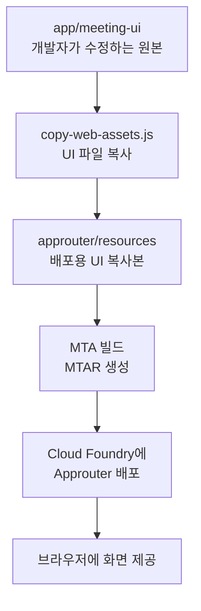
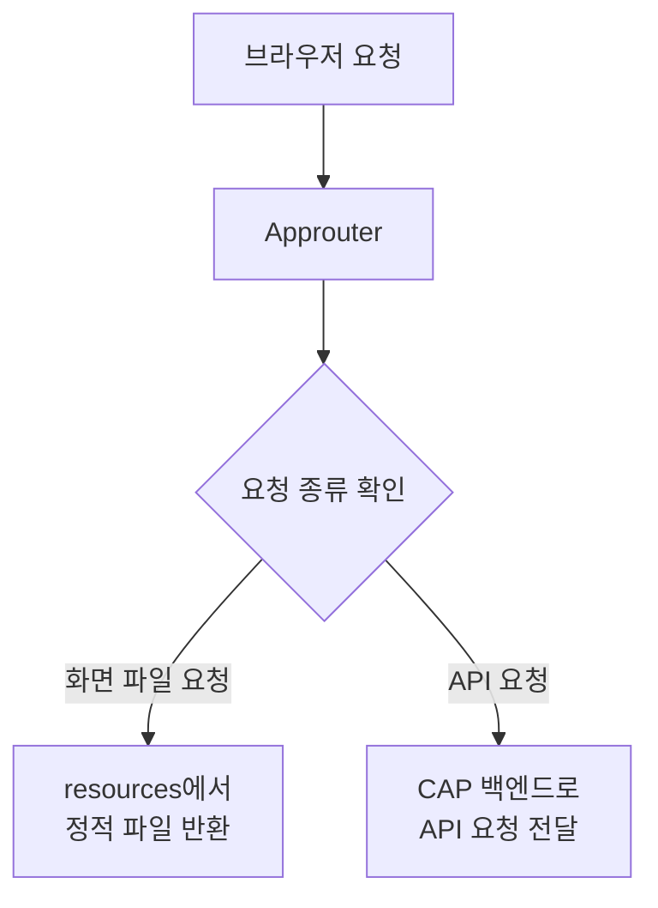
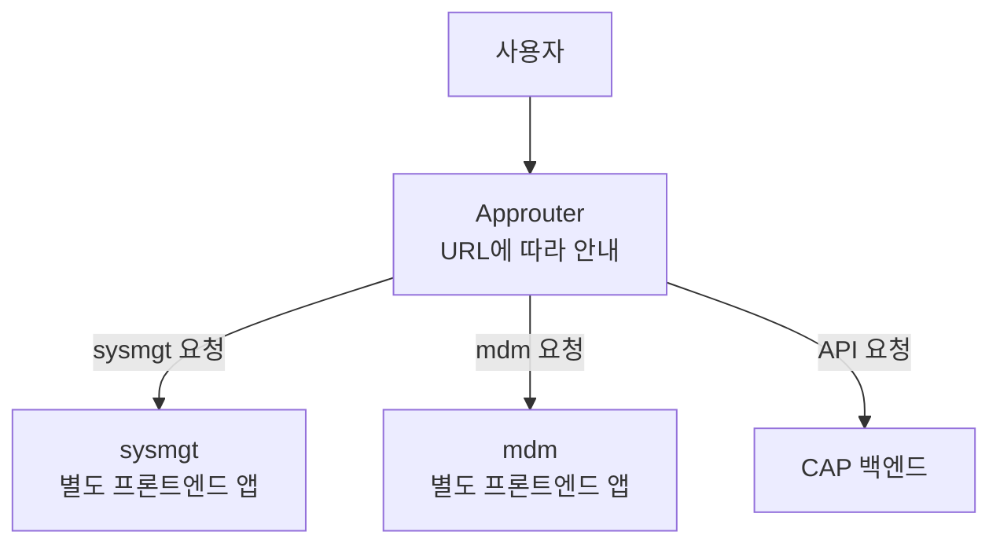

# 내가 개인적으로 중요하다고 느낀 Meeting Whisper의 특징

## 프론트엔드를 Approuter 안에 포함해 배포하는 구조

## 이 점이 중요하게 느껴진 이유

나는 지금까지 다음과 같은 CAP 프로젝트 구조를 주로 알고 있었다.

```text
Approuter
├─ sysmgt 프론트엔드로 요청 전달
├─ mdm 프론트엔드로 요청 전달
└─ CAP 백엔드로 API 요청 전달
```

이 구조에서는 `sysmgt`, `mdm` 같은 프론트엔드 앱을 각각 별도로 빌드하고 배포한다. Approuter는 URL 패턴을 확인한 뒤 요청을 알맞은 프론트엔드 앱으로 안내한다.

그래서 처음 Meeting Whisper를 보았을 때에도 프론트엔드가 별도의 애플리케이션으로 배포되고, Approuter가 그쪽으로 요청을 전달할 것이라고 생각했다.

하지만 Meeting Whisper는 다른 방식을 사용한다.

> 프론트엔드를 별도의 애플리케이션으로 배포하지 않고, 프론트엔드 파일을 Approuter 배포 패키지 안에 포함한다.

이 차이를 이해하고 나니 `app/meeting-ui`, `approuter/resources`, `copy-web-assets.js`가 왜 함께 존재하는지 알 수 있었다.

---

## Meeting Whisper에서 화면이 배포되는 과정

개발자가 수정하는 프론트엔드 원본은 다음 경로에 있다.

```text
app/meeting-ui
```

빌드 또는 로컬 Approuter 실행 과정에서 다음 스크립트가 실행된다.

```text
scripts/copy-web-assets.js
```

이 스크립트는 `app/meeting-ui`의 파일들을 다음 위치로 복사한다.

```text
approuter/resources
approuter/dev/resources
```

역할을 구분하면 다음과 같다.

| 경로 | 역할 |
|---|---|
| `app/meeting-ui` | 개발자가 수정하는 UI 원본 |
| `approuter/resources` | Cloud Foundry 배포에 포함되는 UI 복사본 |
| `approuter/dev/resources` | 로컬 Approuter가 사용하는 UI 복사본 |

전체 과정은 다음과 같다.



여기에서 `resources`는 잘못 개발했을 때를 대비하는 백업 폴더가 아니다. 원본 UI를 Approuter의 실행·배포 공간으로 옮겨 놓은 결과물이다.

따라서 원본 코드가 잘못되어 있으면 잘못된 코드도 그대로 복사되고 배포된다. 이전 코드로 복구하는 역할은 `resources`가 아니라 Git이 담당한다.

---

## 배포할 때 왜 Approuter 안에 들어가는가

`mta.yaml`에서 Approuter 모듈의 경로는 다음과 같이 지정되어 있다.

```yaml
- name: meeting-whisper-approuter
  type: approuter.nodejs
  path: approuter
```

여기서 `path: approuter`는 MTA 빌드가 `approuter` 폴더를 Approuter 애플리케이션의 배포 재료로 사용한다는 뜻이다.

따라서 배포 시에는 대략 다음 구조가 하나의 Approuter 모듈로 묶인다.

```text
approuter
├─ package.json
├─ xs-app.json
└─ resources
   ├─ index.html
   ├─ CSS 파일
   ├─ JavaScript 파일
   └─ 이미지 등 정적 파일
```

결과적으로 별도의 프론트엔드 Cloud Foundry 애플리케이션을 만들지 않아도 Approuter가 화면 파일을 직접 제공할 수 있다.

---

## 브라우저 요청이 들어온 뒤의 처리

Approuter의 `xs-app.json`은 요청 URL을 보고 처리 위치를 결정한다.



예시는 다음과 같다.

| 요청 | 처리 위치 |
|---|---|
| `/index.html` | `approuter/resources/index.html` |
| `/styles.css` | `approuter/resources/styles.css` |
| `/js/app.js` | `approuter/resources/js/app.js` |
| `/api/meetings` | CAP 백엔드 |
| `/api-binary/...` | CAP 백엔드 |
| `/internal/...` | CAP 백엔드 |

여기서 주의할 점은 **프론트엔드에서 발생한 요청**과 **프론트엔드 파일 요청**이 서로 다르다는 것이다.

화면의 JavaScript가 `/api/meetings`를 호출했다면 브라우저에서 발생한 요청이지만, 화면 파일 요청은 아니다. 따라서 Approuter가 직접 결과를 만들지 않고 CAP 백엔드로 전달한다.

---

## 내가 기존에 알고 있던 CAP Template 방식

`CAP_Template` 프로젝트에서는 `sysmgt`, `mdm` 같은 프론트엔드 앱과 Approuter를 각각 별도로 배포한다.



이 방식에서 Approuter는 프론트엔드 파일을 직접 제공하기보다 적절한 프론트엔드 애플리케이션으로 안내하는 관문에 가깝다.

---

## 두 프로젝트의 차이

| 구분 | CAP Template | Meeting Whisper |
|---|---|---|
| 프론트엔드 구성 | `sysmgt`, `mdm` 등 여러 앱 | `meeting-ui` 하나 |
| 프론트엔드 배포 | 각 앱을 별도로 배포 | Approuter 내부에 포함 |
| Approuter 역할 | 요청을 각 프론트엔드로 전달 | 정적 UI 직접 제공 및 API 전달 |
| 화면 파일 위치 | 별도 배포된 프론트엔드 앱 | `approuter/resources` |
| 배포 단위 | Approuter와 UI 앱들이 각각 존재 | UI가 포함된 Approuter |
| 적합한 상황 | 여러 UI를 독립적으로 배포·교체 | 하나의 비교적 단순한 UI 제공 |

두 방식 중 하나만 CAP의 정답인 것은 아니다. 애플리케이션의 개수, 규모, 독립적인 배포 필요성에 따라 구조가 달라질 수 있다.

---

## 비유로 기억하기

### CAP Template

Approuter는 여러 건물 앞의 안내 데스크와 같다.

```text
sysmgt를 찾는 사용자
→ sysmgt 건물로 안내

mdm을 찾는 사용자
→ mdm 건물로 안내
```

프론트엔드 앱마다 별도의 건물이 있다.

### Meeting Whisper

Approuter는 안내 데스크와 전시 공간이 함께 있는 하나의 건물과 같다.

```text
화면 파일 요청
→ 건물 안의 resources에서 바로 제공

회의 데이터 요청
→ CAP 백엔드로 안내
```

---

## 앞으로 비슷한 프로젝트를 볼 때 확인할 것

새로운 CAP 프로젝트를 보았을 때 프론트엔드 배포 방식을 추측하지 말고 다음 항목을 확인해야 한다.

1. `mta.yaml`에서 프론트엔드 모듈이 별도로 정의되어 있는가?
2. Approuter 모듈의 `path`는 어디인가?
3. `xs-app.json`에 `localDir` 설정이 있는가?
4. `localDir`이 가리키는 폴더에 실제 UI 파일이 들어 있는가?
5. UI를 해당 폴더로 복사하는 빌드 스크립트가 있는가?
6. 프론트엔드 앱이 각각 별도의 Cloud Foundry 애플리케이션으로 배포되는가?

특히 다음과 같은 설정이 있다면 Approuter가 정적 파일을 직접 제공할 가능성이 크다.

```json
{
  "source": "^/(.*)$",
  "target": "/$1",
  "localDir": "resources"
}
```

반대로 URL마다 destination이나 별도 HTML5 애플리케이션을 가리킨다면 Approuter가 다른 프론트엔드로 요청을 전달하는 구조일 가능성이 크다.

---

## 내가 기억할 핵심

> Meeting Whisper는 프론트엔드를 별도의 Cloud Foundry 애플리케이션으로 배포하지 않는다. `app/meeting-ui`의 원본 파일을 빌드 과정에서 `approuter/resources`로 복사하고, UI가 포함된 `approuter` 폴더 전체를 하나의 모듈로 배포한다.

그리고 다음 세 가지의 역할을 혼동하지 않아야 한다.

```text
Git
= 변경 이력과 잘못된 코드의 복구

copy-web-assets.js
= UI 원본을 실행·배포 위치로 복사

Approuter
= 로그인 처리, 정적 UI 제공, API 요청 전달
```
