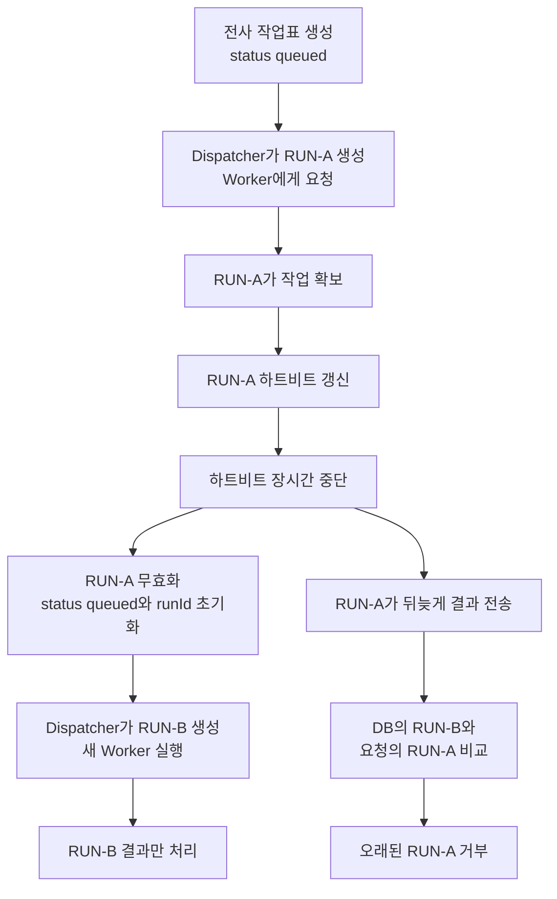

# 내가 개인적으로 중요하다고 느낀 Meeting Whisper의 특징

## `TranscriptionDispatches`와 Worker 하트비트

## 이 점이 헷갈렸던 이유

Meeting Whisper에는 전사와 관련된 상태가 여러 곳에 저장된다.

```text
Meetings.status
Meetings.percent
TranscriptionDispatches.status
TranscriptionDispatches.workerStage
TranscriptionDispatches.workerHeartbeatAt
TranscriptionDispatches.workerRunId
```

처음에는 모두 비슷한 “현재 전사 상태”라고 생각하기 쉽다.

하지만 각각 바라보는 대상과 목적이 다르다.

이 문서에서 기억할 가장 중요한 내용은 다음과 같다.

> `Meetings.status`는 회의 전체의 처리 단계를 나타내고, `TranscriptionDispatches`는 CAP가 전사 작업을 Worker에게 전달하고 실행을 관리하는 작업표다. 오래된 Worker 실행을 거부하는 기준은 `TranscriptionDispatches.workerRunId`다.

---

## 먼저 용어를 구분한다

### `Meetings.status`

회의 전체가 현재 어느 처리 단계에 있는지 나타낸다.

```text
created
audio_uploaded
queued
transcribing
summarizing
done
failed
```

프론트엔드는 이 값을 이용해 사용자에게 현재 상태를 보여 준다.

하지만 화면 표시만을 위한 값은 아니다. 백엔드도 이 값을 보고 다음 작업 가능 여부, 재시도, 정리 대상을 판단한다.

따라서 다음처럼 이해하는 것이 정확하다.

```text
Meetings.status
= 사용자와 전체 시스템이 공유하는 회의 처리 단계
```

### `Meetings.percent`

회의 처리 진행률을 숫자로 저장한다.

```text
10
20
50
80
100
```

Worker가 하트비트와 함께 진행률을 보내면 CAP는 이 값을 `Meetings.percent`에 저장한다.

### `TranscriptionDispatches.status`

전사 작업을 Worker에게 전달하는 과정의 상태다.

```text
queued
= Worker에게 전달할 차례를 기다림

dispatching
= CAP가 Worker에게 요청을 보내는 중

dispatched
= Worker가 요청을 접수함

failed
= 전달 또는 실행이 최종 실패함
```

이 값은 전사 내용이 얼마나 만들어졌는지를 뜻하지 않는다.

```text
dispatching
= Worker에게 연락하는 중

transcribing
= Worker가 실제 음성을 글로 바꾸는 중
```

두 표현은 서로 다른 단계다.

### `TranscriptionDispatches.workerStage`

Worker 내부 작업이 현재 어디까지 진행됐는지 나타낸다.

예시는 다음과 같다.

```text
dispatching
accepted
claimed
downloading
transcribing
saving
summary_queued
summarizing
done
```

`TranscriptionDispatches.status`보다 Worker 내부의 세부 단계에 가깝다.

### `TranscriptionDispatches.workerHeartbeatAt`

CAP가 Worker로부터 마지막으로 정상 진행 신호를 받은 시각이다.

```text
2026-07-30 14:03:20
```

이 값이 일정 시간 동안 갱신되지 않으면 CAP는 Worker가 멈췄을 가능성을 의심한다.

### `TranscriptionDispatches.workerRunId`

현재 전사 작업을 수행할 권한이 있는 Worker 실행의 고유 ID다.

```text
RUN-A
RUN-B
```

Worker가 CAP에 하트비트나 결과를 보낼 때 자신이 받은 `workerRunId`를 함께 보낸다.

CAP는 DB에 저장된 현재 ID와 요청이 가지고 온 ID를 비교한다.

---

## `TranscriptionDispatches`는 어떤 엔티티인가

스키마는 다음과 같다.

```cds
entity TranscriptionDispatches : cuid, managed {
  meeting           : Association to one Meetings not null;
  status            : DispatchStatus default 'queued';
  attempts          : Integer default 0;
  maxAttempts       : Integer default 5;
  nextAttemptAt     : Timestamp;
  lastAttemptAt     : Timestamp;
  lockedAt          : Timestamp;
  workerRunId       : String(64);
  workerStage       : String(80);
  workerHeartbeatAt : Timestamp;
  workerMessage     : LargeString;
  payload           : LargeString;
  lastError         : LargeString;
}
```

이 엔티티는 크게 네 가지 역할을 한다.

### Worker에게 전달할 작업 보관

```text
meeting
payload
```

`payload`에는 Worker에게 전달할 전사 요청 정보가 JSON으로 저장된다.

```text
회의 ID
예상 음원 길이
화자 수 설정
화자 분리 여부
전사 모델 설정
CAP 내부 주소
```

### 전달과 재시도 관리

```text
status
attempts
maxAttempts
nextAttemptAt
lastAttemptAt
lockedAt
lastError
```

Worker가 바쁘거나 연결이 일시적으로 실패해도 작업을 잃지 않고 다시 시도하기 위한 정보다.

### 현재 Worker 실행 식별

```text
workerRunId
```

오래된 Worker와 현재 Worker를 구분한다.

### Worker의 최신 실행 상태 확인

```text
workerStage
workerHeartbeatAt
workerMessage
```

Worker가 마지막으로 어느 단계에서 어떤 메시지를 보냈는지 보관한다.

따라서 `TranscriptionDispatches`는 단순한 상태 칸이 아니다.

> CAP가 전사 작업을 Worker에게 안전하게 전달하고, 재시도하고, 현재 유효한 실행과 최신 하트비트를 관리하기 위한 작업 전달·실행 관리 엔티티다.

---

## 전사 작업표가 처음 만들어지는 과정

사용자가 음원을 업로드하고 전사를 요청하면 CAP는 `TranscriptionDispatches` 행을 만든다.

초기 상태는 다음과 비슷하다.

```text
meeting_ID       = 회의 A
status           = queued
attempts         = 0
maxAttempts      = 5
nextAttemptAt    = 현재 시각
workerRunId      = null
workerStage      = null
workerHeartbeatAt = null
payload          = Worker에게 보낼 요청 정보
lastError        = null
```

여기서 `queued`는 다음 의미다.

> 전사 작업표는 만들어졌고, CAP Dispatcher가 Worker에게 전달할 차례를 기다리고 있다.

---

## CAP가 Worker에게 작업을 전달한다

Dispatcher는 `queued` 상태이고 `nextAttemptAt`이 지난 작업을 찾는다.

작업을 선택하면 새로운 `workerRunId`를 만든다.

```javascript
const workerRunId = cds.utils.uuid();
```

예를 들어 생성된 ID가 `RUN-A`라고 가정한다.

DB는 다음처럼 바뀐다.

```text
status            = dispatching
attempts          = 1
lastAttemptAt     = 현재 시각
lockedAt          = 현재 시각
workerRunId       = RUN-A
workerStage       = dispatching
workerHeartbeatAt = 현재 시각
```

CAP는 Worker에게 다음 정보를 포함해 요청한다.

```text
meetingId = 회의 A
workerRunId = RUN-A
전사 설정과 CAP 내부 주소
```

Worker가 요청을 접수하면 다음처럼 바뀐다.

```text
status            = dispatched
workerStage       = accepted
workerHeartbeatAt = 접수 시각
workerMessage     = Worker accepted transcription job
```

---

## Worker가 작업을 확보한다

Worker는 실제 처리를 시작하기 전에 CAP의 `claimTranscription`을 호출한다.

```text
Worker
→ meetingId와 RUN-A를 CAP에 전달
→ CAP가 현재 workerRunId와 비교
→ 일치하면 작업 확보 허용
```

작업 확보가 성공하면 다음 상태가 저장된다.

```text
Meetings.status                  = transcribing
Meetings.percent                 = 20
TranscriptionDispatches.workerStage = claimed
TranscriptionDispatches.workerHeartbeatAt = 현재 시각
```

---

## 하트비트는 무엇인가

하트비트는 Worker가 CAP에 주기적으로 보내는 진행 신호다.

쉽게 말하면 Worker가 다음 내용을 알리는 것이다.

> 나는 아직 멈추지 않았고, 현재 이 작업을 수행 중이다.

Worker는 하트비트를 보낼 때 다음 정보를 포함한다.

```text
meetingId
workerRunId
stage
message
percent
```

예시는 다음과 같다.

```text
meetingId  = 회의 A
workerRunId = RUN-A
stage      = downloading
message    = 음원 다운로드 중
percent    = 25
```

조금 뒤에는 다음과 같은 하트비트가 올 수 있다.

```text
meetingId  = 회의 A
workerRunId = RUN-A
stage      = transcribing
message    = 음성 전사 중
percent    = 48
```

---

## 하트비트가 저장되는 위치

하트비트 정보가 모두 한 엔티티에 저장되는 것은 아니다.

### `TranscriptionDispatches`에 저장

```text
workerHeartbeatAt
workerStage
workerMessage
workerRunId
```

### `Meetings`에 저장

```text
percent
```

실제 CAP 로직은 개념적으로 다음과 같이 동작한다.

```javascript
await UPDATE(TranscriptionDispatches).set({
  workerHeartbeatAt: 현재시각,
  workerStage: stage,
  workerMessage: message
});

await UPDATE(Meetings).set({
  percent: percent
});
```

따라서 다음처럼 기억하면 된다.

```text
Worker가 언제, 어느 단계에서, 어떤 메시지를 보냈는가
→ TranscriptionDispatches

사용자에게 보여 줄 전체 진행률은 몇 퍼센트인가
→ Meetings
```

---

## 하트비트 전체 이력을 저장하는 것은 아니다

하트비트가 올 때마다 새로운 DB 행을 계속 추가하는 방식이 아니다.

같은 `TranscriptionDispatches` 행의 최신 값을 갱신한다.

```text
14시 01분 하트비트
→ workerHeartbeatAt = 14시 01분

14시 02분 하트비트
→ workerHeartbeatAt = 14시 02분

14시 03분 하트비트
→ workerHeartbeatAt = 14시 03분
```

따라서 이 엔티티는 하트비트 로그 전체를 보관하는 테이블이 아니다.

> 현재 Worker 실행의 마지막 정상 신호를 기억하는 운영 상태 테이블이다.

---

## 하트비트가 끊기면

현재 실행이 `RUN-A`라고 가정한다.

```text
Meetings.status                  = transcribing
TranscriptionDispatches.status  = dispatched
TranscriptionDispatches.workerRunId = RUN-A
TranscriptionDispatches.workerHeartbeatAt = 오래된 시각
```

CAP의 정리 로직은 `workerHeartbeatAt`이 허용 시간보다 오래됐는지 검사한다.

너무 오래됐다면 Worker가 중단됐다고 판단한다.

---

## 재시도 횟수가 남아 있는 경우

CAP는 기존 실행을 무효화하고 작업을 다시 대기 상태로 돌린다.

```text
TranscriptionDispatches.status  = queued
TranscriptionDispatches.workerRunId = null
TranscriptionDispatches.workerStage = queued
TranscriptionDispatches.workerHeartbeatAt = null
TranscriptionDispatches.nextAttemptAt = 현재 시각

Meetings.status  = queued
Meetings.percent = 10
```

여기서 바로 새로운 `workerRunId`를 넣는 것은 아니다.

먼저 `RUN-A`를 제거하고, Dispatcher가 이 작업을 다시 선택할 때 새로운 ID를 만든다.

```text
하트비트 중단 감지
→ RUN-A 제거
→ 작업을 queued로 되돌림
→ Dispatcher가 다시 선택
→ 새로운 RUN-B 생성
→ Worker에게 다시 요청
```

---

## 재시도 횟수를 모두 사용한 경우

더 이상 재시도할 수 없다면 최종 실패로 처리한다.

```text
TranscriptionDispatches.status = failed
Meetings.status = failed
```

사용자는 화면에서 실패 상태와 오류 메시지를 확인할 수 있다.

---

## 오래된 Worker가 뒤늦게 결과를 보내는 문제

`RUN-A`가 멈췄다고 판단해 `RUN-B`를 시작했지만, 실제로는 이전 Worker가 완전히 종료되지 않았을 수 있다.

시간이 지난 뒤 `RUN-A`가 결과를 보내는 상황을 생각할 수 있다.

```text
현재 CAP가 허용한 실행
= RUN-B

뒤늦게 결과를 보낸 실행
= RUN-A
```

CAP는 요청을 처리하기 전에 두 ID를 비교한다.

```javascript
const expected = dispatch.workerRunId;
const actual = workerRunId;

if (expected && actual !== expected) {
  return req.reject(409, "stale worker run ignored");
}
```

비교 결과는 다음과 같다.

```text
DB의 workerRunId = RUN-B
요청의 workerRunId = RUN-A
→ 불일치
→ 오래된 실행
→ 409 오류로 거부
```

`RUN-A`가 보내는 다음 요청들은 처리되지 않는다.

- 하트비트
- 전사 결과 저장
- AI 사용량 기록
- 실패 보고

최신 실행인 `RUN-B`가 보낸 요청만 허용된다.

---

## 오래된 결과를 막는 기준은 `Meetings.status`가 아니다

이 부분을 가장 주의해야 한다.

오래된 Worker 실행을 판별하는 핵심은 다음 비교다.

```text
TranscriptionDispatches.workerRunId
↔
Worker 요청의 workerRunId
```

`Meetings.status`는 회의 전체 처리 단계를 나타내지만, `RUN-A`와 `RUN-B` 중 누가 최신인지 구분하지 못한다.

예를 들어 두 Worker 모두 전사 중이라고 말할 수 있다.

```text
RUN-A → transcribing
RUN-B → transcribing
```

상태 문자열만으로는 어느 실행이 현재 유효한지 알 수 없다.

반면 실행 ID는 명확하게 구분한다.

```text
현재 DB의 ID = RUN-B
요청의 ID = RUN-A
→ 오래된 실행
```

따라서 다음처럼 기억해야 한다.

```text
Meetings.status
= 회의의 전체 처리 단계

TranscriptionDispatches.status
= Worker에게 작업을 전달하는 상태

TranscriptionDispatches.workerStage
= Worker 내부의 세부 작업 단계

TranscriptionDispatches.workerHeartbeatAt
= Worker의 마지막 생존 신호 시각

TranscriptionDispatches.workerRunId
= 현재 결과를 저장할 권한이 있는 실행의 열쇠
```

---

## `Meetings.status` 갱신에 문제가 생긴 경우

재시도 과정에서 `Meetings.status`가 기대한 대로 `queued`로 바뀌지 않았다고 가정한다.

```text
Meetings.status = transcribing
```

이 경우 화면이나 백엔드의 전체 상태 판단은 실제 상황과 잠시 어긋날 수 있다.

하지만 `TranscriptionDispatches.workerRunId`가 정상적으로 `RUN-B`로 교체됐다면 `RUN-A`의 결과는 여전히 거부된다.

```text
Meetings.status = transcribing

DB의 workerRunId = RUN-B
요청의 workerRunId = RUN-A
→ RUN-A 거부
```

즉 두 값은 서로 다른 안전 문제를 담당한다.

| 값 | 주된 역할 | 잘못됐을 때 생길 수 있는 문제 |
|---|---|---|
| `Meetings.status` | 회의 전체 처리 단계 | 화면과 실제 처리 흐름이 어긋남 |
| `TranscriptionDispatches.status` | 전달과 재시도 상태 | 재시도가 실행되지 않거나 중복 전달 가능 |
| `workerRunId` | 현재 실행 식별 | 오래된 결과가 최신 결과를 덮어쓸 위험 |

`Meetings.status`가 중요하지 않다는 뜻은 아니다. 다만 오래된 실행을 막는 직접적인 열쇠가 아니라는 뜻이다.

---

## 전체 시간 순서



---

## 택배 배차표로 비유하기

`Meetings`는 고객 주문서와 비슷하다.

```text
어떤 회의인가?
누가 만들었는가?
현재 전체 처리는 어느 단계인가?
진행률은 얼마인가?
최종 전사문과 요약이 있는가?
```

`TranscriptionDispatches`는 배송 배차표와 송장에 가깝다.

```text
어떤 작업을 Worker에게 보낼 것인가?
전달을 몇 번 시도했는가?
다음 시도 시각은 언제인가?
현재 어느 Worker 실행이 담당하는가?
마지막 생존 신호는 언제 왔는가?
실패하면 다시 배차할 수 있는가?
```

`workerRunId`는 현재 배송 기사에게 발급한 일회성 작업표 번호와 비슷하다.

```text
이전 기사 작업표 = RUN-A
새 기사 작업표 = RUN-B

RUN-A를 가진 기사가 뒤늦게 물건을 가져옴
→ 현재 작업표가 아님
→ 접수 거부
```

---

## 내가 기억할 핵심

> `TranscriptionDispatches`는 CAP와 Worker 사이의 전사 요청을 안전하게 전달하고 재시도하기 위한 작업표다.

> 하트비트가 올 때마다 최신 `workerStage`, `workerHeartbeatAt`, `workerMessage`가 이 작업표에 갱신되고, 진행률은 `Meetings.percent`에 저장된다.

> 하트비트가 오래 끊기면 기존 `workerRunId`를 무효화하고 작업을 다시 `queued`로 돌린 뒤 새로운 실행 ID로 재시도한다.

> 오래된 Worker 결과를 거부하는 기준은 `Meetings.status`가 아니라 DB의 현재 `TranscriptionDispatches.workerRunId`와 Worker 요청의 `workerRunId`가 일치하는지 여부다.

마지막으로 각 값을 한 줄로 정리하면 다음과 같다.

```text
Meetings.status
= 회의 전체의 현재 처리 단계

Meetings.percent
= 사용자에게 보여 줄 전체 진행률

TranscriptionDispatches.status
= Worker 전달과 재시도 상태

workerStage
= Worker 내부의 현재 세부 단계

workerHeartbeatAt
= Worker가 마지막으로 살아 있음을 알린 시각

workerRunId
= 현재 Worker 실행만 결과를 저장하도록 지키는 열쇠
```
