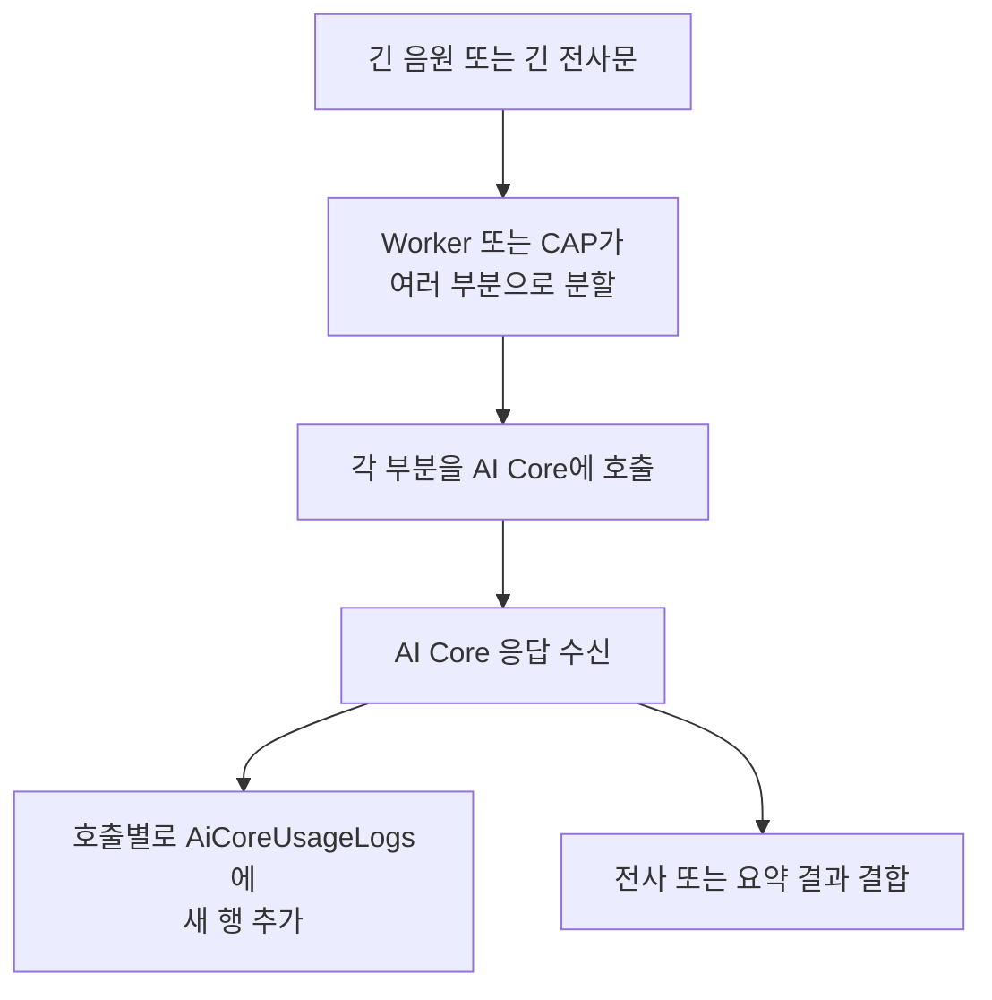

# 내가 개인적으로 중요하다고 느낀 Meeting Whisper의 특징

## `AiCoreUsageLogs`는 언제 기록되는가

## 먼저 결론

`AiCoreUsageLogs`는 Worker 하트비트가 올 때마다 기록하는 테이블이 아니다.

> Worker 또는 CAP 백엔드가 전사문이나 음원을 여러 부분으로 나눈 뒤, 각 부분을 AI Core API에 실제로 호출하고 응답을 받았을 때 호출별 사용량을 새로운 행으로 기록한다.

따라서 사용자 입장에서 전사 요청을 한 번 실행했더라도 AI Core를 여러 번 호출했다면 로그도 여러 행이 생길 수 있다.

---

## 짧은 음원의 전사

짧은 음원을 AI Core에 한 번만 요청했다면 다음과 같이 기록될 수 있다.

```text
회의 A의 음원
→ AI Core 전사 호출
→ 응답 수신
→ AiCoreUsageLogs 1행
```

---

## 긴 음원의 전사

긴 음원은 Worker가 여러 조각으로 나눈 뒤 각각 AI Core에 요청할 수 있다.

```text
회의 A의 긴 음원
├─ 음원 조각 1 → AI Core 호출 → 로그 1행
├─ 음원 조각 2 → AI Core 호출 → 로그 1행
└─ 음원 조각 3 → AI Core 호출 → 로그 1행
```

즉 사용자에게는 회의 A의 전사 한 건이지만, 실제 AI Core 호출은 세 번이므로 `AiCoreUsageLogs`에는 같은 `meetingId`로 여러 행이 생길 수 있다.

---

## 긴 전사문의 요약

긴 전사문도 CAP 백엔드가 여러 구간으로 나누어 부분 요약을 요청한다.

```text
전체 전사문
├─ 전사 구간 1 → 부분 요약 호출 → 로그 1행
├─ 전사 구간 2 → 부분 요약 호출 → 로그 1행
└─ 부분 요약 결합 → 결합 호출 → 로그 1행
```

따라서 요약 버튼을 한 번 실행했더라도 다음과 같은 여러 로그가 생길 수 있다.

```text
summarizeMeeting:chunk
summarizeMeeting:chunk
summarizeMeeting:combine
```

AI 응답 형식이 잘못되어 복구 요청을 추가로 보내거나 호출을 재시도했다면 로그가 더 생길 수도 있다.

---

## 하트비트와는 관계가 없다

Worker 하트비트와 AI 사용량 로그는 목적이 다르다.

| 구분 | Worker 하트비트 | `AiCoreUsageLogs` |
|---|---|---|
| 기록 목적 | Worker가 살아 있는지 확인 | AI 호출 사용량과 결과 추적 |
| 발생 기준 | 처리 중 진행 신호 | 실제 AI Core API 호출 |
| 저장 방식 | 기존 작업표의 최신 값 갱신 | 호출마다 새로운 행 추가 |
| 주요 정보 | 단계, 메시지, 마지막 신호 시각 | 모델, 토큰, 호출 시간, 성공·실패 |

하트비트가 여러 번 왔다고 해서 토큰 로그가 그 횟수만큼 생성되는 것은 아니다.

---

## 로그 한 행에 들어가는 정보

AI Core 호출 한 번에 대해 다음과 같은 정보를 저장한다.

```text
meetingId
source
actionName
modelName
requestId
promptTokens
completionTokens
totalTokens
startedAt
finishedAt
latencyMs
status
errorMessage
```

토큰 값은 특정 시간대의 누적 사용량이 아니라 해당 AI Core 호출 한 번의 사용량이다.

```text
promptTokens
= AI에 전달한 입력 토큰

completionTokens
= AI가 생성한 출력 토큰

totalTokens
= 해당 호출의 전체 토큰
```

AI Core 응답에서 토큰 사용량을 제공하지 않으면 일부 토큰 필드는 비어 있을 수 있다.

---

## 전체 흐름



---

## 내가 기억할 핵심

```text
사용자가 실행한 회의 작업 수
≠ AiCoreUsageLogs의 행 수
```

한 회의 안에서도 AI Core API를 여러 번 호출할 수 있기 때문이다.

> `AiCoreUsageLogs`의 한 행은 회의 한 건이나 하트비트 한 번이 아니라, 실제 AI Core API 호출 한 번에 대응한다고 이해하면 된다.
