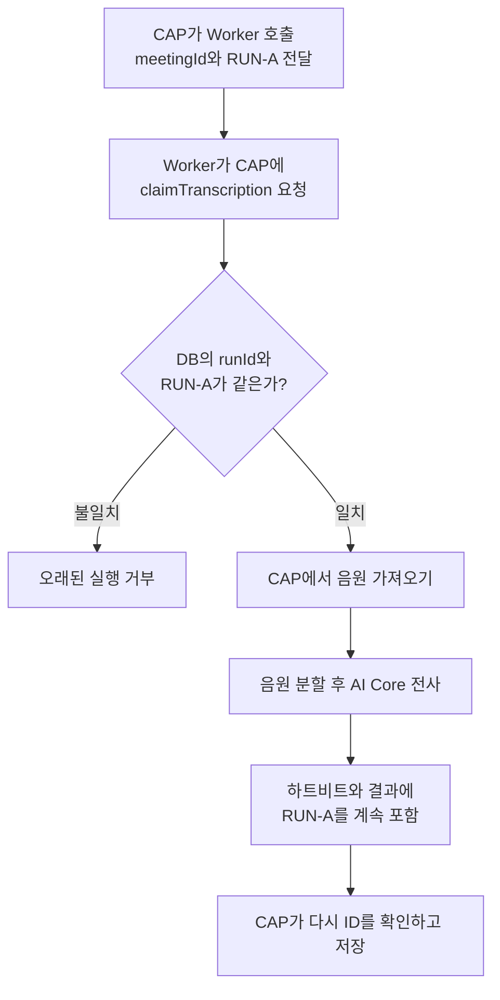

# 내가 개인적으로 중요하다고 느낀 Meeting Whisper의 특징

## Worker가 CAP에 작업 실행권을 확인하는 이유

## 질문에서 시작한 핵심

`2-6. Python Worker의 내부 구조`에는 다음 문장이 있다.

> Worker는 단순한 AI API 래퍼가 아니라, 긴 음원을 안전하게 처리하고 CAP와 작업 소유권을 맞추는 독립적인 작업 관리자다.

여기서 **CAP와 작업 소유권을 맞춘다**는 말은 `main.py`가 CAP의 `claimTranscription`을 호출하는 과정과 관련 있다.

다만 “작업 사용권”이나 “작업 소유권”은 사용자 권한과 혼동될 수 있다. 더 정확한 의미는 다음과 같다.

> 현재 실행 중인 Worker가 이 전사 작업을 수행하고 결과를 저장해도 되는 유효한 실행인지 CAP에 확인한다.

---

## CAP가 Worker에게 보내는 값

CAP가 Worker의 `/transcribe`를 호출할 때 다음 값을 함께 보낸다.

```text
meetingId
workerRunId
전사 설정
CAP 내부 주소
```

예시는 다음과 같다.

```text
meetingId  = 회의 A
workerRunId = RUN-A
```

Worker는 요청을 받았다고 바로 AI Core 전사를 시작하지 않는다.

먼저 CAP의 `claimTranscription`을 호출한다.

```text
“저는 RUN-A입니다.
현재 회의 A의 전사 작업을 제가 처리해도 됩니까?”
```

---

## CAP가 확인하는 내용

CAP는 `TranscriptionDispatches`에 저장된 현재 `workerRunId`와 Worker가 보낸 값을 비교한다.

### 두 값이 같을 때

```text
DB의 workerRunId = RUN-A
요청의 workerRunId = RUN-A
→ 현재 유효한 실행
→ 작업 시작 허용
```

CAP는 회의를 전사 중 상태로 바꾸고 Worker는 음원을 가져와 전사를 시작한다.

```text
Meetings.status = transcribing
Meetings.percent = 20
workerStage = claimed
```

### 두 값이 다를 때

```text
DB의 workerRunId = RUN-B
요청의 workerRunId = RUN-A
→ 이전 실행
→ 409 오류로 거부
```

오래된 Worker가 최신 실행의 작업에 참여하지 못하도록 막는다.

---

## 왜 요청을 받은 뒤 다시 확인하는가

CAP가 Worker에게 요청을 보낸 직후에도 시스템 상태가 달라질 수 있다.

```text
CAP가 RUN-A에 작업 전달
→ RUN-A의 하트비트 중단
→ CAP가 재시도 결정
→ 새로운 RUN-B 시작
→ 뒤늦게 RUN-A가 작업 시작 시도
```

검증하지 않으면 `RUN-A`와 `RUN-B`가 같은 회의를 동시에 처리할 수 있다.

```text
RUN-A가 전사 결과 저장
RUN-B도 전사 결과 저장
→ 어느 결과가 최신인지 불명확
```

`claimTranscription`은 오래된 실행을 작업 시작 단계에서 차단한다.

---

## 시작할 때 한 번만 검사하지 않는다

Worker는 CAP에 중요한 요청을 보낼 때마다 `workerRunId`를 함께 보낸다.

```text
작업 확보
→ workerRunId 확인

하트비트 전송
→ workerRunId 확인

AI 사용량 로그 저장
→ workerRunId 확인

전사 결과 저장
→ workerRunId 확인

실패 보고
→ workerRunId 확인
```

처음에는 유효했던 Worker도 처리 도중 새 실행으로 교체되면 이후 요청이 거부된다.

```text
전사 시작 당시
DB = RUN-A
요청 = RUN-A
→ 허용

재시도 후
DB = RUN-B

RUN-A가 결과 저장 시도
→ 불일치
→ 거부
```

---

## 사용자 권한과 다른 개념

여기서 말하는 작업 실행권은 다음 사용자 권한이 아니다.

```text
누가 회의를 만들었는가?
누가 회의를 읽을 수 있는가?
누가 회의록을 수정할 수 있는가?
```

Worker 실행권은 다음 질문에 답한다.

```text
현재 어떤 Worker 실행이
이 전사 작업을 진행하고
결과를 저장할 수 있는가?
```

---

## 왜 단순한 AI API 래퍼가 아닌가

단순한 AI API 래퍼라면 다음 역할만 수행한다.

```text
음원 받기
→ AI Core 호출
→ 응답 반환
```

Meeting Whisper의 Worker는 다음 과정 전체를 관리한다.

```text
CAP 요청 접수
→ 동시 실행 가능 여부 확인
→ claimTranscription으로 현재 실행 확인
→ CAP에서 음원 다운로드
→ 긴 음원 분할
→ 조각별 AI Core 호출
→ 응답 검증과 필요 시 재분할
→ 전사 결과 결합
→ 하트비트 전송
→ AI 사용량 전달
→ 전사문 저장
→ 실패 보고
→ 임시 파일 정리
```

따라서 문장의 두 부분은 다음과 같이 나뉜다.

```text
긴 음원을 안전하게 처리
= 분할, 호출, 검증, 재분할, 결과 결합

CAP와 작업 실행권을 맞춤
= claimTranscription과 workerRunId 검증
```

---

## 전체 흐름



---

## 내가 기억할 핵심

> `claimTranscription`은 Worker가 사용자 권한을 요청하는 기능이 아니다. CAP가 발급한 현재 `workerRunId`와 Worker가 가진 ID를 비교하여, 이 Worker 실행이 현재 전사 작업을 수행해도 되는지 확인하는 과정이다.

> 이후 하트비트와 결과 저장에서도 같은 ID를 검사하여 오래된 Worker 실행이 최신 결과를 덮어쓰지 못하게 한다.
