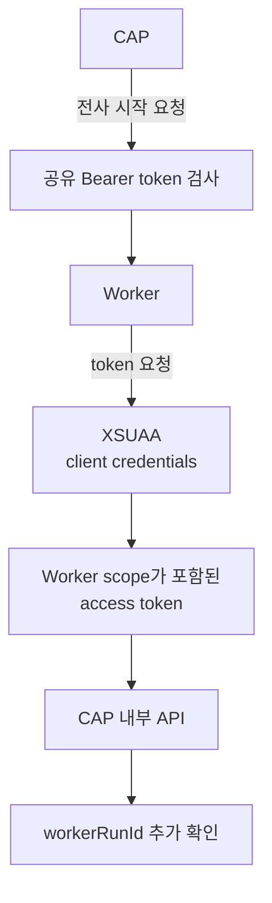

# 내가 개인적으로 중요하다고 느낀 Meeting Whisper의 특징

## CAP와 Worker가 서로 다른 방식으로 인증하는 이유

## 먼저 결론

CAP와 Worker는 서로 요청을 주고받지만 두 방향의 인증 방식은 다르다.

```text
CAP → Worker
= 사전에 공유한 Bearer token

Worker → CAP
= Worker scope가 포함된 XSUAA access token
```

`XSUAA token + Worker 역할`이라는 표현은 개념적으로 맞지만, 실제로 토큰과 역할을 별도로 두 개 보내는 것은 아니다.

> Worker가 XSUAA client credentials로 access token을 발급받고, 그 token 안에 포함된 `Worker` scope를 이용해 CAP 내부 API를 호출한다.

---

## CAP가 Worker를 호출할 때

CAP는 Worker의 다음 주소로 전사 작업을 보낸다.

```text
POST /transcribe
```

이때 `TRANSCRIPTION_WORKER_TOKEN` 값을 HTTP 헤더에 넣는다.

```http
Authorization: Bearer 공유토큰값
```

Worker는 자신에게 설정된 같은 값과 비교한다.

```text
CAP가 보낸 token
↔
Worker의 TRANSCRIPTION_WORKER_TOKEN
```

결과는 다음과 같다.

```text
일치
→ 전사 요청 접수

token 없음
→ 401 거부

불일치
→ 403 거부
```

이 token은 XSUAA가 발급한 OAuth token이 아니다. CAP와 Worker가 미리 알고 있는 공유 비밀 문자열이다.

---

## Worker가 CAP를 호출할 때

Worker는 CAP의 `/internal` 서비스에 다음 요청들을 보낸다.

```text
claimTranscription
heartbeatTranscription
getAudio
saveTranscript
logAiUsage
failTranscription
```

CAP 내부 서비스는 다음처럼 보호된다.

```cds
service WorkerInternalService @(requires: 'Worker')
```

운영 환경에서 Worker는 XSUAA에 다음 자격증명으로 token을 요청한다.

```text
clientId
clientSecret
grant_type = client_credentials
scope = Worker
```

XSUAA가 발급한 access token 안에는 Worker 호출에 필요한 scope가 포함된다.

Worker는 이 token을 CAP 요청에 넣는다.

```http
Authorization: Bearer XSUAA_ACCESS_TOKEN
```

CAP는 다음을 확인한다.

```text
XSUAA가 발급한 유효한 token인가?
→ token 안에 Worker scope가 있는가?
→ 둘 다 만족하면 내부 API 접근 허용
```

---

## 두 방향 비교

| 구분 | CAP → Worker | Worker → CAP |
|---|---|---|
| 호출 목적 | 전사 작업 시작 요청 | 작업 확보, 음원 조회, 하트비트, 결과 저장 |
| 인증 방식 | 공유 Bearer token | XSUAA OAuth access token |
| token 발급 주체 | 별도 발급 없음 | XSUAA |
| 권한 확인 | 공유 문자열 일치 여부 | token의 `Worker` scope |
| 주요 보호 대상 | Worker의 `/transcribe` | CAP의 `/internal` 서비스 |

두 방향의 호출 주체와 보호 대상이 다르기 때문에 인증 방식도 다르다.

---

## `Worker` scope와 `workerRunId`는 다른 검사다

Worker가 CAP를 호출할 때는 두 가지 검사를 통과해야 한다.

### XSUAA 인증

```text
이 요청자가 허용된 Worker 프로그램인가?
```

XSUAA access token과 `Worker` scope로 확인한다.

### 실행 ID 확인

```text
이 Worker 실행이 현재 이 회의를 담당하는 최신 실행인가?
```

`workerRunId`로 확인한다.

예를 들어 이전 실행 `RUN-A`가 올바른 XSUAA token을 가지고 있어도, 현재 실행이 `RUN-B`라면 결과는 거부된다.

```text
XSUAA token과 Worker scope
→ 정상

요청의 workerRunId = RUN-A
DB의 workerRunId = RUN-B
→ 오래된 실행
→ 409 거부
```

---

## 운영 환경과 로컬 개발의 차이

운영 환경의 Worker는 XSUAA client credentials를 사용한다.

```text
운영 환경
Worker → CAP
= XSUAA access token
```

로컬 개발에서는 실제 XSUAA 대신 CAP의 mocked 사용자와 Basic Auth를 사용할 수 있다.

```text
CAP_WORKER_USERNAME=worker
CAP_WORKER_PASSWORD=worker
```

로컬 CAP 설정의 `worker` 사용자는 `Worker` 역할을 가진다.

```text
로컬 개발
Worker → CAP
= Basic Auth의 worker 사용자
```

따라서 “Worker는 항상 XSUAA token만 사용한다”라고 이해하면 로컬 실행 방식과 맞지 않는다.

---

## 전체 인증 흐름



---

## 내가 기억할 핵심

> CAP가 Worker를 호출할 때는 양쪽이 미리 공유한 `TRANSCRIPTION_WORKER_TOKEN`을 Bearer token으로 보낸다.

> Worker가 CAP를 호출할 때는 운영 환경에서 XSUAA client credentials로 `Worker` scope가 포함된 access token을 발급받아 사용한다. token과 역할을 따로 보내는 것이 아니다.

> CAP는 XSUAA 인증이 성공한 뒤에도 `workerRunId`를 확인하여 현재 유효한 Worker 실행인지 별도로 검사한다.
