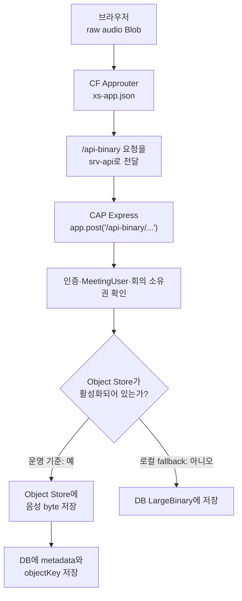

# 내가 개인적으로 중요하다고 느낀 Meeting Whisper의 특징

## server.js로 raw binary 업로드 경로를 등록하는 이유

## 질문에서 시작한 핵심

처음 `server.js`에 대한 설명을 보았을 때 다음과 같이 이해하기 쉬웠다.

```text
CAP 백엔드에는 음성 저장 기능이 직접 구현되어 있지 않고,
로컬 실행이나 배포 후 server.js가 따로 실행되어
백엔드 어딘가에 바이너리 저장 기능을 추가한다.
```

하지만 실제 구조는 다르다.

> `server.js`도 CAP 백엔드 코드의 일부다. CAP Node.js 프로세스가 시작될 때 같은 Express 서버에 raw-binary 업로드 경로를 추가하고, 나머지 구동은 표준 CAP 서버 절차에 맡긴다.

여기서 구분해야 하는 것은 다음 세 가지다.

```text
HTTP 전송 형식
= raw binary인가, Base64가 포함된 JSON인가?

HTTP 요청 처리 계층
= Express 직통 경로인가, CAP의 표준 CDS/OData 경로인가?

최종 저장 위치
= Object Store인가, DB의 LargeBinary인가?
```

---

## CAP과 Express의 관계

CAP Node.js 백엔드는 Express와 별개의 HTTP 서버를 하나 더 만드는 구조가 아니다.

CAP 런타임이 Express 애플리케이션을 만들고, 그 위에 CAP 서비스를 등록한다.

```text
Node.js 프로세스
└─ Express HTTP 서버
   ├─ 개발자가 직접 등록한 경로
   ├─ CAP이 CDS 정의를 읽고 자동 등록한 서비스
   └─ 필요하면 정적 파일 middleware
```

따라서 “CAP Express”라는 표현은 보통 별도 제품을 뜻하지 않는다.

```text
CAP
= 서비스 모델, 업무 로직, 인증·권한, DB 연동 등을 제공하는 프레임워크

Express
= 실제 HTTP 요청을 받고 middleware와 URL 경로를 실행하는 Node.js 웹 서버 계층
```

CAP의 일반 API도 결국 같은 Express 서버 위에 올라간다.

```text
하나의 Express 서버
├─ /api/*          CAP이 MeetingService를 바탕으로 자동 등록
├─ /internal/*     CAP이 WorkerInternalService를 바탕으로 자동 등록
└─ /api-binary/*   개발자가 app.post()로 직접 등록
```

차이는 같은 서버를 사용하는지 여부가 아니라 **누가 어떤 방식으로 경로를 등록하고 요청을 해석하는가**이다.

---

## 일반 CAP API가 등록되는 방식

`cap/srv/meeting-service.cds`에는 다음 서비스 경로가 선언되어 있다.

```cds
@path: '/api'
service MeetingService @(requires: 'MeetingUser') {
  entity Meetings as projection on db.Meetings;
  action uploadAudio(...);
  action enqueueTranscription(...);
}
```

CAP은 이 CDS 정의를 읽고 Express 서버에 `/api` 서비스를 자동으로 연결한다.

예를 들어 다음 요청은:

```http
GET /api/Meetings
```

다음 과정을 거친다.

```text
Express가 요청을 받음
→ CAP protocol adapter가 요청 해석
→ MeetingService의 Meetings 요청으로 변환
→ before/on/after handler 실행
→ DB 조회
→ OData/JSON 응답 반환
```

개발자가 `/api/Meetings`에 대해 `app.get()`을 직접 작성하지 않아도 CAP이 서비스 정의를 바탕으로 만들어 준다.

---

## raw-binary API가 등록되는 방식

음성 업로드 경로는 CAP의 CDS action에만 맡기지 않고 Express에 직접 등록한다.

실제 경로는 다음과 같다.

```http
POST /api-binary/Meetings/:meetingId/audio
```

`cap/srv/lib/binary-upload-route.js`에서는 개념적으로 다음과 같이 등록한다.

```js
app.post(
  "/api-binary/Meetings/:meetingId/audio",
  ...CAP의 선행 middleware,
  handleBinaryAudioUpload,
);
```

이 요청은 CAP의 일반적인 OData JSON payload로 변환되지 않는다.

```text
브라우저의 음성 Blob
→ HTTP request body에 raw byte로 전송
→ Express의 req stream
→ saveAudioStreamForMeeting()
→ Object Store 또는 DB
```

UI도 실제로 `/api-binary/Meetings/{meetingId}/audio`에 Blob을 직접 전송한다.

---

## Approuter 경로와 Express 경로는 같은 것인가

둘 다 URL 패턴을 다루지만 역할이 다르다.

```text
Approuter의 xs-app.json
= 이 요청을 어떤 애플리케이션으로 전달할 것인가?

CAP Express의 app.post()
= CAP에 도착한 요청을 어떤 코드가 실제로 처리할 것인가?
```

배포 환경의 요청 흐름은 다음과 같다.



두 경로 중 하나만 있으면 완전하게 동작하지 않는다.

```text
xs-app.json 경로만 있음
→ CAP까지 프록시는 되지만 처리할 Express handler가 없어 404

Express 경로만 있음
→ CAP 주소로 직접 호출하면 동작할 수 있지만
  Approuter의 라우팅 규칙이 없으면 사용자 진입점에서는 CAP으로 전달되지 않음
```

---

## 왜 표준 CAP uploadAudio action만 사용하지 않는가

Meeting Whisper에는 표준 CAP action도 존재한다.

```cds
action uploadAudio(
  meetingId : UUID,
  mimeType  : String,
  size      : Integer64,
  content   : LargeBinary
) returns Meetings;
```

이 경로에서는 HTTP 요청이 일반적인 JSON 형태가 되고, `LargeBinary` 값은 Base64 문자열로 표현된다.

```text
원본 음성 binary
→ Base64 문자열로 변환
→ JSON body에 포함
→ CAP body parser가 전체 JSON 해석
→ Base64를 다시 Buffer로 변환
→ 저장 계층으로 전달
```

여기서 중요한 교정이 있다.

> Base64 문자열이 최종 저장소에 그대로 저장되는 것이 핵심 문제는 아니다. 전송과 JSON 파싱 과정에서 Base64 문자열을 거쳐야 한다는 것이 문제다.

DB의 `LargeBinary`에는 최종적으로 binary 값이 들어간다. Object Store에도 byte가 저장된다.

하지만 중간 과정에는 다음 부담이 생긴다.

- Base64 변환으로 데이터 크기가 약 33% 증가한다.
- 브라우저가 큰 Base64 문자열을 만들어야 한다.
- CAP이 큰 JSON body를 메모리에 올려 파싱해야 한다.
- Base64 문자열과 디코딩한 Buffer가 한동안 메모리에 함께 존재할 수 있다.
- 큰 음원일수록 Node.js 프로세스의 메모리 peak가 커진다.

이 프로젝트의 측정 기록에서는 다음과 같은 결과가 남아 있다.

```text
25MB Base64 handoff
→ CAP memory peak 약 386MB

50MB Base64 handoff
→ CAP memory peak 약 602MB

CAP 운영 memory
→ 512MB
```

따라서 1시간 회의처럼 100MB 안팎이 될 수 있는 음원을 Base64 JSON으로 처리하는 것은 운영 메모리 기준에 적합하지 않다.

---

## raw binary와 stream 방식의 장점

raw-binary 경로는 브라우저의 Blob을 JSON으로 바꾸지 않고 HTTP body로 보낸다.

```text
Blob
→ raw HTTP body
→ req stream
→ 크기 제한 stream
→ Object Store
```

Object Store가 활성화되어 있고 `Content-Length`를 알 수 있으면 `audio-store.js`는 요청 stream을 제한 stream으로 감싸 Object Store 업로드에 전달한다.

이 방식의 장점은 다음과 같다.

- Base64 크기 증가가 없다.
- 큰 JSON 문자열을 만들지 않는다.
- CAP body parser를 거치지 않는다.
- 전체 음원을 하나의 거대한 Base64 문자열로 유지할 필요가 없다.
- Object Store로 stream 전달이 가능하다.

즉, Express 직통 경로를 만든 이유는 CAP을 우회하여 백엔드 밖에서 저장하기 위해서가 아니다.

> 같은 CAP 백엔드 안에서 대용량 바이너리에 더 적합한 HTTP 처리 방식을 사용하기 위해서다.

---

## 실제 저장 위치

`server.js`가 음성 파일을 직접 저장하는 것은 아니다.

책임은 다음처럼 나뉜다.

| 파일 | 역할 |
|---|---|
| `server.js` | CAP 시작 과정에 바이너리 경로 연결 |
| `binary-upload-route.js` | raw HTTP 요청, 인증·권한, handler 실행 |
| `audio-store.js` | Object Store와 DB 저장 경로 선택 |
| `object-store.js` | Object Store 업로드·삭제·signed URL 생성 |
| `schema.cds` | `AudioObjects` metadata와 `LargeBinary` 구조 정의 |

운영 환경의 기준은 Object Store다.

```text
Object Store
= 원본 음성 byte 임시 저장

HANA AudioObjects
= mimeType
   size
   storageKind = object_store
   objectKey
   expiresAt
   content = null
```

Object Store를 사용하지 않는 fallback에서는 DB의 `AudioObjects.content : LargeBinary`에 binary를 저장한다.

따라서 “항상 HANA BLOB에 저장한다”도 틀리고 “server.js가 임의의 위치에 저장한다”도 틀리다.

---

## server.js의 시작 순서

`server.js`가 Express 서버를 새로 하나 만드는 것은 아니다.

정확한 순서는 다음과 같다.

```text
1. cds-serve가 프로젝트의 server.js를 불러옴
2. server.js가 cds.on("bootstrap", callback)을 등록
3. server.js가 module.exports = cds.server로 표준 CAP 서버를 내보냄
4. 표준 CAP 런타임이 Express 앱을 생성
5. CAP이 bootstrap 이벤트 발생
6. callback이 같은 Express 앱에 /api-binary 경로 등록
7. CAP이 /api와 /internal 서비스 등록
8. Express 서버가 포트에서 요청 수신 시작
```

따라서 다음 표현이 가장 정확하다.

> CAP이 Express HTTP 서버를 구성하는 초기 단계에 raw-binary 직통 경로를 추가하고, 이후 표준 CAP 구동 절차를 계속 실행한다.

---

## 로컬과 배포에서 server.js가 사용되는 과정

`server.js`는 로컬 전용 파일이 아니다. CAP 빌드 결과와 함께 CF에 배포된다.

```text
프로젝트 루트/server.js
→ cds build --production
→ gen/cap/srv/server.js
→ MTA가 gen/cap/srv를 meeting-whisper-srv로 패키징
→ cf deploy
→ CF가 npm run cap:start 실행
→ cds-serve가 server.js 로드
→ /api-binary 경로 등록
```

`server.js`가 바이너리 모듈을 두 위치에서 찾는 이유도 여기에 있다.

```js
const candidates = [
  "./cap/srv/lib/binary-upload-route",
  "./srv/lib/binary-upload-route",
];
```

```text
프로젝트 루트에서 로컬 실행
→ ./cap/srv/lib/binary-upload-route

gen/cap/srv에서 배포 실행
→ ./srv/lib/binary-upload-route
```

CF에 배포되는 것은 실행 결과가 아니라 코드다. 그 코드가 CF 애플리케이션의 시작·재시작·restage 때마다 실행되어 각 인스턴스의 메모리에 Express 경로를 등록한다.

---

## CF route와 Express route를 혼동하지 않기

`/api-binary`는 CF 플랫폼에 별도 애플리케이션 route로 등록되는 것이 아니다.

```text
CF route
= https://meeting-whisper-srv... 처럼 애플리케이션까지 찾아가는 host

Approuter route
= /api-binary 요청을 srv-api destination으로 전달하는 규칙

Express route
= CAP 애플리케이션 안에서 /api-binary 요청을 처리하는 handler
```

계층별로 보면 다음과 같다.

```text
인터넷 요청
→ CF route가 Approuter 앱으로 전달
→ xs-app.json이 CAP destination으로 proxy
→ CAP 앱의 CF route
→ Express가 /api-binary handler 선택
→ audio-store가 저장
```

---

## 비유로 기억하기

Express 서버를 하나의 큰 업무 건물이라고 생각할 수 있다.

```text
CAP 표준 서비스
= 건물 설계도인 CDS를 보고 자동으로 만든 일반 접수 창구

raw-binary Express 경로
= 대형 화물을 받기 위해 따로 만든 화물 전용 출입구
```

음성 파일은 큰 화물과 같다.

일반 접수 창구를 이용하려면 화물을 Base64라는 포장으로 바꾸고 JSON 서류 안에 넣어야 한다. 화물 전용 출입구는 원래 byte 형태 그대로 stream으로 받는다.

화물 전용 출입구도 다른 건물에 있는 것이 아니다. 같은 CAP 백엔드 건물의 Express 서버에 추가한 경로다.

---

## 비슷한 프로젝트에서 확인할 것

1. 루트 또는 `srv`에 custom `server.js`가 있는가?
2. `cds.on("bootstrap", app => ...)`에서 무엇을 등록하는가?
3. `app.get`, `app.post`, `app.use` 같은 Express 코드가 있는가?
4. 일반 CAP action과 별도 Express 경로가 동시에 존재하는가?
5. 대용량 binary가 JSON/Base64로 전송되는가, raw body로 전송되는가?
6. 요청 body를 전체 Buffer로 만드는가, stream으로 외부 저장소에 전달하는가?
7. 최종 원본 파일은 DB와 Object Store 중 어디에 저장되는가?
8. MTA의 CAP 모듈 경로에 `server.js`가 포함되는가?

---

## 내가 기억할 핵심

> Meeting Whisper의 `server.js`는 백엔드 외부에서 뒤늦게 기능을 붙이는 파일이 아니다. CAP Node.js 백엔드의 custom 시작 파일이며, CAP이 만든 같은 Express 서버에 raw-binary 업로드 경로를 직접 등록한다.

> 일반 `/api`와 `/internal` 서비스는 CAP이 CDS 정의를 읽고 Express에 자동 등록하지만, `/api-binary`는 대용량 음성을 Base64 JSON으로 처리하지 않기 위해 개발자가 `app.post()`로 직접 등록한다.

> Base64가 최종 저장 형식이라서 문제가 되는 것이 아니라, 전송 크기 증가와 JSON 파싱·디코딩 과정의 메모리 사용량이 문제다. 운영에서는 raw stream을 Object Store에 저장하고 HANA에는 metadata와 object key를 저장한다.

> `server.js`는 `cds build` 결과에 포함되어 CF에 배포되며, CF의 CAP 앱이 시작될 때마다 실행되어 `/api-binary` 경로를 등록한다.

---

## 함께 보면 좋은 파일

```text
server.js
cap/srv/lib/binary-upload-route.js
cap/srv/lib/audio-store.js
cap/srv/lib/object-store.js
cap/srv/meeting-service.cds
cap/srv/meeting-service.js
cap/db/schema.cds
app/meeting-ui/js/api.js
approuter/xs-app.json
mta.yaml
.cdsrc.json
```

