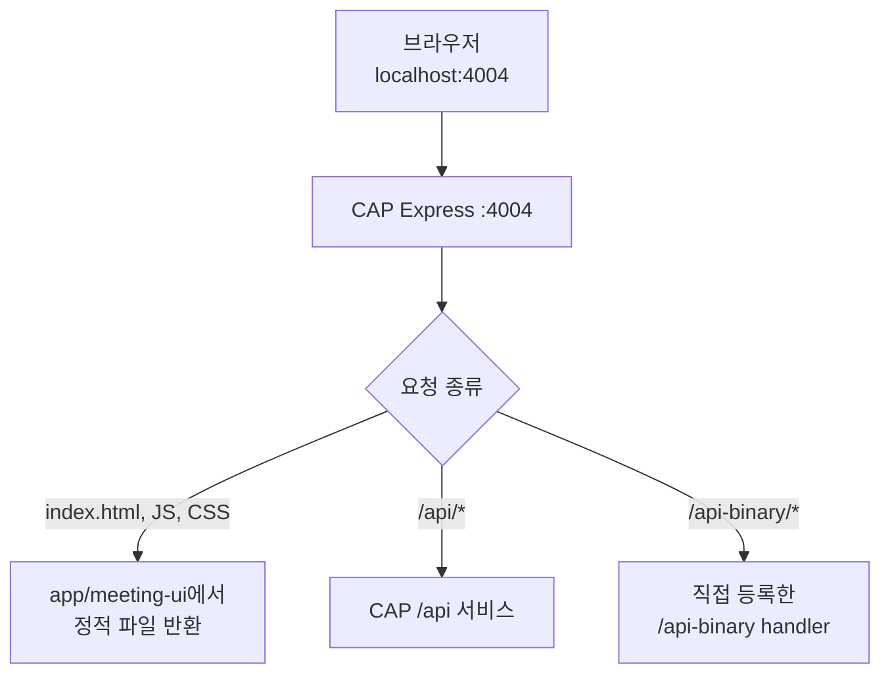
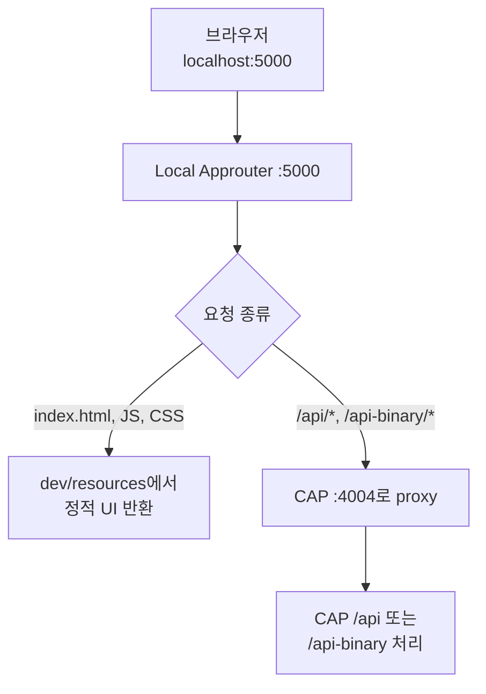
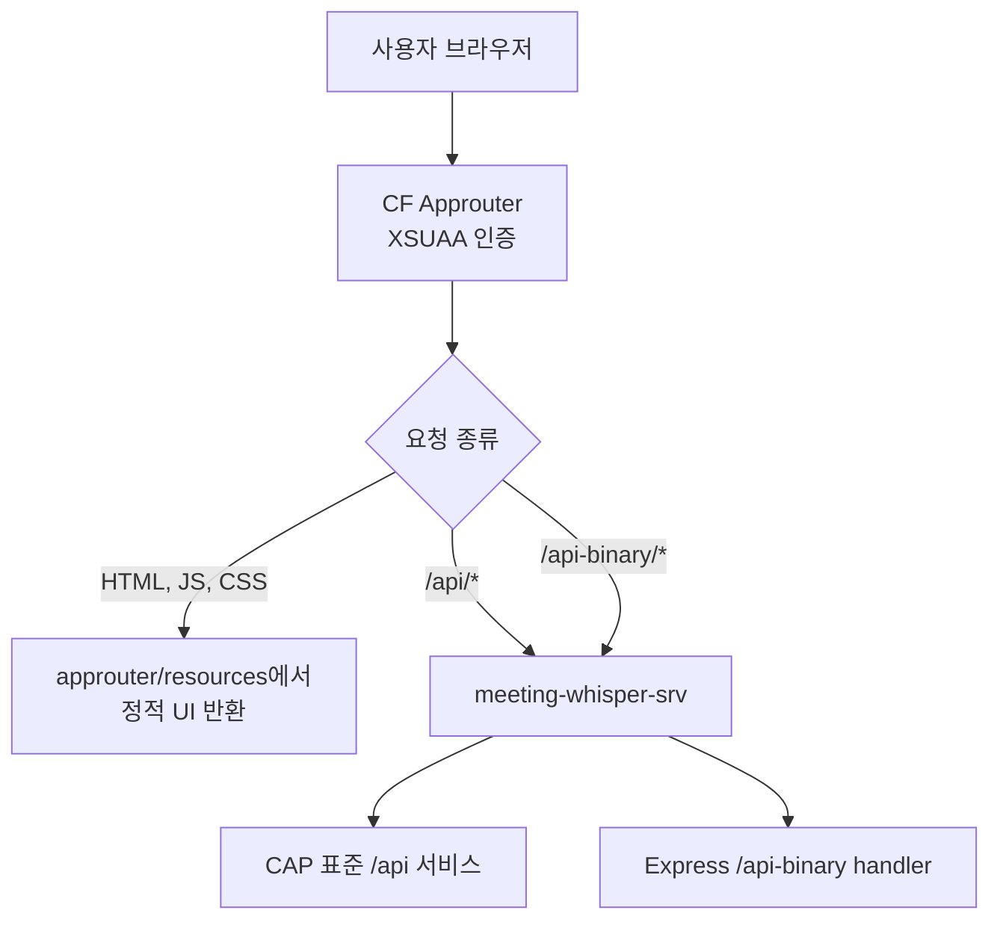

# 내가 개인적으로 중요하다고 느낀 Meeting Whisper의 특징

## CAP 단독 실행과 Approuter 배포에서 정적 UI가 달라지는 이유

## 질문에서 시작한 핵심

`server.js`에는 바이너리 업로드 외에도 다음 코드가 있다.

```js
if (webRoot) {
  app.use(express.static(webRoot));
}
```

처음에는 이 코드를 다음처럼 이해하기 쉬웠다.

```text
Approuter가 켜져 있으면 정석적으로 Approuter를 사용하고,
Approuter가 꺼져 있으면 CAP가 Approuter 쪽으로 안내하거나
대신 연결하여 화면이 동작하게 한다.
```

하지만 실제 동작은 다르다.

> CAP는 Approuter의 실행 여부를 검사하거나 Approuter로 안내하지 않는다. 로컬에서 UI 원본을 발견하면 같은 CAP Express 서버가 정적 파일을 직접 반환한다.

그리고 현재 배포에서는:

> UI 파일을 CAP 배포물에 포함하지 않고 `approuter/resources`에만 포함하므로, CAP의 정적 파일 middleware는 등록되지 않고 Approuter가 UI 제공을 전담한다.

관련된 기본 구조는 [[01. 프론트엔드를 Approuter 안에 포함해 배포하는 구조]]와 함께 보면 이해하기 쉽다.

---

## express.static은 API와 무엇이 다른가

`express.static(webRoot)`도 `/api-binary`와 마찬가지로 같은 Express 서버에 등록된다.

하지만 API handler가 아니라 **정적 파일 middleware**다.

```text
API handler
= 요청에 맞는 업무 코드를 실행하고 JSON 등의 결과를 만듦

정적 파일 middleware
= URL과 일치하는 실제 파일을 폴더에서 찾아 그대로 반환
```

예를 들어 `webRoot`가 `app/meeting-ui`라면:

```text
GET /index.html
→ app/meeting-ui/index.html 반환

GET /js/api.js
→ app/meeting-ui/js/api.js 반환

GET /styles.css
→ app/meeting-ui/styles.css 반환
```

정적 파일이 없으면 오류를 즉시 확정하지 않고 다음 middleware로 요청을 넘긴다.

```text
GET /api/Meetings
→ app/meeting-ui/api/Meetings라는 파일을 찾아봄
→ 파일 없음
→ next()
→ CAP의 /api 서비스가 처리
```

따라서 하나의 Express 서버 안에서 다음 처리기가 함께 존재할 수 있다.

```text
CAP Express :4004
├─ express.static()     HTML, CSS, JS, 이미지
├─ app.post()           /api-binary raw upload
└─ CAP protocol adapter /api, /internal
```

---

## server.js가 UI 폴더를 찾는 방법

`server.js`는 다음 후보 중 `index.html`이 실제로 있는 첫 번째 폴더를 찾는다.

```js
const webRoot = [
  path.join(__dirname, "app", "meeting-ui"),
  path.join(__dirname, "web"),
  path.join(__dirname, "..", "..", "app", "meeting-ui"),
  path.join(__dirname, "..", "..", "web"),
].find((candidate) =>
  fs.existsSync(path.join(candidate, "index.html"))
);
```

그리고 폴더를 찾았을 때만 정적 middleware를 등록한다.

```js
if (webRoot) {
  app.use(express.static(webRoot));
}
```

여기에는 다음과 같은 코드는 없다.

```text
Approuter 프로세스가 실행 중인가?
Approuter의 포트는 무엇인가?
Approuter 주소로 redirect할 것인가?
Approuter를 대신 실행할 것인가?
현재 NODE_ENV가 production인가?
```

오직 다음만 확인한다.

```text
후보 폴더에 index.html 파일이 실제로 존재하는가?
```

---

## 로컬에서 CAP만 실행한 경우

프로젝트 루트에서 CAP를 실행하면 `app/meeting-ui/index.html`이 존재한다.

```text
meeting-whisper/
├─ server.js
├─ app/
│  └─ meeting-ui/
│     └─ index.html
└─ cap/
```

따라서 `webRoot`는 다음 경로가 된다.

```text
app/meeting-ui
```

CAP Express는 정적 UI와 API를 모두 직접 제공한다.



이 경우 Approuter는 아예 실행되지 않아도 된다.

```text
브라우저
→ CAP :4004
→ UI도 CAP가 직접 반환
→ UI의 상대 URL /api 요청도 같은 CAP로 들어감
```

이것은 운영 구조를 흉내 내는 것이 아니라 개발 편의를 위한 CAP 단독 실행 경로다.

---

## 로컬에서 Approuter도 실행한 경우

로컬 Approuter는 보통 `localhost:5000`에서 실행된다.

`router:local` 명령은 실행 전에 `copy-web-assets.js`를 호출해 UI 원본을 다음 폴더로 복사한다.

```text
app/meeting-ui
→ approuter/dev/resources
```

그 후 `approuter/dev/xs-app.json` 규칙에 따라 요청을 처리한다.



이때 브라우저가 `:5000`을 사용하므로 정적 UI 요청은 Approuter에서 끝난다.

CAP의 `express.static()` 코드가 자동으로 제거되는 것은 아니다. 프로젝트 루트에서 실행 중인 CAP는 여전히 `:4004`에서 UI를 직접 제공할 수 있다.

```text
localhost:5000로 접근
→ Approuter가 UI 제공

localhost:4004로 직접 접근
→ CAP Express가 UI 제공
```

즉, 두 서버가 서로를 감지해 역할을 바꾸는 구조가 아니다. 사용자가 어느 주소로 들어갔는지에 따라 먼저 만나는 서버가 달라지는 것이다.

---

## 배포 빌드에서는 UI를 어디에 넣는가

배포 전에 `scripts/copy-web-assets.js`가 실행된다.

원본은 다음 위치다.

```text
app/meeting-ui
```

복사 대상은 다음 두 곳뿐이다.

```text
approuter/resources
approuter/dev/resources
```

역할은 다음과 같다.

| 경로 | 역할 |
|---|---|
| `app/meeting-ui` | 개발자가 수정하는 UI 원본 |
| `approuter/resources` | CF Approuter 배포에 포함되는 UI |
| `approuter/dev/resources` | 로컬 Approuter가 사용하는 UI |
| `gen/cap/srv/web` | 현재 구조에서는 삭제되는 과거 CAP UI 결과 위치 |

MTA 빌드에서는 CAP와 Approuter가 별도 모듈로 패키징된다.

```yaml
- name: meeting-whisper-srv
  type: nodejs
  path: gen/cap/srv

- name: meeting-whisper-approuter
  type: approuter.nodejs
  path: approuter
```

결과적으로:

```text
meeting-whisper-srv 배포물
├─ server.js
├─ CAP 서비스 코드
├─ binary-upload-route.js
└─ 정적 UI 파일 없음

meeting-whisper-approuter 배포물
├─ xs-app.json
├─ package.json
└─ resources/
   ├─ index.html
   ├─ JavaScript
   ├─ CSS
   └─ 이미지
```

---

## gen/cap/srv/web을 명시적으로 삭제하는 이유

`copy-web-assets.js`에는 다음 코드가 있다.

```js
const generatedCapTarget =
  path.join(root, "gen", "cap", "srv", "web");

fs.rmSync(generatedCapTarget, {
  recursive: true,
  force: true,
});
```

이 부분은 중요하다.

이 프로젝트의 과거 빌드 구조에서는 UI를 CAP의 생성 결과 폴더에도 복사한 적이 있었다.

따라서 작업 폴더에 이전 빌드 결과가 남아 있으면 다음 파일이 남을 수 있다.

```text
gen/cap/srv/web/index.html
```

이를 삭제하지 않고 CAP 모듈을 패키징하면:

```text
CF가 CAP 앱 시작
→ 배포된 server.js 실행
→ gen/cap/srv/web/index.html 발견
→ express.static() 등록
→ CAP도 배포 UI를 제공
```

이라는 의도하지 않은 결과가 생길 수 있다.

현재 빌드 스크립트는 이 폴더를 명시적으로 삭제해 과거 빌드 잔여물이 CAP 배포물에 섞이지 않도록 한다.

```text
gen/cap/srv/web 삭제
= CAP 배포물에서 UI를 확실히 제외
= 배포 UI 제공 책임을 Approuter로 일원화
= 오래된 생성물이 우연히 다시 배포되는 상황 방지
```

깨끗한 빌드 환경이라면 원래 파일이 없을 수도 있다. 그래도 명시적 삭제는 현재 구조의 의도를 보장하는 안전장치다.

---

## 배포된 CAP에서 server.js는 실행되는가

실행된다.

`server.js` 전체가 배포에서 제외되는 것이 아니다.

```text
프로젝트 루트/server.js
→ cds build --production
→ gen/cap/srv/server.js
→ meeting-whisper-srv 모듈에 포함
→ CF에서 cds-serve가 로드
```

다만 `server.js` 안의 기능별 결과가 다르다.

| server.js 기능 | 로컬 CAP | 배포 CAP |
|---|---:|---:|
| body parser 제한 설정 | 적용 | 적용 |
| `/api-binary` 경로 등록 | 등록 | 등록 |
| UI 후보 폴더 검색 | 성공 | 실패 |
| `express.static()` 등록 | 등록 | 등록 안 됨 |

배포 시 `express.static()`만 효과가 없는 이유는 `server.js`가 실행되지 않아서가 아니다.

> `server.js`는 실행되지만 CAP 배포 패키지 안에서 `index.html`을 발견하지 못하므로 `if (webRoot)` 조건을 통과하지 못한다.

---

## 배포 환경의 실제 요청 흐름

배포된 `approuter/xs-app.json`에는 크게 세 종류의 규칙이 있다.

```text
/api/*
→ srv-api destination

/api-binary/*
→ srv-api destination

그 밖의 /*
→ localDir: resources
```

전체 흐름은 다음과 같다.



배포에서는 정적 UI 요청이 CAP까지 전달되지 않는다. Approuter가 자신의 `resources`에서 바로 파일을 반환한다.

---

## “배포에서는 Approuter만 진입점”의 정확한 의미

다음 문장은 사용자 관점에서는 맞다.

> 배포 환경에서 사용자는 Approuter route로 접근한다.

하지만 다음처럼 확대 해석하면 정확하지 않다.

```text
모든 프로그램과 모든 내부 요청이
오직 Approuter만 거쳐 CAP에 접근한다.
```

CAP 애플리케이션도 자체 CF route를 가진다.

```text
일반 사용자 UI/API
→ 공식적으로 Approuter 사용

Worker의 내부 callback
→ CAP srv route를 직접 사용할 수 있음

운영 확인
→ CAP srv route를 직접 확인할 수 있음
```

따라서 Approuter는 **사용자용 공식 공개 진입점**이라고 이해하는 것이 가장 정확하다.

---

## Approuter가 배포에서 꺼지면 CAP가 대신하는가

아니다.

배포된 CAP 모듈에는 UI 파일이 없으므로 Approuter가 중단되었다고 해서 CAP가 자동으로 UI를 제공하지 않는다.

```text
CF Approuter 중단
→ 사용자 UI 접근 불가

CAP srv는 실행 중
→ API와 Worker 내부 경로는 살아 있을 수 있음
→ 하지만 CAP 배포물에는 index.html이 없음
→ 사용자 화면을 대신 제공하지 않음
```

로컬 CAP 단독 UI는 장애 시 자동 fallback 기능이 아니라 개발 소스 트리에 UI가 있기 때문에 가능한 별도 실행 방식이다.

---

## 환경별 차이 한눈에 보기

| 환경 | 브라우저 주소 | 정적 UI 제공자 | API 처리자 | CAP의 `express.static()` |
|---|---|---|---|---|
| CAP만 로컬 실행 | `localhost:4004` | CAP Express | CAP | 등록 |
| CAP + 로컬 Approuter | `localhost:5000` | Local Approuter | CAP로 proxy | CAP에는 등록되어 있으나 브라우저 UI 요청은 보통 도달하지 않음 |
| CF 배포 | Approuter CF route | CF Approuter | CAP로 proxy | UI 파일이 없어 등록 안 됨 |

---

## 비유로 기억하기

### 로컬 CAP 단독 실행

CAP 건물 안에 임시 안내 데스크와 전시 공간을 함께 둔 것과 같다.

```text
화면 파일 요청
→ CAP 건물 안의 app/meeting-ui에서 바로 제공

API 요청
→ 같은 건물의 CAP 서비스가 처리
```

### Approuter를 사용하는 실행

앞 건물인 Approuter가 전시 공간과 안내 데스크를 담당한다.

```text
화면 파일 요청
→ Approuter 건물의 resources에서 바로 제공

API 요청
→ 뒤쪽 CAP 건물로 전달
```

배포할 때는 CAP 건물에서 전시 공간 자체를 빼고, Approuter 건물에만 UI를 넣는다.

---

## 비슷한 프로젝트에서 확인할 것

1. `server.js`가 `express.static()`을 등록하는가?
2. 정적 폴더 등록 전에 실제 파일 존재를 검사하는가?
3. 로컬 실행 위치에서 `index.html`이 어느 후보 경로에 있는가?
4. `copy-web-assets.js`가 UI를 어디로 복사하는가?
5. 생성된 CAP 폴더의 UI를 명시적으로 삭제하는가?
6. `mta.yaml`에서 CAP 모듈과 Approuter 모듈의 `path`는 무엇인가?
7. `xs-app.json`의 `localDir`은 어느 폴더를 가리키는가?
8. Approuter가 API 경로를 어느 destination으로 전달하는가?
9. 배포 CAP 모듈 안에 `index.html`이 실제로 포함되는가?

---

## 내가 기억할 핵심

> `express.static()`도 `/api-binary`와 같은 CAP Express 서버에 등록되지만 API handler가 아니라 실제 HTML·JS·CSS 파일을 찾아 반환하는 middleware다.

> 로컬 CAP 단독 실행에서는 프로젝트의 `app/meeting-ui/index.html`을 발견하므로 CAP가 UI와 API를 함께 제공한다. Approuter를 감지하거나 그쪽으로 안내하는 것이 아니다.

> 로컬 Approuter나 CF Approuter를 사용하면 브라우저의 정적 파일 요청은 Approuter의 `resources`에서 끝나고, `/api`와 `/api-binary` 요청만 CAP로 전달된다.

> 배포에서도 `server.js`는 실행되고 바이너리 API는 등록된다. 하지만 `copy-web-assets.js`가 `gen/cap/srv/web`을 삭제하고 UI를 `approuter/resources`에만 복사하므로 CAP는 `index.html`을 발견하지 못해 `express.static()`을 등록하지 않는다.

> `gen/cap/srv/web` 삭제는 오래된 빌드 잔여물이 CAP 배포물에 들어가 UI 제공 책임이 다시 CAP로 섞이는 것을 방지하는 명시적 안전장치다.

---

## 함께 보면 좋은 파일

```text
server.js
scripts/copy-web-assets.js
app/meeting-ui/
approuter/xs-app.json
approuter/dev/xs-app.json
approuter/package.json
mta.yaml
package.json
.cdsrc.json
```

