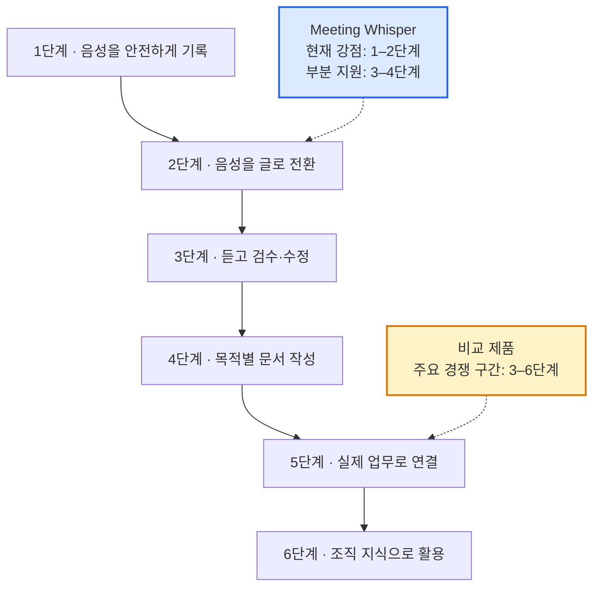
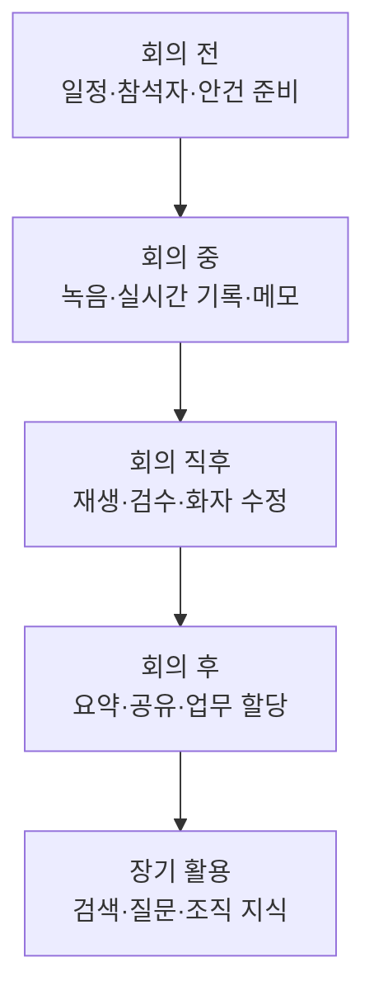
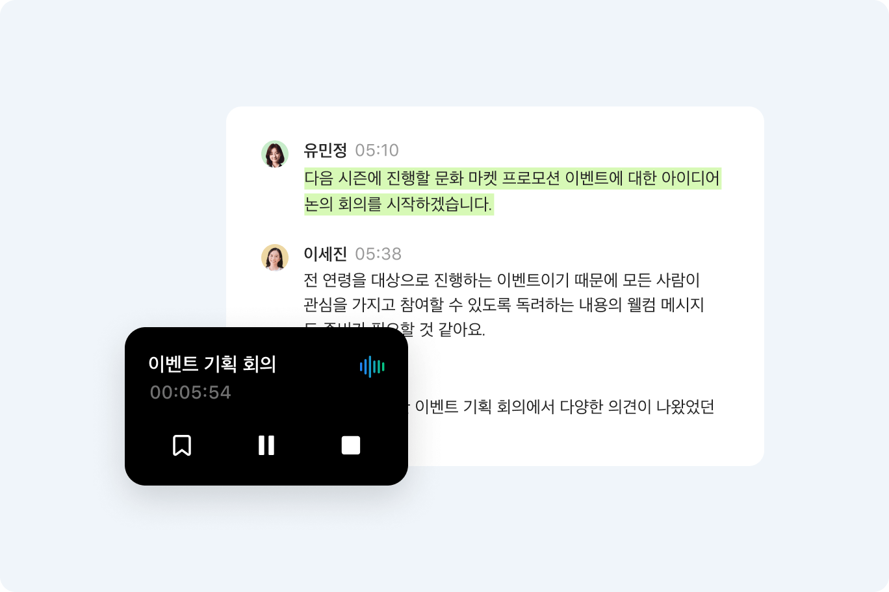
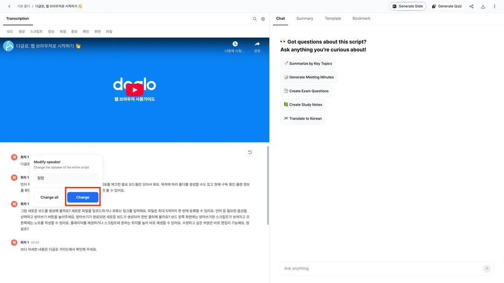
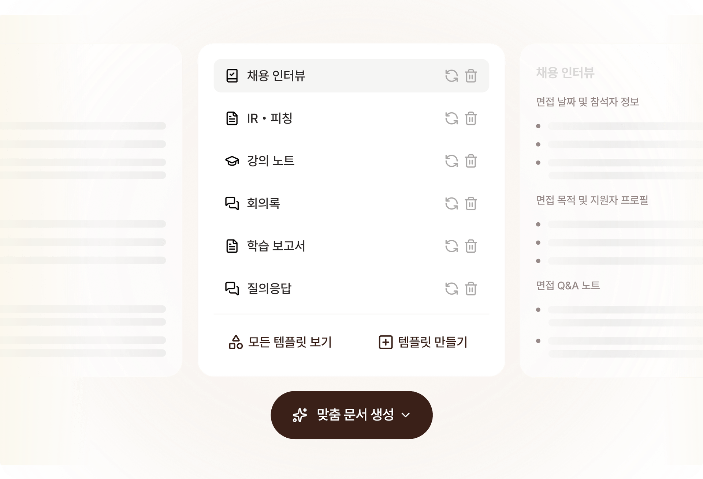
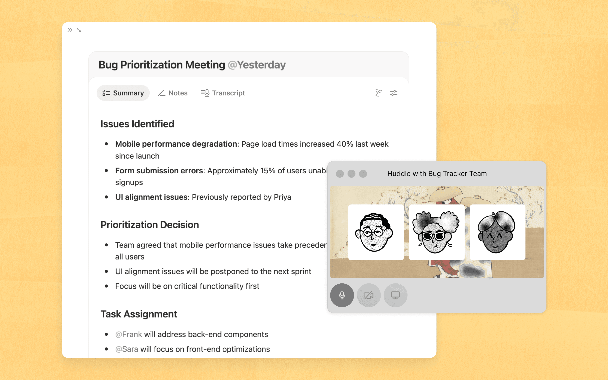
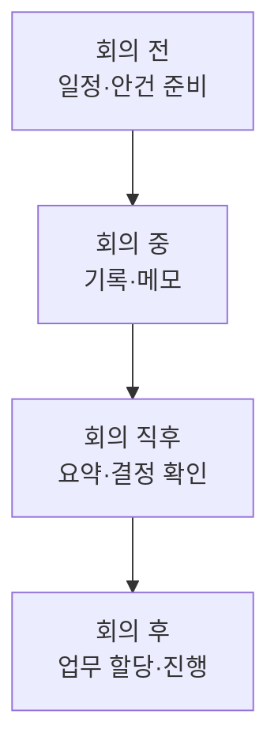
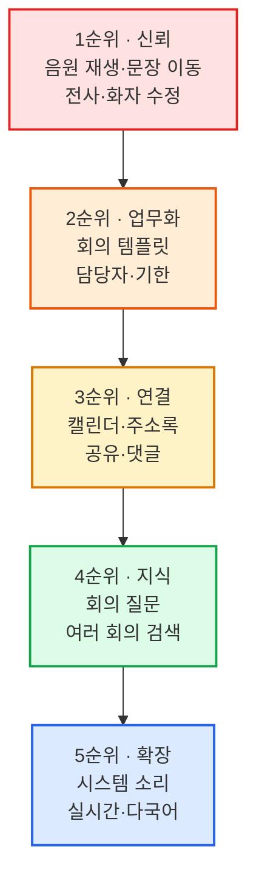

# 다른 회의록 앱과 비교 — Meeting Whisper는 무엇을 더 보완해야 하는가

> 작성일: 2026-07-27  
> 비교 대상: 네이버웍스 클로바노트, 다글로, 티로, Notion AI 노트  
> 목적: 개발 계획 확정이 아니라 제품의 현재 위치와 개선 방향을 이해하기 위한 비교

## 먼저 결론

Meeting Whisper는 **음원을 안전하게 받아 전사와 요약을 끝까지 처리하는 내부 구조**가 강하다.

반면 다른 제품들은 전사 이후의 사용자 경험까지 넓게 다룬다.

- 잘못 들은 내용을 음원과 비교하며 고친다.
- 회의 종류에 맞는 문서를 만든다.
- 회의 내용에 질문한다.
- 결정된 일을 담당자와 기한이 있는 업무로 바꾼다.
- 캘린더와 화상회의, 메신저에 연결한다.
- 여러 회의를 조직의 지식으로 검색한다.

현재 차이를 한 그림으로 보면 다음과 같다.

가장 먼저 해야 할 일은 더 많은 AI 기능을 붙이는 것이 아니다.  
**사용자가 전사 결과를 믿고 확인하고 고칠 수 있는 화면**을 만드는 것이 우선이다.

---

## 비교할 때 보는 기준

전사 정확도 하나만으로 회의록 앱을 비교하면 실제 사용 경험을 놓치기 쉽다. 이번 비교에서는 회의 전·중·후를 모두 살펴본다.

---

## 1. 네이버웍스 클로바노트

### 이 제품이 중요하게 보는 것

클로바노트는 **쉽게 녹음하고, 음성을 다시 들으며 확인하고, 회사가 안전하게 관리하는 경험**에 강하다.

공식 소개에서 확인되는 주요 특징:

- PC와 모바일에서 녹음
- 기존 음성 파일 업로드
- 중요한 순간의 북마크, 하이라이트, 메모
- 주요 내용과 다음 할 일 요약
- 여러 언어 인식
- 회사명과 전문용어를 등록하는 어휘사전
- 음성과 전사 내용을 함께 공유
- 공유, 접근, 다운로드 권한 제어
- 관리자 통계, 감사, 자동 삭제 정책

> 음원 재생 위치와 현재 발언이 함께 보인다. 사용자가 중요한 문장을 실제 음성과 비교하기 쉽다.  
> 출처: [네이버웍스 클로바노트 공식 소개](https://naver.worksmobile.com/products/clovanote/)

### Meeting Whisper와 비교

Meeting Whisper도 녹음, 업로드, 요약, 공유 범위 관리가 가능하다. 그러나 완성된 전사를 검수하는 경험이 약하다.

부족한 부분:

- 음원을 재생하며 해당 문장으로 이동하는 기능
- 현재 재생 중인 발언 강조
- 중요한 순간 북마크
- 단어 전체 찾기·바꾸기
- 회사 공용 전문용어 사전
- 관리자가 보는 통계·감사 화면
- 회의록과 음원의 보존 기간 정책 화면

### 배울 점

AI가 만든 결과를 곧바로 완성본으로 취급하지 않는다.  
사용자가 **듣고, 확인하고, 고치는 과정**을 제품의 중심 기능으로 둔다.

---

## 2. 다글로

### 이 제품이 중요하게 보는 것

다글로는 회의록 앱을 넘어 **여러 자료를 AI로 정리하고 다시 활용하는 업무 공간**을 지향한다.

공식 소개에서 확인되는 주요 특징:

- 녹음, 파일, 유튜브 링크 입력
- 실시간 받아쓰기와 화자 분리
- 핵심 내용과 키워드
- 일반 회의, 이사회, 주간회의 등 목적별 템플릿
- 담당자와 기한이 포함된 액션 아이템
- 회의 내용에 질문하는 AI 채팅
- 여러 회의와 문서를 함께 검색
- PDF 분석과 문서 번역
- 회의 내용을 보고서와 슬라이드로 확장

> 왼쪽에서는 전사와 화자를 확인하고 오른쪽에서는 요약, 템플릿, 북마크, AI 질문을 사용할 수 있다.  
> 출처: [다글로 공식 제품 소개](https://daglo.ai/team-plan)

### Meeting Whisper와 비교

Meeting Whisper의 회의 종류는 AI 요약의 참고 정보에 가깝다. 사용자가 원하는 결과 문서 형태를 고르는 템플릿 시스템은 아니다.

부족한 부분:

- 주간회의, 고객 인터뷰 등 목적별 결과 양식
- 사용자가 직접 만드는 회사 회의록 양식
- 현재 회의에 질문하는 기능
- 여러 회의를 묶어 질문하는 기능
- 액션 아이템의 담당자, 기한, 진행 상태
- 회의에서 보고서나 후속 이메일을 만드는 기능

### 배울 점

사용자는 “음성 파일을 전사하고 싶다”보다 “주간회의록을 만들고 싶다”는 목적을 갖고 들어온다.

따라서 입력 형식보다 **어떤 결과물을 만들 것인지**를 먼저 선택하게 하는 화면이 중요하다.

---

## 3. 티로

### 이 제품이 중요하게 보는 것

티로는 **회의 중 바로 도움을 주는 실시간성**, **다국어**, **회사 양식에 맞는 문서화**, **다른 업무 도구와의 연결**을 강조한다.

공식 소개에서 확인되는 주요 특징:

- 실시간 대화 기록
- 여러 언어의 실시간 번역
- 데스크톱 시스템 소리 녹음
- 모바일과 다양한 기기 지원
- 문단별 음성 다시 듣기
- PDF와 Word 내보내기
- 단어 일괄 수정
- 사용자 정의 템플릿
- 회의 내용에 질문하는 Ask Tiro
- 캘린더, 메신저, CRM 등과 연동
- 팀 공용 템플릿과 단어장

> 채용 인터뷰, 투자 설명, 강의 노트, 회의록처럼 사용 목적을 먼저 선택하고 새 템플릿도 직접 만들 수 있다.  
> 출처: [티로 공식 제품 소개](https://tiro.ooo/)

### Meeting Whisper와 비교

Meeting Whisper는 녹음이 끝난 뒤 Worker가 음원을 처리하는 구조다. 회의 중 실시간 자막이나 번역을 제공하는 구조와는 다르다.

부족한 부분:

- 온라인 회의의 시스템 소리 기록
- 실시간 전사와 번역
- 사용자 정의 회의록 양식
- PDF와 Word 출력
- 회의 내용을 자동으로 다른 업무 도구에 전달하는 기능
- 팀 공용 전문용어와 템플릿

### 배울 점

회의는 항상 브라우저 앞에서 시작되지 않는다. 온라인 화상회의, 대면 회의, 이동 중 대화가 모두 기록 대상이다.

다만 Meeting Whisper가 바로 모바일 앱과 실시간 번역을 모두 따라갈 필요는 없다. 먼저 기존 구조에서 가능한 **PDF·Word 출력, 템플릿, 전문용어 사전**부터 검토하는 편이 현실적이다.

---

## 4. Notion AI 노트

### 이 제품이 중요하게 보는 것

Notion은 회의록을 별도 기록으로 끝내지 않고 **일정, 문서, 할 일, 프로젝트와 연결된 업무 정보**로 만든다.

공식 소개와 도움말에서 확인되는 주요 특징:

- 캘린더에서 예정된 회의 확인
- 회의 전에 안건과 메모 준비
- 시스템 소리와 마이크 동시 기록
- 회의 종류에 맞는 요약
- Summary, Notes, Transcript를 한 문서에서 관리
- 액션 아이템을 담당자와 기한이 있는 할 일로 변경
- 회의 결과로 프로젝트 상태와 일정을 갱신
- 과거 회의에 질문
- 회의 녹음 동의 안내
- 조직 보존 기간과 권한 정책

> 요약, 메모, 전체 전사가 한 문서 안에 있고 결정 사항과 담당 업무가 같은 업무 공간에 이어진다.  
> 출처: [Notion AI 노트 공식 소개](https://www.notion.com/ko/product/ai-meeting-notes)

### Meeting Whisper와 비교

Meeting Whisper는 회의를 직접 새로 만들고 제목과 참여자를 입력한다. 캘린더에 이미 있는 정보를 활용하지 않으며, 요약에서 나온 할 일도 실제 업무 항목과 연결되지 않는다.

부족한 부분:

- 예정된 회의 목록
- 캘린더에서 제목, 시간, 참석자 가져오기
- 회의 전 안건과 사전 메모
- 담당자, 기한, 완료 여부가 있는 액션 아이템
- 프로젝트와 업무 상태 자동 갱신
- 녹음 시작 전 동의 확인
- 조직 전체의 회의 검색

### 배울 점

회의록은 회의가 끝난 뒤 생기는 문서가 아니다.

Meeting Whisper도 장기적으로는 이 네 단계를 하나의 흐름으로 연결할 필요가 있다.

---

## 전체 비교표

`부분`은 기반은 있지만 사용자 기능이 충분하지 않다는 뜻이다.

| 기능 | Meeting Whisper | 클로바노트 | 다글로 | 티로 | Notion |
|---|:---:|:---:|:---:|:---:|:---:|
| 브라우저 녹음 | 지원 | 지원 | 지원 | 지원 | 지원 |
| 파일 업로드 | 지원 | 지원 | 지원 | 지원 | 제한적 |
| 실시간 전사 | 미지원 | 지원 | 지원 | 지원 | 지원 |
| 여러 언어 | 한국어 중심 | 지원 | 지원 | 강점 | 지원 |
| 음원과 문장 동기화 | 미지원 | 강점 | 지원 | 지원 | 제한적 |
| 전사·화자 수정 | 부분 | 지원 | 지원 | 지원 | 문서 편집 |
| 회의 중 북마크·메모 | 미지원 | 강점 | 지원 | 지원 | 지원 |
| 구조화된 요약 | 지원 | 지원 | 지원 | 지원 | 지원 |
| 목적별 템플릿 | 부분 | 부분 | 강점 | 강점 | 강점 |
| 사용자 정의 템플릿 | 미지원 | 제한적 | 지원 | 강점 | 페이지 기반 |
| 회의 내용에 질문 | 미지원 | 제한적 | 지원 | 지원 | 지원 |
| 여러 회의 지식 검색 | 미지원 | 검색 중심 | 지원 | 지원 | 강점 |
| 담당자·기한이 있는 할 일 | 부분 | 부분 | 지원 | 부분 | 강점 |
| 캘린더 연동 | 미지원 | 일부 | 일부 | 지원 | 강점 |
| 조직 권한 | 지원 | 강점 | 지원 | 지원 | 강점 |
| 관리자 통계·감사 화면 | 미지원 | 강점 | 지원 | 지원 | 강점 |
| 안정적인 긴 작업 처리 | 강점 | 외부 확인 어려움 | 외부 확인 어려움 | 외부 확인 어려움 | 외부 확인 어려움 |
| SAP BTP 내부 확장 | 강점 | 미해당 | API 중심 | API 중심 | 외부 연동 |

---

## Meeting Whisper가 이미 잘하는 점

비교 제품에 기능이 많다고 해서 Meeting Whisper가 단순히 뒤처진 제품인 것은 아니다.

### 1. 긴 작업을 안정적으로 처리하는 구조

전사 요청을 대기표에 넣고 Worker의 생존 신호, 재시도 횟수, timeout을 관리한다.

### 2. 사용자와 Worker 권한 분리

사람용 회의 통로와 내부 전사 통로가 분리되어 있다.

### 3. 큰 음원과 업무 데이터 분리

음원은 Object Store에, 회의 정보와 결과는 HANA에 저장한다.

### 4. AI 결과 검사

시간 순서가 뒤집히거나 이상한 형식의 전사 결과를 그대로 저장하지 않는다.

### 5. SAP BTP 조직에 맞는 기반

XSUAA, Approuter, HANA, AI Core를 사용하므로 SAP BTP 중심 조직의 내부 시스템으로 발전시키기 좋다.

---

## 무엇부터 개선해야 하는가

### 1순위 — 듣고 고칠 수 있는 회의록

- 음원 플레이어
- 문장을 누르면 해당 시간으로 이동
- 재생 중 문장 강조
- 화자 이름 변경
- 단어 전체 찾기·바꾸기
- 수정 후 요약을 다시 만들지 안내

이 단계가 없는 상태에서 AI 질문이나 자동 업무 할당을 추가하면 잘못된 전사를 바탕으로 더 많은 결과가 만들어질 수 있다.

### 2순위 — 목적에 맞는 회의록

처음에는 네 가지 양식이면 충분하다.

- 일반 회의
- 주간 업무회의
- 고객 인터뷰
- 의사결정 회의

각 양식은 보여 줄 항목과 요약 구조가 달라야 한다.

### 3순위 — 회의 결과를 실제 업무로 연결

- 액션 아이템 담당자
- 기한
- 완료 상태
- 근거가 된 발언 시간
- 캘린더와 참석자 연결
- 회의 결과 공유와 댓글

### 4순위 — 회의 내용에 질문

처음부터 조직 전체 검색을 만들기보다 현재 회의 하나에 질문하는 기능부터 시작한다. 답변에는 근거가 된 발언과 시간을 함께 보여 주는 것이 중요하다.

### 5순위 — 실시간과 다국어

시스템 소리, 실시간 전사, 실시간 번역은 사용자 가치가 크지만 현재 녹음 완료 후 처리 구조와 다른 기술이 필요하다. 별도 연구 과제로 분리하는 편이 안전하다.

---

## 당장 따라 하지 않아도 되는 기능

다른 제품의 모든 기능을 추가하면 Meeting Whisper의 목적이 흐려질 수 있다.

우선순위를 낮춰도 되는 기능:

- 범용 AI 모델을 여러 개 제공하는 기능
- 회의 내용으로 퀴즈 만들기
- 범용 프레젠테이션 제작
- Apple Watch 전용 앱
- 모든 CRM과 메신저 동시 연동
- 개인 소비자용 요금제와 결제 기능

현재 구조에 더 어울리는 방향은 다음과 같다.

> **SAP BTP 조직을 위한 안전하고 검증 가능한 AI 회의 기록과 후속 업무 도구**

---

## 최종 제안

Meeting Whisper의 다음 목표를 “더 정확한 AI”라고만 정의하지 않는 것이 좋다.

사용자에게 더 직접적인 목표는 다음과 같다.

1. 회의록의 근거를 음성으로 확인할 수 있다.
2. 틀린 문장과 화자를 쉽게 고칠 수 있다.
3. 회의 목적에 맞는 문서가 만들어진다.
4. 결정된 일이 담당자와 기한으로 남는다.
5. 필요한 회의를 나중에 쉽게 찾고 질문할 수 있다.

이 순서로 개선하면 Meeting Whisper는 “음성을 올리면 AI가 요약하는 앱”에서 **회의의 기록, 확인, 결정, 실행을 이어 주는 업무 도구**로 발전할 수 있다.

---

## 공식 참고 자료

- [네이버웍스 클로바노트](https://naver.worksmobile.com/products/clovanote/)
- [다글로 워크스페이스](https://daglo.ai/team-plan)
- [티로](https://tiro.ooo/)
- [Notion AI 노트](https://www.notion.com/ko/product/ai-meeting-notes)
- [Notion AI 노트 도움말](https://www.notion.com/ko/help/ai-meeting-notes)
