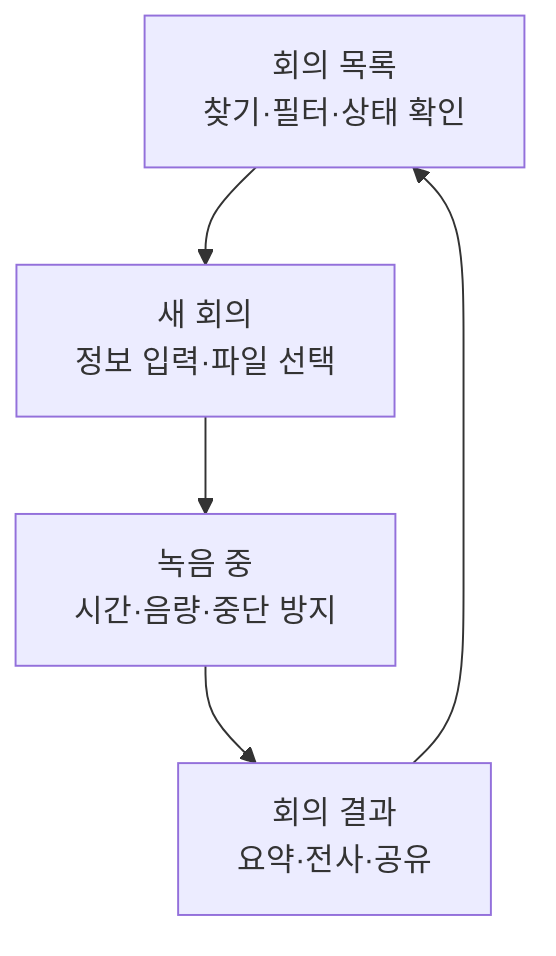

# 사용자 화면 전체 이해

## 이 영역의 역할

`app` 폴더는 사용자가 보는 웹 화면을 담당한다. 화면의 목적은 복잡한 서버 구조를 숨기고 사용자가 다음 네 가지 일에 집중하게 만드는 것이다.

1. 회의를 찾는다.
2. 새 회의를 기록한다.
3. 처리 상황을 이해한다.
4. 완성된 회의록을 읽고 활용한다.

## 화면을 네 장면으로 이해하기

### 회의 목록

사용자가 접근할 수 있는 회의를 모아 보여 준다. 제목, 참여자, 상태 등으로 회의를 찾고 처리 중이거나 실패한 회의를 구분한다.

### 새 회의

제목, 참여자, 회의 종류를 입력한다. 브라우저에서 바로 녹음하거나 기존 음성 파일을 선택한다.

### 녹음 중

브라우저의 마이크 기능을 사용한다. 개발 코드에서는 MediaRecorder라고 부르지만 “브라우저 녹음기”로 이해하면 된다.

긴 녹음 중 문제가 생길 수 있으므로 녹음 조각을 브라우저 안에 임시 저장한다. 이 저장 기술의 이름은 IndexedDB지만, 사용자는 “새로고침 사고에 대비한 로컬 임시 보관함”으로 이해하면 충분하다.

### 결과 화면

처리 단계, 요약, 전체 전사를 보여 준다. 화면은 AI를 직접 실행하지 않고 회의 관리 본부가 저장한 결과를 읽는다.

## 화면 뒤에서 묶여 움직이는 기능

기존 문서는 `app.js`, `session.js`, `ui.js`처럼 파일을 따로 설명했지만 실제 사용 경험에서는 다음 기능 묶음으로 보는 편이 낫다.

### 화면 진행 관리

- 지금 목록·녹음·결과 중 어느 화면을 보여 줄지 결정한다.
- 사용자가 누른 버튼에 맞춰 다음 단계로 이동한다.
- 현재 선택한 회의와 처리 상태를 기억한다.

### 서버와 대화

- 회의 목록과 상세 정보를 요청한다.
- 회의를 만들고 음원을 업로드한다.
- 전사 시작과 재시도를 요청한다.
- 처리 상태를 일정한 간격으로 확인한다.

### 녹음과 복구

- 마이크 사용 권한을 요청한다.
- 녹음 시간을 측정한다.
- 음량을 시각적으로 보여 준다.
- 녹음 조각을 임시 저장한다.
- 중단된 녹음을 복구할 수 있는지 확인한다.

### 로그인 상태 보호

녹음은 길어질 수 있는데 로그인 세션에는 유효 시간이 있다. 화면은 업로드 직전에 로그인이 아직 유효한지 확인하고, 여러 브라우저 탭에서 세션이 끝난 경우 이를 공유한다.

`session.js`는 이 기능을 담은 파일 이름일 뿐이다. 핵심은 “긴 녹음이 끝났는데 로그인 만료 때문에 업로드를 잃는 일을 줄이는 보호 장치”다.

### 결과 표현

서버가 보낸 상태와 회의록을 사람이 읽기 쉬운 형태로 바꾼다.

- 진행률과 대기 문구
- 날짜와 시간
- 화자 이름
- 요약의 각 구역
- 전사의 시간 순서

## 화면 영역의 장점

- 별도의 큰 프론트엔드 프레임워크 없이 가볍게 동작한다.
- 녹음 중 임시 보관으로 데이터 손실을 줄이려 한다.
- queue와 Worker 상태를 비교적 상세하게 보여 줄 수 있다.
- 화면과 서버 역할이 분리되어 있다.

## 화면 영역의 현재 한계

- 사용자에게 낯선 처리 상태가 여전히 보일 수 있다.
- 음원을 들으며 문장을 확인하는 검수 경험이 부족하다.
- 회의 전 안건, 캘린더, 회의 중 북마크가 없다.
- 결과를 실제 할 일이나 프로젝트로 연결하는 기능이 약하다.
- 모바일 웹은 가능하지만 전용 모바일·데스크톱 앱 수준의 녹음 안정성은 아니다.

## 이 영역을 수정할 때 생각해야 할 것

화면 기능을 바꾸면 버튼 모양만 바뀌는 것이 아니다. 서버가 제공하는 데이터, 로그인 시간, 음원 크기, 실패 복구 방식과 함께 확인해야 한다.
