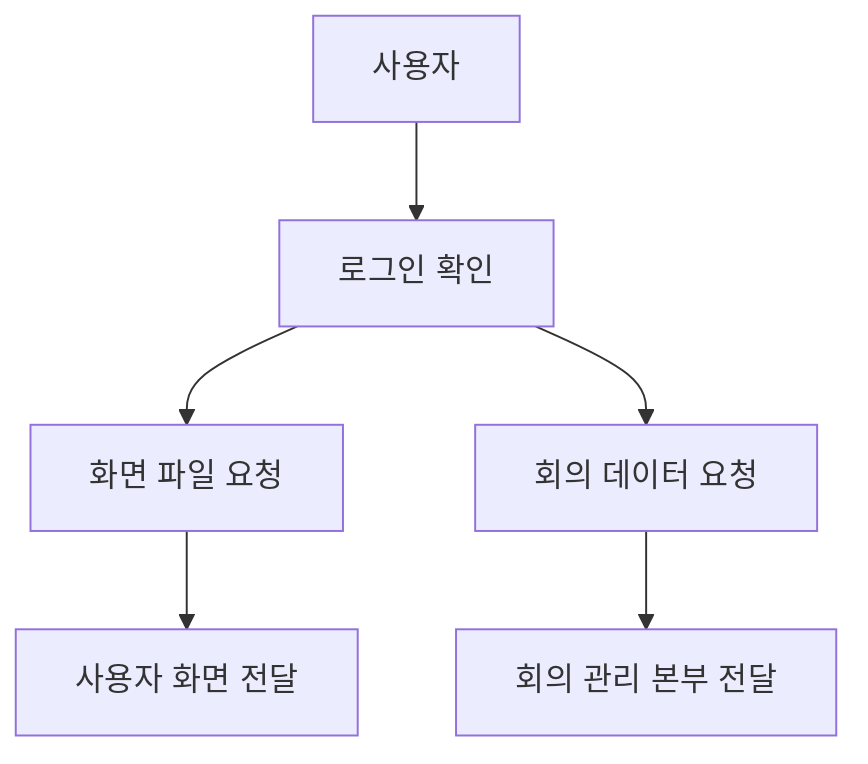
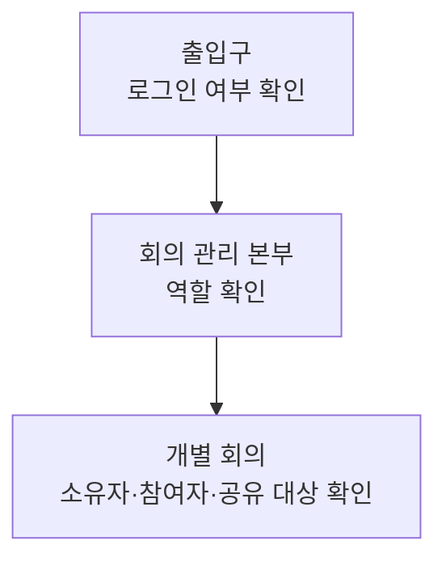

# 로그인과 출입구 전체 이해

## 이 영역의 역할

`approuter`는 사용자가 Meeting Whisper에 들어올 때 만나는 **공식 출입구**다.

## 출입구가 하는 세 가지 일

### 1. 로그인 확인

운영 환경에서는 SAP BTP의 XSUAA라는 인증 서비스를 사용한다. XSUAA는 “이 사람이 누구이고 어떤 역할을 받았는가”를 증명해 주는 사내 출입증 발급소와 비슷하다.

### 2. 요청의 목적지 결정

사용자의 요청은 두 종류다.

- 화면을 그리는 HTML, CSS, 이미지, JavaScript 파일
- 회의 목록, 업로드, 상태 확인 같은 업무 요청

출입구는 주소 규칙을 보고 화면 파일은 화면 저장 위치로, 업무 요청은 CAP 회의 관리 본부로 보낸다.

### 3. 로그인 정보를 안전하게 전달

회의 관리 본부가 권한을 판단할 수 있도록 인증된 사용자 정보를 함께 전달한다.

## 로컬 환경과 운영 환경

개발자 PC에서는 실제 회사 로그인 대신 테스트 사용자를 사용할 수 있다. 또한 화면, 본부, Worker가 각각 다른 주소에서 실행된다.

운영 환경에서는 Cloud Foundry에 올라간 공식 주소와 XSUAA를 사용한다.

두 환경의 주소는 달라도 “출입구가 인증하고 알맞은 곳으로 보낸다”는 역할은 같다.

## 출입구와 권한의 차이

출입구를 통과했다고 모든 회의를 볼 수 있는 것은 아니다.

- 출입구: 로그인한 사용자인가?
- 본부: MeetingUser 또는 관리자 역할이 있는가?
- 개별 회의: 이 회의를 실제로 볼 권한이 있는가?

세 단계가 서로 다른 문제를 해결한다.

## 이 영역에서 장애가 나면 보이는 현상

| 현상 | 가능성 |
|---|---|
| 로그인 화면이 반복됨 | 인증 설정 또는 세션 문제 |
| 화면은 열리지만 회의가 안 보임 | API 전달 또는 사용자 권한 문제 |
| 화면 파일이 깨짐 | 정적 파일 경로 문제 |
| 로컬에서는 되고 운영에서만 실패 | 운영 주소, destination, XSUAA 설정 문제 |

## 중요한 관점

Approuter는 회의 내용을 처리하지 않는다. 출입증 확인과 길 안내만 책임진다. 회의 권한과 데이터 보호의 최종 판단은 CAP 본부가 해야 한다.
