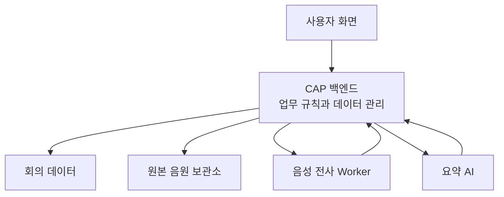
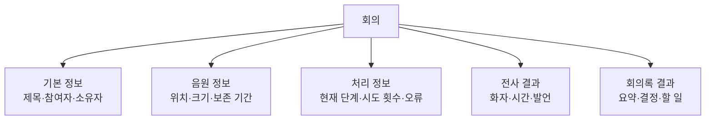
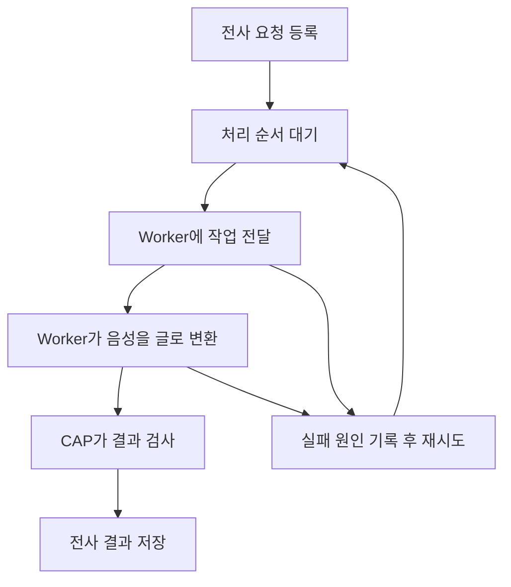
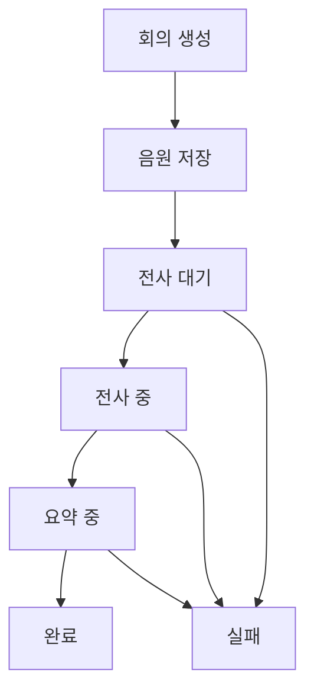

# CAP 백엔드 전체 이해

## 한 문장으로 이해하기

`cap`은 Meeting Whisper의 **업무 본부**다.

화면에서 들어온 요청을 받아 사용 권한을 확인하고, 회의·음원·전사·요약 정보를 관리하며, 시간이 오래 걸리는 음성 변환 작업을 Worker에게 맡긴 뒤 결과를 다시 하나의 회의록으로 모은다.

CAP가 모든 일을 직접 하는 것은 아니다. 대신 누가 무엇을 할 수 있는지 판단하고, 각 작업을 알맞은 곳에 보내며, 진행 상태와 결과를 책임진다.

## CAP가 맡는 다섯 가지 큰 책임

### 사용자와 권한 관리

회의를 만든 사람, 내용을 편집할 사람, 읽기만 할 사람, 시스템을 운영하는 사람을 구분한다.

화면에서 버튼을 감추는 데 그치지 않고, 실제 조회·수정·삭제·재시도 요청이 들어올 때마다 권한을 다시 확인한다. 따라서 CAP는 “이 요청을 처리해도 되는가?”를 판단하는 최종 관문이다.

### 하나의 회의를 하나의 업무 단위로 관리

회의는 제목 하나만 저장되는 단순한 문서가 아니다.

이 정보들은 수명과 변경 시점이 다르므로 나뉘어 저장된다. 예를 들어 원본 음원은 일정 기간 뒤 지울 수 있지만, 전사와 회의록은 계속 보존할 수 있다. 요약만 실패했을 때 전사를 다시 만들 필요도 없다.

### 음원 보관과 수명 관리

큰 음원 파일 자체는 전용 보관소에 두고, CAP는 어느 회의의 파일인지와 저장 위치·크기·만료 시점을 관리한다.

업로드와 삭제 때는 회의 소유권과 파일 크기 제한을 확인한다. 보존 기한이 지난 음원은 정리하되 회의록까지 함께 사라지지 않도록 음원과 문서의 수명을 분리한다.

### 오래 걸리는 전사 작업 조정

음성을 글로 바꾸는 작업은 오래 걸리고 많은 자원을 사용할 수 있다. CAP가 직접 수행하면 회의 목록 조회 같은 빠른 요청까지 느려질 수 있으므로 실제 변환은 Worker에게 맡긴다.

CAP는 대기 중인 작업 수, 시도 횟수, 다음 재시도 시각을 기록한다. Worker가 바쁘거나 일시적으로 연결되지 않으면 바로 계속 호출하지 않고 간격을 두고 다시 시도한다.

Worker가 결과를 보내면 발언 구조, 시간 순서, 회의 길이 범위 등을 검사한 뒤 저장한다. 외부 작업의 결과를 그대로 신뢰하지 않는 구조다.

### 전사를 읽기 좋은 회의록으로 정리

전사가 끝나면 CAP는 긴 내용을 AI가 처리할 수 있는 크기로 나누고, 부분별 핵심을 정리한 뒤 다시 하나로 합친다.

최종 결과는 자유로운 문장 하나가 아니라 다음처럼 재사용하기 쉬운 구조로 관리된다.

- 회의 핵심
- 주요 논의
- 결정 사항
- 해야 할 일
- 확인이 필요한 내용

이렇게 정리하면 같은 정보를 화면, Markdown 다운로드, 향후 PDF나 Word 출력에서 다시 사용할 수 있다.

## 처음부터 완료까지 CAP가 하는 일

| 순서 | CAP의 판단과 행동 |
|---|---|
| 회의 생성 | 사용자를 확인하고 회의 기본 정보를 만든다. |
| 음원 등록 | 소유권과 크기를 확인하고 음원 위치를 기록한다. |
| 전사 요청 | 작업을 대기표에 올리고 현재 상태를 바꾼다. |
| Worker 처리 | 작업 사용권과 음원 접근을 제공하고 진행 상태를 받는다. |
| 결과 접수 | 전사 형식과 시간 정보를 검사해 저장한다. |
| 요약 생성 | 전사를 나누어 AI에 전달하고 결과 형식을 확인한다. |
| 완료 | 전사와 요약을 하나의 회의록으로 화면에 제공한다. |
| 실패 | 성공한 결과는 보존하고 실패 지점과 재시도 정보를 남긴다. |

## 상태가 중요한 이유

상태는 사용자에게 진행 상황을 보여 주는 문구이면서 시스템의 판단 근거다. 같은 작업의 중복 실행을 막고, 오래 멈춘 작업을 찾아 복구하며, 어느 단계부터 다시 시작할지 결정하는 데 쓰인다.

## 사용자 통로와 시스템 통로

CAP에는 성격이 다른 두 통로가 있다.

| 통로 | 이용 주체 | 주요 역할 |
|---|---|---|
| 사용자용 통로 | 웹 화면과 사용자 | 회의 생성·조회·공유·삭제, 음원 업로드, 재시도 |
| 내부 작업 통로 | 전사 Worker | 작업 확보, 생존 신호, 음원 요청, 결과 저장, 실패 보고 |

사용자와 Worker의 통로를 분리하면 내부 작업 기능이 일반 사용자에게 노출되는 일을 막고, 각 요청에 필요한 권한도 명확하게 적용할 수 있다.

## 장애가 나도 결과를 지키는 방법

CAP는 한 번의 긴 작업으로 모든 것을 처리하지 않는다. 음원 저장, 전사, 요약을 서로 다른 단계로 나누고 단계마다 결과를 남긴다.

- 전사는 성공했지만 요약이 실패하면 전사를 보존한다.
- Worker가 응답하지 않으면 작업을 잃지 않고 다시 대기시킨다.
- 같은 작업을 여러 Worker가 동시에 가져가지 못하도록 사용권을 관리한다.
- 오래 멈춘 작업은 생존 신호와 시간을 기준으로 찾아낸다.
- AI나 Worker가 잘못된 형식을 보내면 검사 후 오류로 기록한다.
- 실패 횟수와 다음 재시도 시각을 남겨 무한 반복을 막는다.

## 이 폴더를 볼 때 기억할 큰 그림

CAP를 개별 파일들의 집합으로 보기보다 다음 세 문장으로 이해하면 된다.

1. **화면의 요청을 실제 업무 규칙으로 바꾸는 곳이다.**
2. **회의와 관련된 여러 데이터를 하나의 업무 흐름으로 묶는 곳이다.**
3. **Worker와 AI가 안전하게 일하도록 순서·상태·실패를 조정하는 곳이다.**

화면이 Meeting Whisper의 얼굴이고 Worker가 음성을 글로 만드는 작업장이라면, CAP는 그 사이에서 전체 회의록 생산 과정을 지휘하는 본부다.
