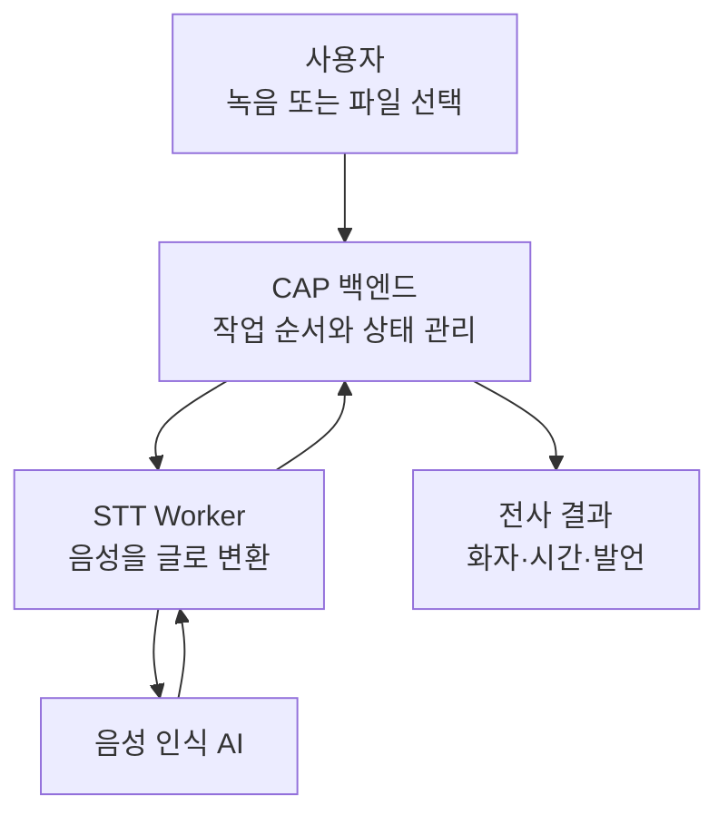
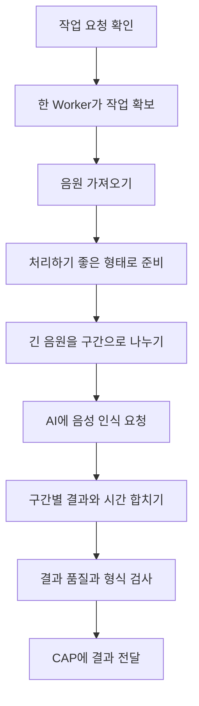
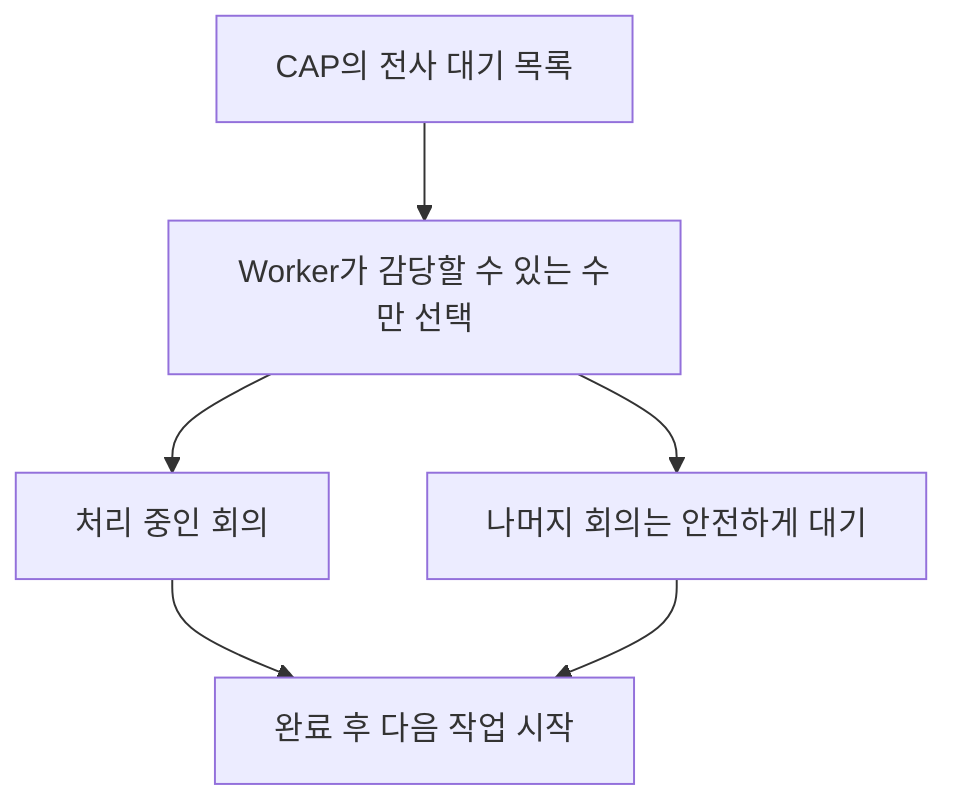

# STT 처리 전체 이해

## 한 문장으로 이해하기

`workers`는 회의 음성을 받아 글로 바꾸는 **전문 작업장**이다.

여기서 STT는 *Speech to Text*, 즉 “말소리를 글자로 바꾸는 일”을 뜻한다. 사용자가 직접 Worker를 조작하는 것은 아니며, CAP 백엔드가 작업을 맡기면 Worker가 음원을 준비하고 AI에 전사를 요청한 뒤 검사된 결과를 돌려준다.

CAP가 전체 회의 처리의 지휘 본부라면, Worker는 음성 변환에 필요한 무거운 작업만 맡는 실행 부서다.

## Worker를 별도로 둔 이유

음성 변환은 회의 목록을 보여 주는 일보다 훨씬 오래 걸리고 메모리도 많이 사용한다.

이 작업을 CAP가 직접 수행하면 한 건의 긴 회의 때문에 다른 사용자의 조회나 저장 요청까지 느려질 수 있다. 별도 Worker로 분리하면 다음과 같은 장점이 생긴다.

- 일반 화면 요청과 무거운 음성 작업이 서로 방해하지 않는다.
- Worker의 개수와 처리 능력만 따로 늘릴 수 있다.
- 특정 전사 작업이 실패해도 전체 백엔드는 계속 동작한다.
- 전사 방식이나 AI 모델이 바뀌어도 나머지 시스템에 미치는 영향이 작다.

## 음성이 글이 되기까지

### 작업 요청을 믿어도 되는지 확인

전사는 AI 사용 비용과 음원 접근 권한이 필요한 작업이다. 따라서 Worker는 CAP가 보낸 내부 요청인지 확인한다. 주소를 아는 외부 사용자가 임의로 전사 작업을 실행할 수 없도록 막는 과정이다.

### 한 Worker가 작업을 확보

Worker는 CAP에 “이 회의는 내가 처리하겠다”고 알린다. 이를 통해 같은 회의를 여러 Worker가 동시에 처리하여 비용과 결과가 중복되는 일을 줄인다.

### 음원을 안전하게 준비

원본 음원은 보통 전용 저장소에서 제한된 시간 동안만 사용할 수 있는 주소로 내려받는다. Worker는 처리 중에만 임시 공간에 파일을 두고 성공하거나 실패하면 정리한다.

### 긴 회의를 여러 구간으로 나누기

긴 음원을 한 번에 AI에 보내면 파일 크기와 처리 시간 제한을 넘거나, 응답이 중간에 끊길 가능성이 커진다. Worker는 음원을 적당한 길이로 나누어 처리한다.

한 구간조차 안정적으로 처리되지 않으면 더 작은 구간으로 나누어 다시 시도할 수 있다. 이는 긴 회의 전체를 처음부터 실패시키지 않기 위한 안전장치다.

### 구간별 결과를 하나의 회의 시간으로 합치기

나뉜 음원은 각 구간 안에서 0초부터 시작한다. Worker는 각 결과에 원래 회의의 위치를 더해 전체 시간 순서로 되돌린다.

예를 들어 두 번째 음원 조각이 실제 회의의 10분 지점에서 시작했다면, 그 조각의 20초 발언은 전체 회의에서는 10분 20초로 기록된다.

### 결과를 검사하고 전달

AI 답변을 그대로 저장하지 않고 다음을 확인한다.

- 발언 목록이 올바르게 만들어졌는가
- 시작과 끝 시간이 숫자인가
- 끝 시간이 시작 시간보다 뒤에 있는가
- 발언 시간이 전체 음원 길이를 크게 벗어나지 않는가
- 설명문이나 코드 형식 같은 불필요한 내용이 섞이지 않았는가

검사를 통과한 결과만 CAP에 전달한다. 실패하면 거대한 원본 응답 대신 원인을 파악하는 데 필요한 오류 정보만 보낸다.

## Worker와 CAP의 역할 경계

| CAP 백엔드 | STT Worker |
|---|---|
| 어떤 회의를 언제 처리할지 결정한다. | 전달받은 음원을 실제로 글로 바꾼다. |
| 작업 대기 순서와 재시도를 관리한다. | 음원을 나누고 AI를 호출한다. |
| 회의의 전체 상태를 저장한다. | 처리 중인 단계와 생존 여부를 알린다. |
| 결과를 회의 데이터와 연결한다. | 시간 정보와 전사 형식을 검사한다. |
| 사용자에게 결과와 오류를 보여 준다. | 성공 결과 또는 실패 이유를 CAP에 돌려준다. |

Worker는 회의의 소유자나 공유 대상을 결정하지 않는다. 반대로 CAP는 음원을 직접 쪼개고 변환하는 세부 작업을 하지 않는다.

## 동시에 많은 회의가 들어올 때

Worker가 한꺼번에 너무 많은 긴 음원을 처리하면 메모리가 부족해지거나 모든 작업이 느려질 수 있다. 그래서 동시에 처리할 수를 제한하고, 나머지는 CAP의 대기 목록에 남겨 둔다.

작업이 지나치게 오래 걸리면 정해진 최대 시간을 기준으로 중단하고 실패를 보고한다. 처리 중에는 생존 신호를 보내 CAP가 멈춘 Worker와 정상 Worker를 구분할 수 있게 한다.

## 실패했을 때 무엇을 지키는가

- 원본 회의와 음원 위치는 CAP에 남아 다시 시도할 수 있다.
- 일부 구간의 문제 때문에 잘못된 전체 결과를 저장하지 않는다.
- 임시 음원은 성공과 실패 여부에 관계없이 정리한다.
- Worker가 멈추면 작업 사용권이 영원히 잠기지 않도록 CAP가 복구한다.
- 오류는 사용자가 이해할 상태와 운영자가 조사할 정보로 나누어 전달한다.

## 현재 방식과 남아 있는 이전 흔적

현재 핵심 경로는 SAP AI Core를 통해 음성 인식 AI를 사용하는 방식이다. 프로젝트 이름에는 Whisper가 들어가고 이전 음성 인식 방식의 흔적도 남아 있지만, 현재 운영 흐름과 과거 대안을 같은 것으로 보면 안 된다.

이 폴더를 이해할 때는 특정 AI 제품명보다 다음의 변하지 않는 역할에 집중하는 편이 좋다.

1. 음원을 안전하게 받는다.
2. 긴 음원을 처리 가능한 크기로 나눈다.
3. AI 결과를 전체 회의 시간으로 합친다.
4. 잘못된 결과를 걸러낸다.
5. 성공 또는 실패를 CAP에 정확히 돌려준다.

## 이 폴더를 볼 때 기억할 큰 그림

Worker는 사용자가 보는 회의록 앱 자체가 아니다. **회의록을 만들기 위해 뒤에서 움직이는 전문 작업장**이다.

화면은 녹음과 결과 확인을 담당하고, CAP는 전체 순서와 데이터를 관리하며, Worker는 그중 가장 무거운 “음성을 글로 바꾸는 일”에만 집중한다.
