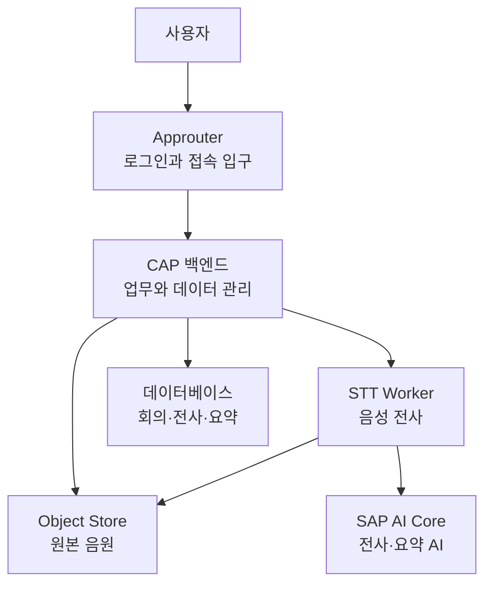
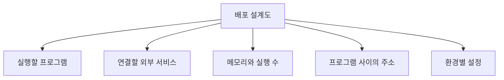
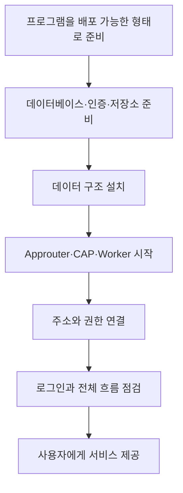
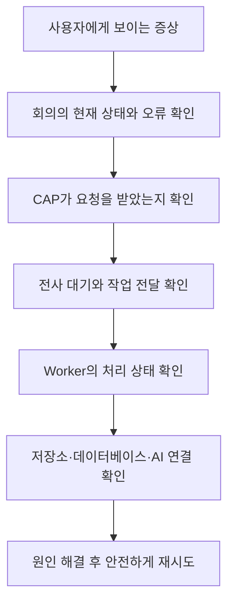

# 배포와 운영 전체 이해

## 한 문장으로 이해하기

`deploy`는 Meeting Whisper의 여러 프로그램과 외부 서비스를 **실제 사용자가 쓸 수 있는 하나의 운영 환경으로 조립하는 설계도**다.

개발자 PC에서는 프로그램을 각각 실행할 수 있지만, 실제 서비스에서는 로그인, 화면, 백엔드, Worker, 데이터베이스, 음원 저장소와 AI가 올바른 주소와 권한으로 연결되어야 한다.

배포는 단순히 파일을 서버에 복사하는 일이 아니다. 각 구성요소의 위치, 필요한 자원, 접근 권한, 연결 대상과 비밀 설정을 함께 맞추는 과정이다.

## 운영 환경의 네 가지 실행 구성요소

### Approuter: 공개 출입구

사용자가 처음 접속하는 곳이다. 로그인을 거친 뒤 화면 파일과 백엔드 요청을 알맞은 목적지로 보낸다.

### CAP Service: 업무 본부

회의와 사용자 권한을 관리하고, 음원·전사·요약의 처리 순서와 상태를 책임진다. 사용자 요청 대부분이 이곳을 거친다.

### STT Worker: 음성 처리 작업장

긴 음원을 나누고 AI를 호출해 글로 바꾼다. 음성 처리에는 많은 메모리와 시간이 필요하므로 CAP와 독립적으로 운영한다.

### DB Deployer: 데이터 구조 설치 담당

회의, 전사, 요약 등을 저장할 데이터 구조를 데이터베이스에 준비한다. 사용자의 요청을 계속 받는 서버가 아니라 배포 시점에 필요한 구조를 설치하는 역할이다.

## 함께 사용하는 외부 서비스

| 서비스 | 앱에서 맡는 역할 | 연결이 끊기면 나타나는 영향 |
|---|---|---|
| HANA | 회의, 전사, 요약과 처리 상태 저장 | 목록 조회와 결과 저장이 어려워진다. |
| XSUAA | 로그인과 사용자 역할 확인 | 사용자가 안전하게 접속할 수 없다. |
| Object Store | 큰 원본 음원 보관 | 업로드 또는 Worker의 음원 접근이 실패한다. |
| SAP AI Core | 전사와 요약 AI 이용 | 음성 변환이나 요약 단계가 진행되지 않는다. |

Meeting Whisper는 어느 한 서버만 정상이라고 완성되는 앱이 아니다. 이 연결망 전체가 하나의 제품으로 동작한다.

## MTA: 전체 배치도

Cloud Foundry 운영 환경에서는 MTA 설정이 여러 구성요소를 하나로 묶는다.

이 설계도에는 어떤 프로그램을 올릴지, 각 프로그램에 어느 정도의 메모리를 줄지, 어떤 서비스와 연결할지, 서로의 주소를 어떻게 알려 줄지가 담긴다.

## 개발 환경과 운영 환경의 차이

| 구분 | 개발자 PC | 실제 운영 환경 |
|---|---|---|
| 목적 | 빠른 개발과 시험 | 여러 사용자의 안정적인 이용 |
| 주소 | 내 컴퓨터 중심 | 공개 주소와 내부 서비스 주소 |
| 로그인 | 간소화하거나 시험 설정 사용 가능 | 실제 인증과 역할 적용 |
| 데이터 | 시험용 저장소 사용 가능 | 운영 데이터베이스 사용 |
| 음원 | 로컬 또는 대체 저장 방식 가능 | Object Store 중심 |
| 자원 | 한 컴퓨터의 성능에 의존 | 구성요소별 메모리와 실행 수 지정 |
| 비밀값 | 개인 개발 설정 | 배포 환경의 보안 설정으로 관리 |

개발 환경에서 성공했다는 사실만으로 운영 환경에서도 정상이라고 단정할 수 없는 이유가 여기에 있다.

## 환경별로 바뀌는 설정

프로그램 코드는 같아도 운영 조건은 달라질 수 있다. 이러한 값은 환경 설정으로 분리한다.

- Worker의 내부 주소
- 업로드 가능한 음원 크기
- 동시에 처리할 전사 작업 수
- 한 작업의 최대 처리 시간
- 사용할 AI 모델
- 음원 저장 방식
- 로그 상세 수준

비밀번호와 접근 토큰 같은 비밀값은 소스코드나 분석 문서에 넣지 않고 운영 환경의 보호된 설정으로 관리한다.

## 배포부터 서비스 시작까지

배포가 성공했다는 메시지만 보는 것으로는 부족하다. 로그인, 회의 생성, 음원 업로드, 전사, 요약과 결과 조회가 끝까지 이어지는지 확인해야 실제 서비스가 준비된 것이다.

## 장애를 큰 흐름으로 찾는 방법

처음부터 “AI가 고장 났다”라고 단정하지 않고 사용자의 요청이 어느 지점까지 도착했는지를 따라간다.

- 앱 자체에 접속할 수 없다면 출입구와 로그인부터 본다.
- 회의를 만들 수 없다면 CAP와 데이터베이스를 본다.
- 음원이 올라가지 않으면 CAP와 Object Store 연결을 본다.
- 전사 대기에서 멈추면 대기 목록과 Worker 상태를 본다.
- 전사는 있지만 요약이 없으면 요약 AI 단계와 결과 검사를 본다.

## 구성요소를 분리해서 운영하는 이유

구성요소별로 필요한 자원과 장애 성격이 다르다.

- 사용자가 늘면 Approuter와 CAP의 처리 능력이 중요해진다.
- 긴 회의가 늘면 Worker의 수와 메모리가 중요해진다.
- 음원이 쌓이면 Object Store 용량과 보존 정책이 중요해진다.
- AI 호출이 늘면 처리 시간, 사용량과 비용을 함께 봐야 한다.

모든 것을 한 서버로 묶으면 작은 변경과 장애가 전체 앱에 영향을 준다. 분리된 구조에서는 필요한 부분만 확장하거나 다시 시작할 수 있다.

## Cloud Foundry와 Kyma

현재 중심 운영 방식은 SAP BTP의 Cloud Foundry다.

프로젝트에 남아 있는 Kyma 관련 설정은 Kubernetes 계열 환경에서 Worker를 운영했던 이전 방식 또는 참고 자료로 이해해야 한다. 운영 변경 시 두 방식을 섞지 말고, 현재 실제 배포가 어느 환경을 기준으로 하는지 먼저 확인해야 한다.

## 이 폴더를 볼 때 기억할 큰 그림

배포와 운영 영역은 개별 설정 파일을 외우는 곳이 아니다. 다음 네 가지 질문에 답하는 전체 지도다.

1. 어떤 프로그램과 외부 서비스가 함께 동작하는가?
2. 각 구성요소는 누구와 어떤 권한으로 연결되는가?
3. 환경마다 달라지는 값과 비밀은 어디서 관리하는가?
4. 장애가 발생하면 요청 흐름의 어느 지점부터 확인하는가?

Meeting Whisper의 소스코드가 부품이라면, 배포 설정은 그 부품들을 실제로 움직이는 제품으로 조립하는 설명서다.
