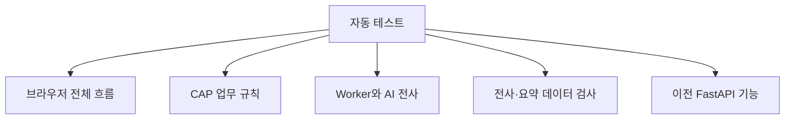

# 점검과 자동화 전체 이해

## scripts와 tests의 차이

두 폴더 모두 “정상적으로 동작하는지 확인한다”는 인상을 주지만 목적이 다르다.

| 영역 | 쉽게 말하면 | 목적 |
|---|---|---|
| scripts | 운영 도구 상자 | 실행, 배포, 데이터 이동, 장애 복구를 자동화 |
| tests | 자동 검사표 | 코드 변경 후 기존 기능이 망가지지 않았는지 확인 |

## scripts — 반복 작업을 줄이는 도구

파일별로 외우기보다 기능 묶음으로 이해한다.

### 빌드와 화면 복사

배포 가능한 형태로 CAP를 만들고 사용자 화면 자산을 올바른 위치에 복사한다.

### 로컬·운영 smoke test

Smoke test는 건물의 모든 부품을 검사하는 것이 아니라 “불이 켜지고 기본 통로가 열리는가”를 빠르게 확인하는 점검이다.

- CAP가 응답하는가
- Worker가 작업을 받을 수 있는가
- 브라우저에서 기본 흐름이 동작하는가

### 배포 지원

Worker image, Kyma 설정, Cloud Foundry 환경 연결 같은 반복 명령을 줄인다.

### 데이터 이동

이전 FastAPI와 SQLite에 있던 데이터를 현재 CAP와 HANA 구조로 옮기는 작업을 돕는다.

### 운영 조회와 복구

- 특정 회의의 상태와 처리 시간을 조회한다.
- 실패한 회의를 운영자가 명시적으로 재시도한다.
- 잘못 삭제되거나 유실된 음원을 복구한다.
- 오래 멈춘 회의를 실패 처리한다.
- 전사 성능을 측정한다.

운영 스크립트는 강력하므로 대상 회의와 환경을 확인한 뒤 사용해야 한다.

## tests — 코드의 약속을 지키는 자동 검사

테스트도 파일별 목록보다 검사 범위로 보는 것이 낫다.

### CAP 쪽 검사

- AI 설정이 빠졌을 때 알맞은 오류를 내는가
- 긴 전사를 부분 요약 후 올바르게 합치는가
- 잘못된 JSON을 복구하거나 거부하는가
- 대기표가 재시도와 상태를 올바르게 기록하는가
- 잘못된 전사 시간 순서를 거부하는가

### Worker 쪽 검사

- 인증 없이 전사 요청을 받지 않는가
- 작업 사용권을 얻은 뒤 처리하는가
- 동시 처리 제한을 지키는가
- timeout과 실패를 본부에 알리는가
- 긴 음원을 조각으로 나누고 시간을 합치는가
- 이상한 AI 응답을 더 작은 조각으로 재시도하는가

### 이전 구조 검사

legacy FastAPI의 업로드, 편집, 저장, 요약 기능을 검사하는 테스트가 많이 남아 있다. 이 테스트가 현재 CAP 기능을 직접 검사한다고 오해하면 안 된다.

## 중요한 점

테스트 개수가 많다고 전체 제품이 완벽한 것은 아니다. 현재 테스트는 백엔드와 Worker의 방어 로직에 강하고, 실제 사용자 화면의 모든 사용성 문제를 대신 확인해 주지는 않는다.
