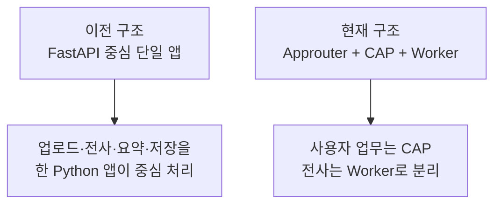

# 이전 구조를 남겨 둔 이유

## legacy란 무엇인가

`legacy`는 현재 운영 중심 구조로 전환하기 전에 사용하던 FastAPI 기반 앱을 보관한 영역이다.

legacy는 “오래됐으니 무조건 나쁜 코드”라는 뜻이 아니다. 현재 구조가 어디에서 왔는지 보여 주는 역사 자료이자 일부 기능의 참고 구현이다.

## 이전 구조와 현재 구조의 차이

### 이전 구조

- Python FastAPI가 사용자 API를 제공했다.
- 로컬 파일과 SQLite를 중심으로 저장했다.
- Whisper 계열 모델, 화자 분리, 요약 pipeline이 한 앱 안에 있었다.
- 로컬에서 독립 실행하기 쉬웠지만 BTP 운영과 대용량 처리에는 한계가 있었다.

### 현재 구조

- CAP가 사용자, 권한, HANA, 대기표를 관리한다.
- Worker는 전사만 담당한다.
- 큰 음원은 Object Store에 둔다.
- XSUAA와 Approuter로 사내 인증을 적용한다.
- AI Core를 운영 중심 AI 경로로 사용한다.

## legacy 내부 기능을 넓게 보면

- 설정과 환경 점검
- 회의 작업 등록과 상태 관리
- 음성 전사와 화자 분리
- AI 요약과 검토
- SQLite 저장
- 전사·요약 편집 API
- Markdown, TXT, SRT 같은 출력

현재 앱에서 사라졌거나 단순화된 기능을 찾을 때 참고할 수 있다.

## 주의할 점

1. legacy의 API 주소를 현재 CAP API로 착각하지 않는다.
2. legacy 테스트 성공을 현재 운영 경로의 성공으로 해석하지 않는다.
3. 새 기능을 legacy와 현재 구조에 동시에 구현할지 먼저 결정한다.
4. 과거 환경 변수와 운영 secret을 현재 설정에 그대로 복사하지 않는다.

## 앞으로의 정리 방향

legacy를 계속 보관한다면 README에서 현재 구조와 명확히 구분해야 한다. 더 이상 사용할 계획이 없다면 필요한 설계 지식과 데이터 이전이 끝난 뒤 별도 archive 저장소로 옮기는 방안도 검토할 수 있다.
