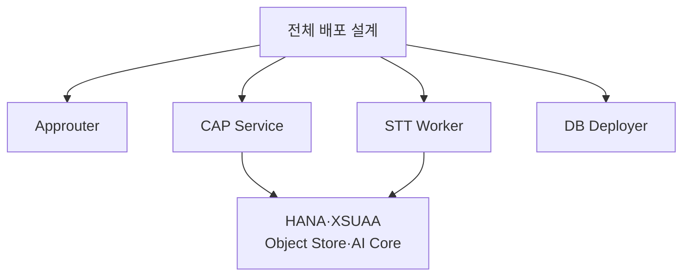

# 프로젝트 전체 설정 이해

저장소 최상단의 설정 파일과 `docs` 폴더는 app, CAP, Worker, 배포 영역을 하나의 제품으로 묶는다.

파일을 하나씩 외우기보다 네 가지 질문으로 이해한다.

## 1. 어떻게 실행하는가

프로젝트의 명령 목록은 Node.js 설정에 모여 있다.

기능별로 보면 다음과 같다.

- 이전 FastAPI 앱 실행
- CAP 개발 서버 실행
- 로컬 Approuter 실행
- 로컬 Worker 실행
- 배포용 build
- Cloud Foundry 배포
- smoke test와 전체 테스트
- 로그와 상태 확인

명령 이름이 많아 보이는 이유는 현재 구조와 이전 구조, 로컬과 운영 환경이 한 저장소에 함께 있기 때문이다.

## 2. 어떤 프로그램과 서비스를 배포하는가

MTA 설정은 전체 배포 설계도다.

## 3. 누가 무엇을 할 수 있는가

보안 설정은 세 역할을 정의한다.

| 역할 | 대상 | 의미 |
|---|---|---|
| MeetingUser | 일반 사용자 | Meeting Whisper 사용 |
| MeetingAdmin | 운영 관리자 | 일반 사용과 운영 관리 |
| Worker | 전사 프로그램 | 내부 전사 API 호출 |

Worker 역할을 일반 사람에게 주면 안 된다.

## 4. 어떤 값을 환경마다 바꾸는가

`.env.example`은 필요한 환경 변수의 예시 목록이다. 실제 비밀번호나 token을 담는 파일이 아니다.

환경 변수는 다음 범주로 나뉜다.

- 서버 주소
- 인증 정보
- 음원 크기와 보존 시간
- Worker 동시 처리와 timeout
- AI 모델과 호출 방식
- Object Store 연결
- 로컬 mock 기능

## server.js의 큰 역할

`server.js`는 CAP 서버가 시작될 때 두 가지를 보완한다.

1. 큰 음원을 받는 전용 업로드 통로를 연결한다.
2. 사용자 화면 파일을 함께 제공할 수 있게 한다.

파일의 세부 코드를 외우기보다 “CAP의 기본 서버에 대용량 업로드와 화면 제공 기능을 덧붙이는 시작 설정”으로 이해하면 된다.

## docs 폴더

`docs`에는 전사 구조를 Kyma CPU Whisper에서 Cloud Foundry Worker와 AI Core 중심으로 변경한 이유가 기록돼 있다.

주요 배경:

- 긴 음원의 CPU Whisper 처리 속도와 메모리 문제
- 큰 base64 요청의 네트워크·메모리 부담
- 전사와 요약을 한 요청에 묶었을 때의 timeout 위험
- Object Store와 별도 Worker의 필요
- 현재 운영 모델과 배포 기준

코드가 “현재 무엇을 하는지” 보여 준다면 docs는 “왜 이렇게 바뀌었는지”를 보여 준다.

## 전체 설정을 변경할 때

한 설정은 여러 프로그램에 동시에 필요할 수 있다.

예를 들어 Worker 인증 token을 바꾸면 CAP와 Worker 양쪽 값을 맞춰야 한다. 음원 최대 크기를 바꾸면 화면 안내, CAP 업로드 제한, Worker AI 제한을 함께 확인해야 한다.

따라서 루트 설정은 파일 한 개만 수정하는 문제가 아니라 연결된 구성 요소의 계약을 바꾸는 일로 봐야 한다.
