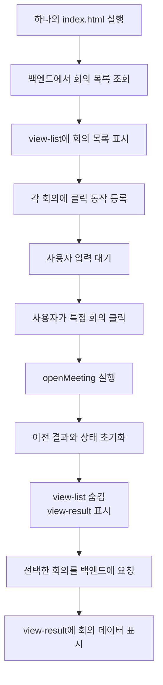

# 내가 개인적으로 중요하다고 느낀 Meeting Whisper의 특징

## 하나의 `index.html` 안에서 화면을 전환하는 구조

## 이 점이 중요하게 느껴진 이유

처음에는 회의 목록에서 특정 회의를 클릭하면 새로운 HTML 페이지를 다시 요청해서 열 것이라고 생각했다.

하지만 Meeting Whisper는 새로운 페이지를 매번 불러오는 방식이 아니다. 하나의 `index.html` 안에 여러 화면 영역을 미리 만들어 놓고, 사용자의 행동에 따라 필요한 영역만 보여 준다.

이 문서에서는 다음 과정에 집중한다.

```text
회의 목록 표시
→ 클릭 동작 연결
→ 사용자가 특정 회의 선택
→ 이전 회의 결과 초기화
→ 결과 화면으로 전환
→ 선택한 회의 데이터 조회
→ 결과 화면에 표시
```

`app.js`와 `ui.js` 사이의 역할 구분 및 개선점은 다음 문서에서 별도로 다룬다.

[[내가 느낀 중요한 점/03. app.js에 섞여 있는 UI 코드와 개선 방향|03. app.js에 섞여 있는 UI 코드와 개선 방향]]

---

## `index.html`에는 여러 화면의 틀이 함께 있다

Meeting Whisper의 `index.html`에는 다음과 같은 큰 화면 영역들이 들어 있다.

```text
view-list       회의 목록
view-entry      회의 정보 입력
view-recording  녹음 화면
view-result     회의 결과
```

개념적으로는 다음과 같은 구조다.

```html
<section id="view-list">
  회의 목록
</section>

<section id="view-entry" class="hidden">
  회의 정보 입력
</section>

<section id="view-recording" class="hidden">
  녹음 화면
</section>

<section id="view-result" class="hidden">
  회의 결과
</section>
```

네 영역이 모두 같은 `index.html` 안에 존재하지만, 사용자에게 동시에 모두 보이는 것은 아니다.

`hidden` 클래스가 붙은 영역은 CSS에 의해 화면에서 보이지 않는다.

---

## 처음 접속했을 때

처음 회의 목록으로 들어오면 다음과 같은 상태가 된다.

```text
view-list       표시
view-entry      숨김
view-recording  숨김
view-result     숨김
```

HTML 안에는 네 화면이 모두 남아 있지만, 사용자 눈에는 회의 목록만 보인다.

`loadList()`는 백엔드에서 사용자가 조회할 수 있는 회의 목록을 가져온 뒤, 조건에 맞는 항목을 `list-body`에 표시한다.

개념적인 순서는 다음과 같다.

```text
목록 화면 표시
→ 백엔드에 회의 목록 요청
→ 회의 데이터를 meetingsCache에 저장
→ 검색과 필터 적용
→ 목록 HTML 생성
→ list-body에 삽입
```

실제 핵심 코드는 다음과 같다.

```javascript
$("list-body").innerHTML =
  renderMeetingList(filtered, { filtered: hasFilters });
```

`renderMeetingList()`가 회의 데이터를 HTML 문자열로 만들고, `innerHTML`이 그 결과를 `list-body`에 넣는다.

---

## 목록을 표시한 뒤 클릭 동작을 연결한다

목록 HTML을 삽입한 다음 다음 함수가 실행된다.

```javascript
bindListEvents();
```

`bindListEvents()`는 사용자가 클릭했을 때 처음 실행되는 함수가 아니다.

목록을 그린 직후 실행되어 다음 규칙을 미리 등록한다.

> 사용자가 나중에 이 회의를 클릭하면 해당 회의 ID로 `openMeeting()`을 실행하라.

핵심 코드는 다음과 같다.

```javascript
function bindListEvents() {
  $("list-body")
    .querySelectorAll(".mtg")
    .forEach((el) =>
      el.onclick = () => openMeeting(el.dataset.open)
    );
}
```

목록 HTML이 다음과 같다고 가정할 수 있다.

```html
<div class="mtg" data-open="meeting-001">주간회의</div>
<div class="mtg" data-open="meeting-002">고객회의</div>
```

`bindListEvents()`는 각 항목에 다음 동작을 연결한다.

```text
주간회의 클릭
→ openMeeting("meeting-001")

고객회의 클릭
→ openMeeting("meeting-002")
```

등록 시점과 실행 시점은 다르다.

```text
bindListEvents 실행
= 클릭할 때 수행할 함수를 미리 등록

사용자가 실제로 클릭
= 등록해 둔 openMeeting 함수 실행
```

---

## 왜 목록을 그린 다음 클릭 동작을 연결하는가

회의 목록 HTML을 만들기 전에는 `.mtg` 요소가 화면에 존재하지 않는다.

따라서 다음 순서로 실행해야 한다.

```text
회의 목록 HTML 생성
→ list-body에 삽입
→ 실제 .mtg 요소가 DOM에 생김
→ 생성된 요소를 찾아 클릭 동작 연결
```

반대로 목록을 만들기 전에 이벤트를 연결하려 하면 연결할 회의 요소를 찾을 수 없다.

---

## 사용자가 특정 회의를 클릭하면

특정 회의를 클릭하면 미리 연결된 `openMeeting(id)`가 실행된다.

```javascript
async function openMeeting(id, options = {}) {
  syncMeetingRoute(id);
  resetResultView();
  show("view-result");

  try {
    const job = await getJob(id);
    paintResult(job);
  } catch (err) {
    showResErr(err.message);
  }
}
```

이 함수는 특정 회의를 여는 전체 순서를 지휘한다.

---

## 주소에 회의 ID를 반영한다

```javascript
syncMeetingRoute(id);
```

브라우저 주소를 다음과 비슷하게 변경한다.

```text
/?meeting=meeting-001
```

페이지 전체를 새로 불러오는 것은 아니다. 브라우저의 주소와 이동 기록을 현재 회의에 맞게 바꾼다.

이 주소 덕분에 다음과 같은 동작이 가능해진다.

- 뒤로 가기를 눌러 목록으로 돌아가기
- 현재 회의 주소를 복사하기
- 특정 회의 주소로 바로 접속하기

---

## 이전 회의 결과를 초기화한다

```javascript
resetResultView();
```

이 함수는 `index.html` 전체를 삭제하거나 다시 불러오지 않는다.

`view-result` 안에 남아 있는 이전 회의 정보와 이전 회의를 가리키는 JavaScript 상태를 초기화한다.

화면에서는 다음 내용을 지우거나 숨긴다.

- 이전 오류 메시지
- 이전 다운로드 영역
- 이전 요약
- 이전 전사문
- 이전 처리 진행 단계
- 이전 공유 설정

JavaScript에서는 다음 상태들을 초기화한다.

```javascript
currentTranscript = null;
currentNote = null;
currentReviewItems = [];
sharedWith = [];
currentJobData = null;
```

이는 회의 A의 데이터가 회의 B 화면에 남거나 두 회의의 상태가 섞이는 것을 방지한다.

중요한 점은 회의 목록 자체를 삭제하는 것은 아니라는 것이다. `view-list`는 이후에 숨겨질 뿐이며 HTML 안에는 그대로 남아 있다.

---

## 결과 화면만 보이게 한다

```javascript
show("view-result");
```

`show()`는 네 화면 중 `view-result`만 표시한다.

```text
view-list       숨김
view-entry      숨김
view-recording  숨김
view-result     표시
```

사용자 눈에는 새로운 페이지로 이동한 것처럼 보이지만, 실제로는 같은 `index.html` 안에서 표시할 영역이 바뀐 것이다.

---

## 백엔드에서 선택한 회의를 조회한다

```javascript
const job = await getJob(id);
```

선택한 회의 ID를 이용해 CAP 백엔드에서 해당 회의 정보를 가져온다.

여기에는 다음과 같은 데이터가 포함될 수 있다.

- 회의 제목과 생성 시간
- 카테고리와 참가자
- 처리 상태와 진행률
- 전사문
- AI 요약
- 검토 후보
- 공유 정보와 수정 권한

---

## 결과 화면에 회의 데이터를 넣는다

```javascript
paintResult(job);
```

`paintResult()`는 백엔드에서 받은 데이터를 `view-result`의 각 영역에 넣는다.

```text
job.title
→ 회의 제목

job.participants
→ 참가자 표시

job.stage
→ 진행률과 처리 단계

job.transcript
→ 전사문 탭

job.note
→ 요약 탭
```

전사문과 요약을 넣은 다음에는 편집과 저장에 필요한 이벤트도 연결한다.

---

## 큰 화면 전환과 세부 내용 교체는 다르다

Meeting Whisper의 화면 변경은 두 종류로 나뉜다.

### 큰 화면은 숨기고 보여 준다

다음 네 영역은 삭제하지 않고 `hidden` 클래스로 표시 상태만 바꾼다.

```text
view-list
view-entry
view-recording
view-result
```

```javascript
show("view-result");
```

### 화면 안의 세부 내용은 실제로 교체한다

결과 영역의 요약과 전사문은 HTML 내용을 새 데이터로 교체한다.

```javascript
$("tab-transcript").innerHTML =
  renderInlineTranscript(job.transcript, speakerNames);

$("tab-summary").innerHTML =
  renderInlineSummary(job.note, job);
```

따라서 다음처럼 구분해야 한다.

```text
큰 화면 전환
= 기존 영역을 숨기고 필요한 영역을 표시

화면 내부 데이터
= 기존 내용을 비우고 새 회의 데이터로 채움
```

---

## 전체 동작 흐름



---

## 페이지 이동처럼 보이지만 실제로는

```text
새로운 index.html 요청
= 하지 않음

기존 index.html 유지
= 함

필요한 큰 화면 표시
= hidden 클래스 변경

선택한 회의의 세부 내용 표시
= 해당 영역의 HTML 교체
```

이는 하나의 페이지 안에서 화면을 바꾸는 간단한 형태의 SPA 방식이라고 볼 수 있다.

---

## 내가 기억할 핵심

> Meeting Whisper는 하나의 `index.html` 안에 목록, 입력, 녹음, 결과 화면을 미리 구성해 둔다. 사용자의 행동에 따라 큰 화면은 숨기고 보여 주며, 선택한 회의의 전사문과 요약 같은 세부 데이터는 해당 영역 내부에 새로 삽입한다.

각 함수의 역할은 다음과 같다.

```text
renderMeetingList()
= 회의 데이터를 목록 HTML로 만듦

bindListEvents()
= 나중에 클릭했을 때 실행할 동작을 미리 연결

openMeeting()
= 특정 회의를 여는 전체 과정 지휘

resetResultView()
= 이전 회의 결과와 JavaScript 상태 초기화

show("view-result")
= 결과 화면만 보이도록 전환

getJob(id)
= 백엔드에서 선택한 회의 데이터 조회

paintResult(job)
= 조회한 회의 데이터를 결과 화면에 표시
```

다음: [[내가 느낀 중요한 점/03. app.js에 섞여 있는 UI 코드와 개선 방향|03. app.js에 섞여 있는 UI 코드와 개선 방향]]
