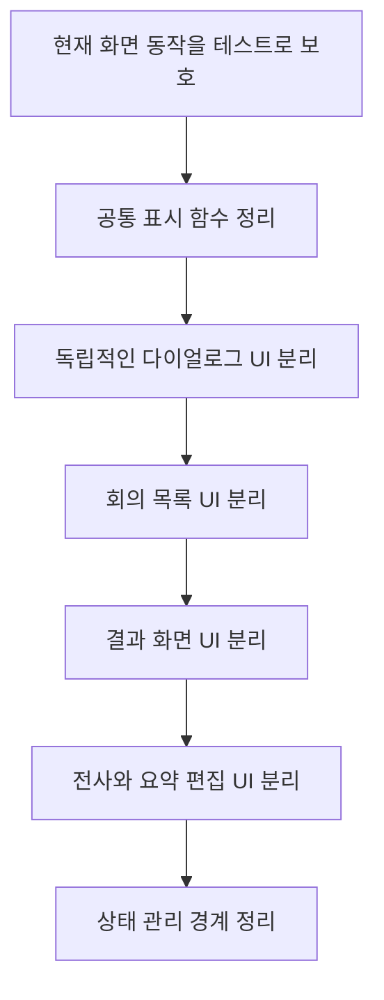

# 내가 개인적으로 중요하다고 느낀 Meeting Whisper의 특징

## `app.js`에 섞여 있는 UI 코드와 개선 방향

## 먼저 결론

현재 Meeting Whisper의 `app.js`는 단순한 컨트롤러 역할만 하지 않는다.

백엔드 요청과 상태 관리뿐 아니라 HTML 생성, DOM 수정, 다이얼로그 생성, 편집 화면 구성 같은 UI 작업도 상당 부분 직접 수행한다.

따라서 현재 구조를 가장 정확하게 표현하면 다음과 같다.

```text
app.js
= 전체 흐름을 지휘하는 컨트롤러
+ 화면 상태 관리
+ 일부 UI 생성과 DOM 조작

ui.js
= 여러 기능에서 반복해서 사용하는 공통 UI 도구
```

이 구조가 당장 잘못 작동한다는 뜻은 아니다. 현재 기능은 정상적으로 협력한다.

다만 `app.js`가 매우 커지고 여러 책임이 섞이면 기능 추가와 오류 분석이 어려워질 수 있으므로, 장기적으로 역할을 더 분리할 필요가 있다는 의미다.

---

## 관련 문서

회의 목록에서 결과 화면으로 전환되는 실제 실행 과정은 다음 문서에서 다룬다.

[[내가 느낀 중요한 점/02. 하나의 index.html 안에서 화면을 전환하는 구조|02. 하나의 index.html 안에서 화면을 전환하는 구조]]

이 문서는 화면 전환 자체보다 `app.js`와 `ui.js`의 역할 경계에 집중한다.

---

## 원래 기대할 수 있는 역할 구분

구조를 단순하게 나누면 다음과 같은 역할을 기대할 수 있다.

### `app.js`가 담당할 역할

- 사용자의 행동 처리
- 화면 전환 순서 결정
- API 호출 시점 결정
- 현재 선택된 회의 상태 관리
- 성공과 실패에 따른 다음 행동 결정
- 여러 모듈의 협력 조정

즉 다음 질문에 답하는 영역이다.

> 지금 무엇을 해야 하며, 다음에는 어떤 작업을 실행해야 하는가?

### `ui.js`가 담당할 역할

- 데이터를 화면용 문자열로 변환
- 반복되는 HTML 생성
- 공통 DOM 조회
- 공통 화면 표시와 숨김
- 오류, 진행률, 목록 같은 반복 UI 생성

즉 다음 질문에 답하는 영역이다.

> 전달받은 상태와 데이터를 어떤 모습으로 보여 줄 것인가?

---

## 현재 `ui.js`가 실제로 하는 일

`ui.js`에는 공통 표시 도구가 모여 있다.

| 함수 | 역할 |
|---|---|
| `$()` | ID를 이용해 DOM 요소 찾기 |
| `show()` | 큰 화면 중 하나만 표시 |
| `fmtClock()` | 시간을 시계 형태로 변환 |
| `fmtDuration()` | 초를 분과 초로 변환 |
| `fmtDate()` | 날짜를 화면용 문자열로 변환 |
| `displaySpeaker()` | 내부 화자 코드를 사용자용 이름으로 변환 |
| `renderMeetingList()` | 회의 목록 HTML 생성 |
| `renderJobProgress()` | 작업 진행률 HTML 생성 |
| `renderTranscript()` | 전사문 HTML 생성 |
| `renderSummary()` | 요약 HTML 생성 |
| `esc()` | 문자열을 안전한 HTML로 변환 |

이 함수들은 여러 화면에서 반복할 수 있는 표시 작업을 한곳에 모았다는 장점이 있다.

예를 들어 `app.js`는 다음처럼 `ui.js`의 함수를 사용한다.

```javascript
$("list-body").innerHTML =
  renderMeetingList(filtered, { filtered: hasFilters });
```

여기서 역할은 다음과 같다.

```text
app.js
“필터를 통과한 목록을 지금 화면에 표시하자.”

ui.js
“데이터를 주면 목록 HTML로 만들어 주겠다.”
```

---

## 그런데 `app.js`도 UI를 직접 만든다

현재 `app.js`는 `ui.js`의 함수를 호출하는 것에서 끝나지 않는다.

여러 곳에서 직접 `innerHTML`, `textContent`, `classList`를 사용하고 HTML 문자열을 생성한다.

### 목록 오류 화면을 직접 생성

```javascript
$("list-body").innerHTML =
  `<p class="err">목록을 불러오지 못했습니다.</p>`;
```

API 실패 처리라는 흐름 판단과 오류 HTML 생성이 같은 함수 안에 들어 있다.

### 다이얼로그 HTML을 직접 생성

`openDialog()`는 `app.js` 안에서 모달 요소를 만들고 HTML을 넣는다.

```javascript
const overlay = document.createElement("div");
overlay.className = "modal";
overlay.innerHTML = `<div class="modal-box">...</div>`;
document.body.appendChild(overlay);
```

다음 책임이 모두 `app.js`에 모여 있다.

- 다이얼로그 HTML 생성
- 입력값 설정
- 확인과 취소 이벤트 연결
- 키보드 입력 처리
- DOM에 추가하고 제거
- 결과를 Promise로 반환

### 회의 결과 화면을 직접 수정

`paintResult()`는 가져온 데이터를 상태 변수에 저장하는 동시에 많은 DOM 요소를 직접 수정한다.

```javascript
$("res-title").textContent = job.title || "회의";
$("res-category").textContent = job.category || "";
$("tab-transcript").innerHTML =
  renderInlineTranscript(job.transcript, speakerNames);
$("tab-summary").innerHTML =
  renderInlineSummary(job.note, job);
```

즉 데이터 수신 이후의 판단과 화면 그리기가 하나의 큰 함수 안에 함께 있다.

### 편집 화면 HTML도 직접 생성

`app.js`에는 다음 UI의 HTML을 직접 만드는 함수들이 있다.

- 회의록 인라인 편집 화면
- 전사문 인라인 편집 화면
- 검토 후보 목록
- 검토 중 버튼
- 요약 재생성 버튼
- 공유 대상 관리 화면
- 내보내기 화면
- 오류 메시지와 재시도 버튼

이 때문에 `app.js`가 컨트롤러이면서 동시에 여러 화면의 View 역할까지 수행한다.

---

## `app.js`가 커지는 이유

한 기능을 구현하려면 보통 다음 작업이 함께 필요하다.

```text
사용자 이벤트 받기
→ 상태 확인
→ API 호출
→ 응답 저장
→ HTML 생성
→ DOM에 삽입
→ 새로운 버튼 이벤트 연결
→ 오류 처리
```

현재는 이 과정 대부분이 `app.js` 안에서 이어진다.

처음에는 한 파일에서 전체 흐름을 볼 수 있어 편할 수 있다. 하지만 기능이 늘어날수록 다음 코드들이 한곳에 쌓인다.

- 회의 목록
- 검색과 필터
- 새 회의 입력
- 녹음
- 업로드
- 전사 결과
- 요약 편집
- 전사문 편집
- 검토 후보
- 공유 권한
- 다운로드
- 라우팅
- 폴링
- 오류 복구

결과적으로 특정 기능을 찾거나 수정할 때 관련 없는 코드까지 함께 읽어야 한다.

---

## 현재 구조에서 생길 수 있는 어려움

### 파일을 처음 읽기 어렵다

`app.js`라는 이름만 보면 애플리케이션의 시작점과 전체 흐름을 기대하게 된다.

하지만 실제로는 화면별 HTML 생성과 세부 편집 로직도 들어 있어 파일 전체를 이해하는 데 시간이 오래 걸린다.

### 수정 영향 범위를 예상하기 어렵다

한 함수가 상태 변경, API 호출, 화면 생성, 이벤트 연결을 함께 수행하면 어느 부분을 수정했을 때 다른 화면에 영향을 줄지 판단하기 어려워진다.

### 화면만 따로 검증하기 어렵다

HTML을 만드는 코드가 API 호출과 현재 전역 상태에 강하게 묶이면, 특정 데이터가 들어왔을 때 화면이 어떻게 만들어지는지만 독립적으로 시험하기 어렵다.

### 같은 표시 방식이 중복될 수 있다

오류 메시지, 로딩 상태, 버튼, 빈 목록 같은 UI를 여러 함수에서 직접 만들면 비슷하지만 조금씩 다른 HTML이 생길 수 있다.

### 이벤트 재연결을 놓칠 수 있다

`innerHTML`로 내용을 교체하면 그 안에 있던 DOM 요소와 이벤트 연결도 함께 사라진다.

그래서 새 HTML을 넣은 다음 다음과 같은 함수를 다시 실행해야 한다.

```text
bindListEvents()
bindInlineTranscriptEditor()
bindInlineNoteEditor()
```

새로운 렌더링 경로를 추가하면서 이벤트 연결 함수를 호출하지 않으면 버튼이 보이지만 작동하지 않는 문제가 생길 수 있다.

---

## 왜 지금도 정상적으로 작동하는가

역할이 섞여 있다고 해서 반드시 잘못된 코드는 아니다.

현재 구조는 다음 규칙을 비교적 일관되게 사용한다.

```text
데이터를 가져옴
→ HTML을 생성
→ innerHTML로 삽입
→ 해당 영역의 이벤트를 다시 연결
```

또한 일부 공통 표시 기능은 이미 `ui.js`로 분리되어 있다.

따라서 현재 상태는 다음과 같이 보는 것이 적절하다.

> 작은 프로젝트에서 시작한 직접적인 DOM 제어 구조가 기능 증가와 함께 커졌고, 이제 장기적인 유지보수를 위해 경계를 더 분명히 할 시점에 가까워졌다.

---

## 개선 방향

아직 계획과 분석 단계이므로 이 문서에서는 소스코드를 수정하지 않는다.

개선한다면 한 번에 전부 바꾸기보다 화면 기능별로 천천히 분리하는 편이 안전하다.

### 화면별 렌더링 모듈로 분리

`ui.js` 하나에 모든 표시 기능을 넣는 것도 다시 큰 파일을 만들 수 있다.

다음처럼 화면별로 나눌 수 있다.

```text
js/ui/
├─ common.js
├─ meeting-list-view.js
├─ meeting-result-view.js
├─ transcript-view.js
├─ summary-view.js
├─ review-view.js
├─ access-view.js
└─ dialog-view.js
```

각 파일의 역할 예시는 다음과 같다.

| 모듈 | 역할 |
|---|---|
| `common.js` | `$`, 날짜와 시간 형식, `esc` |
| `meeting-list-view.js` | 회의 목록과 빈 목록 화면 |
| `meeting-result-view.js` | 결과 화면 초기화와 기본 정보 표시 |
| `transcript-view.js` | 전사문 표시와 편집 UI |
| `summary-view.js` | 요약 표시와 편집 UI |
| `review-view.js` | 검토 후보 화면 |
| `access-view.js` | 참가자와 공유 대상 화면 |
| `dialog-view.js` | 확인, 입력, 오류 다이얼로그 |

### `app.js`에는 실행 순서를 남긴다

분리 후 `app.js`는 다음과 같은 코드에 집중할 수 있다.

```javascript
async function openMeeting(id) {
  syncMeetingRoute(id);
  resetMeetingResultView();
  show("view-result");

  try {
    const job = await getJob(id);
    renderMeetingResult(job);
  } catch (error) {
    showMeetingError(error);
  }
}
```

이렇게 되면 `openMeeting()`만 읽어도 전체 과정이 보인다.

세부 HTML은 각 View 모듈에서 담당한다.

### 상태와 화면을 구분

현재 선택한 회의 상태와 DOM 표시를 나누는 것도 도움이 된다.

```text
상태
currentJobData
currentTranscript
currentNote
currentReviewItems

화면
회의 제목 표시
전사문 HTML 생성
요약 HTML 생성
버튼 상태 변경
```

상태를 변경한 뒤 렌더링 함수를 호출하는 규칙을 정하면 데이터와 화면이 섞이는 범위를 줄일 수 있다.

### 이벤트 위임 검토

현재는 목록을 다시 그릴 때마다 각 `.mtg` 요소에 클릭 이벤트를 다시 연결한다.

이벤트 위임을 사용하면 상위 요소인 `list-body`에 한 번만 이벤트를 연결하고, 실제 클릭된 자식 요소를 확인할 수 있다.

개념적인 형태는 다음과 같다.

```javascript
$("list-body").addEventListener("click", (event) => {
  const meeting = event.target.closest(".mtg");
  if (!meeting) return;
  openMeeting(meeting.dataset.open);
});
```

이 방식은 목록 HTML이 다시 만들어져도 각 회의 항목에 이벤트를 하나씩 재등록할 필요를 줄인다.

다만 제목 수정, 삭제, 카테고리 필터처럼 클릭 의미가 다른 자식 요소가 있으므로 실제 적용 시에는 이벤트 전파와 우선순위를 신중하게 설계해야 한다.

### 렌더링 함수의 입력과 출력을 단순화

가능하면 화면 생성 함수는 다음처럼 명확한 형태를 갖는 것이 좋다.

```text
입력
= 회의 데이터와 권한 상태

출력
= HTML 문자열 또는 DOM 반영 결과
```

전역 변수에 지나치게 의존하지 않으면 각 화면을 독립적으로 테스트하기 쉬워진다.

---

## 한 번에 전부 분리하면 안 되는 이유

`app.js`는 다음 기능들을 서로 연결하고 있다.

```text
라우팅
API 호출
폴링
인라인 편집
자동 저장
권한 처리
이벤트 연결
오류 복구
```

큰 규모로 한 번에 이동하면 기존 동작을 빠뜨릴 위험이 있다.

따라서 개선 순서는 다음처럼 잡는 것이 안전하다.



각 단계를 옮긴 뒤 기존 기능이 동일하게 작동하는지 확인해야 한다.

---

## 개선 전후의 큰 그림

### 현재

```text
app.js
├─ API 호출
├─ 상태 관리
├─ 화면 전환
├─ HTML 생성
├─ DOM 수정
├─ 이벤트 연결
├─ 편집과 자동 저장
└─ 오류 처리

ui.js
└─ 일부 공통 표시 도구
```

### 개선 방향

```text
app.js
├─ 사용자 행동 처리
├─ API 호출 순서
├─ 상태 전환
└─ 화면 모듈 호출

화면별 View 모듈
├─ 목록 화면
├─ 결과 화면
├─ 전사문 화면
├─ 요약 화면
├─ 검토 화면
├─ 공유 화면
└─ 다이얼로그

공통 UI 모듈
├─ DOM 조회
├─ 문자열 안전 처리
└─ 날짜와 시간 형식
```

---

## 내가 기억할 핵심

> 현재 `app.js`는 전체 흐름을 지휘하는 컨트롤러이면서 일부 UI 생성과 DOM 조작까지 직접 담당한다. `ui.js`는 모든 UI를 담당하는 완전한 View 계층이 아니라 반복되는 공통 표시 도구 모음에 가깝다.

그리고 개선의 목적은 단순히 파일을 많이 나누는 것이 아니다.

```text
app.js
= 무엇을 언제 할지 결정

화면 모듈
= 데이터를 어떤 모습으로 보여 줄지 담당

상태
= 현재 어떤 회의와 데이터를 다루는지 보관
```

이 경계를 분명하게 만들어 새로운 기능을 추가하거나 오류를 찾을 때 읽어야 하는 범위와 실수 가능성을 줄이는 것이 핵심이다.
