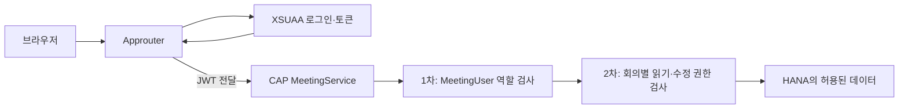

# 로그인과 역할 권한이 CAP까지 전달되는 과정

## 이 문서의 질문

사용자가 로그인한 뒤 이 앱을 사용할 수 있는지는 어디에서 결정되고, 로그인한 사람의 정보와 역할은 어떻게 CAP 백엔드까지 전달되는가?

## 먼저 기억할 결론

이 앱의 로그인과 권한은 한 단계가 아니라 두 층으로 나뉜다.

1. **앱 진입 권한**: Approuter와 XSUAA가 로그인 및 토큰 발급을 담당하고, CAP 서비스의 `MeetingUser` 요구 조건이 앱 사용 가능 여부를 검사한다.
2. **회의별 데이터 권한**: 앱에 들어온 뒤 어떤 회의를 읽고 수정할 수 있는지는 CAP의 `meeting-service.js`가 회의 소유자·참석자·공유자를 보고 다시 판단한다.

즉, `MeetingUser` 역할이 있다고 해서 모든 회의를 볼 수 있는 것은 아니다. 이 역할은 “회의록 앱의 CAP API에 들어올 자격”이고, 실제 회의 행 접근은 그다음 필터가 결정한다.



## 1. 브라우저가 처음 만나는 것은 Approuter이다

배포 환경에서 브라우저의 진입점은 CAP가 아니라 Approuter이다. `approuter/xs-app.json`은 모든 실제 경로에 `xsuaa` 인증을 요구한다.

- `/user-api/*`: 로그인한 사용자 프로필을 읽는 Approuter 내장 서비스
- `/api/*`: CAP의 `MeetingService`로 프록시
- `/api-binary/*`: CAP에 등록된 바이너리 업로드 경로로 프록시
- 나머지 경로: Approuter의 `resources`에서 정적 UI 제공

`mta.yaml`의 `srv-api` destination에는 `forwardAuthToken: true`가 있다. 따라서 Approuter가 인증을 끝낸 뒤 CAP로 요청을 보낼 때 사용자의 JWT를 함께 넘긴다. CAP는 이 토큰에서 `req.user.id`, 사용자 속성, 역할을 복원한다.

중요한 구분은 다음과 같다.

| 대상 | 역할 |
|---|---|
| Approuter | 로그인 유도, 세션, 경로 라우팅, JWT 전달 |
| XSUAA | 사용자 인증과 scope/role이 들어 있는 토큰 발급 |
| CAP | 토큰을 신뢰해 서비스 진입 권한과 데이터 권한 검사 |
| 브라우저 UI | 로그인 사용자의 이름을 표시하고 API를 호출 |

## 2. `/user-api/currentUser`는 보안 판단의 본체가 아니다

UI의 `initUserProfile()`은 `getCurrentUser()`를 호출하고, 이는 `/user-api/currentUser`를 읽는다. 이 값으로 화면 오른쪽 위에 이름·이메일·이니셜을 표시한다.

하지만 이 응답을 이용해 회의 목록 보안을 결정하는 것은 아니다. 브라우저 값은 사용자가 조작할 수 있으므로 보안 근거가 될 수 없다. 실제 보안 근거는 Approuter가 전달한 JWT를 CAP가 해석해 만든 `req.user`이다.

따라서 다음처럼 기억하면 된다.

> `/user-api/currentUser`는 프로필 표시와 세션 확인용이고, `req.user`는 CAP 권한 판단용이다.

녹음 중 세션 연장도 같은 프로필 API를 호출하지만, 이것 역시 권한을 새로 만드는 코드가 아니라 현재 인증 세션이 아직 유효한지를 확인하는 동작이다.

## 3. 앱에 들어올 수 있는 역할

`xs-security.json`에는 세 가지 주요 scope/role template이 있다.

| 역할 | 의미 |
|---|---|
| `MeetingUser` | 일반 사용자가 MeetingService를 이용하는 권한 |
| `MeetingAdmin` | 운영 관리 권한. Role template에 `MeetingUser`도 함께 포함됨 |
| `Worker` | STT Worker가 내부 CAP API를 호출하는 권한 |

`cap/srv/meeting-service.cds`의 서비스 선언은 다음 의미를 갖는다.

```text
MeetingService @(requires: 'MeetingUser')
```

따라서 `MeetingUser`가 없는 사용자는 회의 목록 필터 단계에 오기도 전에 서비스 진입이 거부된다. `MeetingAdmin` role template은 `MeetingUser` scope도 포함하므로 관리자도 일반 MeetingService에 들어올 수 있다.

반대로 Worker는 사용자용 MeetingService가 아니라 `/internal`의 Worker 전용 서비스로 CAP와 통신한다. 사용자 브라우저가 Worker 역할을 갖는 구조가 아니다.

## 4. 로컬과 배포 환경의 로그인 차이

`package.json`의 CAP 설정을 보면 환경에 따라 인증 구현이 바뀐다.

- 개발 프로필: CAP의 `mocked` 인증. `alice`, `mallory`, `worker`, `admin` 같은 테스트 사용자가 정의되어 있다.
- 운영 프로필: `xsuaa` 인증과 HANA DB를 사용한다.

따라서 로컬에서 CAP만 켜고 Basic/mock 사용자로 접속하는 모습과, 배포 후 Approuter를 통해 XSUAA 로그인을 하는 모습은 겉으로 다르다. 그러나 서비스 코드가 보는 최종 인터페이스는 둘 다 `req.user`이므로 회의별 권한 로직은 같은 코드를 탄다.

## 5. 역할 권한과 회의별 권한을 섞으면 안 되는 이유

예를 들어 세 사용자에게 모두 `MeetingUser`가 있다고 하자.

- A가 만든 회의: A는 소유자
- B가 참석자로 입력됨: B는 읽기와 수정 가능
- C가 공유자로 입력됨: C는 읽기만 가능
- D는 어느 필드에도 없음: D에게는 목록 자체가 반환되지 않음

이 차이는 XSUAA role이 아니라 `Meetings.owner`, `participants`, `sharedWith`, `accessTokens`를 보는 CAP 코드가 만든다. 자세한 행 필터 과정은 다음 문서에서 설명한다.

## 흔히 하기 쉬운 오해

### “UI에서 버튼을 숨기면 권한 처리가 끝난다”

아니다. UI의 `can_edit`, `can_delete`는 사용성 안내일 뿐이다. 실제 수정·삭제 action은 CAP에서 다시 소유자와 참석자 여부를 검사한다.

### “로그인만 성공하면 모든 회의를 읽을 수 있다”

아니다. 로그인과 `MeetingUser`는 1차 관문이다. `READ Meetings`와 자식 엔터티 조회에는 별도의 행 필터가 붙는다.

### “MeetingAdmin은 모든 동작을 무조건 할 수 있다”

현재 코드에서는 읽기와 대부분의 수정 검사에서 관리자가 우회할 수 있지만, 회의 삭제 action은 `assertDeletableMeeting()`이 **회의 생성자만** 허용한다. 권한표를 작성할 때 이 예외를 놓치면 안 된다.

## 내가 기억할 핵심

> Approuter/XSUAA는 “누구이며 앱에 들어올 역할이 있는가”를 정하고, CAP는 그 JWT의 사용자를 기준으로 “이 사람이 이 회의를 볼 수 있고 고칠 수 있는가”를 다시 정한다. `/user-api/currentUser`는 화면 표시용이지 보안의 원본이 아니다.

## 직접 확인한 소스

- `approuter/xs-app.json` 1~38행
- `mta.yaml` 113~134행
- `xs-security.json` 1~43행
- `package.json` 72~112행
- `cap/srv/meeting-service.cds` 1~4행
- `app/meeting-ui/js/app.js` 116~155행
- `app/meeting-ui/js/session.js` 50~93행

