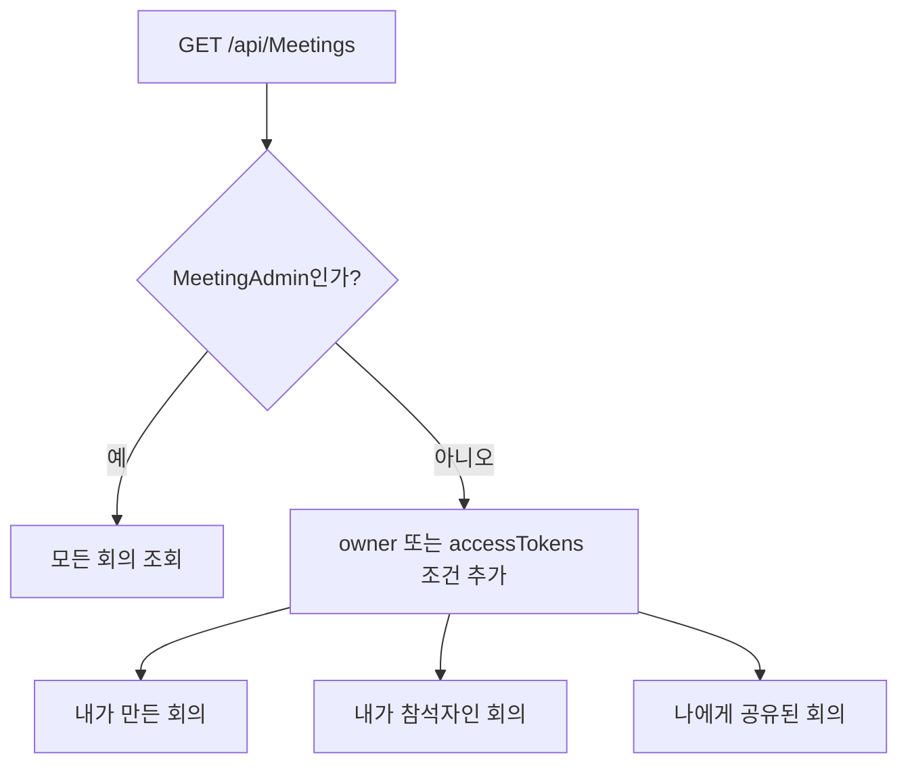

# 회의 목록이 사용자별로 필터링되는 과정

## 이 문서의 질문

로그인한 사용자가 홈 화면에서 보는 회의 목록은 언제, 무엇을 기준으로 줄어들며, 소유자·참석자·공유자·관리자의 권한은 어떻게 다른가?

## 먼저 기억할 결론

목록 보안 필터는 브라우저가 아니라 CAP가 DB 조회문에 조건을 추가해 수행한다.

```text
DB의 전체 Meetings
  → CAP가 로그인 사용자 기준 WHERE 조건 추가
  → 허용된 Meetings만 브라우저로 반환
  → 브라우저가 그 안에서 검색어·상태·카테고리로 화면 필터
```

따라서 브라우저 개발자 도구로 검색 필터를 없애도 권한 없는 회의가 나타나지 않는다. 애초에 서버 응답에 포함되지 않았기 때문이다.

## 1. 회의를 만들 때 접근 검색용 값을 함께 만든다

UI가 `POST /api/Meetings`를 보내면 CAP의 `before CREATE Meetings` hook이 요청값을 그대로 믿지 않고 다음을 정리한다.

1. `owner`를 요청 본문이 아니라 현재 `req.user`의 ID로 덮어쓴다.
2. `ownerName`은 JWT 사용자 속성에서 표시 이름을 골라 저장한다.
3. `participants`, `sharedWith`를 중복 제거한 JSON 문자열로 정리한다.
4. 소유자·참석자·공유자 이름을 정규화하여 `accessTokens`를 만든다.
5. 최초 상태를 `created`, 진행률을 `0`으로 둔다.

`accessTokens`는 대략 다음처럼 줄바꿈으로 경계를 둔 문자열이다.

```text
\n
owner@example.com
owner
홍길동
shared@example.com
shared
\n
```

정규화할 때는 소문자화, 앞뒤 공백 제거, 연속 공백 축약을 하고 이메일이면 `@` 앞의 로컬 파트도 별도 토큰으로 넣는다. 줄바꿈 경계를 두는 이유는 `ann`이 `joann`에 우연히 포함되는 식의 부분 문자열 오판을 줄이기 위해서다.

참석자나 공유자가 바뀌면 두 번째 `before UPDATE` hook이 `accessTokens`를 다시 계산한다. 즉 이것은 원본 관계 자체가 아니라 빠른 조회를 위한 비정규화된 검색 인덱스에 가깝다.

## 2. 현재 사용자의 여러 식별자를 만든다

CAP는 JWT의 다음 후보들을 사용자 식별 토큰으로 만든다.

- `req.user.id`
- `email`
- `user_name`
- `name`, `display_name`
- `given_name + family_name`
- `family_name + given_name`의 붙인 형태와 띄어 쓴 형태
- 각 이메일의 `@` 앞부분

그 이유는 회의 참석자 입력값이 항상 한 가지 형식으로 들어온다는 보장이 없기 때문이다. 어떤 회의에는 이메일이, 다른 회의에는 표시 이름이 들어갈 수 있다.

다만 이 구조는 정규화된 사용자 ID 외에도 이름 문자열에 의존한다. 동명이인이나 이메일 로컬 파트 충돌 가능성이 있으므로 장기적으로는 참가자·공유자를 사용자 ID 관계 테이블로 저장하는 편이 더 엄격한 설계다. 현재 코드의 실제 동작은 위 토큰 매칭이다.

## 3. `READ Meetings`에 서버 필터가 삽입된다

일반 사용자에 대해 CAP는 다음 논리의 WHERE 조건을 조회문에 추가한다.

```text
owner = 현재 사용자 ID
OR accessTokens LIKE 현재 사용자의 첫 번째 식별 토큰
OR accessTokens LIKE 현재 사용자의 두 번째 식별 토큰
OR ...
```

코드 수준에서는 `%\n토큰\n%` 형태로 검색한다. `MeetingAdmin` 또는 `Admin`이면 이 행 필터를 건너뛰어 모든 회의를 읽을 수 있다.



## 4. 회의의 자식 데이터도 별도로 제한한다

회의 목록만 가리고 `Transcripts`, `Summaries`, `ReviewItems`를 열어 두면 회의 ID를 아는 사용자가 자식 API를 직접 호출할 수 있다. 그래서 CAP는 이 세 엔터티의 `READ`에도 hook을 건다.

1. 현재 사용자가 읽을 수 있는 Meeting ID 목록을 먼저 구한다.
2. 자식 조회문에 `meeting_ID in (...)` 조건을 붙인다.
3. 읽을 수 있는 회의가 하나도 없으면 `meeting_ID = null` 조건으로 빈 결과를 만든다.
4. 관리자는 이 필터를 건너뛴다.

이것이 UI에서 안 보이는 것과 API에서 실제로 못 읽는 것을 일치시키는 핵심이다.

## 5. 읽기·수정·삭제 권한은 서로 다르다

현재 코드를 기준으로 정리하면 다음과 같다.

| 사용자 관계 | 목록/상세 읽기 | 회의 내용 수정 action | 삭제 action |
|---|---:|---:|---:|
| 소유자 | 가능 | 가능 | 가능 |
| 참석자 `participants` | 가능 | 가능 | 불가 |
| 공유자 `sharedWith` | 가능 | 불가 | 불가 |
| 관계없는 일반 사용자 | 불가 | 불가 | 불가 |
| MeetingAdmin | 모든 회의 가능 | 대부분 가능 | **소유한 회의만 가능** |

`canReadMeeting()`은 관리자, 소유자, 접근 토큰을 인정한다. `canEditMeeting()`은 관리자, 소유자, 참석자만 인정하고 공유자는 제외한다. `canDelete`는 현재 사용자가 소유자인지만 본다.

또한 일반 OData `UPDATE Meetings` hook은 비관리자에게 `owner = currentUserId` 조건을 붙인다. 제목·카테고리·접근 목록 변경처럼 별도 action을 쓰는 동작은 각 action의 `assertEditableMeeting()` 또는 `assertOwnedMeeting()` 검사도 거친다. UI 버튼만 믿는 구조가 아니다.

## 6. 브라우저의 `listMeetings()`가 하는 일

UI의 목록 호출 흐름은 다음과 같다.

1. `GET /api/Meetings?$orderby=createdAt desc`
2. 이미 CAP가 필터한 각 회의에 대해 `getMeetingStatus` action 호출
3. 각 회의의 `Transcripts`, `Summaries`, `ReviewItems` 조회
4. CAP 자료를 UI의 하나의 job 객체로 합침
5. 홈 화면에서 검색어·진행 단계·카테고리 필터 적용

`getMeetingStatus`도 `assertReadableMeeting()`을 호출하므로, 회의 ID를 추측해서 상태를 읽으려 해도 다시 권한 검사를 받는다. 이 응답에는 `canEdit`, `canDelete`도 들어가 UI가 편집/삭제 버튼을 알맞게 표시한다.

현재 구현은 회의마다 상태와 세 자식 엔터티를 추가 조회하므로 목록이 커지면 요청 수가 많아지는 구조다. 이것은 성능 문제일 수 있지만, 권한 필터의 위치가 브라우저라는 뜻은 아니다. 모든 자식 API에도 서버 필터가 적용된다.

## 7. 마지막 화면 필터는 보안 필터가 아니다

`renderMeetingListView()`는 서버에서 받은 `meetingsCache`를 다시 다음 기준으로 거른다.

- 검색어: 제목, 카테고리, 소유자, 참석자, 공유자, 전사문, 요약 내용
- 진행 단계: active, done, failed 등
- 카테고리

이것은 사용자가 자기에게 허용된 목록을 편하게 찾기 위한 클라이언트 필터다. 검색창을 비우면 다시 나타나는 회의는 원래부터 읽을 권한이 있던 회의뿐이다.

## 예시로 전체 흐름 기억하기

홍길동이 `alice@example.com`이고, 어떤 회의의 참석자에 `alice`가 들어 있다고 하자.

1. JWT에서 `alice@example.com`을 읽는다.
2. 정규화 과정에서 `alice@example.com`, `alice` 토큰을 만든다.
3. `READ Meetings`에 `accessTokens like '%\nalice\n%'` 조건이 붙는다.
4. 해당 회의가 CAP 응답에 포함된다.
5. 상태 action이 참석자임을 확인하여 `canEdit: true`, `canDelete: false`를 반환한다.
6. 브라우저는 이 회의를 목록에 그리되 삭제 버튼은 허용하지 않는다.

## 내가 기억할 핵심

> 목록 보안은 `Meetings`를 전부 내려받은 뒤 UI에서 숨기는 방식이 아니다. CAP가 현재 JWT 사용자의 여러 식별 토큰을 만들어 DB 조회문에 `owner 또는 accessTokens` 조건을 삽입하며, 전사·요약·검토 후보 조회도 허용된 Meeting ID로 다시 제한한다.

## 직접 확인한 소스

- `cap/srv/meeting-service.js` 35~242행, 385~428행, 493~542행
- `cap/srv/lib/audio-store.js` 20~42행
- `cap/db/schema.cds` 30~102행
- `app/meeting-ui/js/api.js` 330~422행, 559~569행
- `app/meeting-ui/js/app.js` 164~225행

