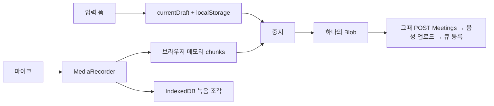

# 회의 정보 입력부터 녹음 중 저장 구조까지

## 이 문서의 질문

사용자가 제목·카테고리·참석자·공유자 등을 입력하고 녹음을 시작하면, 회의가 진행되는 동안 그 정보와 음성은 어디에 저장되는가? CAP DB의 `Meetings` 행은 언제 생기는가?

## 먼저 기억할 결론

마이크 녹음을 시작한 시점에는 아직 CAP DB에 회의가 만들어지지 않는다.

- 회의 메타데이터: 브라우저의 JavaScript 객체와 `localStorage`
- 매초 생기는 녹음 조각: 브라우저 메모리와 `IndexedDB`
- 즉석 임시 전사 확정문: JavaScript 상태와 같은 `localStorage` 초안 메타데이터
- CAP의 `Meetings`, `AudioObjects`, `TranscriptionDispatches`: 사용자가 **중지**를 누르고 업로드를 시작한 뒤 차례로 생성

따라서 “녹음 중인 회의”와 “서버에 저장된 회의 작업”은 서로 다른 생명주기다.



## 1. 녹음 시작 전 입력값은 화면 상태이다

사용자가 입력 폼에서 다루는 주요 값은 다음과 같다.

- 제목
- 카테고리
- 참석자 배열
- 공유자 배열
- 화자 수 범위와 화자 분리 옵션
- 업로드할 기존 음성 파일 또는 마이크 녹음 선택

녹음 시작 전에는 이 값들이 DOM 입력 요소와 `participants`, `sharedWith` 같은 JavaScript 배열에 있다. 아직 CAP DB에 저장된 회의가 아니다.

## 2. 녹음 시작 버튼을 누르면 브라우저 초안을 만든다

마이크 녹음 경로에서 시작 버튼은 먼저 세션을 갱신한 뒤 `currentDraft`를 만든다.

```text
currentDraft
  sessionId
  title
  category
  participants
  sharedWith
  minSpeakers / maxSpeakers
  diarize
  durationSeconds
  chunkCount
  mimeType
  liveText
  startedAt
```

이 객체는 `saveDraftMeta()`를 통해 `localStorage`의 `meeting-whisper:draft` 키에 JSON으로 저장된다. 이는 서버 영속 데이터가 아니라 **현재 브라우저 프로필에 남는 복구용 초안**이다.

이 시점에도 다음 DB 행들은 존재하지 않는다.

- `Meetings`
- `AudioObjects`
- `TranscriptionDispatches`

CAP에 첫 `POST /api/Meetings`가 나가는 곳은 녹음 중지가 끝난 뒤 호출되는 `createJob()`이다.

## 3. MediaRecorder가 음성을 1초 조각으로 만든다

`createRecorder()`는 `getUserMedia({audio:true})`로 마이크 스트림을 얻고 브라우저가 지원하는 형식을 고른다.

우선순위는 대략 다음과 같다.

1. `audio/webm;codecs=opus`
2. `audio/webm`
3. `audio/mp4`

앱은 `timeslice: 1000`으로 녹음을 시작하므로 MediaRecorder가 약 1초마다 `dataavailable` 이벤트를 낸다. 각 조각은 두 곳으로 간다.

1. `recorder.js` 내부 `chunks` 배열: 마지막에 하나의 Blob으로 합치기 위한 메모리 보관
2. `IndexedDB`의 `meeting-whisper-drafts/chunks`: 브라우저가 중단되어도 복구하기 위한 영속 조각

IndexedDB 키는 `${sessionId}:${index}`이고, 값에는 `sessionId`, 순서 번호, Blob이 들어간다. 조각 저장에 성공할 때마다 초안의 MIME type, 경과 시간, 조각 수, 마지막 저장 시각도 `localStorage`에 갱신된다.

즉, IndexedDB에 조각을 저장한다고 해서 메모리 사용이 0이 되는 것은 아니다. 현재 Recorder 구현은 최종 Blob을 만들기 위해 같은 조각들을 내부 배열에도 계속 보유한다. IndexedDB는 주로 중단 복구를 위한 두 번째 사본이다.

## 4. 일시정지 시간은 최종 회의 길이에서 제외된다

Recorder는 녹음 중인 구간의 누적 밀리초만 계산한다.

- 일시정지할 때 현재 구간 시간을 `activeMs`에 더함
- 재개할 때 새 구간 시작 시각 기록
- `elapsed()`는 누적 활성 시간만 초 단위로 반환

그래서 CAP에 나중에 전달되는 `durationSec`는 벽시계상 시작부터 종료까지의 전체 시간이 아니라 실제 녹음 활성 시간이다.

## 5. 브라우저가 닫히거나 새로고침되면 어떻게 복구하는가

녹음 도중 `beforeunload`가 발생하면 경고를 띄우고 `requestData()`로 마지막 조각 방출을 시도한다. 그래도 페이지가 종료될 수 있으므로 홈 화면은 다음 시작 때 초안 메타데이터와 IndexedDB 조각을 확인한다.

복구 배너에서는 다음을 할 수 있다.

- 조각을 순서대로 합쳐 서버에 업로드
- 로컬 파일로 저장
- 다른 이름으로 저장
- 초안 삭제

복구 업로드가 성공하면 IndexedDB 조각과 `localStorage` 메타데이터를 삭제한다. 실패하면 Blob과 초안 세션 ID를 `pendingUpload`에 두고 재시도할 수 있게 한다.

주의할 점은 이것이 서버 측 임시 회의 복구가 아니라 브라우저 저장소 복구라는 것이다. 다른 PC나 다른 브라우저 프로필에서는 이 초안이 보이지 않는다.

## 6. 중지를 눌렀을 때 서버 생명주기가 시작된다

중지 버튼의 순서는 다음과 같다.

1. 실제 녹음 시간을 계산한다.
2. 임시 전사를 멈춘다.
3. 세션 keep-alive를 멈춘다.
4. MediaRecorder의 조각들을 하나의 Blob으로 합친다.
5. 사용자에게 로컬 녹음본 백업 여부를 묻는다.
6. 업로드 직전 인증 세션을 다시 확인한다.
7. `createJob()`을 호출한다.

CAP 경로의 `createJob()`은 다음 세 요청을 순차적으로 보낸다.

```text
POST /api/Meetings
POST /api-binary/Meetings/{meetingId}/audio
POST /api/enqueueTranscription
```

첫 요청에서야 HANA의 `Meetings` 행이 생긴다. 두 번째 요청은 음성을 Object Store 또는 DB의 `AudioObjects`에 저장한다. 세 번째 요청은 `TranscriptionDispatches` 큐 행을 만든다.

세 단계 중 뒤 단계가 실패할 수 있기 때문에, “회의 행 생성”, “음성 업로드”, “전사 큐 등록”은 하나의 브라우저 요청으로 원자적으로 묶인 작업이 아니다. UI는 실패한 Blob을 `pendingUpload`로 유지해 재시도를 제공한다.

## 7. 기존 파일 업로드 경로는 조금 다르다

사용자가 마이크 대신 기존 음성 파일을 선택하면 녹음 초안을 만들지 않는다.

- 선택한 `File` 객체와 입력값으로 `pendingUpload`를 만든다.
- 미디어 길이를 읽는다.
- 바로 `createJob()`을 호출한다.

즉 IndexedDB 1초 조각 저장과 중단 복구는 앱 내 마이크 녹음 경로의 기능이다. 기존 파일은 브라우저가 이미 완성된 파일을 들고 있으므로 곧바로 서버 저장 과정으로 간다.

## 8. 현재 화자 분리 입력값에 관한 코드상의 사실

녹음 초안에는 `minSpeakers`, `maxSpeakers`, `diarize`가 들어가지만, 현재 CAP용 `createJob()`은 다음처럼 값을 강제로 만든다.

- `diarize = false`
- `minSpeakers = null`
- `maxSpeakers = null`

따라서 현재 주 배포 경로에서는 UI에서 초안에 담긴 화자 분리 설정이 CAP 회의 생성 요청에 반영되지 않는다. Worker에는 결국 화자 분리 false가 전달된다. 코드를 읽을 때 “입력 폼과 초안에 필드가 있다”와 “현재 서버 요청에 실제 반영된다”를 구분해야 한다.

## 저장 위치를 한눈에 보기

| 시점/데이터 | 저장 위치 | 서버 전송 여부 |
|---|---|---:|
| 녹음 시작 전 입력 | DOM·JS 상태 | 아니오 |
| 녹음 중 회의 메타 | `currentDraft` + `localStorage` | 아니오 |
| 녹음 중 1초 음성 조각 | 메모리 + `IndexedDB` | 아니오 |
| 녹음 중 임시 전사 확정문 | JS 상태 + 초안의 `liveText` | 아니오 |
| 중지 후 회의 정보 | HANA `Meetings` | 예 |
| 중지 후 음성 | Object Store가 우선, 미사용 시 `AudioObjects.content` | 예 |
| 전사 작업 상태 | HANA `TranscriptionDispatches` | 예 |

## 내가 기억할 핵심

> 녹음 시작은 서버 회의 생성이 아니라 브라우저 초안 시작이다. 회의 정보는 localStorage, 음성 조각은 메모리와 IndexedDB에 있고, 중지를 눌러 최종 Blob을 만든 뒤에야 CAP의 Meetings → 음성 저장 → 전사 큐가 차례로 생긴다.

## 직접 확인한 소스

- `app/meeting-ui/js/app.js` 476~615행, 1202~1437행, 1480~1532행
- `app/meeting-ui/js/recorder.js` 1~101행
- `app/meeting-ui/js/drafts.js` 1~102행
- `app/meeting-ui/js/api.js` 425~445행
- `cap/db/schema.cds` 30~79행

