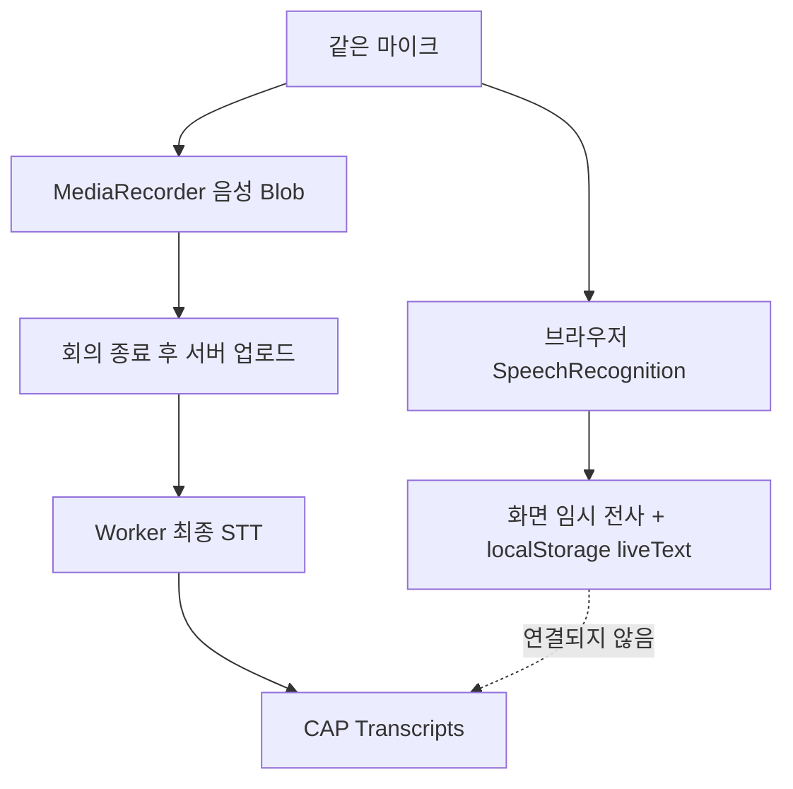

# 즉석 임시 전사의 생성·저장·폐기 과정

## 이 문서의 질문

회의 중 화면에 즉석으로 보이는 전사는 어떤 모델이 만들고, 어디에 보관되며, 회의 종료 후 정식 STT 결과에 영향을 주는가?

## 먼저 기억할 결론

회의 중 임시 전사와 회의 후 최종 전사는 서로 독립된 두 파이프라인이다.

| 구분 | 회의 중 임시 전사 | 회의 후 최종 전사 |
|---|---|---|
| 실행 주체 | 브라우저의 Web Speech API | 별도 Python STT Worker |
| 입력 | 실시간 마이크 스트림 | 업로드 완료된 전체 음성 파일 |
| 목적 | 사용자가 지금 말이 잡히는지 즉시 확인 | 저장할 공식 전사문 생성 |
| 저장 | 브라우저 초안 `liveText` | CAP `Transcripts.content` |
| 요약 입력 | 사용하지 않음 | 사용함 |

임시 전사의 문장을 수정해도 최종 STT 프롬프트나 요약 입력으로 전달되지 않는다.



## 1. 어떤 기능이 임시 전사를 만드는가

`startLiveTranscript()`는 다음 브라우저 API 중 사용 가능한 것을 고른다.

```javascript
window.SpeechRecognition || window.webkitSpeechRecognition
```

설정은 다음과 같다.

- 언어: `ko-KR`
- `continuous = true`: 계속 듣기
- `interimResults = true`: 확정 전 중간 인식 결과도 받기

이 코드에는 Whisper, Gemini, CAP, Python Worker 호출이 없다. 따라서 이것을 “Whisper의 스트리밍 전사”라고 부르면 틀린다. 브라우저가 제공하는 음성 인식 기능이며, 실제 인식 엔진이 로컬인지 원격 서비스인지는 브라우저 구현에 달려 있다. 코드만으로 특정 공급자를 단정할 수 없다.

브라우저가 이 API를 지원하지 않으면 화면에 “이 브라우저에서는 지원되지 않음”을 표시하지만 MediaRecorder 녹음은 계속된다. 임시 전사 실패가 최종 음성 녹음을 막지 않도록 분리되어 있다.

## 2. interim과 final 결과를 다르게 다룬다

SpeechRecognition 결과에는 아직 바뀔 수 있는 중간 결과와 확정 결과가 함께 온다.

- `isFinal = false`: `liveInterimText`에 모아 흐리게 임시 표시
- `isFinal = true`: `appendLiveLine()`으로 확정 문장 목록에 추가

확정 문장은 중복된 마지막 줄이면 추가하지 않는다. 사용자는 확정된 각 줄을 `contenteditable` 영역에서 직접 고칠 수도 있다. 수정할 때마다 화면의 줄들을 다시 읽어 `liveFinalText`를 갱신한다.

일시정지나 종료 시에는 `commitLiveInterim()`을 호출한다. 남아 있던 중간 문장을 확정 목록에 붙이고 `liveInterimText`를 비운다. 따라서 화면에서 보이던 마지막 미확정 문장이 일시정지 순간 사라지는 것을 줄인다.

## 3. 브라우저 음성 인식이 저절로 끝나면 다시 시작한다

일부 브라우저의 SpeechRecognition은 장시간 실행 중 스스로 종료될 수 있다. `onend`가 발생하면 다음 조건에서 500ms 뒤 다시 시작한다.

- 사용자가 임시 전사를 계속 원하고 있음
- Recorder가 존재함
- Recorder 상태가 `recording`

반대로 사용자가 일시정지하거나 종료하면 `liveWanted = false`로 만들고 현재 인식기를 멈추므로 자동 재시작하지 않는다.

오류는 화면 상태로 보여 준다.

- 말소리 없음
- 오디오 캡처 실패
- 브라우저 권한 차단
- 음성 인식 네트워크 오류
- 중단

이 오류들도 MediaRecorder의 녹음 성공 여부와는 별개다.

## 4. 임시 전사는 어디에 저장되는가

확정된 문장들은 `liveFinalText`라는 줄바꿈 문자열로 유지된다. 그리고 녹음 초안이 있으면 다음처럼 저장한다.

```text
currentDraft.liveText = liveFinalText
saveDraftMeta(currentDraft)
```

결과적으로 `localStorage`의 `meeting-whisper:draft` JSON 안에 `liveText`가 들어간다. IndexedDB에는 임시 전사 텍스트가 아니라 음성 Blob 조각만 들어간다.

여기에는 중요한 현재 구현의 한계가 있다. 코드 전체에서 `liveText`를 쓰는 곳은 저장하는 부분뿐이다. 복구 배너와 `uploadRecoveredDraft()`는 음성 조각과 제목·참석자 등은 되살리지만 `liveText`를 다시 화면에 표시하거나 최종 전사에 합치지 않는다.

즉 `liveText`는 브라우저 초안에 기록되기는 하지만, 페이지가 살아 있는 동안의 표시·수정용 성격이 강하고 현재 복구 흐름에서는 실질적으로 재사용되지 않는다.

## 5. 임시 전사가 최종 전사로 넘어가지 않는다는 코드 근거

중지 후 `createJob()`에 전달되는 값은 다음뿐이다.

- 최종 음성 Blob
- 제목
- 참석자
- 파일 확장자
- 녹음 시간
- 화자 범위
- 공유자
- 전사 옵션
- 카테고리

`liveFinalText` 또는 `currentDraft.liveText`는 인자에 없다. CAP의 `Meetings` 생성 본문에도 없고, 바이너리 업로드에도 없으며, Worker dispatch payload에도 없다.

따라서 최종 STT Worker는 회의 중 임시 전사를 힌트나 교정 사전으로 사용하지 않는다. 업로드된 음성만 새로 듣는다.

## 6. 왜 두 전사를 일부러 분리했는가

코드에 설계 이유를 적은 주석은 없지만, 동작에서 다음 의도를 추론할 수 있다.

- 즉시성: Web Speech API는 녹음 도중 빠르게 피드백을 제공한다.
- 신뢰성: 최종 결과는 전체 음성을 대상으로 독립적인 Worker 파이프라인에서 검증한다.
- 장애 분리: 브라우저 음성 인식이 끊겨도 녹음과 최종 STT가 계속된다.
- 단순한 서버 인터페이스: 서버는 실시간 조각 전사 상태를 합치지 않고 완성된 음성만 받는다.

대신 사용자가 회의 중 고친 임시 문장이 최종 결과에 자동 반영되지 않는다는 단점이 있다. 이를 반영하려면 별도의 제품 변경으로 임시 전사를 서버에 보내거나, STT 어휘 힌트로 넣거나, 최종 결과와 병합하는 명시적 로직이 필요하다. 현재에는 그런 연결이 없다.

## 7. 개인정보와 네트워크에 대해 코드로 말할 수 있는 범위

임시 전사는 CAP 서버로 전송되지 않는다. 다만 Web Speech API 구현이 브라우저 공급자의 원격 인식 서비스를 사용할 가능성은 있다. 실제 처리 위치는 브라우저와 환경 정책에 따라 달라지므로, “전부 기기 안에서만 처리된다”고 코드만 보고 단정하면 안 된다.

확실히 말할 수 있는 것은 이 앱의 JavaScript가 임시 전사 텍스트를 CAP API 또는 Worker API로 보내는 요청을 만들지 않는다는 점이다.

## 내가 기억할 핵심

> 회의 중 글자는 브라우저 Web Speech API가 만드는 임시 참고본이고, 회의 후 공식 전사는 Worker가 전체 음성을 다시 처리해 만든다. `liveText`는 브라우저 localStorage 초안에만 기록되며 createJob이나 요약 파이프라인으로 넘어가지 않는다.

## 직접 확인한 소스

- `app/meeting-ui/js/app.js` 1273~1347행, 1363~1387행, 1523~1723행
- `app/meeting-ui/js/api.js` 425~445행
- `app/meeting-ui/js/drafts.js` 41~57행
- `workers/transcription/app/main.py` 184~224행

