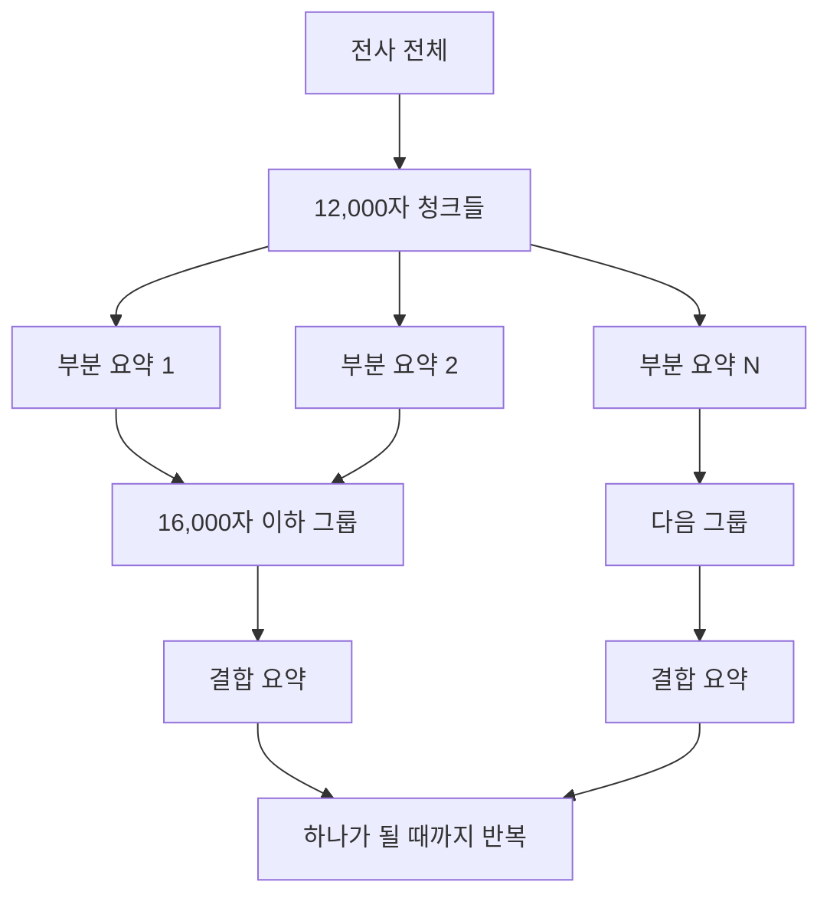

# 전사 저장 후 요약 프롬프트 조립과 생성

## 이 문서의 질문

최종 전사문이 저장된 뒤 요약은 어떻게 시작되고, 카테고리 지침·회의 정보·전사문·JSON schema 같은 여러 조각은 어떻게 최종 모델 입력으로 합쳐지는가? 긴 회의는 어떻게 요약하는가?

## 먼저 기억할 결론

요약 프롬프트에는 코드 안의 한 문장만 있는 것이 아니다. 다음 재료들이 실행 시점에 조립된다.

```text
회의록 작성 공통 규칙
+ 카테고리별 작성 지침
+ 참석자와 카테고리
+ 전체/부분 요약 범위 지시
+ speaker: text 형태의 전사문 또는 부분 요약 JSON
+ SUMMARY_SCHEMA
+ 배포 시 AI Core에 등록된 원격 summary template의 고정 지침
```

그리고 현재 배포에서는 코드가 만든 messages를 그대로 direct 호출하지 않고, AI Core의 등록 템플릿 `meeting-whisper-summary-ko-v1`에 `user_prompt`와 `json_schema` 두 placeholder를 넣는다.

## 1. 요약은 언제 시작되는가

Worker가 유효한 전사문을 CAP 내부 `saveTranscript` action으로 보내면 CAP는 다음을 한다.

1. 기존 전사문 삭제 후 새 `Transcripts` 저장
2. 회의 상태를 `summarizing`, 진행률을 `80`으로 변경
3. `setImmediate()`로 요약 background task 예약
4. API 응답은 먼저 Worker에 반환

background task는 회의의 카테고리와 참석자를 읽고 `summarizeMeeting()`을 호출한다. 즉 전사 저장 transaction과 긴 LLM 요약 호출을 한 HTTP 응답 안에서 계속 붙잡지 않는다.

사용자가 나중에 전사문을 수정하고 “요약 재생성”을 선택하거나 `runSummary` action을 누를 때도 같은 `summarizeMeeting()` 경로를 사용한다.

## 2. 전사 JSON을 요약용 텍스트로 바꾼다

요약 모델에 raw transcript JSON 전체를 그대로 주지 않는다. `meeting-note.js`가 각 segment를 다음 한 줄로 바꾼다.

```text
{speaker 또는 UNKNOWN}: {앞뒤 공백을 제거한 text}
```

빈 text segment는 제외한다. 현재 운영 경로에서 화자 분리가 꺼져 있으므로 많은 줄이 `UNKNOWN: ...`이 될 수 있다.

시간값, 단어 배열, 엔진 메타데이터는 요약 텍스트에 들어가지 않는다. 요약 모델이 보는 전사 핵심은 화자 라벨과 문장 텍스트다.

## 3. 공통 system 규칙

코드가 만드는 요약용 system message의 의미는 다음과 같다.

- 간결한 한국어 회의록을 만든다.
- 전사문에 명시된 사실만 사용한다.
- 결정, 담당자, 작업, 기한, 숫자, 날짜를 지어내지 않는다.
- 명시적 결정이나 action item이 없으면 해당 배열을 비운다.
- 명확한 기한이 없으면 due는 null이다.
- JSON만 반환한다.

이 공통 규칙과 별개로 출력 구조는 `SUMMARY_SCHEMA`가 강제한다.

## 4. user prompt를 구성하는 네 부분

`summaryMessages()`는 user message를 다음 순서로 만든다.

```text
[회의 정보]
카테고리: {category 또는 미지정}
참석자: {쉼표로 연결한 참석자 또는 미상}

[카테고리별 작성 지침]
{선택한 카테고리 지침}

[요약 범위]
{전체 전사인지 n/total 부분인지에 따른 지시}

[전사문]
{UNKNOWN: ... 또는 SPEAKER: ... 줄들}
```

### 전체 전사일 때

처음부터 끝까지 검토하되 결정, 핵심 이슈, 중요한 변경 사항, 명확한 후속 조치만 골라 간결한 최종 회의록을 만들라고 한다.

### 긴 전사의 한 청크일 때

전체 중 `n/total` 구간임을 알리고 결정 후보, 핵심 이슈, 중요한 변경, 명확한 후속 조치를 우선한 **중간 요약**을 만들며 반복 발언과 배경 설명을 압축하라고 한다.

## 5. 카테고리별로 붙는 지침

현재 코드의 카테고리는 다음처럼 요약 관점을 바꾼다.

| 카테고리 | 강조점 |
|---|---|
| 주간회의 | 진행 상황·주요 이슈·다음 계획, 담당자와 실행 내용 |
| 고객미팅 | 고객 요구·우려·요청과 배경, 양측이 약속한 후속 조치 |
| 프로젝트회의 | 현황·리스크·범위/일정 변경·의사결정, 담당자·작업·기한 |
| 내부회의 | 공유 사항·내부 운영 방침·논의된 문제와 합의 |
| 인터뷰 | 질문/답변 흐름·경험·역량·추가 확인, 근거 없는 평가 금지 |
| 내부 세미나 참석 | 강의 핵심 개념·방법론·사례·수치·Q&A, 강의를 회의 결정으로 오해하지 않기 |
| 그 외 | 주요 흐름·논의 주제·실제 합의·명확한 후속 업무 |

이 지침은 별도 파일에서 불러오는 것이 아니라 `CATEGORY_SUMMARY_GUIDANCE` 상수에서 선택되어 user prompt 안에 들어간다.

## 6. 출력 JSON schema

최종 note의 구조는 다음 네 필드다.

```text
summary       문자열, 최대 600자
decisions     문자열 최대 5개, 각 240자
action_items  최대 8개
              owner 최대 100자
              task 최대 240자
              due 문자열 최대 80자 또는 null
topics        최대 8개
              title 최대 120자
              points 최대 3개, 각 300자
```

추가 필드는 허용하지 않고 네 필드는 모두 필수다. 이 schema는 단지 설명문이 아니라 모델 응답을 받은 뒤 CAP가 직접 검사하는 기준이기도 하다.

## 7. 짧은 전사와 긴 전사의 흐름

기본 문자 한도는 12,000자다.

### 12,000자 이하

전사 텍스트를 한 번의 `summarizeText(phase=full)` 호출에 넣는다.

### 12,000자 초과

1. 전사 줄을 순서대로 최대 12,000자 청크로 나눈다.
2. 모든 청크를 빠짐없이 순서대로 각각 요약한다.
3. 생성된 부분 요약 JSON들을 16,000자 한도 그룹으로 묶는다.
4. 각 그룹을 “최종 결정·blocking 이슈/리스크·중요 변경·명시적 후속 조치만 남기고 중복과 배경을 제거”하는 결합 프롬프트로 다시 요약한다.
5. 결과가 하나가 될 때까지 이 reduce 과정을 반복한다.



이는 앞부분만 12,000자로 잘라 요약하는 방식이 아니다. 모든 청크를 먼저 요약한 다음 선택적으로 압축한다.

## 8. 현재 배포에서 “최종 프롬프트”가 만들어지는 정확한 경계

여기가 가장 헷갈리기 쉬운 부분이다.

`summarizeMeeting()`은 코드 안에서 system message와 user message를 모두 만든다. 하지만 `mta.yaml`은 요약 목적에 대해 다음을 지정한다.

```text
CAP_AICORE_SUMMARY_ORCHESTRATION_MODE=template
CAP_AICORE_SUMMARY_CONFIG_NAME=meeting-whisper-summary-ko-v1
CAP_AICORE_SUMMARY_CONFIG_SCENARIO=orchestration
CAP_AICORE_SUMMARY_CONFIG_VERSION=0.0.1
CAP_AICORE_SUMMARY_TEMPLATE_PLACEHOLDERS=user_prompt,json_schema
```

따라서 AI Core로 가는 실제 요청은 다음 형태다.

```text
config_ref = 위 등록 템플릿의 name/scenario/version
placeholder_values.user_prompt = 코드에서 만든 [회의 정보]~[전사문] 부분
placeholder_values.json_schema = SUMMARY_SCHEMA의 JSON 문자열
messages_history = []
```

현재 allowlist에는 `system_prompt`가 없으므로 코드에서 만든 영문 system message 자체는 placeholder로 전달되지 않는다. 배포의 등록 템플릿이 정적 system/assistant 지침을 갖고 있고, 그 템플릿이 `user_prompt`와 `json_schema`를 끼워 최종 모델 프롬프트를 완성하는 구조다.

### 코드만으로 알 수 없는 것

저장소에는 AI Core에 등록된 `meeting-whisper-summary-ko-v1` 템플릿 본문이 없다. 따라서 저장소 코드만 보고 **원격 템플릿의 고정 문장까지 포함한 완전한 최종 프롬프트**를 100% 재현할 수는 없다.

코드로 확정할 수 있는 부분은 다음이다.

- 어떤 user prompt가 만들어지는가
- 어떤 schema가 전달되는가
- 어떤 등록 템플릿을 참조하는가
- 어떤 placeholder만 허용하는가

원격 고정 지침과 실제 선택 모델은 AI Core의 해당 config를 열거나 실행 로그의 응답 model 정보를 확인해야 확정할 수 있다. `mta.yaml`의 `CAP_LLM_MODEL=anthropic--claude-4.7-opus`는 direct 호출에서는 모델 선택에 쓰이지만, 현재 summary template 요청에서는 `model` placeholder가 allowlist에서 빠져 있으므로 실제 요약 모델은 등록 config 쪽 정의가 결정할 수 있다.

## 9. JSON 오류 수리와 재시도

모델 응답을 받으면 다음을 수행한다.

1. JSON fence 제거
2. JSON parse
3. 응답이 `{meeting_note: {...}}`처럼 schema name으로 한 번 감싸졌으면 내부 객체 추출
4. `SUMMARY_SCHEMA` 검증

파싱 또는 schema 검증이 실패하면 원래 응답, parser 오류, schema를 넣은 **JSON repair 프롬프트**로 모델을 한 번 더 호출한다. 의미와 사실을 보존하고 새 사실을 추가하지 말라는 지시가 있다.

repair까지 실패하면 바깥 summary attempt가 재시도한다. 기본 시도 횟수는 2다. 구성된 LLM이 없으면 전사 첫 3개 segment를 이용한 단순 fallback note를 사용한다. LLM 설정이 있는데 호출이 실패한 경우에는 `CAP_LLM_ALLOW_FALLBACK`이 true일 때만 fallback을 저장하고, 그렇지 않으면 오류를 기록한다. 현재 `mta.yaml`에는 fallback 허용 설정이 없다.

## 10. 저장되는 최종 결과

정상 note는 한 번 더 `normalizeNote()`를 거친다.

- 문자열 trim
- 배열이 아니면 빈 배열
- action item의 기본 owner와 due 정리
- task가 빈 action item 제거
- topic 구조 정리

그 후 기존 Summary와 ReviewItems를 삭제하고 다음 두 형태를 함께 저장한다.

- `Summaries.content`: 구조화된 note JSON 문자열
- `Summaries.markdown`: Summary, Decisions, Action Items, Topics 섹션으로 변환한 Markdown

회의 상태는 `done`, 진행률 `100`이 된다. Worker 직후 자동 요약에서는 마지막 `finally`에서 처리용 음성을 삭제한다.

## 내가 기억할 핵심

> 요약 입력은 전사문 하나가 아니라 회의 정보·카테고리 지침·전체/부분 범위·전사 텍스트·JSON schema가 실행 중 합쳐진 결과다. 운영에서는 이 중 `user_prompt`와 `json_schema`를 AI Core 등록 템플릿에 넣으므로, 원격 템플릿 본문까지 보아야 완전한 최종 프롬프트를 확정할 수 있다.

## 직접 확인한 소스

- `cap/srv/worker-internal-service.js` 118~180행, 249~282행
- `cap/srv/lib/meeting-note.js` 115~234행
- `cap/srv/lib/ai-core.js` 13~56행, 82~288행, 443~639행, 803~945행
- `cap/srv/meeting-service.js` 274~313행, 591~617행, 651~685행
- `mta.yaml` 38~49행
- `.env.example` 3~15행, 42~52행
- `tests/ai-core-summary.test.js` 219~288행

