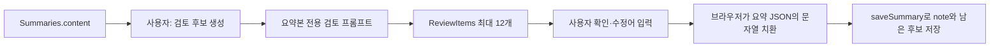

# 검토 후보 프롬프트와 사용자 수정 반영

## 이 문서의 질문

요약이 만들어진 뒤 사용자가 수정할 후보를 생성할 때 어떤 모델 입력과 프롬프트를 사용하고, 후보를 선택하면 실제 데이터는 어떻게 바뀌는가? 이것은 STT 전사 후처리인가?

## 먼저 기억할 결론

현재 검토 후보 기능은 **전사문 전체를 검토하지 않는다. 생성된 요약 JSON만 모델에 보내 요약 안의 의심 용어를 찾는다.**

그리고 모델은 후보를 제안할 뿐 자동으로 요약을 바꾸지 않는다. 사용자가 후보별 수정어를 확인하고 “요약에 적용”해야 브라우저가 실제 note 문자열을 치환한 뒤 CAP에 저장한다.



## 1. 검토는 자동 요약 직후 자동 실행되지 않는다

전사 저장 뒤 요약은 자동으로 생성되지만, 검토 후보는 사용자가 요약 화면의 “검토 후보 생성” 또는 “다시 검토” 버튼을 눌러 시작한다.

UI는 `runTranscriptReview()`라는 이름의 함수를 부르지만 CAP 경로에서는 `runReview` action으로 간다. 함수명과 UI 데이터 필드의 `transcript_review_items`는 이전 구조의 흔적처럼 보이며, 현재 실제 입력은 transcript가 아니라 Summary다.

CAP는 다음을 확인한다.

- 사용자가 해당 회의를 수정할 수 있는가
- 다른 summary/review 작업으로 busy 상태가 아닌가
- Summary 행이 존재하는가

그 뒤 회의 상태를 `reviewing`, 진행률을 `95`로 바꾸고 background task에서 `generateReviewForMeeting()`을 실행한다.

## 2. 모델이 실제로 받는 데이터

`generateReviewForMeeting()`은 `Summaries.content`를 JSON parse하고 `normalizeNote()`를 거쳐 `reviewMeeting({note, usageLog})`를 호출한다.

여기서 주의할 현재 코드의 사실이 있다. `reviewMeeting()` 함수는 `participants` 인자를 받을 수 있지만 `generateReviewForMeeting()` 호출부는 참석자를 넘기지 않는다. 따라서 현재 review user prompt의 참석자 줄은 항상 기본값인 `(unknown)`이다.

모델 입력 note에는 다음이 포함된다.

- `summary`
- `decisions`
- `action_items`의 owner, task, due
- `topics`의 title, points

원본 오디오, 전사 segment, timestamp, 회의 중 임시 전사는 들어가지 않는다.

## 3. 검토용 system prompt

코드가 만든 system message의 의미는 다음과 같다.

```text
전체 전사문이 아니라 한국어 회의록만 검토한다.
사람 이름, 회사/제품명, 영어·기술 용어, 약어, 숫자, 날짜,
어색하게 전사된 것처럼 보이는 짧은 용어를 찾는다.
반환할 text는 회의록 안에 정확히 존재해야 한다.
회의 내용 자체를 비평하거나 문체 재작성을 제안하지 않는다.
JSON만 반환한다.
```

user message는 다음 형태다.

```text
Participants: (unknown)

[Meeting note]
{정규화된 note JSON}
```

## 4. 출력 schema와 direct AI Core 프롬프트 조립

요약 호출과 달리 review 호출에는 `orchestrationPurpose: "summary"`가 없다. 그래서 `mta.yaml`의 전역 설정인 `CAP_AICORE_ORCHESTRATION_MODE=direct`를 사용한다.

direct mode는 원래 두 message 뒤에 세 번째 system message를 추가한다.

```text
1. system: 위 검토 규칙
2. user: Participants + Meeting note JSON
3. system: summary_review라는 JSON 객체만 반환하며 REVIEW_SCHEMA를 지키라는 지시 + schema 문자열
```

이 message 배열이 AI Core의 `prompt_templating.prompt.template`에 직접 들어가며, 현재 `CAP_LLM_MODEL=anthropic--claude-4.7-opus`가 direct 모델 이름으로 사용된다. temperature는 0이고 version은 latest다.

각 review item의 schema는 다음과 같다.

| 필드 | 의미 |
|---|---|
| `segment_index` | 정수. 현재 요약 검토에서는 실질적 segment 연결 의미가 약함 |
| `text` | 요약 안에 실제로 존재하는 원문 후보 |
| `category` | `name`, `word`, `sentence` 중 하나 |
| `reason` | 왜 확인이 필요한지 |
| `suggestion` | 추천 치환어 또는 null |
| `confidence` | 신뢰도 숫자 또는 null |

## 5. 모델 응답을 그대로 저장하지 않는다

JSON parse와 REVIEW_SCHEMA 검증 후 `normalizeReviewItems()`가 다시 제한한다.

1. segment index를 숫자로 정리
2. category가 허용값이 아니면 `word`
3. 빈 suggestion은 null
4. 같은 `text` 중복 제거
5. 후보 `text`가 현재 note 전체 텍스트에 **정확히 포함**되는지 확인
6. 최대 12개만 유지

따라서 모델이 회의록에 없는 새로운 잘못된 단어를 후보로 만들면 제거된다. 이 검사는 후속 문자열 치환이 실제로 동작하도록 하는 안전장치다.

정상 후보는 기존 `ReviewItems`를 모두 지운 뒤 새 행으로 저장한다. 회의 상태는 다시 `done`, 진행률 `100`이 된다.

## 6. 모델 호출을 못 하면 규칙 기반 후보를 만든다

Review는 LLM 설정이 없거나 호출이 실패해도 항상 fallback 후보를 반환할 수 있다.

정규식으로 다음 같은 문자열을 찾는다.

- 영문으로 시작하는 기술 용어
- 숫자·날짜처럼 보이는 값
- `AI`, `API`, `LLM`, `CAP`, `BTP`, `GPU`, `CPU`, `Kyma`, `HANA`, `XSUAA`가 포함된 값

그중 영문 2자 이상, 숫자 포함, 아주 짧은 단어 같은 의심 조건을 만족하는 값을 최대 12개 만든다. 이때 suggestion은 null이고 confidence는 0.35다.

즉 후보가 화면에 나타났다고 해서 반드시 모델이 만든 결과라고 단정할 수 없다. AI 설정이 없거나 review 호출이 실패하면 규칙 기반 후보일 수 있다.

## 7. 사용자가 후보 하나를 적용할 때

후보 행에는 원래 text, 이유, 모델 suggestion, 수정어 입력칸이 있다. 사용자가 적용하면 브라우저가 현재 note를 읽고 다음 모든 필드에서 **정확한 source 문자열의 모든 출현**을 replacement로 바꾼다.

- 핵심 요약
- 결정 사항
- action item의 owner, task, due
- topic의 title과 points

변경된 후보는 목록에서 제거한다. 그 뒤 `saveSummary` action으로 다음을 함께 보낸다.

- 변경된 note JSON
- 아직 확인하지 않은 나머지 review items

CAP는 Summary를 JSON과 Markdown으로 다시 저장하고, 전달된 나머지 ReviewItems로 테이블을 교체한다.

### “이상 없음”을 누를 때

note는 바꾸지 않고 그 후보만 남은 ReviewItems에서 제거해 저장한다. “모두 이상 없음”은 남은 후보를 전부 빈 배열로 저장한다.

### “일괄 적용”을 누를 때

suggestion 또는 사용자가 입력한 replacement가 있는 모든 후보를 note에 적용하고, 실제로 적용된 후보만 목록에서 제거한다.

중요한 점은 단어의 특정 한 위치가 아니라 note 전체에서 `split(source).join(replacement)`로 치환한다는 것이다. 같은 문자열이 여러 문맥에 있으면 모두 바뀐다.

## 8. 직접 편집과 모델 기능의 관계

사용자는 후보 기능 없이도 두 종류의 수정을 할 수 있다.

### 요약본을 직접 편집

contenteditable UI의 값을 모아 `saveSummary`로 바로 저장한다. 모델을 다시 호출하지 않는다.

### 전사문을 직접 편집

segment text를 수정하고 blur하면 `saveTranscript`를 호출한다. 현재 UI는 `scheduleTranscriptSave(true)`를 사용하므로 전사문 저장 뒤 기존 Summary와 ReviewItems를 지우고 요약을 다시 생성한다. 새 요약이 끝난 뒤 검토 후보가 필요하면 사용자가 다시 review를 실행해야 한다.

따라서 권장되는 논리 순서는 다음과 같다.

```text
전사문 오류 수정
  → 요약 재생성
  → 요약 내용 직접 다듬기
  → 검토 후보 생성
  → 후보 적용 또는 이상 없음 처리
```

## 9. 이것은 STT 전사 후처리인가

엄밀히는 아니다.

- STT 후처리: 모델 전사 JSON과 timestamp를 검증·재시도·병합하여 `Transcripts`에 저장
- 요약 생성: 저장된 전사문을 회의록 note로 변환
- 검토 후보: 생성된 note 안의 의심 용어를 사람이 확인하도록 제시

현재 review prompt의 첫 문장도 “full transcript가 아니라 meeting note만 검토한다”고 명시한다. 따라서 전사문에 틀린 고유명사가 있어도 요약에 포함되지 않았다면 review 후보가 될 수 없다. 반대로 요약 모델이 만든 어색한 용어는 후보가 될 수 있다.

## 흔히 하기 쉬운 오해

### “검토 모델이 전사문을 자동 교정한다”

아니다. 전사문은 입력에 없고, Summary도 사용자가 적용하기 전에는 바뀌지 않는다.

### “segment_index가 있으니 전사 segment와 연결된다”

현재 입력이 note뿐이라 실제 전사 segment를 찾아 전달하지 않는다. 필드 이름은 남아 있지만 현재 기능의 핵심은 note 문자열 후보다.

### “참석자 이름을 힌트로 고유명사를 교정한다”

함수 설계에는 participants 인자가 있지만 현재 CAP 호출부가 넘기지 않아 배포 경로에서는 `(unknown)`이다.

## 내가 기억할 핵심

> 검토 후보 모델은 전사문이 아니라 요약 JSON만 보고, 그 안에 정확히 존재하는 의심 용어를 최대 12개 제안한다. 실제 변경은 사용자가 승인한 뒤 브라우저가 note 전체 문자열을 치환하고 saveSummary로 저장할 때 일어난다. 따라서 이것은 자동 STT 후처리가 아니라 사람 중심의 요약 검수 도구다.

## 직접 확인한 소스

- `cap/srv/lib/ai-core.js` 58~80행, 314~411행, 443~568행, 803~875행
- `cap/srv/meeting-service.js` 315~352행, 619~640행, 688~709행
- `app/meeting-ui/js/api.js` 513~548행
- `app/meeting-ui/js/app.js` 2462~2538행, 2587~2608행, 2645~2727행, 2774~2858행
- `cap/db/schema.cds` 87~102행
- `mta.yaml` 38~49행

