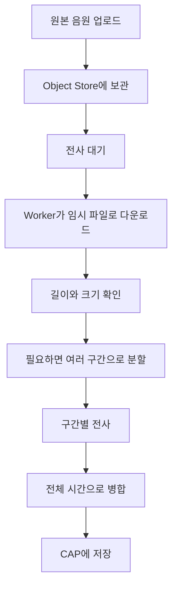
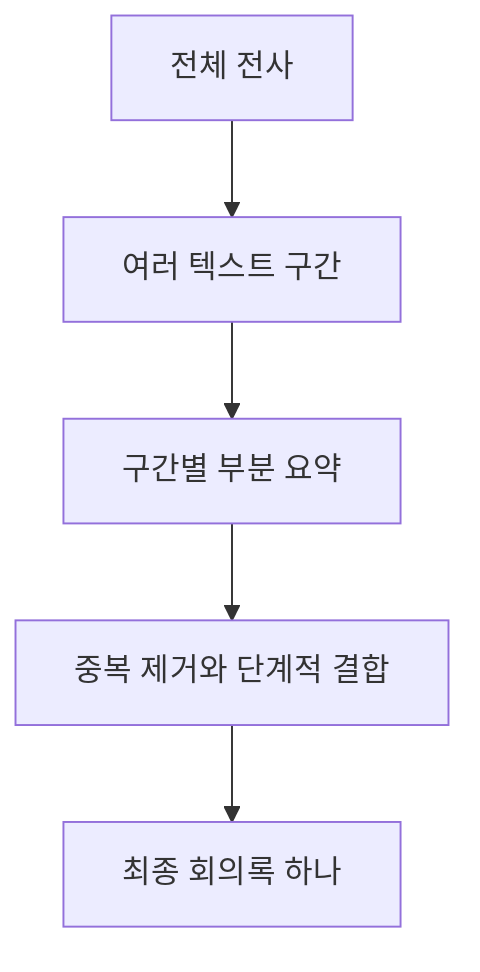

# 1-3. 긴 회의를 안전하게 처리하는 설계

## 긴 회의가 어려운 이유

긴 음원은 단순히 처리 시간이 길다는 문제만 만들지 않는다.

- 파일이 커서 네트워크 전송과 메모리 사용량이 증가한다.
- AI 모델이 받을 수 있는 크기와 처리 시간을 넘을 수 있다.
- 한 번 실패하면 처음부터 다시 처리하는 비용이 커진다.
- 여러 긴 회의가 동시에 들어오면 Worker가 멈출 수 있다.
- 긴 전사문을 한 번에 요약하면 입력 길이 제한과 정보 누락 위험이 커진다.

## 음원을 다루는 단계

현재 설정의 중심 기준은 다음과 같다.

- 음원이 720초보다 길면 분할 대상이다.
- 인라인 전송 기준 크기를 넘겨도 분할 대상이다.
- Worker는 동시에 처리할 작업 수를 제한한다.
- 각 AI 응답은 검증하고 잘못되면 재시도한다.
- 계속 실패한 구간은 더 작은 구간으로 다시 나눈다.

숫자는 `mta.yaml`과 환경 변수로 바꿀 수 있으므로 영구적인 업무 규칙으로 외우기보다 현재 운영값으로 이해해야 한다.

## 표시된 회의 길이를 Worker에 전달하는 이유

일부 WebM 파일은 파일 자체에서 길이를 정확히 읽기 어렵다. 그러면 실제로는 긴 회의인데 짧은 파일로 오판할 수 있다.

CAP는 브라우저가 알고 있는 녹음 길이를 `expectedDurationSec`으로 대기 작업에 포함하고 Worker에 전달한다. Worker는 파일에서 측정한 값과 이 예상값을 처리 판단에 활용한다.

## 전사 결과의 여러 검증 지점

AI가 반환한 결과는 곧바로 데이터베이스에 들어가지 않는다.

1. Worker가 AI 응답을 완전한 JSON으로 읽을 수 있는지 확인한다.
2. 각 발언의 시간과 문장 구조를 정규화한다.
3. 전체 결과가 저장 가능한 전사 구조인지 다시 확인한다.
4. CAP가 `saveTranscript`에서 동일한 핵심 조건을 재검사한다.

검사 항목에는 빈 발언, 거꾸로 된 시간, 이전 문장보다 뒤로 가는 시작 시간, 음원 길이를 벗어난 시간과 원시 JSON이 문장 칸에 들어간 경우 등이 포함된다.

## 긴 전사문을 요약하는 방법

음원 분할과 전사문 분할은 서로 다른 단계다.

- 음원 분할: STT 모델이 처리할 수 있도록 Worker가 수행
- 전사문 분할: 요약 모델이 처리할 수 있도록 CAP가 수행

CAP는 긴 전사문을 약 12,000자 단위로 나누어 부분 요약을 만든다. 부분 요약이 많으면 약 16,000자 범위로 묶어 여러 차례 결합한다.

## 사용자에게는 왜 하나로 보이나

내부에서는 여러 음원 조각과 여러 부분 요약이 생기지만 이것은 처리 과정의 임시 단위다.

사용자가 관리해야 하는 것은 회의 하나, 전사 하나, 요약 하나다. 내부 최적화 방법이 바뀌어도 사용자 데이터 모델을 바꾸지 않기 위해 최종 결과만 하나로 합친다.

## 핵심 정리

긴 회의 처리의 핵심은 큰 작업을 무조건 한 번에 성공시키는 것이 아니다.

> 작업을 작게 나누고, 각 단계의 결과를 검사하고, 실패한 범위만 다시 시도한 뒤 사용자에게는 하나의 결과로 합쳐 주는 것이다.

다음: [[1-4. 운영자가 배포와 장애를 바라보는 방법|1-4. 운영자가 배포와 장애를 바라보는 방법]]
