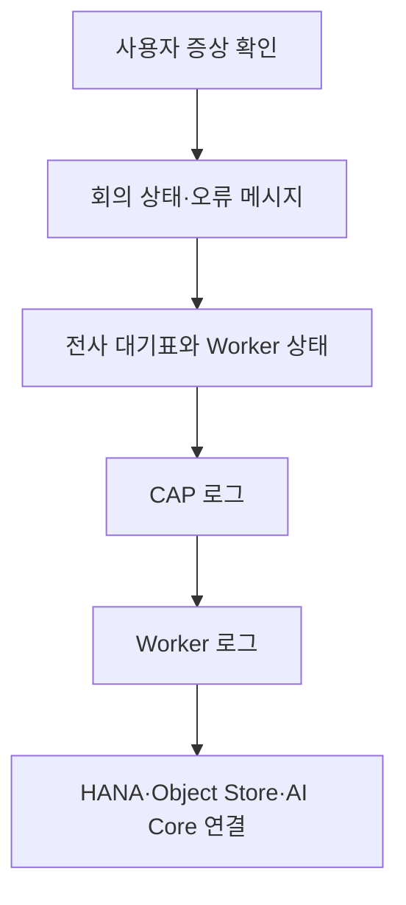

# 1-4. 운영자가 배포와 장애를 바라보는 방법

## 운영은 무엇을 보는 일인가

운영자는 코드 파일보다 “사용자 요청이 어디까지 갔는가”를 본다.

Meeting Whisper는 여러 프로그램과 외부 서비스가 연결되므로 화면에 같은 오류가 보여도 원인은 다를 수 있다.

## 현재 배포 단위

`mta.yaml`은 다음 네 프로그램을 하나의 배포 묶음으로 정의한다.

| 프로그램 | 운영 역할 |
|---|---|
| `meeting-whisper-approuter` | 공개 접속 주소와 로그인 |
| `meeting-whisper-srv` | CAP API, 권한, 데이터와 요약 |
| `meeting-whisper-stt-worker` | 음성 전사 |
| `meeting-whisper-db-deployer` | HANA 데이터 구조 설치 |

여기에 HANA, XSUAA, Object Store와 AI Core가 서비스로 연결된다.

## 장애를 확인하는 순서

처음부터 AI 장애라고 가정하지 않는다.

- 로그인 화면에서 막히면 Approuter와 XSUAA를 본다.
- 회의 생성이 안 되면 CAP와 HANA를 본다.
- 음원 업로드가 실패하면 바이너리 업로드 경로와 Object Store를 본다.
- `queued`에서 오래 멈추면 대기표와 Worker 호출을 본다.
- `transcribing`에서 멈추면 Worker 생존 신호와 AI Core 호출을 본다.
- `summarizing`에서 멈추면 CAP의 요약 로그와 AI Core 설정을 본다.

## 상태가 운영 정보가 되는 이유

회의의 `status`, `percent`, `stage`, `error`는 화면용 장식이 아니다.

이 값으로 사용자는 현재 단계를 알 수 있고, 운영자는 어느 프로그램까지 요청이 도착했는지 판단한다. 대기 작업에는 별도로 시도 횟수, 다음 시도 시각, Worker 실행 식별자와 마지막 생존 시간이 저장된다.

## Secret은 두 방향으로 존재한다

CAP와 Worker는 서로를 아무나 호출하지 못하게 두 방향 인증을 사용한다.

- CAP → Worker: 공유 Bearer token
- Worker → CAP: XSUAA client-credentials와 Worker 역할

한쪽 비밀을 교체하면 상대 프로그램의 설정도 함께 맞아야 한다. `deploy/OPERATIONS.md`의 secret rotation 절차가 이 관계를 설명한다.

## 재전사와 원본 음원의 관계

전사에 실패했다고 항상 다시 시도할 수 있는 것은 아니다. 원본 음원이 남아 있어야 Worker가 다시 전사할 수 있다.

정상 완료 후에는 보존 정책에 따라 원본 음원이 삭제될 수 있다. 따라서 운영자 재전사 도구는 회의 상태뿐 아니라 음원의 존재 여부도 확인해야 한다.

## 배포 자료를 읽는 우선순위

1. `mta.yaml`: 실제로 무엇이 배포되고 어떤 값이 들어가는지
2. `deploy/cf/README.md`: 현재 Cloud Foundry 배포 명령
3. `deploy/OPERATIONS.md`: 권한, 비밀 교체, 장애와 롤백
4. `docs/transcription-architecture-migration.md`: 구조가 바뀐 이유
5. `deploy/kyma/`: 과거 구조 참고

## 핵심 정리

운영의 핵심 질문은 “어느 파일이 문제인가?”보다 다음에 가깝다.

> 사용자의 요청이 Approuter, CAP, 대기표, Worker, 저장소와 AI Core 중 어디까지 도착했고 어디에서 멈췄는가?

다음: [[1-5. 사용자 권한이 실제 요청에 적용되는 과정|1-5. 사용자 권한이 실제 요청에 적용되는 과정]]
