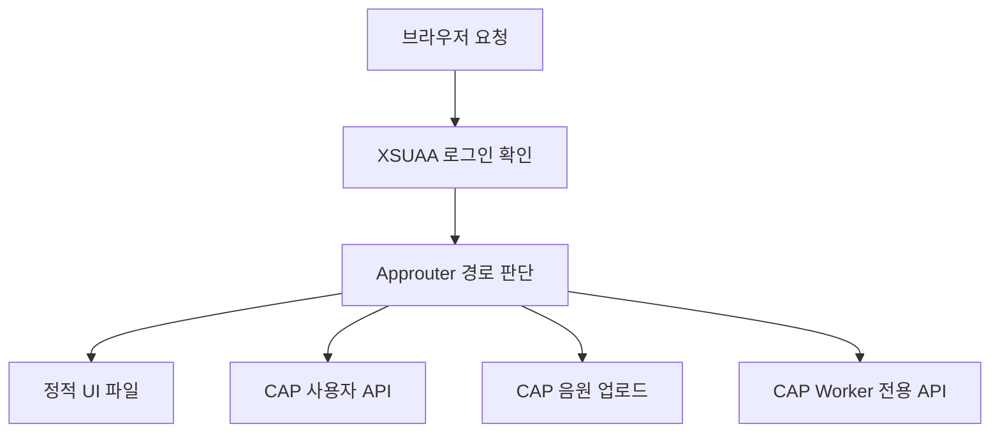

# 2-2. 로그인부터 화면이 열리기까지

## 사용자가 처음 만나는 프로그램

운영 환경에서 사용자는 CAP나 Worker 주소로 직접 들어가지 않는다. Approuter 주소로 접속한다.

Approuter는 요청을 보고 다음 목적지를 결정한다.



## `xs-app.json`의 역할

`approuter/xs-app.json`은 URL 규칙표다.

| URL 성격 | 전달 대상 |
|---|---|
| `/user-api/` | 현재 로그인 사용자 정보 |
| `/api/` | CAP의 공개 Meeting Service |
| `/api-binary/` | CAP의 대용량 음원 업로드 경로 |
| `/internal/` | CAP의 Worker 전용 Service |
| 나머지 주소 | `resources` 안의 UI 파일 |

이 설정은 업무 로직을 수행하지 않는다. 어떤 요청을 어디로 보낼지 정한다.

## 화면 파일은 어디에서 오는가

원본 UI는 `app/meeting-ui`에 있다. 빌드 과정에서 `scripts/copy-web-assets.js`가 이 파일들을 `approuter/resources`로 복사한다.

```text
app/meeting-ui
→ copy-web-assets.js
→ approuter/resources
→ Approuter가 브라우저에 전달
```

따라서 UI 소스를 바꾼 뒤 복사·빌드하지 않으면 배포 파일에는 예전 화면이 남을 수 있다.

## 로그인 이후 사용자 정보

브라우저는 `/user-api/currentUser` 계열 요청을 통해 현재 로그인 사용자의 이름과 이메일을 확인한다.

이 정보는 화면 표시뿐 아니라 회의 생성자와 참여자 입력에도 사용된다. 하지만 브라우저가 보내는 사용자 값을 최종 권한 근거로 믿어서는 안 된다. CAP는 인증된 서버 컨텍스트의 사용자를 기준으로 다시 판단한다.

## 운영과 로컬의 차이

운영에서는 XSUAA가 실제 인증을 담당한다. 로컬 CAP 개발에서는 `package.json`의 mocked 사용자 설정을 사용할 수 있다.

예를 들면 `alice`, `worker`, `admin` 같은 시험 사용자가 정의돼 있다. 이것은 로컬 테스트 편의를 위한 것이며 실제 운영 계정은 아니다.

## 왜 Worker 경로도 Approuter 설정에 보이나

`/internal` 경로가 라우팅 설정에 존재한다고 해서 일반 사용자가 Worker 역할을 얻는 것은 아니다. 경로 전달과 접근 권한은 별도다.

Approuter가 요청을 CAP로 보내더라도 CAP Service의 `@requires: 'Worker'` 조건을 통과해야 내부 작업을 실행할 수 있다.

## 핵심 정리

> Approuter는 로그인 문과 교통정리를 맡고, 실제 회의 권한과 업무 처리는 CAP가 다시 판단한다.

다음: [[2-3. 브라우저 화면 모듈들이 협력하는 방식|2-3. 브라우저 화면 모듈들이 협력하는 방식]]
