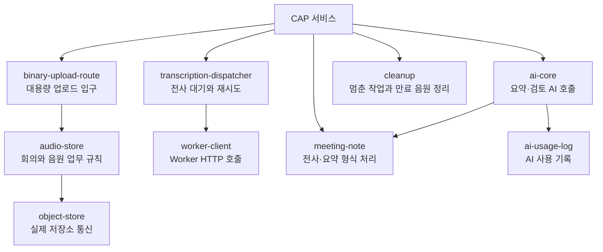

# 2-5. CAP 라이브러리가 기능을 나누는 방식

## 서비스 파일에 모든 코드를 넣지 않은 이유

`meeting-service.js`와 `worker-internal-service.js`는 요청의 시작점이다. 저장소 연결, AI 호출, 대기표와 오디오 처리를 모두 안에 넣으면 두 서비스가 같은 코드를 반복하고 수정 영향도 커진다.

`cap/srv/lib`는 반복되거나 전문적인 책임을 별도 모듈로 나눈다.

## 기능 흐름으로 보는 라이브러리

## 오디오 계열

- `audio.js`: 크기, 만료와 인코딩 같은 작은 계산
- `object-store.js`: S3 호환 Object Store와 직접 통신
- `audio-store.js`: 회의 소유권과 저장 정책을 적용
- `binary-upload-route.js`: 큰 파일을 스트림으로 받는 Express 경로

저장소 기술이 바뀌더라도 서비스가 AWS SDK 세부 사항을 직접 알지 않도록 층을 나눈 구조다.

## 전사 대기 계열

- `transcription-dispatcher.js`: DB에 대기 작업을 만들고 재시도 시각과 상태 관리
- `worker-client.js`: Worker `/transcribe` 주소로 실제 HTTP 요청
- `status.js`: 여러 모듈이 공유하는 상태 문자열

대기 정책과 네트워크 호출을 분리했기 때문에 Worker 주소가 없거나 바쁠 때도 작업 자체는 DB에 남길 수 있다.

## 전사와 회의록 형식 계열

`meeting-note.js`는 다음을 담당한다.

- 전사 JSON 읽기와 정규화
- 시간과 문장 구조 검증
- 긴 전사문을 요약용 텍스트 구간으로 나누기
- AI 요약 결과 정규화
- Markdown 회의록 만들기
- AI를 사용할 수 없을 때의 단순 대체 요약

`ai-core.js`는 이 기능을 이용해 AI 호출 순서와 프롬프트를 관리한다.

## AI 호출과 사용 기록

`ai-core.js`는 요약, 부분 요약 결합, JSON 복구와 검토 후보 생성을 실행한다.

`ai-usage-log.js`는 모델명, 요청 식별자, 지연 시간, token 사용량과 성공·실패를 기록한다. AI 기능의 품질뿐 아니라 비용과 장애를 조사할 근거를 남긴다.

## `cleanup.js`의 역할

긴 작업은 프로그램 종료나 네트워크 장애 때문에 중간 상태로 남을 수 있다.

`cleanup.js`는 주기적으로 다음을 찾는다.

- 보존 기간이 지난 음원
- 너무 오래 대기한 회의
- 생존 신호가 끊긴 Worker 작업
- 완료 결과가 있는데 상태만 끝나지 않은 회의

이는 사용자의 새 요청을 처리하는 기능이 아니라 이전 작업의 모순을 복구하는 운영 기능이다.

## 핵심 정리

> CAP 라이브러리는 파일 수를 늘리기 위한 분리가 아니라 저장·대기·AI·검증·복구라는 서로 다른 변경 이유를 격리하기 위한 분리다.

다음: [[2-6. Python Worker의 내부 구조|2-6. Python Worker의 내부 구조]]
