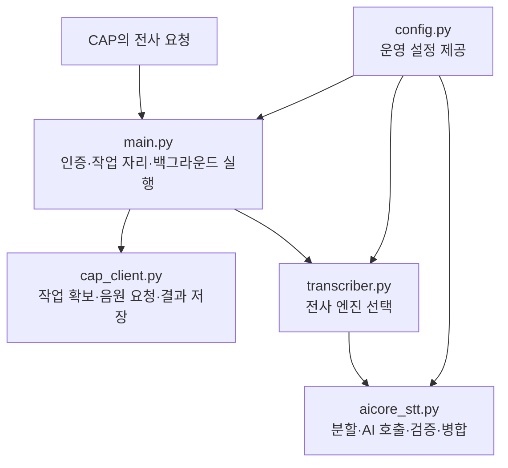

# 2-6. Python Worker의 내부 구조

## Worker는 작은 독립 서버다

`workers/transcription`은 CAP 안에서 실행되는 Python 함수가 아니다. 별도로 배포되는 FastAPI 서버다.

CAP가 `/transcribe`에 작업 요청을 보내면 Worker는 접수 가능 여부를 판단하고 백그라운드에서 처리한다.

## 파일별 책임

| 파일 | 맡은 일 |
|---|---|
| `main.py` | HTTP 입구, 작업 자리 제한, CAP 통신 흐름, 임시 파일과 생존 신호 |
| `transcriber.py` | 사용할 전사 엔진 선택 |
| `aicore_stt.py` | AI Core 호출, 음원 분할, 응답 검사와 병합 |
| `cap_client.py` | Worker가 CAP 내부 API를 호출 |
| `config.py` | 환경 변수를 Python 설정으로 변환 |

## 요청이 들어온 뒤의 협력

## `main.py`가 맡는 안전장치

Worker는 요청을 받자마자 무조건 202를 반환하지 않는다.

1. CAP가 보낸 공유 token을 확인한다.
2. 현재 처리 가능한 작업 자리가 있는지 확인한다.
3. CAP에 작업 사용권을 요청한다.
4. 사용권 확보에 성공한 뒤 백그라운드 작업을 등록한다.
5. 처리 중 주기적으로 생존 신호를 보낸다.
6. 성공 또는 실패 결과를 CAP에 보고한다.
7. 임시 음원과 작업 자리를 정리한다.

## `transcriber.py`의 엔진 분기

환경 변수 `TRANSCRIPTION_ENGINE`에 따라 다음 경로가 있다.

- `aicore`: 현재 운영 중심
- `whisperx`: 과거·대체 경로
- `fast`: faster-whisper 경로

이 분기는 “세 모델이 동시에 결과를 만든다”는 뜻이 아니다. 한 번의 실행에서 설정된 엔진 하나를 선택한다.

## `aicore_stt.py`가 큰 이유

AI 요청 한 번만 담당하지 않기 때문이다.

- 음원 길이 측정
- 음원 분할 판단
- WAV 구간 생성
- 음원과 프롬프트를 AI Core에 전달
- 인증 token과 요청 처리
- JSON 파싱
- 발언 시간과 문장 정규화
- 실패 구간 재시도와 더 작은 재분할
- 전체 시간으로 병합
- 사용량 로그 정보 생성

## CAP와 Worker의 인증 방향

CAP가 Worker를 호출할 때는 공유 token을 사용한다. Worker가 CAP에 결과를 보낼 때는 XSUAA client-credentials를 사용한다.

두 방향이 다른 이유는 호출 주체와 필요한 권한이 다르기 때문이다.

## 핵심 정리

> Worker는 단순한 AI API 래퍼가 아니라, 긴 음원을 안전하게 처리하고 CAP와 작업 소유권을 맞추는 독립적인 작업 관리자다.

다음: [[2-7. 설정 테스트 운영도구와 Legacy를 구분하기|2-7. 설정·테스트·운영도구와 Legacy를 구분하기]]
