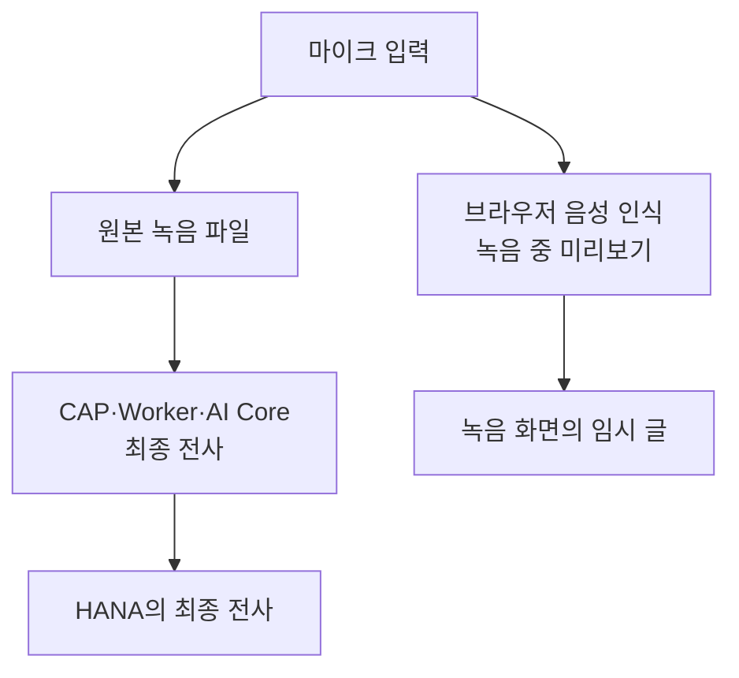

# 3-1. 화면의 임시 전사와 저장되는 최종 전사

## 같은 음성을 두 번 글로 보는 이유

녹음 중 화면에 나타나는 글과 회의가 끝난 뒤 저장되는 전사는 서로 다른 결과다.



## 임시 전사

브라우저의 `SpeechRecognition` 또는 `webkitSpeechRecognition` 기능을 사용한다.

- 브라우저와 기기에 따라 지원 여부와 품질이 달라진다.
- 녹음 도중 사용자가 대략적인 내용을 볼 수 있게 한다.
- 중간 결과와 확정 결과를 화면에 나누어 표시한다.
- 초안 복구를 위해 브라우저 로컬 저장소에 일부 보존될 수 있다.
- CAP의 최종 `Transcripts`에는 저장하지 않는다.
- AI 요약의 입력으로 사용하지 않는다.

관련 시작점은 `app/meeting-ui/js/app.js`의 실시간 전사 함수다.

## 최종 전사

녹음이 끝나면 생성된 원본 오디오를 서버에 업로드한다. CAP가 전사 작업을 대기표에 넣고 Worker가 AI Core를 호출해 다시 전사한다.

최종 결과에는 각 발언의 시작 시간, 끝 시간, 문장과 선택적인 화자 정보가 들어간다.

```json
{
  "language": "ko",
  "segments": [
    {
      "start": 12.4,
      "end": 17.8,
      "text": "이번 주 배포 일정을 확인하겠습니다.",
      "speaker": null
    }
  ]
}
```

## 왜 임시 결과를 그대로 저장하지 않나

임시 결과는 다음 정보가 부족하거나 일관되지 않을 수 있다.

- 정확한 시간 구간
- 전체 음원 기준의 문장 순서
- 브라우저 간 같은 품질
- 서버에서 재현 가능한 처리 기록
- 장시간 녹음의 안정성

최종 전사는 업로드된 동일 원본 음원에서 다시 만들어지므로 서버가 검증하고 재시도할 수 있다.

## “통합되지 않는다”의 정확한 의미

두 경로를 같은 화면에서 보여 줄 수 없다는 뜻이 아니다. 현재 데이터 흐름에서 임시 전사 텍스트를 최종 전사의 입력이나 초안으로 서버에 전달하지 않는다는 뜻이다.

통합하려면 평문 임시 결과와 시간별 최종 segment를 맞추는 정책, 서버 저장 방식과 충돌 해결이 필요하다. 이는 단순 UI 수정이 아니라 데이터 흐름 변경이다.

## 초보자가 자주 하는 오해

녹음 중 문장이 정확해 보여도 최종 전사가 반드시 같지는 않다. 반대로 임시 전사가 틀렸더라도 원본 오디오가 좋다면 최종 전사는 더 정확할 수 있다.

## 핵심 정리

> 임시 전사는 녹음 경험을 돕는 화면 기능이고, 최종 전사는 회의록과 요약의 근거가 되는 서버 데이터다.

다음: [[3-2. 회의 생성부터 전사 대기표까지|3-2. 회의 생성부터 전사 대기표까지]]
