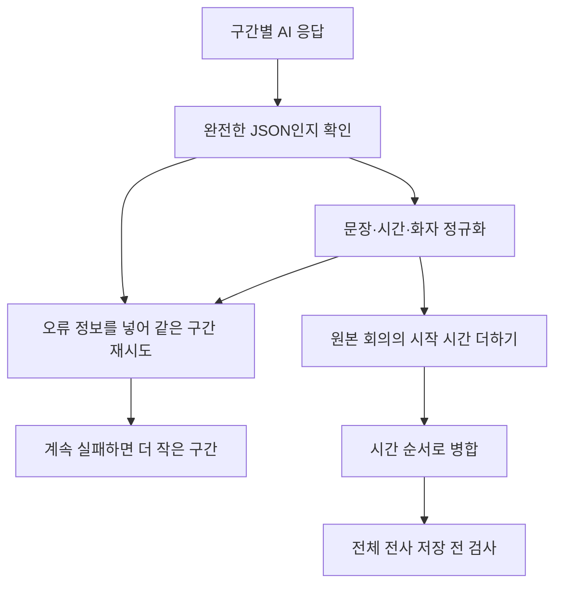

# 3-5. 분할된 결과를 합치고 검증하는 과정

## AI 응답을 바로 저장하지 않는다

AI가 JSON처럼 보이는 응답을 줬다고 해서 올바른 전사라고 확정할 수 없다.

Worker는 구간별 응답을 읽고 형식을 정리한 뒤 전체 회의로 합치고 다시 검사한다.



## 구간 응답 검사

대표적으로 다음 조건을 확인한다.

- 최상위 값이 완전한 JSON 객체인가
- `segments` 배열이 존재하는가
- 각 segment가 객체인가
- 발언 문장이 문자열인가
- 시작과 끝 시간이 숫자인가
- 음수가 아닌가
- 끝 시간이 시작보다 빠르지 않은가
- 시간 순서가 뒤로 가지 않는가
- 해당 음원 구간의 길이를 벗어나지 않는가
- JSON 전체가 발언 문자열 안에 잘못 들어가 있지 않은가

## 오류를 알려 주고 재시도

재시도할 때 같은 프롬프트를 그대로 보내지 않는다. 이전 응답이 왜 거부됐는지 짧게 추가한다.

예를 들면 시간 범위 초과, 닫히지 않은 JSON 또는 시간 역전 같은 구체적인 이유다. 모델은 해당 오류를 고쳐 완전한 JSON만 반환하도록 요청받는다.

## 더 작은 구간으로 나누는 이유

같은 음원 조각이 정해진 횟수만큼 실패하면 그 조각을 더 작은 단위로 나눈다.

긴 구간의 한 부분 때문에 전체 회의를 실패시키지 않고, 모델이 처리하기 쉬운 범위로 문제를 축소하는 방법이다.

## 전체 회의 시간으로 바꾸기

각 조각의 시간에 `chunk_start_sec`을 더한다.

```text
두 번째 조각의 원본 시작 위치: 720초
조각 안 발언 시작: 15.5초
전체 회의 발언 시작: 735.5초
```

이 변환은 AI의 추측이 아니라 Worker 코드의 숫자 계산이다.

## 중복과 경계 처리

구간이 이어지는 경계에서는 비슷한 문장이 반복되거나 시간이 겹칠 수 있다. Worker는 정규화와 병합 과정에서 시간 순서를 맞추고 잘못된 중복이나 범위를 방어한다.

병합된 전체 결과에는 언어, segment 목록과 처리 정보가 포함될 수 있다.

## CAP가 다시 검사하는 이유

Worker에서 검사했더라도 네트워크 경계 밖에서 들어오는 데이터는 CAP가 다시 검증한다.

CAP의 `meeting-note.js`는 `saveTranscript` 전에 저장 가능한 구조, 발언 시간 순서와 음원 길이를 확인한다. 이는 Worker 버그나 오래된 Worker 버전이 잘못된 데이터를 보내는 경우의 마지막 방어선이다.

## 핵심 정리

> 전사 품질은 AI 모델 한 번의 답변이 아니라 파싱, 정규화, 재시도, 재분할, 시간 병합과 CAP 재검증의 연속으로 지켜진다.

다음: [[3-6. 전사 저장 이후 요약과 검수가 진행되는 과정|3-6. 전사 저장 이후 요약과 검수가 진행되는 과정]]
