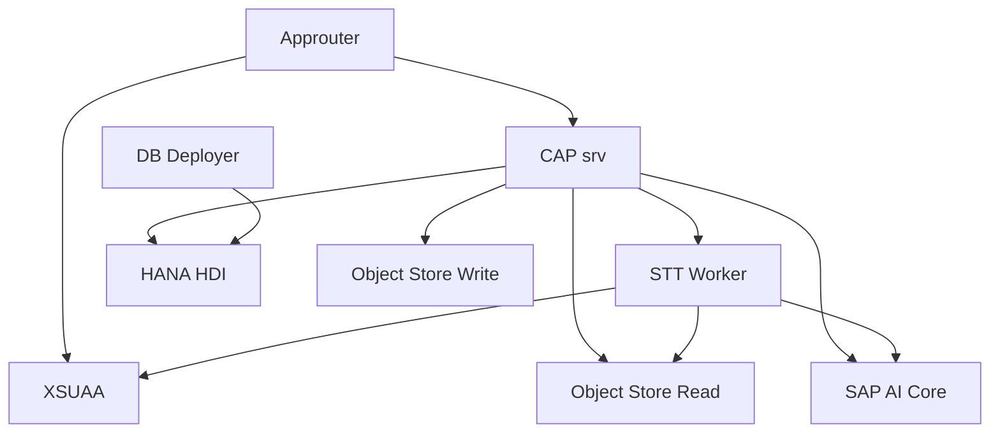

# 5-3. MTA가 네 프로그램과 BTP 서비스를 조립하는 방식

## MTA의 역할

`mta.yaml`은 비즈니스 로직이 아니라 배포 설계도다.

어떤 프로그램을 만들고 어떤 BTP 서비스와 연결할지 한곳에서 정의한다.

## 실행 모듈

| 모듈 | Buildpack | 현재 메모리 | 역할 |
|---|---|---:|---|
| `meeting-whisper-srv` | Node.js | 512MB | CAP 백엔드 |
| `meeting-whisper-stt-worker` | Python | 2GB | 음성 전사 |
| `meeting-whisper-db-deployer` | Node.js | 배포 작업용 | HANA 구조 설치 |
| `meeting-whisper-approuter` | Node.js | 256MB | 로그인과 UI |

수치는 현재 설정일 뿐이며 운영 관측에 따라 바뀔 수 있다.

## BTP 서비스

Object Store를 쓰기와 읽기 바인딩으로 구분한 것은 각 프로그램에 필요한 권한만 주기 위한 설계다.

## 주소가 전달되는 방식

CAP 모듈은 자신의 내부 API 주소를 제공하고 Worker 모듈은 전사 접수 주소를 제공한다.

MTA의 `provides`와 `requires`가 이 값을 다른 모듈의 환경 변수로 연결한다. 개발자가 운영 URL을 소스코드에 고정하지 않아도 된다.

## 환경 변수는 무엇을 바꾸나

CAP 쪽에서는 다음을 조절한다.

- Object Store 사용과 보존
- 음원 최대 크기
- 전사 대기표의 전달 수와 재시도 간격
- Worker timeout과 멈춤 판단
- 요약의 문자 분할 기준
- AI Core 요약 모드와 모델

Worker 쪽에서는 다음을 조절한다.

- 전사 엔진과 모델
- 음원 분할 기준
- AI 응답 재시도 횟수
- 동시 작업 수
- 작업 전체 timeout
- 생존 신호 간격

## `managed`와 `existing`

MTA resource는 배포가 서비스를 새로 관리하도록 만들 수도 있고 이미 존재하는 서비스 이름을 참조할 수도 있다.

이 선택은 데이터와 자격증명 수명에 영향을 준다. 기존 HANA나 Object Store를 새로 만드는 서비스로 착각하면 운영 데이터에 위험이 생길 수 있으므로 실제 `mta.yaml`의 resource 정의를 기준으로 봐야 한다.

## 핵심 정리

> MTA는 소스 폴더를 프로그램으로 만들고, 프로그램을 BTP 서비스와 주소·권한·환경 변수로 연결하는 조립 설명서다.

다음: [[5-4. 현재 수동 배포와 CI-CD의 차이|5-4. 현재 수동 배포와 CI-CD의 차이]]
