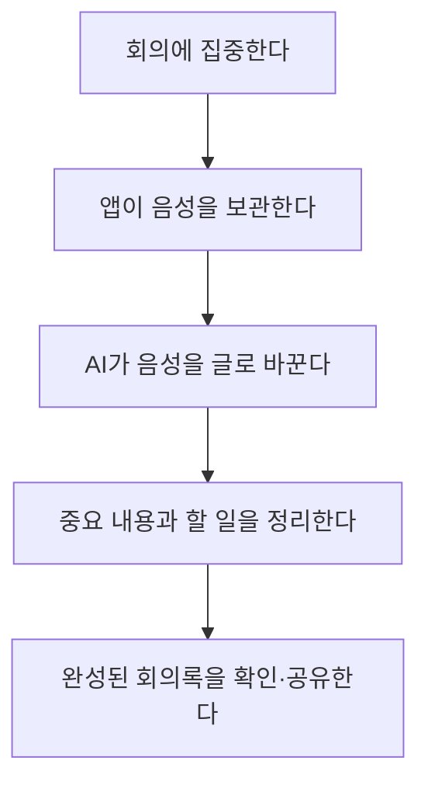
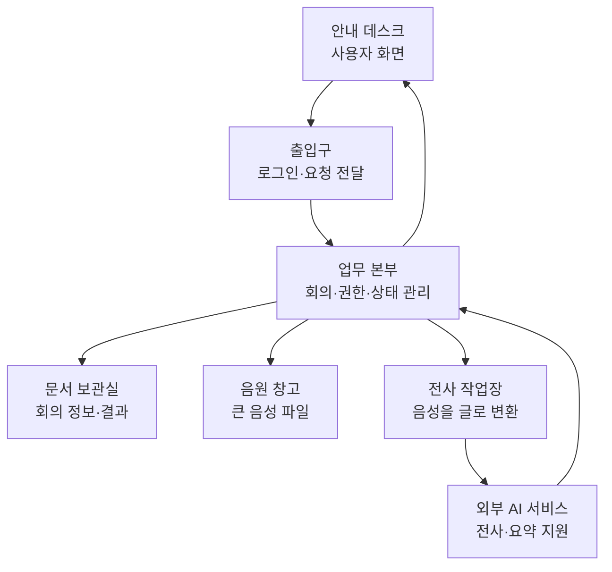

# 전체 구조 설명서 — 이 앱은 무엇이고 어떻게 구성되는가

## 먼저 한 문장으로

Meeting Whisper는 **회의 음성을 받아 글로 바꾸고, 중요한 내용과 할 일을 정리하여 회의록으로 보여 주는 사내 업무 앱**이다.

사용자에게는 하나의 웹사이트처럼 보이지만, 실제로는 서로 다른 일을 맡은 여러 영역이 협력한다.

## 이 앱이 해결하려는 문제

회의가 끝나면 보통 다음 문제가 생긴다.

- 누가 무슨 말을 했는지 기억이 흐려진다.
- 메모하느라 대화에 집중하지 못한다.
- 긴 녹음을 다시 들을 시간이 없다.
- 결정 사항과 할 일이 여러 사람의 기억 속에 흩어진다.
- 회의록을 작성하고 공유하는 데 시간이 오래 걸린다.

Meeting Whisper는 이 과정을 다음처럼 바꾸려 한다.

## 한 건물로 비유한 전체 구조

앱 전체를 하나의 회사 건물로 생각하면 이해하기 쉽다.

### 1. 안내 데스크 — 사용자 화면

사용자가 직접 보는 웹 화면이다.

- 새 회의를 만든다.
- 브라우저에서 녹음하거나 음성 파일을 선택한다.
- 처리 중인 상태를 확인한다.
- 완성된 요약과 전체 발언을 읽는다.
- 회의를 검색하고 공유 범위를 관리한다.

이 영역은 저장이나 AI 처리를 직접 하지 않는다. 사용자의 요청을 업무 본부에 전달하고 결과를 보기 좋게 표현한다.

### 2. 출입구 — 로그인과 요청 전달

건물에 아무나 들어오지 못하게 확인하는 출입구다.

- 로그인하지 않은 사용자의 접근을 막는다.
- 로그인한 사용자의 신원 정보를 다음 영역으로 전달한다.
- 화면에서 보낸 요청을 올바른 업무 본부로 넘긴다.

이 출입구를 프로젝트에서는 **Approuter**라고 부른다. 이름을 외울 필요는 없고 “로그인과 길 안내를 담당하는 앞문”으로 이해하면 된다.

### 3. 업무 본부 — 회의 관리 백엔드

앱의 가장 중요한 판단을 내리는 곳이다.

- 회의를 만든 사람이 누구인지 기록한다.
- 누가 회의를 읽고 수정할 수 있는지 검사한다.
- 음원 저장, 전사 시작, 요약 시작 순서를 관리한다.
- 현재 작업이 대기 중인지, 전사 중인지, 완료됐는지 기록한다.
- Worker가 보낸 전사 결과를 검사하고 저장한다.
- 실패한 작업을 재시도하거나 오래 멈춘 작업을 정리한다.

이 영역은 SAP의 **CAP**이라는 개발 방식으로 만들어졌다. CAP는 “업무 데이터와 업무 규칙을 정리하기 위한 SAP의 백엔드 틀”이다.

### 4. 문서 보관실 — 데이터베이스

회의와 관련된 중요한 정보를 오래 보관한다.

- 회의 제목, 참여자, 만든 사람
- 현재 처리 상태와 진행률
- 전사된 문장과 시간 정보
- AI가 만든 요약
- 검토가 필요한 항목
- AI 사용량과 작업 실패 기록

실제 운영 환경에서는 SAP HANA라는 데이터베이스를 사용한다.

### 5. 음원 창고 — Object Store

음성 파일은 일반 회의 정보보다 훨씬 크다. 큰 음원을 데이터베이스에 계속 넣으면 저장과 전송 부담이 커진다.

그래서 음원은 큰 파일 보관에 적합한 별도 저장소에 둔다. 이 저장소를 **Object Store**라고 한다.

- 데이터베이스에는 음원의 위치와 크기 같은 정보만 기록한다.
- Worker는 제한된 시간 동안 사용할 수 있는 주소로 음원을 받는다.
- 처리가 끝나거나 보관 기간이 지나면 음원을 삭제할 수 있다.

### 6. 전사 작업장 — Worker

음성을 글로 바꾸는 일은 몇 초 안에 끝나지 않을 수 있다. 이 일을 업무 본부가 직접 붙잡고 있으면 다른 사용자의 요청까지 느려진다.

그래서 오래 걸리는 작업을 맡는 별도 프로그램을 둔다. 이 프로그램을 **Worker**라고 한다.

- 해야 할 회의인지 먼저 업무 본부에 확인한다.
- 음원 창고에서 파일을 내려받는다.
- 긴 음성을 처리 가능한 크기로 나눈다.
- AI에 전사를 요청한다.
- 진행 중이라는 신호를 계속 보낸다.
- 결과 또는 실패 이유를 업무 본부에 돌려준다.

### 7. 외부 AI 서비스

프로그램이 음성 인식과 요약 모델을 직접 운영하는 대신 SAP AI Core를 통해 AI 모델을 사용한다.

- Worker는 음성을 글로 바꾸는 데 AI를 사용한다.
- 업무 본부는 전사된 글을 요약하고 검토하는 데 AI를 사용한다.

AI는 최종 결정을 내리는 본부가 아니다. 결과를 만들어 주는 외부 전문가에 가깝고, 저장 전 검사는 Meeting Whisper가 담당한다.

## 왜 이렇게 여러 영역으로 나눴는가

| 이유  | 설명                                       |
| --- | ---------------------------------------- |
| 안전  | 로그인, 사용자 권한, Worker 권한을 서로 다르게 관리할 수 있다. |
| 안정성 | 전사가 오래 걸려도 일반 화면과 회의 조회는 계속 동작한다.        |
| 확장성 | 사용량이 늘면 전사 작업장만 별도로 늘릴 수 있다.             |
| 비용  | 큰 음원과 작은 업무 정보를 알맞은 저장소에 나눠 둔다.          |
| 복구  | 어느 단계에서 실패했는지 기록하고 해당 단계부터 다시 시도할 수 있다.  |

## 현재 구조를 이해할 때 가장 중요한 사실

1. 화면이 직접 AI를 호출하지 않는다.
2. 사용자의 모든 중요한 요청은 회의 관리 본부를 거친다.
3. 음원, 회의 정보, 전사 결과는 서로 다른 목적에 맞게 보관한다.
4. 전사와 요약은 하나의 긴 작업이 아니라 분리된 단계다.
5. Worker는 사람용 화면이 아니라 내부 작업 전용 프로그램이다.

## 다음 문서

[[분석 내용/01. 녹음부터 회의록까지|녹음부터 회의록까지]]에서 실제 사용자 행동을 따라가며 각 영역이 언제 움직이는지 설명한다.
