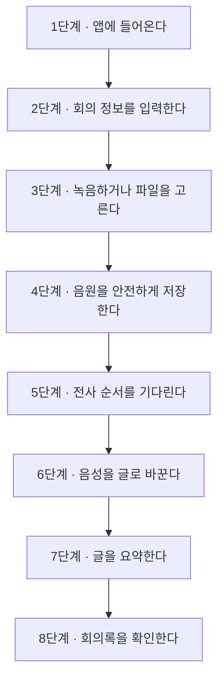
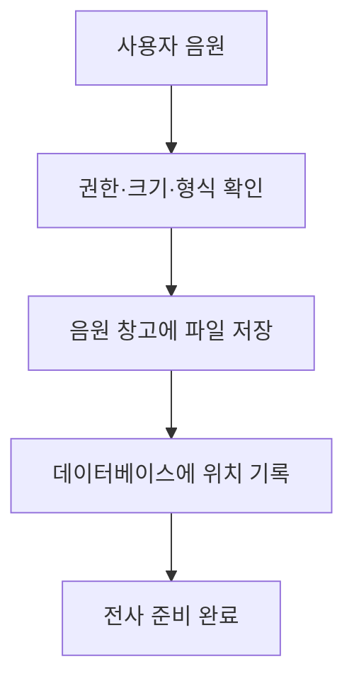
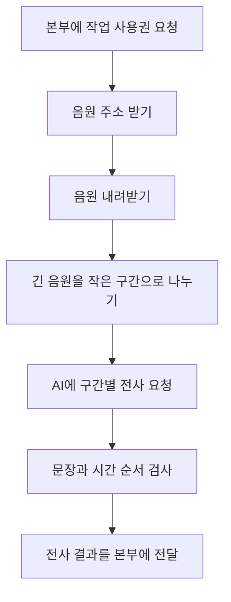

# 녹음부터 회의록까지 — 실제로 무슨 일이 일어나는가

이 문서는 사용자가 앱을 여는 순간부터 회의록을 확인하기까지를 한 편의 과정으로 설명한다.

## 전체 여정

## 1단계 — 앱에 들어온다

사용자가 웹 주소에 접속하면 가장 먼저 출입구가 로그인 여부를 확인한다.

로그인이 완료되면 화면은 회의 관리 본부에 “이 사용자가 볼 수 있는 회의 목록을 달라”고 요청한다. 본부는 모든 회의를 주지 않고 다음 기준으로 걸러서 보낸다.

- 사용자가 직접 만든 회의
- 참여자 또는 편집자로 지정된 회의
- 공유 대상으로 지정된 회의
- 관리자가 전체 접근 권한을 가진 경우 허용되는 회의

즉, 화면에서 회의를 숨기는 것만으로 보안을 지키는 것이 아니라 데이터가 나오기 전에 본부가 권한을 확인한다.

## 2단계 — 새 회의 정보를 입력한다

사용자는 제목, 참여자, 회의 종류 같은 정보를 입력한다.

이 정보는 단순 장식이 아니다.

- 제목은 목록과 검색에 사용된다.
- 참여자는 누가 회의를 볼 수 있는지 판단하는 근거가 된다.
- 회의 종류는 AI가 어떤 관점으로 요약할지 정하는 힌트가 된다.

본부는 회의를 만든 사람을 소유자로 기록하고 최초 상태를 만든다.

## 3단계 — 녹음하거나 파일을 고른다

### 브라우저 녹음

브라우저가 제공하는 녹음 기능을 사용한다. 코드에서는 MediaRecorder라는 이름을 사용하지만, 사용자는 “웹페이지가 마이크 소리를 작은 조각으로 계속 받아 둔다”고 이해하면 충분하다.

녹음이 길어지는 동안 브라우저가 닫히거나 새로고침될 수 있다. 이를 대비해 녹음 조각을 사용자 PC의 브라우저 저장 공간에 임시 보관한다.

### 기존 음성 파일

이미 녹음된 파일을 선택할 수도 있다. 화면은 파일 종류와 크기를 확인하고 업로드를 시작한다.

## 4단계 — 음원을 안전하게 저장한다

회의 관리 본부는 다음을 확인한다.

- 이 회의를 수정할 권한이 있는가?
- 파일이 허용된 크기 안에 있는가?
- 파일 종류가 올바른가?
- 이미 처리 중인 회의와 충돌하지 않는가?

확인이 끝나면 큰 음성 파일은 Object Store라는 음원 창고에 저장하고, 데이터베이스에는 저장 위치와 크기, 만료 시간만 기록한다.

## 5단계 — 전사 순서를 기다린다

여러 사람이 동시에 긴 음원을 올리면 Worker가 한꺼번에 모두 처리할 수 없다.

본부는 전사 요청을 대기표에 기록한다. 이를 **작업 큐**라고 한다. 음식점 대기 명단처럼 먼저 준비된 작업부터 처리하되, 동시에 처리할 수 있는 수를 제한한다.

화면에는 단순히 “로딩 중”만 표시하지 않고 다음과 같은 정보를 보여 줄 수 있다.

- 대기 중
- 앞에 몇 개 작업이 있는지
- Worker에 전달 중
- 전사 중
- 요약 중
- 완료 또는 실패

## 6단계 — 음성을 글로 바꾼다

Worker가 차례를 받으면 다음 순서로 움직인다.

Worker는 처리 중 일정한 간격으로 “아직 살아 있고 이 작업을 처리 중”이라는 신호를 보낸다. 이를 heartbeat, 즉 **생존 신호**라고 한다.

생존 신호가 오랫동안 없으면 본부는 Worker가 중단됐다고 판단해 무한히 기다리지 않도록 작업을 복구하거나 실패 처리한다.

## 7단계 — 전사 내용을 요약한다

전사 결과가 저장되면 Worker의 주된 임무는 끝난다. 요약은 회의 관리 본부가 별도 작업으로 진행한다.

긴 회의는 한 번에 전부 AI에 넣지 않는다.

1. 전사 내용을 적당한 크기로 나눈다.
2. 각 부분의 핵심 내용을 먼저 정리한다.
3. 부분 정리들을 다시 묶어 최종 회의록을 만든다.
4. 결과가 약속된 형식인지 검사한다.

이렇게 전사와 요약을 분리하면 전사는 성공했는데 요약만 실패한 경우 요약 단계만 다시 시도할 수 있다.

## 8단계 — 사용자가 회의록을 확인한다

화면은 처리 중 일정한 간격으로 본부에 현재 상태를 묻는다. 이것은 직원이 작업실에 계속 들어가는 것이 아니라 전광판의 상태를 주기적으로 확인하는 것과 같다.

완료되면 다음 정보를 보여 준다.

- 회의 제목과 참여자
- 핵심 요약
- 결정 사항과 할 일
- 시간 순서가 있는 전체 발언
- 검토가 필요한 표현
- 복사하거나 내려받을 수 있는 회의록

## 실패하면 어떻게 되는가

| 실패 위치 | 앱의 대응 |
|---|---|
| 업로드 실패 | 파일과 권한을 확인해 사용자에게 즉시 알린다. |
| Worker가 바쁨 | 대기표에 남겨 두고 잠시 뒤 다시 전달한다. |
| 일시적 통신 오류 | 횟수를 기록하고 간격을 두어 재시도한다. |
| Worker 중단 | 생존 신호를 확인해 오래 멈춘 작업을 복구한다. |
| 잘못된 전사 결과 | 시간 순서와 문장 구조를 검사해 저장을 막는다. |
| 요약 실패 | 전사는 보존하고 요약만 다시 실행할 수 있게 한다. |

## 사용자가 꼭 알아야 할 현재 한계

- 현재 중심 구조는 실시간 자막보다 녹음 완료 후 처리에 가깝다.
- 음원은 영구 보관 자료가 아니라 처리용 임시 데이터로 설계됐다.
- AI 결과는 언제나 완벽하다고 가정하지 않으며 검증 과정이 필요하다.
- 경쟁 제품 수준의 음원 재생 검수, 캘린더 연결, AI 질문 기능은 별도 개선 과제다.

## 영역별로 더 읽기

- 화면이 궁금하면 [[분석 내용/1. app — 사용자 화면/00. 사용자 화면 전체 이해|사용자 화면 전체 이해]]
- 데이터와 권한, 전사·요약 조정 방식이 궁금하면 [[분석 내용/3. cap — 데이터와 백엔드/00. CAP 백엔드 전체 이해|CAP 백엔드 전체 이해]]
- 음성이 글이 되는 과정이 궁금하면 [[분석 내용/4. workers — STT 처리/00. STT 처리 전체 이해|STT 처리 전체 이해]]
- 실제 운영이 궁금하면 [[분석 내용/5. deploy — 배포와 운영/00. 배포와 운영 전체 이해|배포와 운영 전체 이해]]
