# Meeting Whisper 경쟁 제품 비교 및 제품·UI 개선 제안

> 작성일: 2026-07-24  
> 비교 대상: 네이버웍스 클로바노트, 다글로, 티로, Notion AI 노트  
> 기준 코드: `C:\Users\염정운\project\meeting-whisper`  
> 문서 성격: **계획·건의 단계의 제품 검토 자료**. 구현 범위나 일정이 확정된 개발 계획이 아니다.

---

## 1. 결론 요약

Meeting Whisper는 단순 데모 수준을 넘어 다음과 같은 **운영 기반**을 이미 갖추고 있다.

- XSUAA 역할과 회의 소유권에 기반한 접근 통제
- HANA 메타데이터와 Object Store 음원 분리
- DB 기반 전사 dispatch queue
- Worker claim, heartbeat, timeout, retry, stale 작업 복구
- SAP AI Core 기반 STT와 요약
- 전사 JSON 검증과 AI 사용량 기록
- 회의 목록, 검색·필터, 녹음·파일 업로드, 진행 상태, 전사·요약 확인

반면 경쟁 제품과 비교하면 사용자가 직접 체감하는 제품 완성도는 아직 **“전사 파이프라인” 중심**이다. 경쟁 제품은 이미 다음 단계인 **회의 전 준비 → 회의 중 보조 → 회의 후 검수 → 업무 실행 → 조직 지식화**까지 확장하고 있다.

현재 가장 큰 격차는 아래 7가지다.

1. 음원 재생과 전사 문장의 시간 동기화가 약하다.
2. 실시간 전사·번역·시스템 오디오 수집이 없다.
3. 회의 유형별 템플릿과 사용자 정의 출력 양식이 부족하다.
4. 회의 내용에 질문하는 AI와 여러 회의를 아우르는 지식 검색이 없다.
5. 액션 아이템을 실제 담당자·마감일·업무 상태로 연결하지 못한다.
6. 캘린더, 화상회의, 메신저, 프로젝트 도구 연동이 없다.
7. 관리자용 통계·감사·보존 정책 UI가 없다.

### 제품 성숙도 관점에서 본 현재 위치

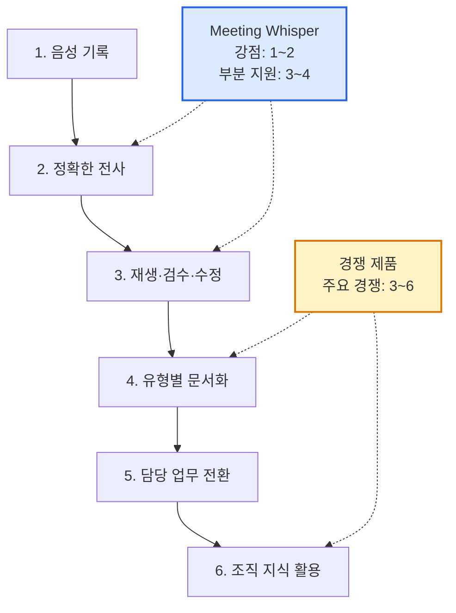

가장 먼저 필요한 것은 화려한 생성형 AI 기능이 아니라 **결과를 신뢰하고 고칠 수 있는 검수 경험**이다. 따라서 추천 순서는 다음과 같다.

```text
1단계: 음원 플레이어 + 문장 동기화 + 전사/화자 교정
2단계: 회의 유형 템플릿 + 결정/액션 아이템 업무화
3단계: 캘린더/Teams 연동 + 공유·댓글
4단계: Ask Meeting + 회의 지식 검색
5단계: 다국어·실시간 처리 + 관리자 거버넌스
```

---

## 2. 조사 범위와 판단 기준

이번 비교는 각 제품의 공식 제품 소개, 공식 도움말, 공식 업데이트·가이드, 공식 요금제 페이지를 기준으로 했다. 마케팅 문구만 있는 기능은 실제 세부 동작이 확인된 기능과 구분해 해석했다.

### 주요 공식 자료

- [네이버웍스 클로바노트 제품 소개](https://naver.worksmobile.com/products/clovanote/)
- [네이버웍스 클로바노트 요금 및 기능 비교](https://naver.worksmobile.com/pricing/clovanote/)
- [네이버웍스 클로바노트 화자 자동 식별](https://naver.worksmobile.com/blog/clovanote-speaker-identification/)
- [다글로 워크스페이스·팀 제품 소개](https://daglo.ai/team-plan)
- [다글로 2026 공식 가이드](https://daglo.ai/blog/2026%EB%85%84-%EB%8B%A4%EA%B8%80%EB%A1%9C-%EC%99%84%EB%B2%BD-%EA%B0%80%EC%9D%B4%EB%93%9C--119502)
- [다글로 2025 기능 업데이트 총결산](https://daglo.ai/blog/daglo-update-summary)
- [티로 공식 제품·요금 소개](https://tiro.ooo/)
- [티로 2025 핵심 기능 가이드](https://tiro.ooo/ko/blog/95235)
- [티로 문단별 재생·PDF/Word·일괄 수정 업데이트](https://tiro.ooo/ko/blog/tiro-update-features)
- [Notion AI 노트 제품 소개](https://www.notion.com/ko/product/ai-meeting-notes)
- [Notion AI 노트 공식 도움말](https://www.notion.com/ko/help/ai-meeting-notes)
- [Notion 요금제](https://www.notion.com/ko/pricing)

### 비교 축

| 축 | 확인 내용 |
|---|---|
| 입력 | 실시간 녹음, 파일, 시스템 오디오, 화상회의, 모바일 |
| 전사 | 정확도 보조, 언어, 화자, 실시간성, 전문용어 |
| 검수 | 음원 재생, timestamp 이동, 편집, 찾기·바꾸기 |
| 요약 | 템플릿, 사용자 정의 양식, 결정·액션 추출 |
| 활용 | AI 질의, 검색, 번역, 문서·PPT 등 2차 산출물 |
| 협업 | 공유, 권한, 댓글, 동료·주소록, 자동 배포 |
| 연동 | 캘린더, 화상회의, 메신저, 프로젝트·CRM |
| 관리 | 통계, 감사, 보존 정책, SSO, API |
| UI | 시작 동선, 진행 상태, 결과 화면, 모바일 접근성 |

---

## 3. 현재 Meeting Whisper의 제품 기준선

### 3.1 현재 사용자 여정

```text
목록
→ 새 회의 작성
→ 카테고리·제목·참여자 입력
→ 브라우저 녹음 또는 파일 선택
→ 업로드
→ queue/전사/요약 진행 상태 확인
→ 요약 또는 전사 확인
→ Markdown 복사·다운로드
```

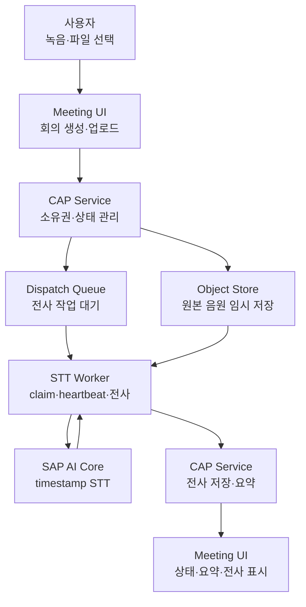

### 3.2 현재 강점

#### 안정적인 비동기 처리

긴 전사를 하나의 HTTP 요청에 묶지 않는다. Dispatch 행, Worker claim, heartbeat, retry와 stale cleanup이 분리되어 있어 장시간 작업을 운영하기 좋은 구조다.

#### BTP 친화적인 보안 구조

Approuter와 XSUAA, `MeetingUser`·`Worker`·`MeetingAdmin` 역할, owner 기반 접근 제한이 이미 있다. 단순 개인용 SaaS보다 사내 업무 시스템으로 확장하기 좋은 기반이다.

#### 대용량 음원 처리 방향

원본 음원을 HANA BLOB에 계속 보관하지 않고 Object Store와 signed URL을 사용한다. 음원 만료·삭제를 분리할 수 있어 비용과 개인정보 측면에서 유리하다.

#### 상태 가시성

UI가 단순 spinner만 보여 주는 것이 아니라 queue 대기, dispatch, worker heartbeat, 전사 진행률, 요약 단계와 실패 원인을 표현할 수 있다.

#### 구조화된 결과와 검증

전사는 segment와 timestamp 구조를 가지며, 요약은 구조화된 note로 관리된다. 비정상 JSON, 역전된 timestamp 같은 결과를 저장 전에 막는 방어 로직도 있다.

### 3.3 현재 제품적 한계

기술적으로는 전사 파이프라인이 견고하지만, 사용자는 결과를 **듣고 확인하고 수정하고 업무로 넘기는 과정**에서 경쟁 제품보다 더 많은 수작업을 해야 한다.

---

## 4. 제품별 비교

## 4.1 네이버웍스 클로바노트

### 핵심 방향

클로바노트는 “누구나 쉽게 쓰는 회의 기록”과 “기업 관리자가 통제할 수 있는 음성 자산”을 동시에 강조한다.

공식 기능 기준으로 다음을 제공한다.

- PC 웹·모바일 실시간 녹음과 파일 업로드
- 주요 주제, 다음 할 일, 요약, 제목 자동 생성
- 주요 키워드
- 메모, 북마크, 하이라이트
- 검색과 단어 치환
- 공유 링크
- 재생 속도 조정
- 한국어·영어·일본어·중국어와 일부 혼합 언어
- 기업·개인 어휘사전
- 상위 플랜 화자 자동 식별
- 공유·접근·다운로드 권한 제어
- 접속·디바이스 제한, 통계, 감사, 자동 삭제 정책
- 상위 플랜 외부 시스템 연동 API

### 공식 화면에서 확인되는 UI

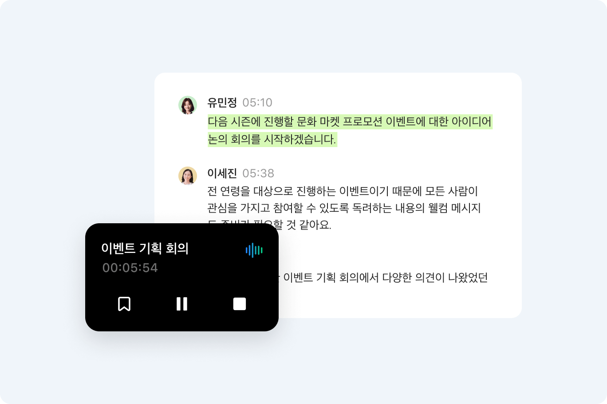

> 그림 1. 음성 재생 컨트롤과 현재 재생 중인 발언 강조가 전사 화면 안에 결합되어 있다.  
> 출처: [네이버웍스 클로바노트 공식 제품 소개](https://naver.worksmobile.com/products/clovanote/) · 확인일 2026-07-24

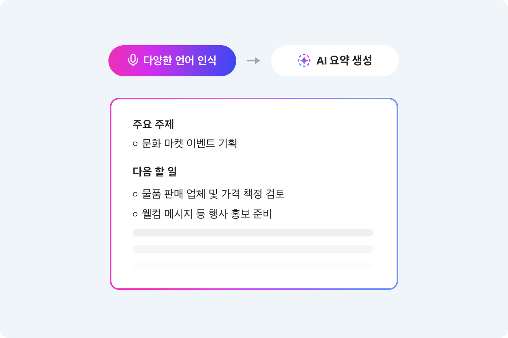

> 그림 2. 전사 원문과 별개로 핵심 내용·다음 할 일처럼 사용자가 바로 소비할 수 있는 결과 구조를 제공한다.  
> 출처: [네이버웍스 클로바노트 공식 제품 소개](https://naver.worksmobile.com/products/clovanote/) · 확인일 2026-07-24

### UI에서 배울 점

1. **회의 중 즉시 표시할 수 있는 도구**
   - 메모·북마크·하이라이트가 회의 후 AI 결과와 별개로 존재한다.
   - 사용자가 “이 순간은 중요하다”는 신호를 회의 중 남길 수 있다.

2. **음성과 텍스트를 하나의 기록으로 취급**
   - 텍스트만 공유하지 않고 음성을 재생하며 맥락을 확인할 수 있다.
   - 재생 속도와 검색·치환이 검수 비용을 줄인다.

3. **익숙한 정보 구조**
   - 전체 노트, 공유 받은 노트, 공유한 노트, 휴지통처럼 사용자의 소유·공유 상태를 사이드바에서 분리한다.

4. **기업 관리 기능을 별도 제품 경험으로 제공**
   - 관리자 정책, 통계, 감사가 백엔드 설정에만 머무르지 않는다.

### Meeting Whisper가 부족한 점

- 음원 재생, 재생 속도, segment 클릭 이동이 없다.
- 북마크·하이라이트·회의 중 메모가 없다.
- 단어 일괄 치환과 어휘사전이 없다.
- 다국어와 화자 자동 식별이 운영 기본 기능이 아니다.
- 공유 상태를 한눈에 보는 전용 화면이 부족하다.
- 관리자 정책·통계·감사 UI가 없다.
- transcript/summary 보존 기간을 조직 정책으로 설정할 수 없다.

### 추천 반영

- 가장 먼저 `오디오 플레이어 + timestamp 동기화 + 찾기/바꾸기`를 도입한다.
- 회의 중 `북마크` 버튼과 간단한 메모를 추가한다.
- 개인·조직 공용 `전문용어 사전`을 만든다.
- 목록에 `내 회의 / 공유받음 / 공유함 / 처리 중 / 실패` 저장 보기를 제공한다.

---

## 4.2 다글로

### 핵심 방향

다글로는 회의록 단일 제품보다 **멀티모달 AI 워크스페이스**를 지향한다. 녹음·파일·유튜브를 받아쓰기 한 뒤, AI 채팅·번역·템플릿·문서·슬라이드·RAG로 확장한다.

공식 자료에서 확인되는 주요 기능:

- 실시간 녹음, 파일 업로드, 유튜브 링크
- 화자 분리
- 요약과 핵심 키워드
- 일반·이사회·주간회의 등 템플릿
- 결정 사항과 액션 아이템의 담당자·기한 구조화
- 약 20종의 용도별 템플릿
- 회의록을 기반으로 하는 AI 채팅
- 여러 보드·자료를 묶는 RAG 검색
- PDF 분석, 문서 번역, 유튜브 요약
- AI 슬라이드와 퀴즈 같은 2차 산출물
- 조직용 데이터 암호화, 권한, 추적, 보관·파기 정책

### 공식 화면에서 확인되는 UI

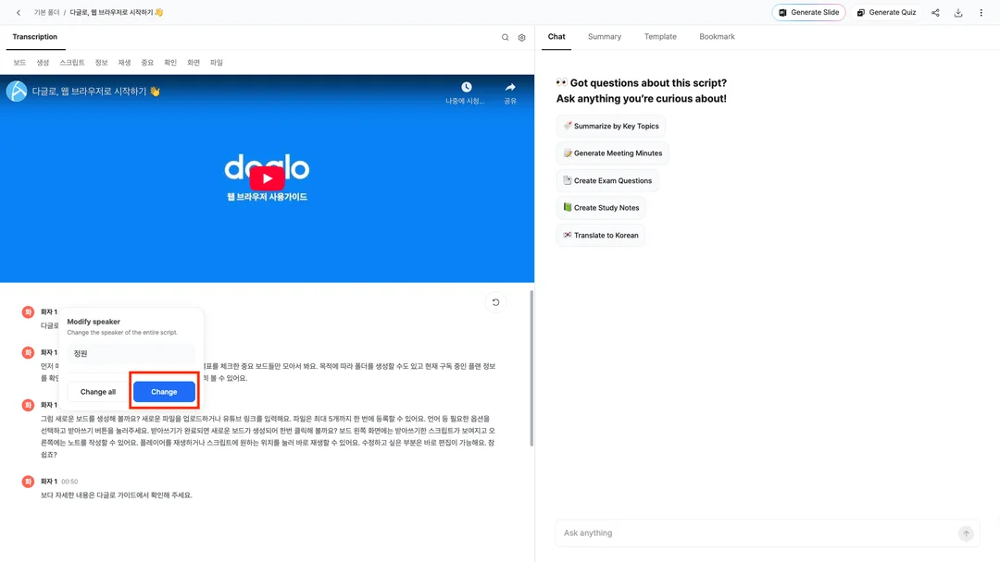

> 그림 3. 왼쪽에서 전사와 화자를 검수하면서 오른쪽에서 Chat·Summary·Template·Bookmark를 전환한다. 전사 결과를 별도 페이지로 끝내지 않고 후속 AI 작업의 맥락으로 사용한다.  
> 출처: [다글로 공식 회의록 활용 가이드](https://daglo.ai/blog/meeting-summary-escape) · 확인일 2026-07-24

### UI에서 배울 점

1. **입력 형식이 아니라 결과 목적에서 시작**
   - 사용자는 “오디오를 올린다”보다 “주간회의록을 만든다”, “이사회 기록을 만든다”를 선택한다.

2. **회의록을 후속 AI 작업의 원본으로 사용**
   - 요약이 끝이 아니라 질문, 보고서, 슬라이드, 번역으로 이어진다.

3. **템플릿을 주요 탐색 요소로 사용**
   - 사용자가 프롬프트를 몰라도 정해진 업무 결과물을 얻는다.

4. **여러 기록을 묶어 검색**
   - 한 회의 상세뿐 아니라 팀에 쌓인 자료 전체를 지식 기반으로 취급한다.

### Meeting Whisper가 부족한 점

- 현재 category는 요약 prompt 힌트에 가깝고 사용자가 결과 구조를 직접 고르는 템플릿 시스템이 아니다.
- 회의 내용에 후속 질문을 할 수 없다.
- 여러 회의를 묶어 검색·질문하는 기능이 없다.
- 유튜브·PDF·문서 같은 관련 맥락 자료를 함께 처리하지 못한다.
- 액션 아이템이 실제 담당자·기한·상태가 있는 업무 객체로 연결되지 않는다.
- 회의록에서 보고서·이메일·PPT 초안으로 이어지는 후속 작업이 없다.

### 추천 반영

- `회의 유형`을 단순 카테고리가 아니라 출력 schema와 prompt를 가진 템플릿으로 승격한다.
- 우선 템플릿은 4개만 제공한다.
  - 일반 회의
  - 주간 업무회의
  - 고객/요구사항 인터뷰
  - 의사결정 회의
- 회의 상세에 `이 회의에 질문하기` 패널을 추가한다.
- 1차적으로는 해당 회의 transcript·summary만 사용하고, 이후 여러 회의 RAG로 확장한다.
- 액션 아이템을 별도 entity로 만들 가능성을 검토한다.

---

## 4.3 티로

### 핵심 방향

티로는 **실시간 대화 보조와 맞춤형 문서 자동화**에 강하다. 특히 언어 장벽, 다양한 기기, 회사 양식, 외부 도구 자동 전달을 제품 전면에 둔다.

공식 자료에서 확인되는 주요 기능:

- 고품질 실시간 기록과 요약
- 15개 이상 언어의 실시간 번역·다국어 기록
- 데스크톱 시스템 사운드 녹음
- 모바일과 Apple Watch 녹음
- 화자 분리
- 문단별 음성 다시 듣기
- PDF·Word 내보내기
- 단어 일괄 수정
- 요약 맥락 파일 업로드
- 나만의 템플릿
- Ask Tiro
- 폴더와 공유
- 캘린더·워크스페이스·메신저·CRM·ATS 연동
- Automation
- 팀 공용 템플릿과 공용 단어장
- 팀 관리와 사용량 대시보드

### 공식 화면에서 확인되는 UI

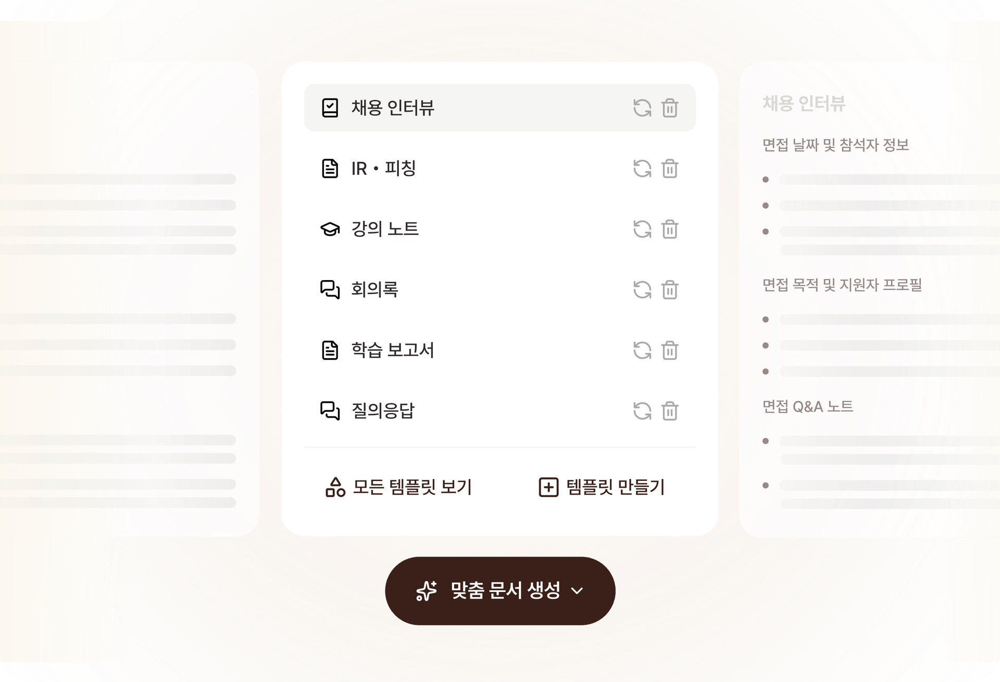

> 그림 4. 채용 인터뷰, IR·피칭, 강의 노트, 회의록처럼 사용 목적을 먼저 고르고, 사용자가 직접 템플릿을 만드는 동선을 함께 제공한다.  
> 출처: [티로 공식 제품 소개](https://tiro.ooo/) · 확인일 2026-07-24

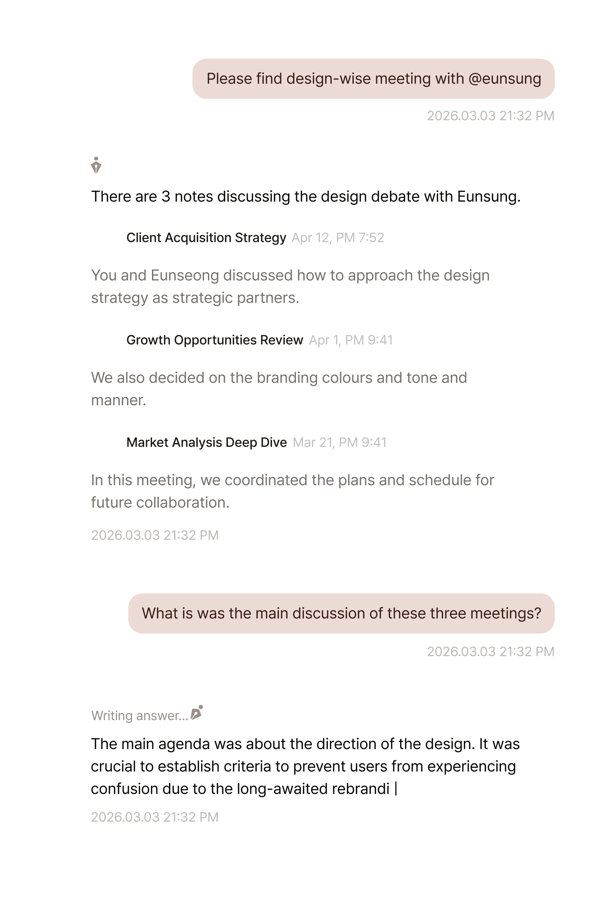

> 그림 5. 회의록을 읽는 화면과 질문하는 화면을 연결해 사용자가 긴 전사를 직접 다시 훑지 않도록 한다.  
> 출처: [티로 공식 제품 소개](https://tiro.ooo/) · 확인일 2026-07-24

### UI에서 배울 점

1. **회의가 시작되는 장소를 넓게 본다**
   - 브라우저뿐 아니라 데스크톱, 모바일, 시계까지 기록 시작점을 확장한다.

2. **실시간 가치**
   - 회의가 끝난 뒤 결과를 기다리는 도구가 아니라, 회의 중 번역·기록을 확인하는 보조 도구다.

3. **맞춤 문서의 진입 장벽이 낮다**
   - 회사 양식을 코드나 프롬프트 설정이 아니라 사용자 기능으로 제공한다.

4. **자동 전달**
   - 결과를 앱 안에 가두지 않고 기존 업무 시스템으로 보낸다.

### Meeting Whisper가 부족한 점

- Worker 완료 후 전사를 확인하는 방식이라 실시간 기록·번역이 없다.
- 웹 마이크 외 시스템 오디오 수집 경로가 없다.
- 모바일 앱·데스크톱 앱·백그라운드 녹음이 없다.
- 사용자 정의 템플릿, 맥락 파일, Ask 기능이 없다.
- PDF·Word export가 없다.
- 팀 공용 템플릿·단어장·자동 공유가 없다.
- 외부 업무 도구 자동 전달이 없다.

### 추천 반영

- 단기적으로 네이티브 앱보다 `PWA 설치 경험`, 녹음 중 이탈 방지, 네트워크 복구 UX를 먼저 개선한다.
- 온라인 회의 대응은 데스크톱 캡처 앱 전체 개발 전에 Teams/Zoom 녹화 파일 import 또는 캘린더 첨부 방식부터 검토한다.
- 실시간 전사는 별도 streaming architecture가 필요하므로 현재 batch Worker 개선과 분리된 연구 과제로 둔다.
- PDF·DOCX export와 팀 공유 템플릿은 비교적 작은 범위로 체감 효과가 크다.

---

## 4.4 Notion AI 노트

### 핵심 방향

Notion은 전사 정확도 자체보다 **회의를 기존 문서·프로젝트·업무 데이터베이스 안에 넣는 것**을 차별점으로 삼는다.

공식 자료에서 확인되는 주요 기능:

- 시스템 오디오와 마이크 동시 수집
- Zoom, Google Meet, Microsoft Teams 등에서 봇 없이 기록
- Notion Calendar 연동
- 예정된 회의에서 사전 회의록·안건 준비
- 회의 종류에 맞춘 요약
- 회의 전 사용자가 적은 메모를 요약 맥락에 반영
- 회의 목록 통합 보기, 필터·정렬·검색·그룹화
- 액션 아이템 담당자·우선순위·마감일 설정 지원
- 프로젝트 상태·일정 자동 갱신
- 과거 회의 질문과 워크스페이스 검색
- 참석자 동의 안내
- 워크스페이스 가용성, transcript 보존 기간, 로컬 음원 저장 정책
- SSO, 감사 로그, 세분화된 권한

### 공식 화면에서 확인되는 UI

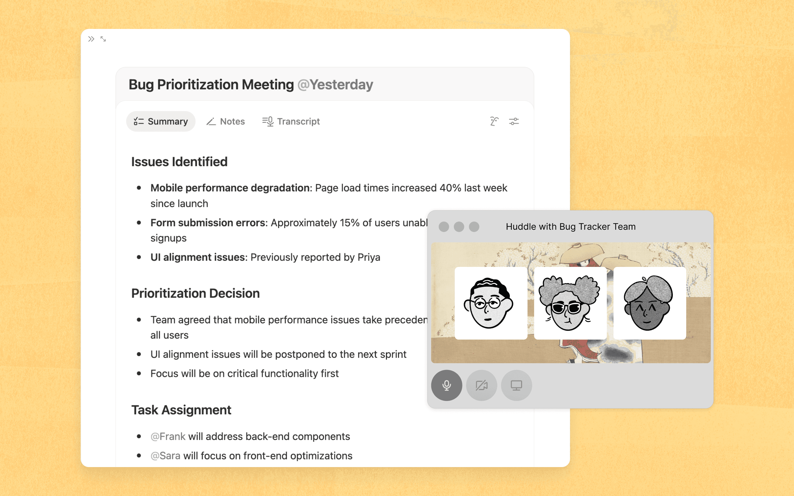

> 그림 6. Summary·Notes·Transcript가 한 페이지에 있고, 이슈·결정·업무 할당을 기존 Notion 문서 흐름 안에서 이어 간다.  
> 출처: [Notion AI 노트 공식 제품 소개](https://www.notion.com/ko/product/ai-meeting-notes) · 확인일 2026-07-24

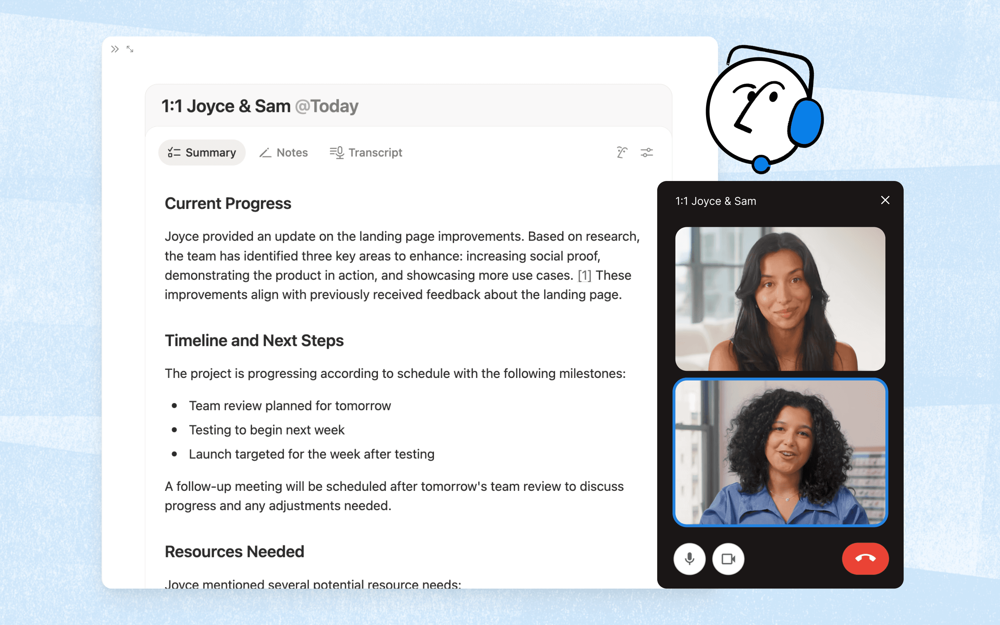

> 그림 7. 같은 전사 기능이라도 회의 유형에 따라 결과 문서의 정보 구조가 달라질 수 있음을 보여 준다.  
> 출처: [Notion AI 노트 공식 제품 소개](https://www.notion.com/ko/product/ai-meeting-notes) · 확인일 2026-07-24

### UI에서 배울 점

1. **회의 전·중·후가 한 페이지**
   - 회의 전에 안건과 메모를 작성하고, 회의 중 전사하며, 종료 후 같은 페이지에 요약과 액션을 생성한다.

2. **캘린더가 시작 화면**
   - “새 회의 만들기”를 반복 입력하지 않고 예정된 이벤트에서 회의 노트를 미리 생성한다.

3. **결과가 바로 업무 데이터**
   - 액션 아이템이 텍스트 목록에서 끝나지 않고 task와 project로 이어진다.

4. **동의를 UX에 포함**
   - 녹음 동의를 약관 문구가 아니라 시작 흐름의 명확한 단계로 다룬다.

### Meeting Whisper가 부족한 점

- 예정된 회의와 사전 안건 개념이 없다.
- 캘린더 참가자·제목·시간을 자동으로 가져오지 않는다.
- 회의 전 메모를 요약 맥락으로 사용하지 않는다.
- 액션 아이템을 실제 업무에 할당하지 못한다.
- 조직 전체 회의 검색과 질문이 없다.
- 녹음 동의를 수집·표시하는 명확한 UI가 없다.
- transcript 보존 정책과 로컬 음원 정책을 관리자가 설정할 수 없다.

### 추천 반영

- `예정된 회의`와 `최근 회의`를 홈 화면에서 구분한다.
- Microsoft 365 또는 Google Calendar 중 조직 환경에 맞는 하나를 먼저 연동한다.
- 회의 생성 화면에 `안건/사전 메모`를 추가하고 요약 prompt에 포함한다.
- 액션 아이템을 담당자·기한·완료 여부가 있는 목록으로 보여 준다.
- 녹음 시작 전에 `참석자 동의 확인` 체크와 안내 문구를 넣는다.

---

## 5. 전체 기능 매트릭스

표의 `△`는 부분 지원 또는 기반은 있으나 사용자 기능이 충분하지 않음을 의미한다.

### 제품별 강점 지도

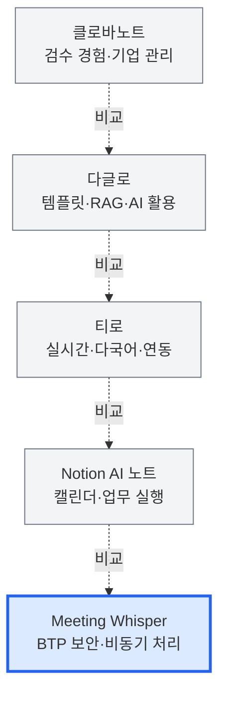

| 기능 | Meeting Whisper | 클로바노트 | 다글로 | 티로 | Notion |
|---|:---:|:---:|:---:|:---:|:---:|
| 브라우저 녹음 | ● | ● | ● | ● | ● |
| 파일 업로드 | ● | ● | ● | ● | 제한적 |
| 시스템 오디오 | × | ● | 확인 필요 | ● | ● |
| 실시간 전사 | × | ● | ● | ● | ● |
| 실시간 번역 | × | △ | △ | ● | × |
| 다국어 | 한국어 중심 | ● | ● | ● | ● |
| 화자 분리·식별 | △/기본 비활성 | ● | ● | ● | 언어별 제한 |
| 음원 재생·문장 이동 | × | ● | ● | ● | 로컬 음원 정책 |
| 전사 편집·일괄 치환 | △ | ● | ● | ● | 페이지 편집 |
| 회의 중 메모·북마크 | × | ● | △ | △ | ● |
| 구조화 요약 | ● | ● | ● | ● | ● |
| 회의 유형 템플릿 | △ | 제한적 | ● | ● | ● |
| 사용자 정의 템플릿 | × | ×/제한 | ● | ● | 페이지 기반 |
| AI 질의 | × | 확인 필요 | ● | ● | ● |
| 여러 회의 지식 검색 | × | 검색 중심 | ● | ● | ● |
| 액션 담당자·기한·상태 | △ | △ | ● | △ | ● |
| 공개/조직 공유 | △ | ● | ● | ● | ● |
| 댓글·공동 작업 | × | △ | △ | ● | ● |
| 캘린더 연동 | × | △ | 확인 필요 | ● | ● |
| 메신저·프로젝트 연동 | × | NAVER WORKS | △ | ● | ● |
| PDF·DOCX export | Markdown 중심 | 다양한 형식 | ● | ● | ● |
| 전문용어 사전 | × | ● | 키워드 부스팅 | ● | × |
| 관리자 통계·감사 UI | × | ● | ● | ● | ● |
| 보존·자동 삭제 정책 | 음원 cleanup 중심 | ● | ● | ● | ● |
| API·확장 기반 | CAP API 기반 | 상위 플랜 | 개발자 API | 개발자 기능 | API/MCP |

---

## 6. UI 개선안

## 6.1 홈/목록 화면

### 현재 문제

- 회의 목록과 새 회의 작성은 가능하지만, 사용자 관점의 업무 상태와 공유 상태가 충분히 분리되지 않는다.
- 예정된 회의, 내가 해야 할 후속 작업, 최근 실패 작업을 한 화면에서 판단하기 어렵다.

### 제안 구조

```text
┌─────────────────────────────────────────────────────────┐
│ 오늘의 회의                              [새 회의 기록] │
├─────────────────────────────────────────────────────────┤
│ 예정된 회의                                            │
│ 10:00 주간회의  [안건 준비] [기록 시작]                │
│ 14:00 고객 인터뷰 [노트 만들기]                        │
├─────────────────────────────────────────────────────────┤
│ 처리 중 2   실패 1   확인 필요한 액션 4                │
├─────────────────────────────────────────────────────────┤
│ 내 회의 | 공유받음 | 공유함 | 북마크 | 휴지통          │
│ [검색] [기간] [참여자] [상태] [회의 유형] [저장 보기] │
│ 회의 카드/테이블                                       │
└─────────────────────────────────────────────────────────┘
```

### 개선 포인트

- `예정된 회의`와 `완료된 회의`를 분리한다.
- 처리 중·실패·후속 작업 대기 수를 상단에 표시한다.
- 검색 필터를 제목·참여자뿐 아니라 기간·유형·상태·공유 관계로 확장한다.
- 카드와 테이블 보기를 선택할 수 있게 한다.
- 실패 회의는 일반 목록 안에서 빨간 badge만 표시하지 말고 별도 복구 동선을 제공한다.

## 6.2 새 회의/녹음 시작 화면

### 제안 필드 순서

1. 회의 유형
2. 캘린더 이벤트 또는 직접 입력
3. 제목·시간·참석자
4. 안건·사전 메모
5. 언어·전문용어 사전
6. 녹음 동의 확인
7. 실시간 녹음 또는 파일 업로드

### UI 원칙

- 기술 옵션인 모델 이름을 일반 사용자에게 노출하지 않는다.
- 대신 “한국어 회의”, “한·영 혼합 회의”, “고객 인터뷰”처럼 업무 언어를 사용한다.
- 파일 업로드 전에 지원 형식·최대 길이·예상 처리 시간을 보여 준다.
- 긴 녹음에서는 로컬 draft 저장 상태와 서버 업로드 상태를 명확히 구분한다.

## 6.3 녹음 중 화면

추가를 검토할 요소:

- 큰 녹음 시간과 입력 레벨
- `중요` 북마크 버튼
- 짧은 메모 입력
- 참석자 동의 상태
- 네트워크·로컬 저장 상태
- 일시 정지와 이어서 녹음
- 실시간 전사가 도입되기 전에는 “실시간 전사처럼 보이는 가짜 텍스트”를 표시하지 않는다.

## 6.4 결과 상세 화면

가장 중요한 개선 영역이다.

```text
┌────────────────────────────────────────────────────────────┐
│ 회의 제목  [공유] [내보내기] [재요약] [•••]               │
│ 날짜 · 참석자 · 유형 · 처리시간 · 보안등급                │
├────────────────────────────────────────────────────────────┤
│ ▶ 12:31 ━━━━━━━━━●━━━━━━━━ 45:10  1.0x [음량]             │
├──────────────────────────────┬─────────────────────────────┤
│ 요약                         │ Ask Meeting                 │
│ - 핵심 요약                  │ “결정된 배포일은?”          │
│ - 결정 사항                  │ 답변 + 근거 timestamp       │
│ - 액션 아이템                │                             │
│   담당자 / 기한 / 상태       │                             │
├──────────────────────────────┴─────────────────────────────┤
│ 전사 | 메모 | 검토 필요 | 변경 이력                       │
│ 12:24 홍길동  ... [재생] [화자변경] [수정] [북마크]       │
└────────────────────────────────────────────────────────────┘
```

### 필수 상호작용

- 문장을 클릭하면 해당 음원 위치로 이동한다.
- 재생 중인 문장을 자동 강조한다.
- 화자명 변경을 같은 화자의 전체 segment에 적용할 수 있다.
- 단어 찾기·전체 바꾸기를 제공한다.
- 전사 수정 시 요약이 오래된 결과임을 badge로 알리고 재요약을 제안한다.
- AI 답변은 근거가 된 transcript timestamp로 이동할 수 있어야 한다.
- 액션 아이템은 체크박스, 담당자, 기한, 상태를 가진다.

## 6.5 관리자 화면

현재 백엔드에 존재하는 운영 정보를 사용자 화면으로 끌어올릴 필요가 있다.

- 월별 전사 시간과 AI 사용량
- 성공률, 평균 대기·전사·요약 시간
- 실패 유형과 재시도 현황
- 사용자·팀별 사용량
- transcript·summary·audio 보존 기간
- 공유·다운로드·외부 링크 정책
- 조직 공용 전문용어
- 조직 공용 회의 템플릿
- 감사 로그 조회·내보내기

---

## 7. 기능 제안 우선순위

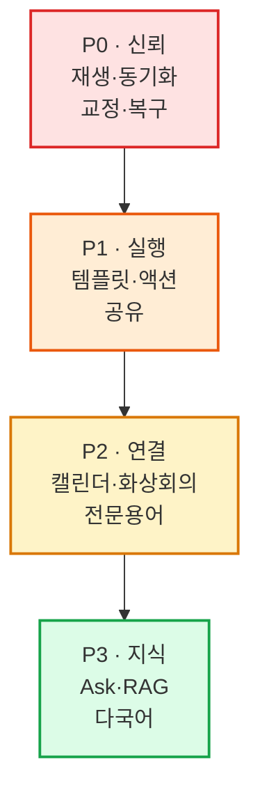

## P0 — 신뢰 가능한 회의록

### 1. 음원 플레이어와 transcript 동기화

**이유:** 네 제품 모두 결과 검수 또는 원문 맥락 확인 경험을 강조한다. STT가 아무리 좋아도 사용자는 중요한 숫자·고유명사·결정 문장을 확인해야 한다.

**주의:** 현재 음원을 요약 후 빠르게 삭제하는 정책과 충돌할 수 있다. 보존 기간, 비용, 개인정보 정책을 먼저 결정해야 한다.

### 2. 전사·화자 수정과 찾기/바꾸기

**이유:** 전문용어 하나가 반복해서 틀리면 사용자가 문장마다 고치는 것은 현실적이지 않다.

**필요 UX:** 전체 변경 전 preview, 변경 이력, 요약 stale 표시.

### 3. 녹음 동의와 개인정보 안내

**이유:** 녹음 제품의 필수 신뢰 요소다. Notion은 시작 단계에서 동의를 명시하고, 기업 제품은 보존 정책을 관리한다.

### 4. 실패 복구 UX

**이유:** 백엔드 retry 기반은 강하지만 일반 사용자가 `왜 지연되는지`, `기다려야 하는지`, `다시 시도해야 하는지`를 더 명확히 알아야 한다.

---

## P1 — 회의 결과를 업무로 전환

### 5. 회의 유형별 템플릿

첫 버전은 4개 템플릿으로 제한한다. 템플릿은 prompt 문자열이 아니라 다음을 함께 가진다.

- 입력 필드
- 결과 JSON schema
- 화면 section
- export 형식
- 후속 action 규칙

### 6. 액션 아이템 관리

`담당자`, `기한`, `상태`, `근거 transcript`를 가진 별도 데이터로 다루는 방향을 권장한다.

### 7. PDF·DOCX export

Markdown은 개발자에게는 편하지만 일반 조직의 보고·결재·메일 첨부에는 PDF와 Word가 더 직접적이다.

### 8. 공유와 댓글

- 참여자 검색
- viewer/editor 역할
- 외부 공유 만료일
- segment 또는 summary section 댓글
- 변경 이력

---

## P2 — 입력과 협업 확장

### 9. 캘린더 연동

조직의 실제 사용 환경에 따라 Microsoft 365 또는 Google Calendar 중 하나부터 시작한다.

얻을 수 있는 가치:

- 제목·시간·참석자 자동 입력
- 예정 회의 목록
- 사전 안건
- 시작 알림
- 종료 후 참석자 자동 공유

### 10. 화상회의·시스템 오디오

브라우저 microphone만으로는 헤드셋을 사용한 온라인 회의를 제대로 기록하기 어렵다. 다만 데스크톱 앱은 큰 투자이므로 다음 순서를 권장한다.

1. 화상회의 녹화 파일 import
2. Teams/Zoom/Meet 캘린더 링크 연결
3. OS 시스템 오디오 캡처 PoC
4. 데스크톱 앱 또는 공식 연동 결정

### 11. 전문용어 사전

- 사용자 개인 사전
- 조직 공용 사전
- 회의별 임시 용어
- STT prompt/keyword boosting 지원 여부에 따른 적용 전략

---

## P3 — AI 지식 플랫폼

### 12. Ask Meeting

첫 버전:

- 현재 회의만 대상으로 질문
- 답변마다 transcript timestamp 근거
- 개인정보·권한은 기존 meeting owner/access 규칙 재사용

확장:

- 선택한 회의 폴더
- 프로젝트/고객별 회의
- 전체 조직 지식 검색

### 13. 맞춤 문서 생성

회의록에서 다음 산출물을 생성한다.

- 경영진용 5줄 요약
- 고객 follow-up 이메일
- 요구사항 목록
- 장애 회고 문서
- 주간 보고 초안

PPT·퀴즈처럼 제품의 핵심 포지셔닝과 거리가 있는 기능은 우선순위를 낮춘다.

### 14. 다국어와 실시간 번역

경쟁력은 높지만 기술·비용·품질 검증 범위가 크다. 먼저 업로드 후 다국어 전사와 번역을 제공하고, streaming STT·실시간 번역은 별도 architecture로 검토한다.

---

## 8. 권장 제품 포지셔닝

Meeting Whisper가 네 제품을 모두 따라가면 범위가 과도하게 커진다. 현재 자산을 고려하면 다음 포지셔닝이 적합하다.

> **“SAP BTP 조직을 위한 신뢰 가능한 AI 회의 기록과 후속 업무 자동화”**

### 집중할 차별점

- SAP BTP·XSUAA·HANA·AI Core 기반 기업 내 배포
- 조직 데이터 경계와 명확한 보존 정책
- 긴 회의의 안정적인 비동기 처리
- 검증 가능한 timestamp 근거
- 결정 사항과 액션 아이템을 사내 업무로 연결
- SAP 생태계 또는 조직 시스템 연동

### 당장 따라 하지 않아도 되는 기능

- 다글로의 범용 AI 모델 허브
- AI 퀴즈
- 범용 PPT 생성
- 개인 소비자 대상 무제한 녹음 요금제
- Apple Watch 네이티브 앱
- 모든 메신저·CRM을 동시에 지원

이 기능들은 멋져 보이지만 Meeting Whisper의 현재 BTP 사내 회의록 포지션을 흐릴 가능성이 있다.

---

## 9. 제안 로드맵

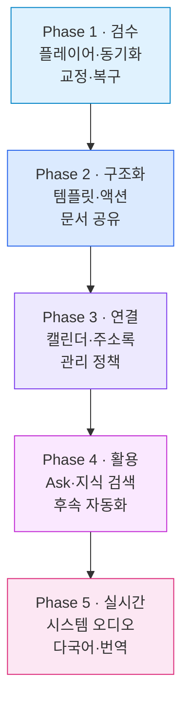

### Phase 1 — Verify & Correct

- 오디오 보존 정책 결정
- 플레이어와 timestamp sync
- 전사·화자 편집
- 찾기·바꾸기
- 검토 필요 segment
- 녹음 동의
- 실패 복구 UX

### Phase 2 — Structure & Act

- 4종 회의 템플릿
- 안건·사전 메모
- 결정·액션 아이템 구조화
- 담당자·기한·상태
- PDF·DOCX export
- 공유·댓글

### Phase 3 — Connect

- 캘린더
- 주소록/조직 사용자 검색
- Teams 또는 사내 메신저 공유
- 전문용어 사전
- 관리자 사용량·감사·보존 정책

### Phase 4 — Ask & Automate

- Ask Meeting
- 프로젝트/고객별 회의 검색
- 근거 timestamp
- follow-up 이메일·보고서 생성
- 외부 업무 시스템 action

### Phase 5 — Realtime & Global

- 시스템 오디오
- 데스크톱 capture
- streaming STT
- 다국어 전사
- 실시간 번역
- 고도화된 화자 식별

---

## 10. 기능 선정 시 평가표

새 기능은 아래 기준으로 점수화하는 것을 권장한다.

| 기준 | 질문 |
|---|---|
| 사용자 가치 | 회의 전후 시간을 실제로 얼마나 줄이는가? |
| 신뢰성 | 결과를 검증하고 오류를 되돌릴 수 있는가? |
| 반복 빈도 | 대부분의 회의에서 반복적으로 쓰이는가? |
| 기존 구조 활용 | 현재 CAP, HANA, Worker, AI Core 기반을 재사용하는가? |
| 보안 영향 | 음원 보존·외부 공유·새 credential이 필요한가? |
| 운영 비용 | STT/LLM 호출과 저장 비용이 얼마나 증가하는가? |
| UX 복잡도 | 초보 사용자가 설명 없이 사용할 수 있는가? |
| 차별화 | BTP 조직용 제품 포지션을 강화하는가? |

---

## 11. 최종 제안

가장 위험한 선택은 경쟁 제품에 있는 AI 기능을 순서 없이 추가하는 것이다. 현재 Meeting Whisper는 보이지 않는 백엔드 안정성이 강하고, 보이는 사용자 경험이 상대적으로 약하다.

따라서 다음 세 가지를 첫 제품 개선 묶음으로 권장한다.

1. **듣고 확인할 수 있는 회의록**
   - 음원 플레이어, timestamp sync, 전사·화자 수정, 찾기·바꾸기

2. **결정과 행동이 남는 회의록**
   - 회의 템플릿, 결정 사항, 담당자·기한이 있는 액션 아이템

3. **회의 전후 흐름이 연결되는 회의록**
   - 예정 회의, 사전 안건, 캘린더, 참석자 공유

이 세 묶음이 완성되면 제품은 “음성을 올리면 요약해 주는 앱”에서 “회의의 준비·기록·검수·실행을 연결하는 업무 도구”로 넘어갈 수 있다. 그다음에 Ask Meeting, 여러 회의 지식 검색, 실시간 번역을 추가하는 편이 제품 가치와 기술 투자 순서 모두 자연스럽다.
