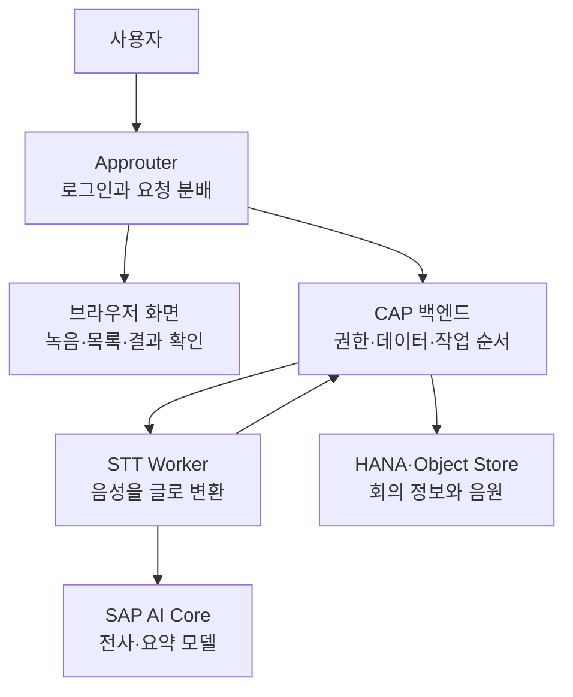

# 1-1. Meeting Whisper를 한 번에 이해하기

## 먼저 알아둘 말

- **브라우저**: 사용자가 보는 웹 화면이다.
- **Approuter**: 로그인 여부를 확인하고 요청을 알맞은 서버로 보내는 출입구다.
- **CAP**: 회의 데이터와 업무 규칙을 관리하는 Node.js 백엔드다.
- **Worker**: 음성을 글로 바꾸는 무거운 작업을 맡는 Python 프로그램이다.
- **AI Core**: 전사와 요약에 필요한 AI 모델을 호출하는 SAP BTP 서비스다.

## 이 앱이 해결하는 일

Meeting Whisper는 음성을 녹음하거나 파일로 올리면 다음 결과를 만든다.

1. 음성을 시간 정보가 있는 글로 변환한다.
2. 회의의 핵심, 결정 사항과 할 일을 정리한다.
3. 사용자 권한에 따라 회의록을 보여 주고 수정·공유하게 한다.

겉으로는 하나의 웹앱이지만 실제로는 역할이 다른 프로그램들이 협력한다.

## 사용자의 행동을 따라가기

사용자가 회의를 만들면 브라우저 화면은 먼저 CAP에 회의 기본 정보를 저장한다. 그다음 원본 음원을 업로드하고 전사를 요청한다.

CAP는 음성을 직접 처리하지 않는다. 전사 대기표에 작업을 등록하고 Worker가 받을 수 있을 때 전달한다. Worker는 음원을 내려받아 AI Core에 보내고, 결과를 검사한 뒤 CAP에 돌려준다.

CAP는 전사 결과를 저장한 다음 별도의 AI 요청으로 요약을 만든다. 사용자는 이 모든 내부 이동을 알 필요 없이 하나의 회의 상태와 최종 회의록을 본다.

## 프로그램을 나눈 이유

회의 목록 조회는 빨라야 하지만 긴 음성 전사는 수 분이 걸릴 수 있다. 두 작업을 같은 서버가 붙잡고 있으면 한 사용자의 긴 회의 때문에 다른 사용자의 화면도 느려질 수 있다.

따라서 다음처럼 책임을 나눴다.

| 영역 | 책임지지 않는 일 | 책임지는 일 |
|---|---|---|
| 브라우저 화면 | 권한 최종 판단, 실제 AI 호출 | 사용자 입력과 결과 표시 |
| Approuter | 회의 데이터 처리 | 로그인과 요청 전달 |
| CAP | 음원 자체 전사 | 권한, 데이터, 상태, 작업 순서, 요약 |
| Worker | 사용자 화면과 공유 권한 | 음원 준비, 분할, STT, 결과 검사 |
| AI Core | 회의 보존과 사용자 권한 | 모델 실행 |

## 실제 코드에서 찾는 위치

- 화면: `app/meeting-ui/`
- 로그인과 요청 분배: `approuter/xs-app.json`
- 공개 업무 API: `cap/srv/meeting-service.js`
- Worker 전용 API: `cap/srv/worker-internal-service.js`
- 전사 대기표: `cap/srv/lib/transcription-dispatcher.js`
- 전사 실행: `workers/transcription/app/`
- 요약과 검토: `cap/srv/lib/ai-core.js`
- 데이터 구조: `cap/db/schema.cds`
- 전체 배포 구성: `mta.yaml`

## 핵심 정리

이 앱을 이해할 때 가장 중요한 문장은 다음이다.

> 브라우저가 요청하고, CAP가 판단하고, Worker가 전사하며, CAP가 결과를 요약하고 보존한다.

다음 문서에서는 왜 현재 구조가 처음부터 이렇게 만들어진 것이 아니라 Kyma 기반 구조에서 변경됐는지 살펴본다.

다음: [[팀 동료 요약 내용/세부 분석/1. Vault 분석 확장/1-2. Kyma에서 Cloud Foundry와 AI Core로 바뀐 이유|1-2. Kyma에서 Cloud Foundry와 AI Core로 바뀐 이유]]
