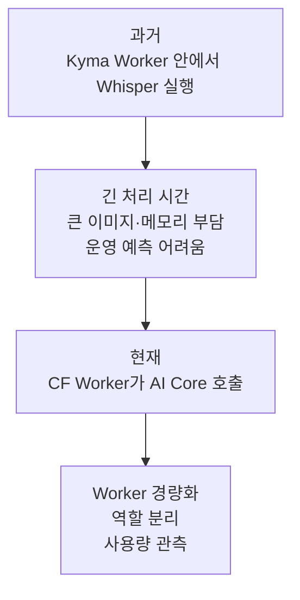

# 1-2. Kyma에서 Cloud Foundry와 AI Core로 바뀐 이유

## 과거 구조와 현재 구조

초기에는 Kyma 환경의 Worker가 Whisper 계열 모델을 직접 실행했다. 현재 운영 중심은 Cloud Foundry의 Python Worker가 SAP AI Core에 음원을 보내 전사하는 방식이다.



## 왜 CPU Whisper가 부담이었나

Whisper와 WhisperX를 Worker 안에서 직접 실행하려면 모델 파일, PyTorch와 음성 처리 도구가 함께 필요하다. 이 조합은 이미지가 크고 메모리를 많이 사용한다.

특히 GPU가 없는 환경에서 긴 회의를 처리하면 완료 시간을 예측하기 어렵다. 사용자가 기다리는 HTTP 요청과 전사 작업의 수명도 길어지고, Worker를 여러 개 늘릴 때마다 같은 무거운 실행 환경이 반복된다.

## 바뀐 뒤 Worker의 역할

현재 Worker는 모델을 직접 품고 있지 않고 다음 일에 집중한다.

1. CAP가 보낸 작업인지 확인한다.
2. 원본 음원을 내려받는다.
3. 긴 음원을 작은 구간으로 나눈다.
4. 음원과 전사 지시문을 AI Core에 전달한다.
5. JSON과 시간 정보를 검사한다.
6. 구간 결과를 합쳐 CAP에 보낸다.

즉 “모델 실행”은 AI Core가 맡고 Worker는 안전한 전사 작업 절차를 맡는다.

## 전사와 요약도 분리됐다

Worker가 전사와 요약을 모두 처리하면 요약이 끝날 때까지 Worker의 작업 자리가 점유된다. 현재는 Worker가 전사 결과를 CAP에 저장하면 주된 임무를 끝낸다.

이후 요약은 CAP가 별도의 백그라운드 작업으로 실행한다.

```text
Worker
음원 처리 → 전사 → 결과 전달 → 종료

CAP
전사 저장 → 요약 시작 → 회의록 저장
```

따라서 전사는 성공했지만 요약이 실패한 경우에도 전사 결과를 보존할 수 있다.

## 현재 코드에 남은 과거 흔적

다음은 현재 기본 운영 경로가 아니다.

- `deploy/kyma/`
- `legacy/fastapi/`
- Worker의 `whisperx`와 `fast` 엔진 분기
- Kyma 배포용 PowerShell 스크립트

이 코드는 과거 결정과 대체 경로를 이해하는 참고 자료다. 현재 운영 절차를 찾을 때는 `mta.yaml`, `deploy/cf/README.md`, `deploy/OPERATIONS.md`를 우선해야 한다.

## 전환으로 얻은 것과 새로 생긴 의존성

| 얻은 것 | 감수한 것 |
|---|---|
| Worker가 가벼워짐 | AI Core 장애와 사용량 제한에 의존 |
| 긴 전사의 처리 시간이 예측 가능해짐 | 모델 지원 종료에 맞춰 교체 필요 |
| 전사와 요약을 별도로 복구 가능 | AI 호출 비용 관측 필요 |
| Worker 수와 CAP 처리량을 따로 조절 | 긴 음원의 구간 경계 품질 확인 필요 |

## 핵심 정리

이 전환은 단순히 Whisper 모델을 다른 모델로 바꾼 일이 아니다.

> 모델을 직접 실행하는 Worker에서, 작업을 준비·검사하는 Worker와 모델을 실행하는 AI Core로 책임을 다시 나눈 아키텍처 변경이다.

다음: [[팀 동료 요약 내용/세부 분석/1. Vault 분석 확장/1-3. 긴 회의를 안전하게 처리하는 설계|1-3. 긴 회의를 안전하게 처리하는 설계]]
