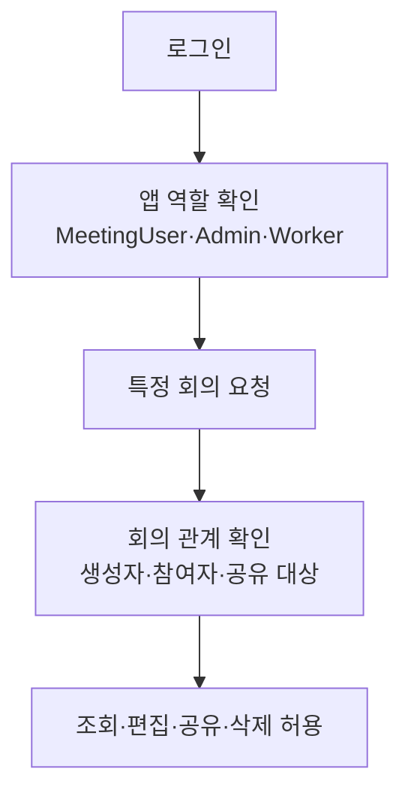

# 1-5. 사용자 권한이 실제 요청에 적용되는 과정

## 권한이 두 겹인 이유

Meeting Whisper의 권한은 두 질문을 따로 판단한다.

1. 이 사람이 Meeting Whisper에 들어올 수 있는가?
2. 들어온 사람이 이 특정 회의를 읽거나 바꿀 수 있는가?

첫 번째는 XSUAA 역할이, 두 번째는 CAP의 회의별 규칙이 담당한다.

## 앱 전체 역할

`xs-security.json`은 다음과 같은 역할의 기반을 정의한다.

- `MeetingUser`: 일반 사용자용 API에 접근
- `MeetingAdmin`: 운영 목적의 넓은 접근
- `Worker`: Worker 전용 내부 API에 접근

사용자가 `MeetingUser`라고 해서 모든 회의를 볼 수 있는 것은 아니다.

## 회의별 관계

회의 하나에는 생성자, 참여자와 공유 대상이 있다.

| 관계 | 읽기 | 내용 편집 | 접근 대상 변경 | 삭제 |
|---|---:|---:|---:|---:|
| 생성자 | 가능 | 가능 | 가능 | 가능 |
| 참여자 | 가능 | 가능 | 불가 | 불가 |
| 공유 대상 | 가능 | 불가 | 불가 | 불가 |
| 관리자 | 운영 권한에 따라 가능 | 가능 | 가능 | 가능 |

## `accessTokens`가 하는 일

CAP는 생성자, 참여자와 공유 대상의 이름·이메일 형태를 정리하여 검색 가능한 `accessTokens` 문자열을 만든다.

목록을 읽을 때 CAP는 사용자의 식별값과 맞는 회의만 데이터베이스 조회 조건에 포함한다. 즉 모든 회의를 가져온 다음 브라우저에서 숨기는 방식이 아니다.

토큰을 줄바꿈으로 감싸는 것은 짧은 이름이 긴 이메일의 일부와 우연히 맞는 부분 검색 오류를 줄이기 위한 장치다.

## 요청마다 다시 확인한다

브라우저가 수정 버튼을 숨겼더라도 사용자는 직접 HTTP 요청을 만들 수 있다. 따라서 실제 보안은 화면이 아니라 CAP에서 이루어진다.

- 회의 목록 조회 전 필터 적용
- 회의 수정 전 편집 권한 확인
- 참여자와 공유 대상 변경 전 생성자 권한 확인
- 삭제 전 생성자 또는 관리자 여부 확인
- 전사·요약 같은 자식 데이터 조회 전 부모 회의 접근 권한 확인

## Worker 권한은 사용자 권한과 다르다

Worker는 내부적으로 음원을 받고 전사 결과를 저장해야 하지만 사용자의 회의 관리 기능은 필요하지 않다.

그래서 `/api` 사용자 서비스와 `/internal` Worker 서비스를 나눴다. Worker 역할은 `claimTranscription`, `getAudio`, `saveTranscript`, `heartbeatTranscription` 같은 내부 작업에만 사용된다.

## 핵심 정리

권한을 이해할 때 다음을 구분해야 한다.

> XSUAA 역할은 건물 출입증이고, CAP의 회의별 권한은 건물 안에서 열 수 있는 문을 정하는 열쇠다.

다음: [[팀 동료 요약 내용/세부 분석/2. 소스 구조 확장/2-1. 하나의 저장소 안에 여러 프로그램이 있는 이유|2-1. 하나의 저장소 안에 여러 프로그램이 있는 이유]]
