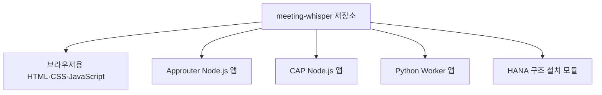

# 2-1. 하나의 저장소 안에 여러 프로그램이 있는 이유

## 저장소와 프로그램은 같은 말이 아니다

`meeting-whisper` 폴더는 하나지만 실행되는 프로그램은 하나가 아니다.

하나의 저장소는 관련된 소스와 설정을 함께 관리하는 공간이다. 그 안의 코드는 서로 다른 실행 환경으로 나뉘어 배포될 수 있다.



## 각 폴더가 실행되는 장소

| 소스 영역 | 실행 장소 | 주된 역할 |
|---|---|---|
| `app/meeting-ui` | 사용자의 브라우저 | 화면과 녹음 |
| `approuter` | Cloud Foundry | 로그인과 요청 분배 |
| `cap` | Cloud Foundry | API, 권한, 데이터와 요약 |
| `workers/transcription` | Cloud Foundry | 음성 전사 |
| `cap/db` | 배포 시 HANA | 데이터 구조 설치 |

브라우저 코드는 서버에서 실행되지 않고 사용자의 기기에서 실행된다. 반대로 CAP와 Worker 코드는 브라우저에 내려가지 않는다.

## `mta.yaml`이 조립하는 것

MTA는 Multi-Target Application의 약자다. 서로 다른 실행 대상을 하나의 배포 단위로 묶는다.

`mta.yaml`은 다음 정보를 연결한다.

- 어떤 폴더를 어떤 프로그램으로 만들 것인가
- Node.js 또는 Python 중 어떤 실행 환경을 사용할 것인가
- 각 프로그램에 메모리를 얼마나 줄 것인가
- HANA, XSUAA, Object Store, AI Core 중 무엇을 연결할 것인가
- CAP와 Worker가 서로의 주소를 어떻게 알 것인가
- 운영 환경 변수를 어떤 값으로 설정할 것인가

## 소스가 함께 있는 장점

사용자 화면이 보내는 요청 형식, CAP가 받는 API, Worker가 받는 작업 형식과 데이터베이스 구조가 함께 바뀔 때 한 저장소에서 변경 관계를 확인할 수 있다.

예를 들어 `expectedDurationSec`을 새로 전달한다면 다음 영역이 함께 맞아야 한다.

```text
브라우저가 녹음 길이 저장
→ CAP 데이터 모델
→ 전사 대기 payload
→ Worker 요청 모델
→ 음원 분할 판단
```

## 주의할 점

한 저장소라고 해서 모든 코드를 한 프로세스로 실행하면 안 된다. 각 영역은 다른 언어와 자원 요구를 가진다.

- UI 변경은 브라우저 캐시와 정적 파일 복사를 고려한다.
- CAP 변경은 데이터와 권한 영향을 고려한다.
- Worker 변경은 Python 의존성과 긴 작업을 고려한다.
- 데이터 모델 변경은 HANA 배포 영향을 고려한다.

## 핵심 정리

> Meeting Whisper는 하나의 앱처럼 보이지만, 실제로는 한 저장소에서 함께 관리되는 여러 프로그램의 협업 결과다.

다음: [[팀 동료 요약 내용/세부 분석/2. 소스 구조 확장/2-2. 로그인부터 화면이 열리기까지|2-2. 로그인부터 화면이 열리기까지]]
