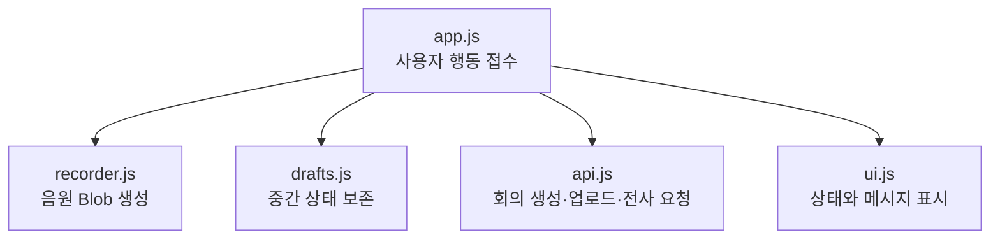

# 2-3. 브라우저 화면 모듈들이 협력하는 방식

## 프레임워크 없는 단일 페이지 앱

`app/meeting-ui`는 React나 UI5 같은 프레임워크 없이 HTML, CSS와 JavaScript ES 모듈로 만들어졌다.

페이지를 이동할 때 서버가 새 HTML을 계속 주는 것이 아니라 `app.js`가 현재 상태에 맞게 화면을 바꾼다.

## 모듈별 책임

| 파일 | 초보자용 설명 |
|---|---|
| `index.html` | 화면에 필요한 기본 칸과 모달의 뼈대 |
| `styles.css` | 크기, 색상과 배치 |
| `js/app.js` | 화면 전체의 진행을 지휘하는 컨트롤러 |
| `js/api.js` | CAP에 HTTP 요청을 보내는 통신 창구 |
| `js/ui.js` | 반복되는 DOM 표시와 메시지 도우미 |
| `js/recorder.js` | 브라우저 녹음을 시작·정지하고 Blob 생성 |
| `js/session.js` | 로그인 세션 만료 경고와 연장 |
| `js/drafts.js` | 녹음 중 임시 데이터를 IndexedDB에 보존 |

## 회의를 녹음하고 만드는 흐름

`app.js`는 사용자가 누른 버튼에 따라 다른 모듈을 호출한다. `recorder.js`는 녹음 자체만 알고 CAP API 주소는 모른다. `api.js`는 서버 통신을 알지만 마이크를 제어하지 않는다.

## `app.js`가 큰 이유

`app.js`에는 목록 화면, 회의 생성 화면, 상세 화면, 간단한 라우팅, 참여자 입력과 실시간 임시 전사가 함께 들어 있다.

이 파일을 읽을 때 위에서 아래로 모든 함수를 외우려 하면 어렵다. 사용자 시나리오별 시작 함수를 먼저 찾는 편이 낫다.

- 앱 시작과 사용자 확인
- 회의 목록 읽기
- 녹음 시작과 중지
- 회의 생성과 음원 업로드
- 전사 상태 반복 확인
- 상세 결과 표시
- 회의 수정과 공유

## `api.js`가 중간층인 이유

브라우저 코드 곳곳에서 `fetch`를 직접 사용하면 주소, 오류 처리와 응답 형식이 흩어진다. `api.js`는 이를 한곳에 모은다.

일부 코드는 현재 CAP와 과거 Legacy FastAPI 양쪽을 지원하는 분기를 포함한다. 새 흐름을 분석할 때는 CAP 경로를 중심으로 보고 Legacy 분기는 호환 흔적으로 구분해야 한다.

## 녹음 복구와 서버 저장은 다르다

`drafts.js`의 IndexedDB 저장은 브라우저가 닫히거나 화면이 새로고침됐을 때 녹음 초안을 복구하기 위한 로컬 안전장치다.

이 데이터가 HANA에 저장됐다는 뜻은 아니다. CAP에 회의를 만들고 음원을 업로드해야 서버 처리 흐름이 시작된다.

## 세션 모듈의 위치

`session.js`는 일정 시간 활동이 없을 때 경고를 보여 주고 세션 확인 요청을 보낸다.

세션이 만료되면 API 요청이 실패할 수 있으므로 이 모듈은 화면 편의 기능이면서 긴 녹음 중 로그인 상태를 관리하는 신뢰성 기능이다.

## 핵심 정리

> `app.js`가 사용자 흐름을 지휘하고, 녹음·통신·세션·복구는 각각의 작은 모듈이 전문적으로 돕는다.

다음: [[팀 동료 요약 내용/세부 분석/2. 소스 구조 확장/2-4. CAP의 데이터 모델과 두 개의 서비스|2-4. CAP의 데이터 모델과 두 개의 서비스]]
