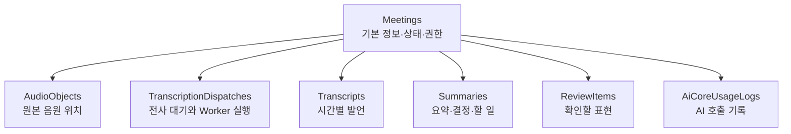

# 2-4. CAP의 데이터 모델과 두 개의 서비스

## CAP를 두 층으로 보기

CAP 영역은 크게 데이터 구조와 서비스 동작으로 나뉜다.

```text
cap/db/schema.cds
→ 무엇을 저장할지 정의

cap/srv/*.cds
→ 외부에 어떤 API를 제공할지 정의

cap/srv/*.js
→ 요청이 들어왔을 때 실제로 무엇을 할지 구현
```

## 회의 하나와 연결되는 데이터

`Meetings`는 중심 엔티티다. 다른 정보는 회의와 연결된다.



모든 정보를 `Meetings` 한 줄에 넣지 않은 이유는 수명과 변경 시점이 다르기 때문이다. 음원은 삭제될 수 있고, 요약은 다시 만들 수 있으며, 전사 작업은 여러 번 시도될 수 있다.

## 사용자용 서비스

`meeting-service.cds`와 `meeting-service.js`는 브라우저가 사용하는 `/api` 영역이다.

대표적인 책임은 다음과 같다.

- 회의 생성·조회·수정
- 음원 업로드
- 전사 요청과 재시도
- 회의 상태 조회
- 요약 다시 실행
- 검토 항목 생성
- 참여자와 공유 대상 변경
- 회의와 음원 삭제

서비스 전체에 `MeetingUser` 역할이 요구되고, 각 회의마다 생성자·참여자·공유 관계를 다시 검사한다.

## Worker 전용 서비스

`worker-internal-service.cds`와 `worker-internal-service.js`는 `/internal` 영역이다.

대표적인 책임은 다음과 같다.

- 전사 작업 사용권 확보
- Worker 생존 신호 저장
- 음원 다운로드 정보 제공
- 전사 결과 저장
- 전사 실패 보고

이 서비스는 `Worker` 역할을 요구한다. 사용자 기능과 내부 기능을 나누면 Worker 자격증명이 노출돼도 사용자 공유·삭제 기능까지 실행되는 범위를 줄일 수 있다.

## 상태가 두 종류인 이유

회의 상태와 전사 전달 상태는 같은 것이 아니다.

- 회의 상태: 사용자가 보는 전체 처리 단계
- Dispatch 상태: CAP가 Worker에게 작업을 전달하는 내부 단계

예를 들어 회의는 `queued` 상태이면서 Dispatch는 일시적으로 `dispatching` 또는 재시도 대기일 수 있다.

## CDS와 JavaScript의 관계

CDS 파일은 계약서에 가깝다. 어떤 엔티티와 action이 있고 어떤 역할이 필요한지 정의한다.

JavaScript 파일은 계약을 실행하는 담당자다. 요청 전후 훅을 사용해 권한을 검사하고, 데이터베이스를 읽고 쓰며, 라이브러리를 호출한다.

## 핵심 정리

> 데이터 모델은 회의 처리의 기억을 구성하고, 두 서비스는 사람과 Worker가 그 기억에 접근하는 서로 다른 문을 제공한다.

다음: [[팀 동료 요약 내용/세부 분석/2. 소스 구조 확장/2-5. CAP 라이브러리가 기능을 나누는 방식|2-5. CAP 라이브러리가 기능을 나누는 방식]]
