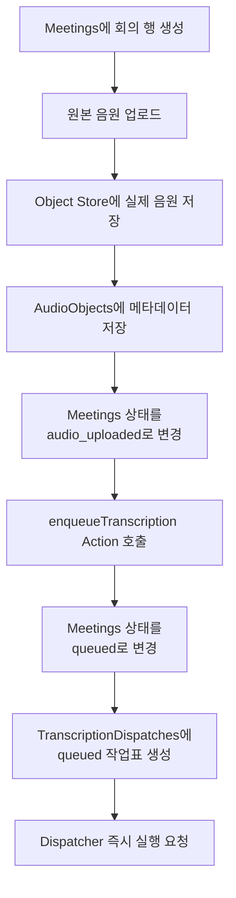

# 3-2. 회의 생성부터 전사 대기표까지

## 이 문서에서 다루는 범위

이 문서는 사용자가 회의를 저장한 뒤 다음 세 단계가 어떻게 분리되어 처리되는지 설명한다.

```text
회의 정보 생성
→ 음원 저장
→ Worker에게 전달할 전사 작업표 생성
```

여기까지는 Worker가 실제 전사를 시작하기 전의 준비 과정이다.



## 회의 기본 정보는 `Meetings`에 저장

브라우저의 `app.js`가 `api.js`를 통해 CAP의 `Meetings`에 새로운 회의를 만든다.

대표 정보는 다음과 같다.

- 제목과 카테고리
- 참여자와 공유 대상
- 녹음 길이
- 화자 수와 화자 분리 설정
- 생성자와 접근 권한 정보

CAP는 브라우저가 보낸 생성자를 그대로 믿지 않고 인증된 사용자 정보를 기준으로 소유자를 설정한다.

처음 상태는 `created`다.

## 실제 음원과 메타데이터는 서로 다른 곳에 저장

회의 ID가 만들어지면 브라우저가 원본 음원을 다음 주소로 보낸다.

```text
POST /api-binary/Meetings/{meetingId}/audio
```

요청은 다음 코드를 거친다.

```text
server.js
→ binary-upload-route.js
→ audio-store.js
→ object-store.js
```

현재 배포 환경에서는 실제 음원 바이너리를 Object Store에 저장한다.

음원 위치와 파일 정보는 `Meetings`가 아니라 `AudioObjects`에 저장한다.

```text
Object Store
= 실제 음원

AudioObjects
= meeting_ID, mimeType, size, storageKind,
   objectKey, expiresAt 등의 메타데이터

Meetings
= 회의 전체 상태
```

저장이 성공하면 다음처럼 바뀐다.

```text
Meetings.status = audio_uploaded
Meetings.percent = 5
```

Object Store가 비활성화된 로컬 환경에서는 `AudioObjects.content`에 음원을 직접 저장할 수도 있다.

## 화면이 호출하는 `enqueueTranscription`

음원 저장이 성공하면 브라우저가 CAP의 Action을 호출한다.

```text
MeetingService.enqueueTranscription
```

이 Action은 Worker의 `/transcribe`를 즉시 호출하는 함수가 아니다.

먼저 전사 요청을 DB 대기 작업으로 등록한다.

1. `AudioObjects`에서 음원이 존재하는지 확인한다.
2. 재실행이라면 이전 전사·요약·검토 결과를 정리한다.
3. `Meetings.status`를 `queued`로 변경한다.
4. `TranscriptionDispatches`에 새 전사 작업표를 만든다.
5. 요청이 성공한 뒤 Dispatcher의 큐 처리 함수를 즉시 호출한다.

## 첫 번째 `queued`: 회의 전체 상태

CAP는 먼저 `Meetings`를 변경한다.

```text
Meetings.status
audio_uploaded → queued

Meetings.percent
5 → 10
```

의미는 다음과 같다.

> 이 회의는 전사 시작을 기다리는 단계에 들어갔다.

## 두 번째 `queued`: Worker 전달 작업표

그다음 `createTranscriptionDispatch()`가 `TranscriptionDispatches` 행을 만든다.

같은 회의의 이전 작업표가 있으면 삭제하고 새 작업표로 초기화한다.

```text
meeting_ID       = 회의 ID
status           = queued
attempts         = 0
maxAttempts      = 최대 시도 횟수
nextAttemptAt    = 현재 시각
workerRunId      = null
workerStage      = null
workerHeartbeatAt = null
payload          = Worker에게 보낼 전사 설정
lastError        = null
```

`TranscriptionDispatches.status`는 스키마에서 기본값이 `queued`이고 생성 코드도 이를 명시한다.

```cds
status : DispatchStatus default 'queued';
```

```javascript
status: DISPATCH_STATUS.QUEUED
```

두 `queued`는 서로 다른 질문에 답한다.

| 값 | 의미 |
|---|---|
| `Meetings.status = queued` | 회의 전체가 전사 대기 중 |
| `TranscriptionDispatches.status = queued` | Worker에게 전달할 작업표가 대기 중 |

## 대기표 payload에 남는 내용

- 회의 ID
- 예상 음원 길이
- 화자 수 범위
- 화자 분리 여부
- 전사 모델 선택값
- CAP 내부 주소

작업표 자체에는 시도 횟수, 다음 시도 시각, 최근 오류와 Worker 실행 상태도 저장된다.

현재 코드에서는 회의 카테고리, 참석자와 전문용어 목록이 STT Worker 요청 payload에 포함되지 않는다.

## “Dispatcher를 깨운다”의 정확한 의미

CAP는 다음 코드를 사용한다.

```javascript
req.on("succeeded", () => {
  processTranscriptionDispatchQueue(...);
});
```

이는 새로운 Dispatcher 서버를 시작한다는 의미가 아니다.

> 전사 대기 등록 요청의 DB 변경이 성공한 뒤, `transcription-dispatcher.js`의 큐 처리 함수를 즉시 한 번 호출한다는 뜻이다.

Dispatcher는 원래 일정 주기로도 대기표를 확인한다. 새 작업이 생긴 직후에는 다음 주기를 기다리지 않도록 즉시 호출한다.

## 핵심 정리

> 실제 음원은 Object Store에, 음원 메타데이터는 `AudioObjects`에 저장한다. 이후 `MeetingService.enqueueTranscription`이 `Meetings`를 전사 대기로 변경하고 `TranscriptionDispatches.status = queued`인 작업표를 만든다. “Dispatcher 깨우기”는 이 작업표를 즉시 확인하도록 큐 처리 함수를 호출하는 것이다.

다음: [[팀 동료 요약 내용/세부 분석/3. 전사 과정 확장/3-3. CAP가 Worker에게 일을 넘기는 과정|3-3. CAP가 Worker에게 일을 넘기는 과정]]
