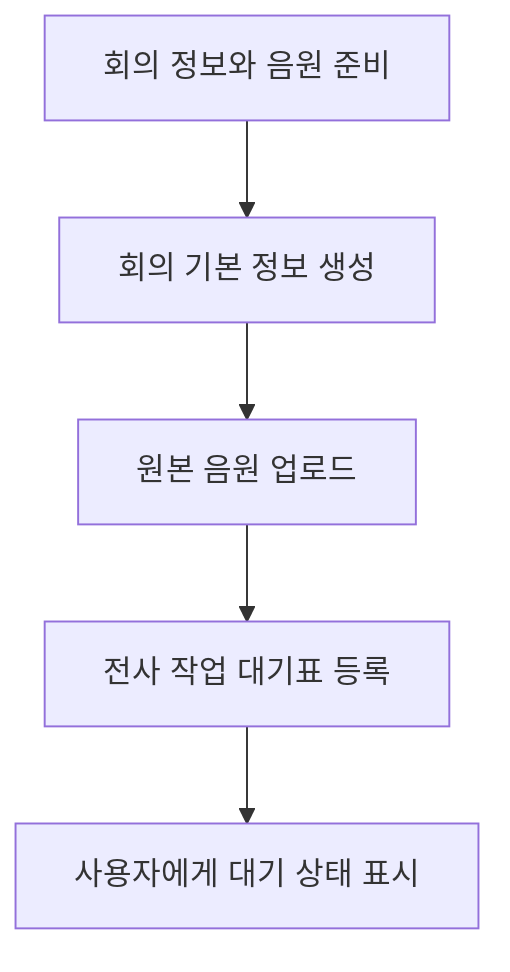

# 3-2. 회의 생성부터 전사 대기표까지

## 한 번의 저장 버튼 안에서 일어나는 일

사용자는 녹음을 마치고 회의를 저장하지만 서버에는 성격이 다른 세 요청이 순서대로 전달된다.

## 회의 기본 정보 생성

브라우저의 `app.js`가 `api.js`를 통해 CAP의 `Meetings`에 새 회의를 만든다.

이때 저장되는 대표 정보는 다음과 같다.

- 제목
- 카테고리
- 참여자와 공유 대상
- 녹음 길이
- 화자 수 설정
- 전사 엔진 관련 선택값
- 생성자와 접근 토큰

CAP는 브라우저가 보낸 생성자를 그대로 믿지 않고 인증된 사용자를 기준으로 소유자를 설정한다.

## 음원 업로드

회의 ID가 만들어진 뒤 원본 음원을 `/api-binary/Meetings/{meetingId}/audio` 경로로 보낸다.

일반 OData JSON 안에 큰 base64 문자열을 넣지 않고 전용 스트림 라우트를 사용한다. `server.js`가 이 Express 경로를 장착하고 `binary-upload-route.js`가 `audio-store.js`로 전달한다.

`audio-store.js`는 다음을 확인한다.

- 해당 사용자가 회의를 수정할 수 있는가
- 파일 크기가 최대 허용값 안인가
- 음원 형식과 길이 정보는 무엇인가
- Object Store를 사용할 수 있는가

저장이 끝나면 회의 상태를 `audio_uploaded`로 바꾼다.

## 전사 요청 등록

브라우저가 `enqueueTranscription` action을 호출하면 CAP는 즉시 AI를 호출하지 않는다.

1. 음원이 존재하는지 확인한다.
2. 이전 전사·요약·검토 결과가 있다면 새 실행과 충돌하지 않도록 정리한다.
3. 회의 상태를 `queued`로 바꾼다.
4. `TranscriptionDispatches`에 대기 작업을 만든다.
5. 사용자 요청이 성공한 뒤 dispatcher를 깨운다.

## 응답 후에 Worker 호출을 깨우는 이유

CAP는 `req.on("succeeded", ...)`에서 대기표 처리를 시작한다.

사용자가 보낸 요청의 데이터베이스 변경이 성공적으로 끝난 다음 Worker 호출을 시작하기 위해서다. Worker 호출이 느려도 사용자는 “전사 요청이 접수됐다”는 응답을 먼저 받을 수 있다.

## 대기표에 무엇이 남나

- 회의 ID
- 예상 음원 길이
- 화자 수 범위
- 화자 분리 여부
- 선택한 Whisper 모델 크기
- 시도 횟수와 최대 횟수
- 다음 시도 시각
- Worker 실행 식별자
- Worker 단계와 마지막 생존 시각

현재 코드에서는 회의 카테고리, 참석자와 전문용어 목록이 Worker 요청 payload에 포함되지 않는다.

## 핵심 정리

> 회의 생성, 음원 저장과 전사 요청은 하나의 긴 요청이 아니라 각각 성공 여부를 확인할 수 있는 세 단계다.

다음: [[팀 동료 요약 내용/세부 분석/3. 전사 과정 확장/3-3. CAP가 Worker에게 일을 넘기는 과정|3-3. CAP가 Worker에게 일을 넘기는 과정]]
