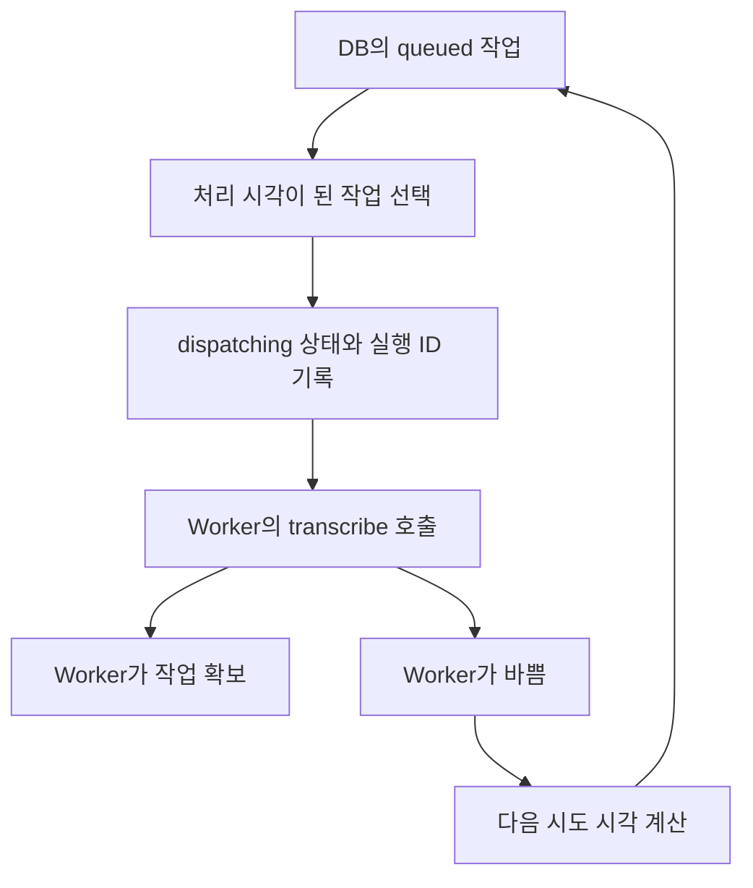

# 3-3. CAP가 Worker에게 일을 넘기는 과정

## Dispatcher란 무엇인가

Dispatcher는 대기표에서 처리할 작업을 찾아 Worker에게 전달하는 CAP 내부 기능이다.

사용자의 요청과 Worker의 처리 속도를 직접 묶지 않고 DB 대기표를 사이에 둔다.

## 작업을 선택하는 기준

`transcription-dispatcher.js`는 주기적으로 다음 조건의 행을 찾는다.

- Dispatch 상태가 `queued`
- `nextAttemptAt`이 현재 시각 이전
- 한 번에 처리할 최대 개수 안에 포함

현재 폴링 간격과 최대 전달 수는 환경 변수로 조정할 수 있다.

## Worker 호출 전에 남기는 정보

CAP는 Worker를 호출하기 전에 Dispatch를 `dispatching`으로 바꾸고 새로운 `workerRunId`를 만든다.

이 식별자는 같은 회의를 여러 번 실행할 때 오래된 Worker가 늦게 결과를 보내 최신 실행을 덮어쓰는 것을 막는 기준이 된다.

## CAP에서 Worker로 가는 요청

`worker-client.js`가 Worker의 `/transcribe`에 JSON 요청을 보낸다.

요청에는 회의 ID와 처리 설정이 들어가고, HTTP Authorization 헤더에는 공유 Bearer token이 들어간다.

Worker 주소가 설정되지 않은 로컬 환경에서는 실제 호출을 하지 않고 `dispatched: false` 결과를 돌려줄 수 있다.

## Worker가 먼저 작업을 확보하는 이유

Worker는 요청을 받으면 CAP의 `claimTranscription`을 호출한다.

CAP는 회의 상태와 `workerRunId`를 확인한 뒤 이 Worker 실행을 실제 처리 주체로 인정하고 회의 상태를 `transcribing`으로 바꾼다.

작업 확보가 실패하면 Worker는 처리 자리를 반납하고 본 작업을 시작하지 않는다.

## Worker가 바쁠 때

Worker는 Semaphore로 동시에 처리할 수를 제한한다. 자리가 모두 사용 중이면 429를 반환한다.

CAP는 이를 영구 실패로 보지 않고 `WORKER_BUSY`로 해석하여 다음 시도 시각을 정하고 대기 상태로 되돌린다.

바쁜 Worker를 쉬지 않고 계속 호출하면 장애가 더 커지므로 시도 간격을 늘리는 backoff를 사용한다.

## `dispatched`와 `transcribing`의 차이

- `dispatched`: CAP가 Worker 호출을 접수시켰다는 내부 전달 상태
- `transcribing`: Worker가 CAP에서 작업 사용권을 확보하고 실제 처리를 시작한 회의 상태

둘을 분리하면 요청 전달 성공과 실제 작업 시작을 구분할 수 있다.

## 핵심 정리

> Dispatcher는 Worker에게 일을 던지고 잊는 기능이 아니라, 실행 식별자·시도 횟수·다음 시각을 기록하며 안전하게 인계하는 기능이다.

다음: [[팀 동료 요약 내용/세부 분석/3. 전사 과정 확장/3-4. Worker가 음원을 AI Core로 전사하는 과정|3-4. Worker가 음원을 AI Core로 전사하는 과정]]
