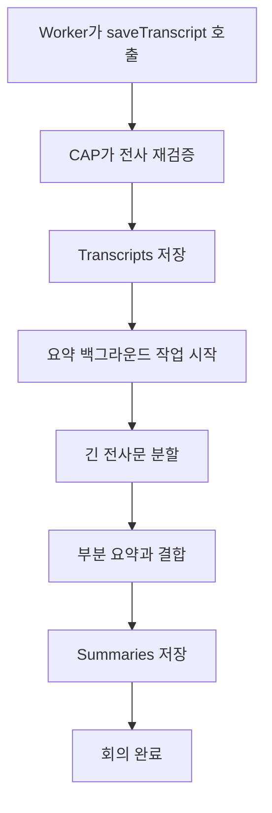

# 3-6. 전사 저장 이후 요약과 검수가 진행되는 과정

## Worker의 책임이 끝나는 지점

Worker는 검증된 전사 JSON을 CAP의 `saveTranscript`에 전달한다.

CAP는 작업 실행 ID와 회의 상태를 확인하고 전사를 다시 검증한 뒤 `Transcripts`에 저장한다. 그다음 회의 상태를 `summarizing`으로 바꾼다.

Worker는 요약이 끝날 때까지 기다리지 않는다.

## 요약은 CAP 백그라운드에서 진행



전사 저장과 요약을 분리하면 요약 실패 시에도 전사를 보존할 수 있다.

## 카테고리별 요약 프롬프트

`ai-core.js`는 회의 카테고리에 따라 다른 작성 지침을 선택한다.

- 주간회의: 진행 상황, 이슈, 다음 계획
- 고객미팅: 고객 요구·우려·요청과 후속 조치
- 프로젝트회의: 현황, 위험, 일정·범위 변경과 결정
- 내부회의: 공유 사항, 운영 방침과 합의
- 인터뷰: 질문·답변, 경험과 추가 확인 내용
- 내부 세미나: 핵심 개념, 사례, 수치와 질의응답

참석자와 카테고리, 지침과 전사문이 하나의 요청으로 요약 모델에 전달된다.

## 할루시네이션 억제 지침

시스템 프롬프트는 다음을 명시한다.

- 전사에 명시된 사실만 사용
- 결정, 담당자, 업무, 기한, 숫자와 날짜를 발명하지 않음
- 결정이나 할 일이 명확하지 않으면 빈 배열
- 기한이 명확하지 않으면 `null`
- JSON만 반환

응답은 `summary`, `decisions`, `action_items`, `topics` 구조로 제한되고 개수와 글자 길이도 검사한다.

## 긴 전사문 요약

전사문이 크면 약 12,000자 단위로 부분 요약한다. 부분 요약을 다시 묶을 때는 결정, 막는 이슈, 위험, 중요한 변경과 명확한 후속 조치만 남기고 중복을 제거한다.

한 번에 모두 넣지 못해도 최종적으로 회의록 하나를 만든다.

## 현재 검수의 실제 위치

사용자가 `runReview`를 요청하면 `reviewMeeting`이 실행되고 `ReviewItems`를 만든다.

현재 검수 입력은 **전체 전사문이 아니라 이미 생성된 회의 요약본**이다. 이름, 회사·제품명, 영문·기술 용어, 약어, 숫자와 어색한 표현 중 수동 확인할 후보를 찾는다.

따라서 현재 구현은 “전사 후 전문용어를 엄격하게 검수”하는 완성된 파이프라인이 아니다.

## 정한 방향으로 확장할 때의 차이

목표 흐름은 다음과 같이 구분해야 한다.

```text
현재
전사 저장 → 요약 생성 → 요약본에서 의심 용어 탐지

목표
원본 전사 저장
→ 전체 전사에서 의심 문장·전문용어 탐지
→ 사용자 승인으로 확정 전사 생성
→ 확정 전사에서 요약 생성
→ 요약과 전사의 사실 일치 재검증
```

후처리 모델은 원본을 자동으로 덮어쓰기보다 `원문`, `수정 후보`, `이유`, `확신도`, `근거 segment`를 반환하는 편이 안전하다.

## 핵심 정리

> 현재 CAP 후처리는 목적별 요약과 요약본 용어 검토까지 구현돼 있으며, 전체 전사 검수와 요약 사실 검증은 앞으로 별도로 강화해야 할 영역이다.

다음: [[팀 동료 요약 내용/세부 분석/3. 전사 과정 확장/3-7. 실패 재시도 진행률과 복구 장치|3-7. 실패·재시도·진행률과 복구 장치]]
