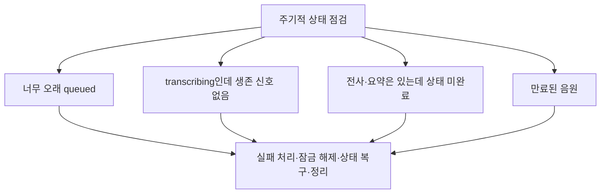

# 3-7. 실패·재시도·진행률과 복구 장치

## 긴 작업은 정상적인 HTTP 요청과 다르다

전사는 수 분 동안 진행될 수 있고 CAP, Worker, Object Store와 AI Core 중 어느 곳에서도 일시 장애가 날 수 있다.

그래서 성공 경로뿐 아니라 “도중에 연락이 끊겼을 때 누가 무엇을 기억하는가”가 중요하다.

## 세 종류의 재시도

| 위치 | 재시도 대상 | 이유 |
|---|---|---|
| CAP Dispatcher | Worker 호출 | Worker가 바쁘거나 네트워크 오류 |
| Worker STT | 같은 음원 구간의 AI 응답 | JSON·시간 형식 오류 |
| Worker 분할 | 더 작은 음원 구간 | 큰 구간이 반복 실패 |

서로 다른 문제를 같은 재시도로 해결하지 않는다.

## 생존 신호

Worker는 처리 중 CAP에 heartbeat를 보낸다.

- 현재 단계
- 진행 메시지
- 대략적인 진행률
- 마지막으로 살아 있음을 알린 시각
- Worker 실행 ID

CAP는 이 정보를 회의와 Dispatch에 저장한다. 화면은 이를 읽어 `transcribing` 진행 상황을 표시한다.

## 진행률이 정확한 완료 시간이 아닌 이유

음원 구간의 처리 위치를 기준으로 전사 진행률을 추정할 수 있지만 AI 응답 시간과 재시도 여부는 달라질 수 있다.

따라서 진행률은 “현재 어느 정도 처리했는지”를 알려 주는 값이지 남은 시간을 정확히 보장하는 값은 아니다.

## 오래 멈춘 작업 복구

`cleanup.js`는 주기적으로 모순된 상태를 찾는다.

Worker가 사라졌는데 회의가 영원히 `transcribing`으로 남거나, 완료 결과가 있는데 화면만 처리 중으로 남는 일을 줄인다.

## 실패 시 무엇을 남기는가

- 회의 상태와 사용자용 오류
- Dispatch의 시도 횟수와 마지막 오류
- Worker 단계와 마지막 생존 시간
- 성공적으로 저장된 전사
- 원본 음원 존재 여부
- AI Core 사용량과 요청 식별자

민감하거나 지나치게 큰 AI 응답 전체를 사용자 오류에 노출하지 않고 운영 조사에 필요한 정보만 남기려 한다.

## 재전사 가능 여부

전사에 실패했더라도 원본 음원이 남아 있으면 다시 대기표에 올릴 수 있다.

정상 완료 후 원본이 삭제됐다면 전사와 요약은 보존되지만 새 전사를 만들려면 음원을 다시 업로드해야 할 수 있다.

## 핵심 정리

> 이 파이프라인의 안정성은 한 번도 실패하지 않는 데서 나오지 않고, 작업 소유권과 상태를 기록하여 실패한 지점부터 판단하고 복구할 수 있는 데서 나온다.

다음: [[팀 동료 요약 내용/세부 분석/5. 조사 문서 확장/5-1. 사용자 행동으로 다시 보는 전체 구조|5-1. 사용자 행동으로 다시 보는 전체 구조]]
