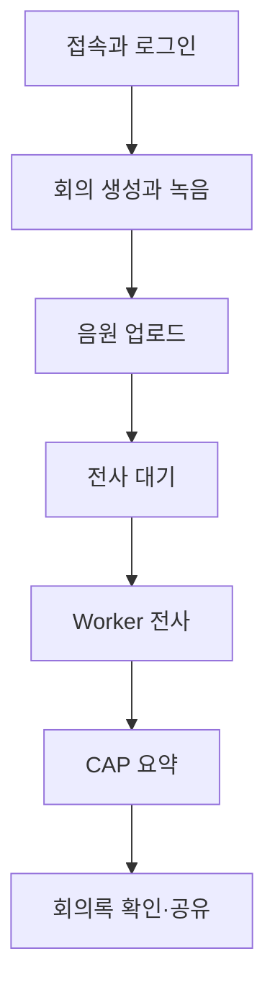

# 5-1. 사용자 행동으로 다시 보는 전체 구조

## 폴더가 아니라 사용자 행동으로 읽기

프로젝트 구조를 외우기보다 사용자가 앱에 들어와 회의록을 받는 순서에 각 프로그램을 붙이면 이해하기 쉽다.



## 접속과 로그인

브라우저는 Approuter에 접속한다. XSUAA 인증이 끝나면 UI 파일을 받고 현재 사용자 정보를 조회한다.

관련 코드와 설정:

- `approuter/xs-app.json`
- `xs-security.json`
- `app/meeting-ui/js/session.js`

## 회의 생성과 녹음

`app.js`가 화면 흐름을 관리하고 `recorder.js`가 음원 Blob을 만든다. `drafts.js`는 브라우저가 갑자기 닫혀도 초안을 복구하도록 돕는다.

녹음 중 임시 전사는 화면용이고 최종 서버 전사와 분리돼 있다.

## 음원 업로드

브라우저는 먼저 CAP에 회의를 만들고 전용 바이너리 주소로 음원을 보낸다.

관련 흐름:

```text
app.js
→ api.js
→ server.js의 바이너리 route
→ binary-upload-route.js
→ audio-store.js
→ object-store.js
```

## 전사 대기와 Worker 인계

CAP는 `TranscriptionDispatches`에 작업을 저장한다. Dispatcher가 준비된 작업을 골라 `worker-client.js`로 Worker를 호출한다.

Worker는 `workerRunId`로 작업 사용권을 확보한 뒤 음원을 받는다.

## 실제 전사

Worker의 `main.py`가 전체 실행을 관리하고 `transcriber.py`가 엔진을 선택한다. 현재 운영 중심인 AI Core 경로에서는 `aicore_stt.py`가 음원을 분할하고 모델 응답을 검증·병합한다.

## 전사 저장과 요약

Worker는 CAP 내부 서비스의 `saveTranscript`로 결과를 돌려준다.

CAP는 `meeting-note.js`로 다시 검사하고 `ai-core.js`로 카테고리별 요약을 만든다. 요약 결과는 JSON과 Markdown 형태로 저장된다.

## 확인과 공유

브라우저는 회의 상태를 반복 조회하다가 완료되면 전사와 요약을 보여 준다. 생성자·참여자·공유 대상의 관계에 따라 읽기와 수정 범위가 달라진다.

## 한 줄 코드 지도

```text
사용자
→ approuter
→ app/meeting-ui
→ meeting-service
→ transcription-dispatcher
→ Worker main
→ aicore_stt
→ worker-internal-service
→ ai-core
→ meeting-service
→ 사용자
```

## 핵심 정리

> 하나의 회의록은 UI, CAP, Worker와 AI Core 중 어느 한 파일이 만드는 것이 아니라 요청이 이 경로를 한 바퀴 돌아 완성되는 결과다.

다음: [[팀 동료 요약 내용/세부 분석/5. 조사 문서 확장/5-2. 인증과 권한을 두 겹으로 나눈 이유|5-2. 인증과 권한을 두 겹으로 나눈 이유]]
