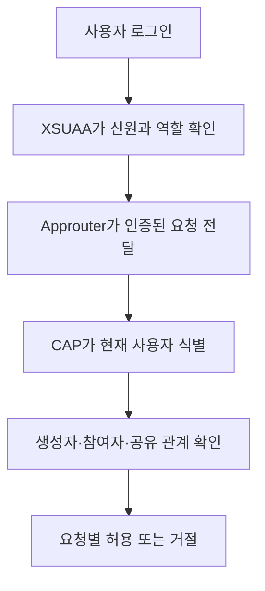

# 5-2. 인증과 권한을 두 겹으로 나눈 이유

## 인증과 권한은 다른 질문이다

- 인증: 당신이 누구인가
- 역할: 이 애플리케이션의 어떤 종류 사용자인가
- 회의별 권한: 이 특정 회의와 어떤 관계인가

Meeting Whisper는 이 세 질문을 한 번에 처리하지 않는다.

## 사람의 요청



`MeetingUser` 역할은 사용자 API에 들어갈 기본 자격이다. 목록 조회 시에는 `accessTokens` 조건을 추가해 읽을 수 있는 회의만 가져온다.

수정과 삭제는 다시 별도의 규칙을 사용한다. 읽을 수 있다고 삭제할 수 있는 것은 아니다.

## 시스템 사이의 요청

CAP와 Worker도 서로 인증한다.

```text
CAP → Worker
공유 Bearer token

Worker → CAP
XSUAA client-credentials token + Worker 역할
```

CAP가 Worker를 호출하는 공개되지 않은 주소에도 공유 token이 필요하다. Worker가 CAP 내부 API를 사용할 때는 기술 사용자 자격으로 OAuth token을 받는다.

## 왜 한 가지 token만 쓰지 않나

두 방향의 신뢰 범위가 다르다.

- Worker는 CAP의 음원과 전사 저장 기능만 필요하다.
- CAP는 Worker의 전사 접수 기능만 필요하다.
- 일반 사용자는 어느 내부 기능도 직접 실행할 필요가 없다.

권한을 최소 범위로 나누면 한 자격증명이 노출됐을 때 피해 범위를 줄일 수 있다.

## `workerRunId`는 인증인가

`workerRunId`는 사용자의 신원을 증명하는 인증 token이 아니다. 인증된 Worker 여러 실행 중 어떤 실행이 현재 회의 작업의 주인인지 확인하는 작업 식별자다.

따라서 다음 두 조건이 모두 필요하다.

1. 이 요청은 Worker 권한을 가진 주체가 보냈는가
2. 이 Worker 실행은 현재 작업에 발급된 `workerRunId`를 가졌는가

## 초보자가 기억할 비유

```text
XSUAA token = 회사 출입증
MeetingUser·Worker 역할 = 부서 출입 권한
회의별 권한 = 특정 문서의 공유 설정
workerRunId = 지금 이 작업을 맡은 담당표
```

## 핵심 정리

> 인증은 주체를 확인하고, 역할은 API 범위를 제한하며, 회의 관계와 실행 ID는 실제 데이터와 작업의 소유권을 결정한다.

다음: [[팀 동료 요약 내용/세부 분석/5. 조사 문서 확장/5-3. MTA가 네 프로그램과 BTP 서비스를 조립하는 방식|5-3. MTA가 네 프로그램과 BTP 서비스를 조립하는 방식]]
