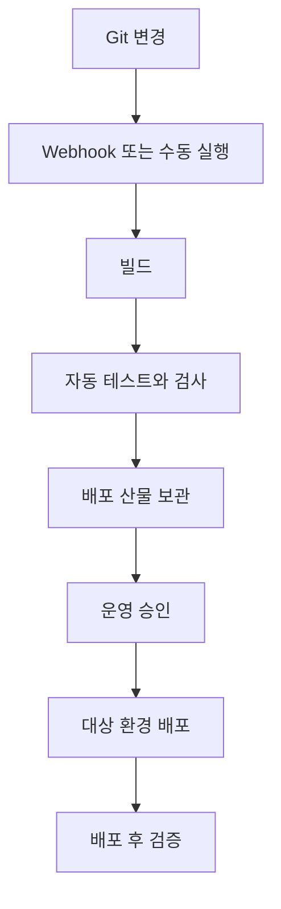

# 5-4. 현재 수동 배포와 CI/CD의 차이

## 현재 저장소에서 확인되는 배포 방식

현재 저장소에는 `.pipeline/config.yml`이나 Git 변경을 받아 실행하는 파이프라인 정의가 없다.

`package.json`의 명령을 사람이 로컬에서 실행하는 구조다.

```text
CAP 빌드와 UI 복사
→ MBT로 MTAR 생성
→ cf deploy로 Cloud Foundry 배포
```

대표 명령은 다음과 같다.

```powershell
npm run build:mtar
npm run deploy:cf:mtar
```

## 수동 배포에서 사람이 책임지는 것

- 올바른 브랜치와 커밋인지 확인
- 테스트 실행
- CAP 컴파일과 빌드
- MTAR 생성
- 올바른 CF org와 space 선택
- 배포 명령 실행
- 로그와 smoke test 확인
- 실패 시 이전 산물 선택

명령이 자동화돼 있어도 누가 언제 실행할지와 통과 조건이 연결돼 있지 않으면 CI/CD 파이프라인은 아니다.

## CI/CD 서비스의 기본 구조



SAP Continuous Integration and Delivery에서는 repository, pipeline 유형과 설정을 묶은 실행 구성을 **Job**이라고 하고, 한 번의 실행을 **Build**라고 한다. Pipeline은 여러 Stage로, Stage는 여러 Step으로 구성된다.

## SAP CI/CD 서비스와 Project Piper의 구분

동료 원본 문서에는 두 개념이 같은 것처럼 읽히는 부분이 있지만 공식적으로는 구분해야 한다.

- **SAP Continuous Integration and Delivery**: SAP BTP의 관리형 서비스로 미리 정의된 pipeline을 UI 중심으로 설정
- **Project Piper**: 자체 Jenkins 또는 다른 CI 환경에서 사용할 수 있는 오픈소스 pipeline과 step 도구

SAP CI/CD 서비스가 SAP의 모범 절차를 활용한다는 점과 Project Piper 자체를 운영한다는 것은 같은 말이 아니다.

## `mta.yaml`과 pipeline 설정

두 파일은 경쟁 관계가 아니다.

```text
mta.yaml
→ 무엇을 어떤 BTP 구성으로 배포할지

pipeline 설정
→ 언제 빌드·테스트·승인·배포할지
```

파이프라인이 생겨도 MTA는 여전히 필요하다.

## 핵심 정리

> 현재는 배포 명령이 준비된 수동 절차이고, CI/CD는 그 명령 앞뒤에 자동 트리거·검사·산물·승인·검증을 연결하는 운영 체계다.

다음: [[팀 동료 요약 내용/세부 분석/5. 조사 문서 확장/5-5. 이 프로젝트에 파이프라인을 적용할 때의 위험|5-5. 이 프로젝트에 파이프라인을 적용할 때의 위험]]
