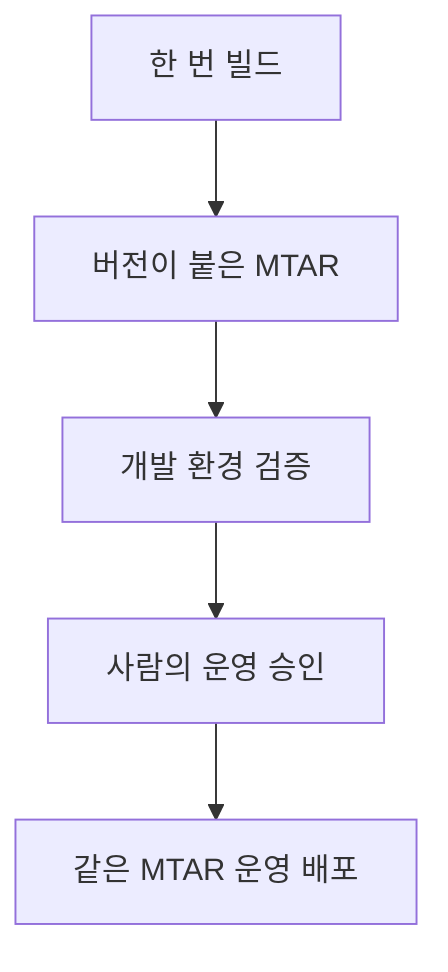

# 5-5. 이 프로젝트에 파이프라인을 적용할 때의 위험

## 자동화 전에 알아야 할 것

명령을 pipeline에 옮긴다고 안전해지는 것은 아니다. 잘못된 테스트 범위와 배포 대상을 더 빠르게 반복할 수도 있다.

## 테스트 범위 혼재

`npm test`는 Windows 로컬 가상환경의 Python을 직접 가리키며 `pytest` 전체를 실행한다.

테스트 폴더에는 현재 Worker 테스트와 Legacy FastAPI 테스트가 함께 있다. Pipeline에서는 다음을 분리해 명확히 실행하는 편이 안전하다.

```text
현재 CAP JavaScript 테스트
현재 Worker Python 테스트
브라우저 E2E 또는 smoke
Legacy 회귀 테스트
```

어떤 묶음의 실패가 배포를 막아야 하는지도 별도로 정해야 한다.

## Python 빌드와 테스트 환경

MTA 배포 시 Worker는 `python_buildpack`으로 빌드되지만, pipeline의 테스트 단계가 사용하는 빌드 이미지에 Python과 필요한 시스템 라이브러리가 있다는 보장은 별개다.

특히 PyAV나 Whisper 계열 의존성을 설치하는 테스트는 일반 Node.js 빌드 이미지에서 실패할 수 있다.

먼저 가장 작은 Worker unit test를 CI 환경에서 실행해 Python 버전, wheel과 시스템 의존성을 확인해야 한다.

## 데이터베이스 변경

`db-deployer`는 HANA 구조를 설치한다. 애플리케이션 코드를 이전 버전으로 되돌리는 것과 데이터 구조를 자동으로 이전 상태로 되돌리는 것은 같은 일이 아니다.

운영 데이터에 영향을 주는 CDS 변경은 다음이 필요하다.

- 호환 가능한 forward migration 설계
- 실제 데이터 보존 확인
- 운영 배포 전 승인
- 실패 시 애플리케이션과 DB의 호환 범위 확인

## Secret과 대상 환경

CF 사용자, 기술 사용자와 Git 자격증명을 pipeline 설정 파일에 직접 적으면 안 된다. CI/CD 서비스의 credential 저장소에 보관하고 설정에서는 credential ID만 참조해야 한다.

dev와 production은 서로 다른 CF space와 credential을 가져야 한다. `cf target` 실수로 운영에 배포하는 문제를 pipeline이 오히려 반복하지 않도록 대상을 고정해야 한다.

## 승인과 산물

같은 소스를 production에서 다시 빌드하면 dev에서 시험한 MTAR와 다른 산물이 생길 수 있다.

안전한 흐름은 한 번 만든 MTAR를 보관하고, 검증된 동일 산물을 승인 후 다음 환경에 배포하는 것이다.



## 현재 과제 범위와 구분

원본 조사 문서는 pipeline 학습과 설계를 다루지만 실제 구축은 별도 승인과 범위가 필요한 작업으로 표시한다.

이 문서도 구현 완료를 뜻하지 않는다. 현재 저장소에는 자동 pipeline이 없다는 사실과 적용 시 확인해야 할 위험을 설명한다.

## 핵심 정리

> 이 프로젝트의 CI/CD 핵심 위험은 “배포 명령을 실행할 수 있는가”보다 테스트 범위, Python 환경, HANA 변경, credential과 운영 승인을 정확히 분리할 수 있는가에 있다.

다음: [[팀 동료 요약 내용/세부 분석/5. 조사 문서 확장/5-6. AI 모델 변경을 코드와 운영 관점에서 이해하기|5-6. AI 모델 변경을 코드와 운영 관점에서 이해하기]]
